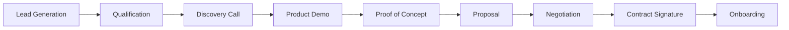
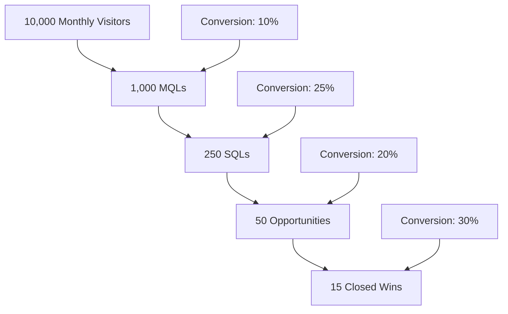
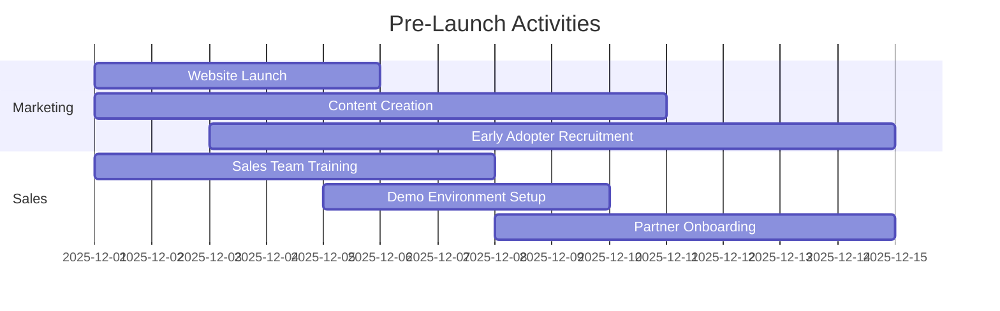

# Go-To-Market (GTM) Strategy
## Automated Quotation and Purchase Order Management System

---

## Document Information
- **Document Version:** 1.0
- **Date:** December 2025
- **Status:** Final
- **Prepared By:** Product Marketing Team
- **Delivery Timeline:** 11 Days (MLP Launch)

---

## 1. Executive Summary

The Automated Quotation and Purchase Order Management System represents a transformative solution for organizations struggling with manual, time-consuming sales and procurement processes. This Go-To-Market strategy outlines our approach to successfully launching and scaling this AI-powered platform that reduces quotation generation time from hours to minutes and automates the entire purchase order lifecycle.

### Key GTM Highlights:

- **Target Market:** Mid-to-large B2B enterprises in manufacturing, distribution, technology, and professional services sectors
- **Initial Focus:** Organizations with 50+ sales representatives and $50M+ annual revenue
- **Value Proposition:** Reduce quotation time by 95%, eliminate manual PO processing, and increase sales productivity by 25%+
- **Launch Strategy:** Phased rollout starting with early adopter program, followed by broader market launch
- **Revenue Model:** SaaS subscription with tiered pricing based on users and transaction volume
- **Go-Live:** 11-day accelerated implementation for MLP, with continued feature releases post-launch

---

## 2. Market Analysis

### 2.1 Target Market

#### Primary Target Segments:

| Segment | Characteristics | Market Size | Priority |
|---------|----------------|-------------|----------|
| **Manufacturing Enterprises** | Complex product catalogs, custom quotations, multi-tier supply chains | $2.8B TAM | High |
| **Distribution Companies** | High-volume quotations, inventory management, vendor coordination | $1.5B TAM | High |
| **Technology Solution Providers** | Custom solutions, complex pricing, professional services | $1.2B TAM | Medium |
| **Professional Services Firms** | Project-based quotations, resource allocation, time-based pricing | $800M TAM | Medium |

#### Ideal Customer Profile (ICP):

- **Company Size:** 200-5000 employees
- **Annual Revenue:** $50M - $500M
- **Sales Team Size:** 50-500 representatives
- **Geographic Focus:** North America, Europe (initial); Global expansion (Phase 2)
- **Technology Maturity:** Cloud-ready, existing ERP/CRM systems
- **Pain Point Intensity:** High manual workload, slow quote turnaround, PO tracking challenges

### 2.2 Competitive Landscape

#### Direct Competitors:

| Competitor | Strengths | Weaknesses | Our Advantage |
|------------|-----------|------------|---------------|
| **Salesforce CPQ** | Market leader, strong CRM integration | Complex implementation, high cost, limited AI | Faster implementation, AI-powered intelligence, integrated PO management |
| **SAP CPQ** | Enterprise-grade, comprehensive | Legacy technology, slow to innovate | Modern cloud-native architecture, better UX, rapid deployment |
| **Oracle CPQ** | Robust features, ERP integration | Expensive, complex user experience | Simplified workflows, 11-day implementation, lower TCO |
| **Apttus (Conga)** | Strong contract management | Focused on larger enterprises | Mid-market focus, faster time-to-value |

#### Indirect Competitors:
- Manual processes using Excel, Word, email
- Custom-built internal solutions
- Basic quotation tools without AI or PO automation

#### Competitive Advantages:

1. **AI-Powered Intelligence:** Machine learning for cost estimation, vendor selection, and issue prediction
2. **Integrated Solution:** Single platform for quotations and purchase order management
3. **Rapid Deployment:** 11-day implementation vs. 3-6 months for competitors
4. **Modern UX:** Intuitive interface with mobile support
5. **Flexible Pricing:** Lower TCO compared to enterprise solutions
6. **Proactive Automation:** Intelligent vendor selection and delivery tracking

### 2.3 Market Opportunity

#### Market Size & Growth:

- **Total Addressable Market (TAM):** $6.3B globally
- **Serviceable Addressable Market (SAM):** $2.1B (North America & Europe)
- **Serviceable Obtainable Market (SOM):** $105M (Year 1 target: 5% of SAM)
- **Market Growth Rate:** 12% CAGR (2025-2030)

#### Market Drivers:

1. **Digital Transformation:** Organizations moving from manual to automated processes
2. **AI Adoption:** Growing acceptance of AI/ML in business operations
3. **Remote Work:** Need for cloud-based collaboration tools
4. **Customer Expectations:** Demand for faster response times
5. **Cost Pressure:** Need to improve operational efficiency
6. **Supply Chain Complexity:** Increased need for vendor management and tracking

---

## 3. Product Positioning & Value Proposition

### 3.1 Positioning Statement

**For** B2B enterprises struggling with manual quotation and purchase order processes,

**Who need** to accelerate sales cycles, improve accuracy, and gain visibility into order fulfillment,

**Our product** is an AI-powered automation platform that transforms quotation generation from hours to minutes and streamlines the entire purchase order lifecycle,

**Unlike** traditional CPQ solutions that are complex, expensive, and slow to implement,

**We deliver** rapid time-to-value with an 11-day implementation, intelligent automation, and integrated PO management at a fraction of the cost.

### 3.2 Value Proposition by Persona

#### Sales Representatives:
- **Time Savings:** Generate quotations in 5 minutes instead of 2-4 hours (95% reduction)
- **Increased Capacity:** Create 15-20 quotes per day vs. 3-5 (4x improvement)
- **Better Accuracy:** 95% cost estimation accuracy reduces errors and rework
- **Deal Velocity:** Faster quotes lead to faster deals and higher win rates

#### Sales Managers:
- **Team Productivity:** 25% increase in revenue per sales representative
- **Pipeline Visibility:** Real-time dashboard of quotation activity and trends
- **Pricing Consistency:** Standardized quotation process across the team
- **Forecasting Accuracy:** Better visibility into deal progression

#### Procurement Teams:
- **Automation:** Eliminate manual PO creation (save 1-2 days per order)
- **Optimization:** 10% cost savings through AI-powered vendor selection
- **Visibility:** Real-time tracking of all purchase orders
- **Risk Management:** 48-hour advance warning of potential delays

#### Finance Teams:
- **Budget Control:** Real-time spending visibility and budget tracking
- **Compliance:** Automated margin validation and approval workflows
- **Reconciliation:** Automated invoice-to-PO matching
- **Reporting:** Comprehensive financial analytics and cost analysis

#### Executive Leadership:
- **Revenue Growth:** 30% improvement in quote-to-win conversion
- **Operational Efficiency:** 40% reduction in sales administrative time
- **Customer Satisfaction:** 4.5/5+ rating from faster, more accurate service
- **Competitive Advantage:** Modern technology platform for digital transformation

### 3.3 Key Messages

#### Primary Message:
"Transform your sales and procurement operations with AI-powered automation that generates accurate quotations in minutes and streamlines your entire order lifecycle—delivered in just 11 days."

#### Supporting Messages:

1. **Speed to Value:** "Be operational in 11 days, not 6 months"
2. **Intelligence Built-In:** "AI that learns from your data to optimize costs and vendor selection"
3. **End-to-End Solution:** "From quote to delivery, all in one platform"
4. **Modern & Intuitive:** "Built for today's mobile, cloud-first workforce"
5. **Proven ROI:** "Customers see 25% productivity gains and 10% cost savings within the first quarter"

---

## 4. Pricing Strategy

### 4.1 Pricing Model

**SaaS Subscription Model** with tiered pricing based on users and transaction volume:

#### Tier 1: Starter ($5,000/month)
- Up to 25 users
- 500 quotations/month
- 200 purchase orders/month
- Basic AI features
- Email support
- Standard implementation (11 days)

#### Tier 2: Professional ($12,000/month)
- Up to 100 users
- 2,000 quotations/month
- 1,000 purchase orders/month
- Full AI capabilities
- Priority support
- Custom templates (5)
- Dedicated implementation team

#### Tier 3: Enterprise ($25,000/month)
- Unlimited users
- Unlimited quotations/POs
- Advanced AI and analytics
- 24/7 premium support
- Custom integrations
- Dedicated success manager
- White-glove implementation

#### Add-On Modules:
- **Advanced Analytics Dashboard:** $2,000/month
- **Multi-Currency Support (10+ currencies):** $1,500/month
- **Custom Integration (per integration):** $3,000-$10,000 one-time
- **Vendor Portal Access:** $500/month per 10 vendors
- **Mobile App Access:** Included in all tiers

### 4.2 Implementation Fees

- **Standard Implementation:** $10,000 (included in Professional & Enterprise tiers)
- **Expedited Implementation (7 days):** $15,000
- **Data Migration Services:** $5,000-$25,000 (based on complexity)
- **Custom Template Design:** $1,000 per template

### 4.3 Pricing Strategy Rationale

1. **Value-Based Pricing:** Priced at 1/3 of enterprise competitors while delivering 80% of functionality
2. **Land and Expand:** Starter tier for easy entry; upsell to higher tiers as adoption grows
3. **Usage-Based Scaling:** Pricing grows with customer value realization
4. **Competitive Positioning:** 40-60% less expensive than Salesforce CPQ and SAP CPQ
5. **Predictable Revenue:** Monthly recurring revenue model for financial stability

### 4.4 Discounting Strategy

- **Annual Commitment:** 15% discount for annual prepayment
- **Early Adopter Program:** 25% discount for first 20 customers (3-month commitment)
- **Volume Discount:** 10% additional discount for 200+ users
- **Non-Profit/Education:** 20% discount for qualifying organizations
- **Partner Referral:** 10% commission to channel partners

---

## 5. Sales & Distribution Strategy

### 5.1 Sales Channels

#### Direct Sales (Primary Channel - 70% of revenue):

**Inside Sales Team:**
- Target: Mid-market companies ($50M-$150M revenue)
- Team Size: 10 Account Executives, 5 Sales Development Reps
- Quota: $1.5M ARR per AE
- Sales Cycle: 45-60 days average

**Field Sales Team:**
- Target: Enterprise accounts ($150M+ revenue)
- Team Size: 5 Enterprise Account Executives
- Quota: $2.5M ARR per AE
- Sales Cycle: 90-120 days average

#### Channel Partners (Secondary Channel - 20% of revenue):

**System Integrators:**
- Partner with ERP/CRM implementation consultancies
- Co-selling opportunities
- Implementation services partnership
- Target: 10 strategic partnerships in Year 1

**Value-Added Resellers (VARs):**
- Industry-specific VARs (manufacturing, distribution)
- Partner margin: 20-25%
- Training and certification program
- Target: 25 active resellers in Year 1

#### Self-Service/Product-Led Growth (10% of revenue):

**Free Trial Program:**
- 30-day free trial with 2 users
- Self-service onboarding
- Automated nurture campaigns
- Conversion target: 15% trial-to-paid

### 5.2 Sales Enablement

#### Sales Tools & Resources:

1. **Demo Environment:** Fully functional demo with sample data
2. **Sales Playbook:** Objection handling, competitive positioning, discovery questions
3. **ROI Calculator:** Interactive tool showing cost savings and productivity gains
4. **Case Studies:** Success stories from early adopters (available post-launch)
5. **Battle Cards:** Competitive comparison sheets for each major competitor
6. **Proposal Templates:** Standardized proposals with customizable sections

#### Sales Process:

**Stage Definitions:**
1. **Lead Generation:** MQL (Marketing Qualified Lead) - engaged with content, matches ICP
2. **Qualification:** SQL (Sales Qualified Lead) - BANT criteria met, budget confirmed
3. **Discovery:** Needs assessment, stakeholder mapping, pain point analysis
4. **Demo:** Customized product demonstration, 45-60 minutes
5. **POC:** 2-week proof of concept with 5-10 users (for Enterprise tier)
6. **Proposal:** Formal proposal with pricing, implementation plan, ROI analysis
7. **Negotiation:** Address concerns, finalize terms, legal review
8. **Close:** Contract execution, payment processing

### 5.3 Channel Partner Program

#### Partner Tiers:

| Tier | Requirements | Benefits | Commission |
|------|-------------|----------|------------|
| **Registered** | Basic training completed | Partner portal access, co-marketing | 15% |
| **Certified** | 2+ implementations, technical certification | Priority support, deal registration | 20% |
| **Premier** | 10+ implementations, $500K+ ARR | Dedicated partner manager, MDF funds | 25% |

#### Partner Support:
- Quarterly partner training webinars
- Partner portal with resources and lead management
- Marketing Development Funds (MDF) for Premier partners
- Co-marketing programs (webinars, content, events)

---

## 6. Marketing Strategy

### 6.1 Pre-Launch Phase (Weeks 1-2 before go-live)

#### Objectives:
- Build awareness among target audience
- Generate qualified leads for sales pipeline
- Create anticipation for product launch
- Recruit early adopter customers

#### Tactics:

**Content Marketing:**
- [ ] Publish thought leadership articles on sales automation trends
- [ ] Create "State of B2B Sales Operations" whitepaper
- [ ] Develop product explainer videos (3-5 minutes)
- [ ] Launch company blog with 2-3 posts per week

**Digital Marketing:**
- [ ] Launch website with product information, pricing, and demo request
- [ ] Set up Google Ads campaigns targeting key search terms
- [ ] LinkedIn Sponsored Content targeting decision-makers
- [ ] Retargeting campaigns for website visitors

**PR & Media Relations:**
- [ ] Press release announcing product launch
- [ ] Pitch to industry publications (SalesTech, ProcureTech, B2B Insider)
- [ ] Executive interviews with trade publications
- [ ] Analyst briefings (Gartner, Forrester)

**Early Adopter Program:**
- [ ] Recruit 10-15 beta customers for early access
- [ ] Offer 25% discount for 3-month commitment
- [ ] Create exclusive early adopter community
- [ ] Request testimonials and case study participation

### 6.2 Launch Phase (Launch week + 4 weeks)

#### Objectives:
- Maximize visibility and market penetration
- Generate high volume of qualified leads
- Establish thought leadership position
- Drive trial signups and demos

#### Tactics:

**Launch Event:**
- [ ] Virtual launch event with live product demo
- [ ] Executive keynote on AI-powered sales automation
- [ ] Customer panel discussion with early adopters
- [ ] Q&A session with product team
- [ ] Target: 500+ attendees

**Content Blitz:**
- [ ] Series of "How-To" guides on sales automation
- [ ] Video testimonials from early customers
- [ ] Infographic: "Manual vs. Automated Quotations"
- [ ] ROI calculator tool on website
- [ ] 5-part email nurture series for leads

**Digital Advertising:**
- [ ] Increased ad spend (3x pre-launch budget)
- [ ] Programmatic display advertising
- [ ] LinkedIn, Google, industry sites
- [ ] Conversion-optimized landing pages
- [ ] A/B testing for ad creative and messaging

**Social Media Campaign:**
- [ ] Daily posts on LinkedIn, Twitter
- [ ] Share customer success stories
- [ ] Behind-the-scenes content (team, technology)
- [ ] Engage with industry influencers
- [ ] Launch hashtag: #AutomateToAccelerate

**Webinar Series:**
- [ ] "Transform Your Sales Operations in 11 Days"
- [ ] "AI-Powered Vendor Selection Strategies"
- [ ] "Eliminating the Quote-to-Cash Bottleneck"
- [ ] Target: 100+ attendees per webinar

**Partnership Announcements:**
- [ ] Press releases for key technology partnerships
- [ ] Joint webinars with complementary solutions
- [ ] Co-marketing campaigns with channel partners

### 6.3 Post-Launch Phase (Month 2+)

#### Objectives:
- Sustain momentum and market presence
- Nurture leads through sales funnel
- Build customer advocacy program
- Expand market reach

#### Tactics:

**Customer Success Stories:**
- [ ] Publish 3-5 detailed case studies
- [ ] Video testimonials and success stories
- [ ] Customer reference program
- [ ] User community and forum

**Thought Leadership:**
- [ ] Speaking engagements at industry conferences
- [ ] Publish research report on sales automation ROI
- [ ] Guest articles in major publications
- [ ] Podcast appearances and sponsorships

**Content Marketing:**
- [ ] Ongoing blog posts (2-3 per week)
- [ ] Monthly webinar series
- [ ] Quarterly eBook or whitepaper
- [ ] Video tutorial library

**Account-Based Marketing (ABM):**
- [ ] Target top 100 accounts with personalized campaigns
- [ ] Direct mail campaigns to decision-makers
- [ ] Personalized landing pages
- [ ] Executive roundtable events

**Performance Marketing:**
- [ ] Ongoing optimization of paid campaigns
- [ ] Conversion rate optimization (CRO)
- [ ] Marketing automation and lead scoring
- [ ] Email nurture campaigns by persona

### 6.4 Marketing Channels & Budget Allocation

| Channel | Budget % | Focus | Expected ROI |
|---------|----------|-------|--------------|
| **Digital Advertising** | 30% | Lead generation | 3:1 |
| **Content Marketing** | 25% | Awareness, thought leadership | 4:1 |
| **Events & Webinars** | 15% | Engagement, pipeline | 5:1 |
| **PR & Media Relations** | 10% | Brand awareness, credibility | 2:1 |
| **Partner Marketing** | 10% | Channel enablement | 6:1 |
| **ABM Campaigns** | 10% | Enterprise accounts | 8:1 |

**Total Marketing Budget Year 1:** $1.2M

---

## 7. Customer Acquisition Strategy

### 7.1 Lead Generation

#### Inbound Channels:

1. **SEO & Content:**
   - Target: 10,000 monthly website visitors by Month 6
   - Focus keywords: "CPQ software", "quotation automation", "PO management system"
   - Content hubs: Sales Automation, Procurement Optimization, AI Business Tools

2. **Paid Search:**
   - Google Ads campaigns for high-intent keywords
   - Target: 500 MQLs per month
   - Average CPA: $200

3. **Social Media:**
   - LinkedIn lead generation campaigns
   - Target: 300 MQLs per month
   - Average CPA: $150

4. **Free Trial:**
   - 30-day self-service trial
   - Target: 200 trial signups per month
   - Conversion rate: 15% trial-to-paid

#### Outbound Channels:

1. **Outbound SDR Team:**
   - Cold outreach to ICP companies
   - Target: 100 qualified meetings per month
   - Tools: LinkedIn Sales Navigator, ZoomInfo

2. **Email Campaigns:**
   - Targeted email campaigns to purchased lists
   - ABM campaigns for enterprise accounts
   - Target: 5% response rate

3. **Events & Trade Shows:**
   - Attend 8-10 industry conferences in Year 1
   - Target: 150 qualified leads per event
   - Focus: Manufacturing, Supply Chain, Sales Technology

### 7.2 Conversion Funnel

**Target Conversion Rates:**
- Visitor to MQL: 10%
- MQL to SQL: 25%
- SQL to Opportunity: 20%
- Opportunity to Close: 30%
- Overall visitor to customer: 0.15%

### 7.3 Customer Acquisition Cost (CAC) & Lifetime Value (LTV)

**Target Metrics:**
- **Customer Acquisition Cost (CAC):** $15,000
- **Average Contract Value (ACV):** $150,000 (Professional tier annual)
- **Customer Lifetime Value (LTV):** $450,000 (3-year average)
- **LTV:CAC Ratio:** 30:1 (target: 3:1+)
- **Payback Period:** 3-4 months

**CAC Breakdown:**
- Sales costs (salaries, commissions): $8,000
- Marketing costs (campaigns, tools): $5,000
- Technology costs (CRM, tools): $2,000

---

## 8. Success Metrics & KPIs

### 8.1 Business Metrics

#### Revenue Targets:

| Metric | Month 3 | Month 6 | Month 12 |
|--------|---------|---------|----------|
| **Monthly Recurring Revenue (MRR)** | $150K | $500K | $1.5M |
| **Annual Recurring Revenue (ARR)** | $1.8M | $6M | $18M |
| **Total Customers** | 15 | 45 | 150 |
| **Average Contract Value (ACV)** | $120K | $135K | $150K |

#### Growth Metrics:

- **Month-over-Month Growth:** 15-25%
- **Year-over-Year Growth:** 200%+ (Year 2)
- **Net Revenue Retention:** 120%+
- **Gross Revenue Retention:** 95%+

### 8.2 Sales Metrics

| Metric | Target |
|--------|--------|
| **Sales Qualified Leads (SQL)** | 250/month by Month 6 |
| **Sales Pipeline Value** | $5M by Month 6 |
| **Win Rate** | 30%+ |
| **Average Sales Cycle** | 60 days (mid-market), 90 days (enterprise) |
| **Sales Productivity** | $1.5M ARR per AE |

### 8.3 Marketing Metrics

| Metric | Target |
|--------|--------|
| **Website Traffic** | 10,000 visitors/month by Month 6 |
| **Marketing Qualified Leads (MQL)** | 1,000/month by Month 6 |
| **MQL to SQL Conversion** | 25% |
| **Cost Per Lead (CPL)** | $150 |
| **Marketing Sourced Revenue** | 60% of total revenue |

### 8.4 Product Metrics

| Metric | Target |
|--------|--------|
| **Trial Signup Rate** | 200/month |
| **Trial to Paid Conversion** | 15% |
| **Feature Adoption Rate** | 80% for core features |
| **Daily Active Users (DAU)** | 70% of licenses |
| **Product NPS** | 50+ |

### 8.5 Customer Success Metrics

| Metric | Target |
|--------|--------|
| **Customer Satisfaction (CSAT)** | 4.5/5 |
| **Net Promoter Score (NPS)** | 50+ |
| **Customer Churn Rate** | <5% annually |
| **Time to Value** | <30 days |
| **Support Ticket Resolution Time** | <24 hours |

---

## 9. Launch Timeline & Milestones

### Pre-Launch Phase (Weeks -2 to 0)

**Key Milestones:**
- **Week -2:** Sales team trained, demo environment ready
- **Week -1:** Website live, early adopter program launched
- **Launch Day:** Product available, launch event held

### Launch Phase (Weeks 1-4)

**Week 1: Launch Week**
- Day 1: Virtual launch event
- Day 2-3: Press release distribution, media interviews
- Day 4-5: Sales outreach to warm leads
- Day 7: First customer onboarding

**Week 2: Momentum Building**
- Webinar #1: Product overview
- First case study published
- Launch advertising campaigns
- Partner enablement sessions

**Week 3: Scaling**
- Webinar #2: Advanced features
- Sales pipeline review and optimization
- Customer feedback sessions
- Content marketing ramp-up

**Week 4: Optimization**
- Analyze early results
- Optimize marketing campaigns
- Refine sales messaging
- Plan next phase

### Post-Launch Phase (Month 2+)

**Month 2:**
- 30 customers onboarded
- First customer success stories published
- Channel partner program fully launched
- Quarterly business review

**Month 3:**
- 50 customers milestone
- Industry conference attendance
- Product enhancements based on feedback
- Analyst relations program launched

**Month 6:**
- 100 customers milestone
- International expansion planning
- Product roadmap update
- Customer advisory board formed

---

## 10. Risk Mitigation & Contingency Plans

### 10.1 Market Risks

| Risk | Impact | Mitigation |
|------|--------|------------|
| **Low market demand** | High | Extensive customer discovery, pilot programs, flexible pricing |
| **Competitive response** | Medium | Strong differentiation, rapid innovation, customer lock-in through integrations |
| **Economic downturn** | High | Focus on ROI messaging, flexible payment terms, focus on cost savings |
| **Technology disruption** | Medium | Continuous innovation, partnerships with AI leaders |

### 10.2 Execution Risks

| Risk | Impact | Mitigation |
|------|--------|------------|
| **Slow sales ramp** | High | Early adopter program, simplified trial process, aggressive lead generation |
| **Implementation challenges** | High | Dedicated onboarding team, comprehensive documentation, partner support |
| **Product readiness issues** | Critical | Rigorous testing, phased rollout, rapid bug fix process |
| **Customer churn** | High | Strong customer success program, proactive support, continuous value delivery |

### 10.3 Contingency Plans

**Scenario 1: Slower Than Expected Sales**
- Action: Increase trial period to 60 days
- Action: Offer implementation fee waiver for first 50 customers
- Action: Expand early adopter program discounts
- Action: Accelerate free value-add features

**Scenario 2: Product Performance Issues**
- Action: Immediate escalation to engineering team
- Action: Customer communication and transparency
- Action: Temporary discounts or credits for affected customers
- Action: Expedited bug fix releases

**Scenario 3: Strong Competitive Response**
- Action: Emphasize differentiation (11-day implementation, AI features)
- Action: Accelerate product roadmap features
- Action: Lock in customers with annual contracts
- Action: Strengthen customer relationships through success programs

---

## 11. Budget & Resource Requirements

### 11.1 Marketing Budget (Year 1)

| Category | Q1 | Q2 | Q3 | Q4 | Total |
|----------|-------|-------|-------|-------|-------|
| **Digital Advertising** | $60K | $90K | $100K | $110K | $360K |
| **Content Marketing** | $50K | $70K | $80K | $100K | $300K |
| **Events & Webinars** | $30K | $45K | $50K | $55K | $180K |
| **PR & Media** | $20K | $30K | $30K | $40K | $120K |
| **Partner Marketing** | $20K | $30K | $30K | $40K | $120K |
| **ABM Campaigns** | $20K | $30K | $30K | $40K | $120K |
| **Total** | **$200K** | **$295K** | **$320K** | **$385K** | **$1.2M** |

### 11.2 Sales Team Structure

| Role | Headcount | Annual Cost |
|------|-----------|-------------|
| **VP of Sales** | 1 | $250K |
| **Enterprise AEs** | 5 | $1M ($200K each) |
| **Mid-Market AEs** | 10 | $1.5M ($150K each) |
| **SDRs** | 5 | $350K ($70K each) |
| **Sales Engineers** | 3 | $450K ($150K each) |
| **Sales Operations** | 2 | $220K ($110K each) |
| **Total** | **26** | **$3.77M** |

### 11.3 Customer Success Team

| Role | Headcount | Annual Cost |
|------|-----------|-------------|
| **VP of Customer Success** | 1 | $200K |
| **Customer Success Managers** | 5 | $500K ($100K each) |
| **Implementation Specialists** | 4 | $360K ($90K each) |
| **Support Engineers** | 3 | $240K ($80K each) |
| **Total** | **13** | **$1.3M** |

### 11.4 Total GTM Budget (Year 1)

- **Marketing:** $1.2M
- **Sales:** $3.77M
- **Customer Success:** $1.3M
- **Tools & Technology:** $200K
- **Travel & Events:** $150K
- **Contingency (10%):** $632K
- **Total GTM Budget:** $7.25M

**Expected Revenue (Year 1):** $18M ARR
**GTM Efficiency Ratio:** 2.48:1

---

## 12. Success Criteria & Review Cadence

### 12.1 Success Criteria

The GTM strategy will be considered successful if:

1. **Revenue Targets:** Achieve $18M ARR by end of Year 1
2. **Customer Acquisition:** Onboard 150+ customers in first year
3. **Market Presence:** Establish top 3 position in category (per analyst rankings)
4. **Customer Satisfaction:** Maintain NPS of 50+ and CSAT of 4.5/5
5. **Efficiency:** Maintain LTV:CAC ratio of 3:1 or better
6. **Retention:** Keep annual churn below 5%

### 12.2 Review Cadence

**Weekly:**
- Sales pipeline review
- Marketing campaign performance
- Customer health scores
- Support ticket trends

**Monthly:**
- Full GTM metrics dashboard review
- Budget vs. actuals analysis
- Win/loss analysis
- Product feedback summary

**Quarterly:**
- Comprehensive business review
- Strategy adjustment session
- Annual plan progress check
- Compensation and incentive review

**Bi-Annually:**
- Market positioning assessment
- Competitive landscape review
- Pricing strategy evaluation
- Long-term roadmap alignment

---

## 13. Conclusion

This Go-To-Market strategy provides a comprehensive roadmap for successfully launching and scaling the Automated Quotation and Purchase Order Management System. By focusing on clear value proposition, targeted marketing, efficient sales processes, and customer success, we are positioned to:

1. **Capture Market Opportunity:** Address a $6.3B global market with a differentiated offering
2. **Rapid Growth:** Achieve $18M ARR in Year 1 with 150+ customers
3. **Strong Unit Economics:** Maintain healthy LTV:CAC ratio and rapid payback periods
4. **Sustainable Competitive Advantage:** Leverage AI capabilities and 11-day implementation as key differentiators
5. **Customer Delight:** Deliver measurable value with 25% productivity gains and 10% cost savings

The accelerated 11-day implementation timeline, combined with AI-powered intelligence and integrated quotation-to-PO automation, positions this solution as a market leader in the sales and procurement automation space.

**Next Steps:**
1. Secure executive approval of GTM strategy
2. Finalize marketing and sales budgets
3. Begin team hiring and onboarding
4. Launch early adopter program
5. Execute pre-launch marketing activities
6. Prepare for launch event

---

## 14. Appendices

### Appendix A: Competitive Battle Cards
*(Detailed competitive analysis sheets for sales team - to be developed)*

### Appendix B: Sales Playbook
*(Comprehensive sales methodology and scripts - to be developed)*

### Appendix C: Customer Personas
*(Detailed buyer personas with pain points and messaging - reference PRD Section 5)*

### Appendix D: ROI Calculator Methodology
*(Financial model for customer ROI calculations - to be developed)*

### Appendix E: Partner Program Details
*(Complete partner program terms and conditions - to be developed)*

---

## Document Approval

| Role | Name | Signature | Date |
|------|------|-----------|------|
| **Chief Revenue Officer** | | | |
| **VP of Marketing** | | | |
| **VP of Sales** | | | |
| **VP of Product** | | | |
| **Chief Financial Officer** | | | |

---

**Document Version:** 1.0  
**Last Updated:** December 2025  
**Document Owner:** Product Marketing Team

---

**End of Document**
