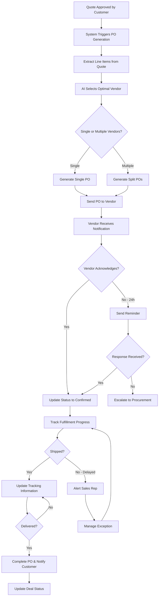
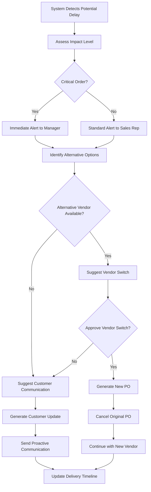
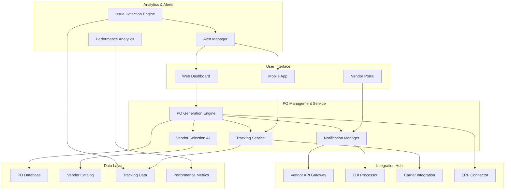
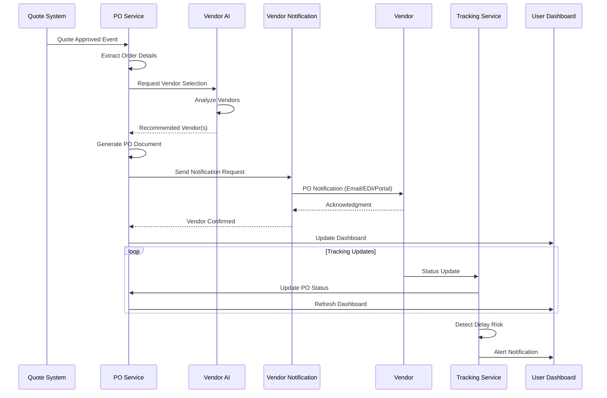
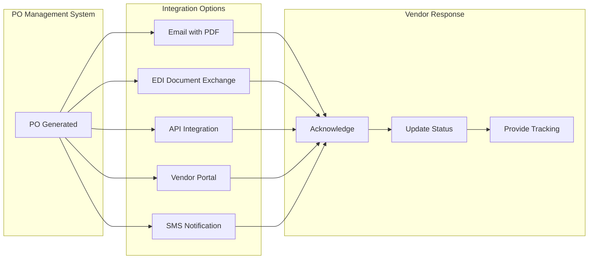
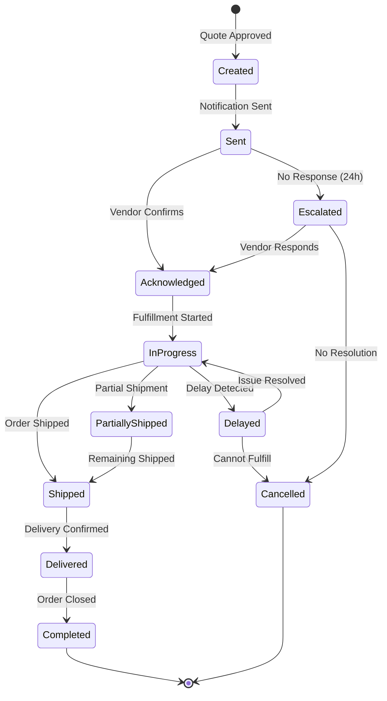
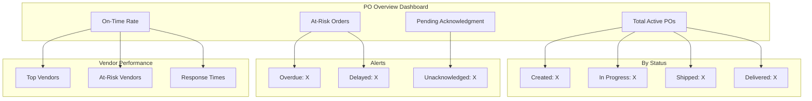

# Minimum Lovable Product (MLP) - Automated Purchase Order Management

## Executive Summary

**Use Case:** Automated Purchase Order Management  
**Target Users:** Sales Representatives, Procurement Team, Vendors/Partners, Operations Managers  
**Primary Goal:** Streamline the purchase order lifecycle from quote approval to delivery tracking through intelligent automation and vendor integration.

---

## Problem Statement

Organizations struggle with manual purchase order management processes:

- **Manual PO Creation:** Time-consuming manual generation of purchase orders from approved quotes
- **Vendor Communication Gaps:** Delayed and inconsistent communication with vendors
- **Tracking Challenges:** Lack of real-time visibility into PO status and delivery timelines
- **Error-Prone Processes:** Manual data entry leads to order errors and discrepancies
- **Coordination Overhead:** Significant effort required to coordinate between sales, procurement, and vendors
- **Delivery Delays:** Late detection of fulfillment issues leads to customer dissatisfaction

---

## Solution Overview

An intelligent automated purchase order management system that:

1. Automatically generates POs from approved quotations
2. Selects optimal vendors based on availability, pricing, and performance
3. Sends automated notifications to vendors
4. Provides real-time delivery tracking and status updates
5. Integrates with vendor systems for seamless order processing
6. Alerts stakeholders proactively about potential issues

---

## User Personas

### Sales Representative - "Active Alex"

**Pain Points:**
- Must manually coordinate PO creation after quote approval
- Lacks visibility into order fulfillment status
- Spends time following up with vendors on deliveries
- Cannot quickly respond to customer inquiries about order status

**Goals:**
- Automatic PO generation when quotes are approved
- Real-time visibility into delivery status
- Instant customer updates on order progress
- Focus on selling, not order management

### Procurement Specialist - "Precise Pat"

**Pain Points:**
- Manual vendor selection and PO creation
- Difficulty tracking multiple POs across vendors
- No centralized view of procurement activities
- Time spent on vendor follow-ups

**Goals:**
- Automated vendor selection based on criteria
- Streamlined PO workflow
- Centralized PO tracking dashboard
- Reduced manual intervention

### Vendor/Partner - "Reliable Rita"

**Pain Points:**
- Receives POs through inconsistent channels
- Unclear requirements and delivery expectations
- Manual order acknowledgment process
- Difficulty updating order status

**Goals:**
- Automated PO receipt through preferred channel
- Clear specifications and delivery requirements
- Easy order confirmation and status updates
- Strong partnership through efficient processes

### Operations Manager - "Organized Omar"

**Pain Points:**
- Lacks visibility into pending orders
- Delivery delays discovered too late
- No centralized tracking across all POs
- Manual reporting on procurement metrics

**Goals:**
- Real-time PO status dashboard
- Early warning for potential delays
- Automated reporting and analytics
- Process efficiency improvements

---

## Core Features

### 1. Automatic PO Generation

**Description:** Automatically create purchase orders from approved quotations without manual intervention.

**Capabilities:**
- Quote-to-PO conversion automation
- Line item mapping and validation
- Automatic PO number generation
- Multi-line order support
- Partial fulfillment handling

**Acceptance Criteria:**
- PO generated within 5 minutes of quote approval
- 100% accuracy in line item transfer
- Support for complex multi-product orders

### 2. Intelligent Vendor Selection

**Description:** AI-powered vendor selection based on multiple criteria to optimize fulfillment.

**Capabilities:**
- Availability-based vendor matching
- Price optimization across vendors
- Performance history scoring
- Geographic proximity consideration
- Split order capability for optimal fulfillment

**Acceptance Criteria:**
- Vendor selection completed in < 10 seconds
- Cost savings of 10%+ through optimization
- 95%+ vendor match accuracy

### 3. Automated Vendor Notifications

**Description:** Multi-channel notification system for seamless vendor communication.

**Capabilities:**
- Email notification with PO details
- EDI integration for enterprise vendors
- Vendor portal for PO access
- SMS alerts for urgent orders
- Automated reminders for unacknowledged POs

**Acceptance Criteria:**
- 100% vendor notification rate
- < 5 minute notification delivery
- Support for 3+ communication channels

### 4. Real-Time Delivery Tracking

**Description:** Live tracking of order status from PO creation to delivery completion.

**Capabilities:**
- Order status updates from vendors
- Shipping carrier integration
- Estimated delivery date tracking
- Milestone-based progress tracking
- Geolocation tracking (where available)

**Acceptance Criteria:**
- Real-time status updates (< 15 min delay)
- 95%+ delivery date accuracy
- Complete order lifecycle visibility

### 5. Issue Detection & Escalation

**Description:** Proactive identification and escalation of potential fulfillment issues.

**Capabilities:**
- Delay detection and prediction
- Automatic escalation workflows
- Alternative vendor suggestions
- Customer communication templates
- Resolution tracking

**Acceptance Criteria:**
- Issues detected 48+ hours before impact
- Automatic escalation for critical orders
- 80%+ issue resolution rate

### 6. Vendor System Integration

**Description:** Seamless integration with vendor systems for automated order processing.

**Capabilities:**
- API integration with vendor platforms
- EDI document exchange
- Vendor portal for smaller suppliers
- Automated invoice matching
- Payment processing integration

**Acceptance Criteria:**
- Support for 5+ integration methods
- 99%+ data accuracy in exchanges
- < 1 hour integration latency

---

## User Flow

### Happy Path: Automated PO from Quote Approval



### Alternative Flow: Issue Management



---

## Technical Architecture

### System Components



### Data Flow Architecture



---

## Vendor Integration Methods



---

## Success Metrics & KPIs

### Efficiency Metrics

| Metric | Current State | Target | Measurement Method |
|--------|--------------|--------|-------------------|
| Time from Quote to PO | 1-2 days | < 5 minutes | System timestamp |
| Vendor Notification Time | 4-8 hours | < 5 minutes | Notification logs |
| PO Processing Accuracy | 85% | 99%+ | Error tracking |
| Manual Intervention Rate | 80% | < 10% | Workflow analytics |

### Fulfillment Metrics

| Metric | Target | Measurement Method |
|--------|--------|-------------------|
| On-Time Delivery Rate | 95%+ | Delivery tracking |
| Early Issue Detection | 48 hours advance | Alert analytics |
| Vendor Response Time | < 4 hours | Response tracking |
| Order Status Visibility | 100% real-time | System coverage |

### Business Impact Metrics

| Metric | Target | Measurement Method |
|--------|--------|-------------------|
| Customer Satisfaction | 4.5/5+ | Survey feedback |
| Procurement Cost Savings | 10%+ | Cost analysis |
| Vendor Performance Score | 90%+ average | Performance tracking |
| Order Fulfillment Rate | 99%+ | Completion rate |

---

## Implementation Roadmap

### Phase 1: Foundation (Weeks 1-4)

- [ ] Set up PO management service infrastructure
- [ ] Build automatic PO generation from quotes
- [ ] Implement basic email notification system
- [ ] Create vendor acknowledgment workflow
- [ ] Develop PO tracking dashboard

### Phase 2: Intelligence (Weeks 5-8)

- [ ] Train AI vendor selection model
- [ ] Implement multi-vendor split order logic
- [ ] Add EDI integration capabilities
- [ ] Build delivery tracking integration
- [ ] Create issue detection algorithms

### Phase 3: Integration (Weeks 9-12)

- [ ] Develop vendor portal for self-service
- [ ] Add carrier tracking integrations
- [ ] Implement ERP synchronization
- [ ] Build automated escalation workflows
- [ ] Create mobile app functionality

### Phase 4: Optimization (Weeks 13-16)

- [ ] Refine vendor selection AI based on data
- [ ] Add predictive delay detection
- [ ] Implement vendor performance scoring
- [ ] Build advanced analytics dashboard
- [ ] Add API platform for custom integrations

---

## PO Lifecycle States



---

## Risk Assessment & Mitigation

### Technical Risks

| Risk | Impact | Probability | Mitigation Strategy |
|------|--------|-------------|---------------------|
| Vendor integration failures | High | Medium | Multiple integration fallbacks (email, portal) |
| Tracking data inconsistency | Medium | Medium | Data validation and reconciliation |
| System downtime | High | Low | Redundant architecture, offline queuing |

### Operational Risks

| Risk | Impact | Probability | Mitigation Strategy |
|------|--------|-------------|---------------------|
| Vendor non-compliance | High | Medium | Vendor onboarding and performance tracking |
| Delivery delays | High | Medium | Early detection and alternative sourcing |
| Order errors | Medium | Low | Automated validation and verification |

### Business Risks

| Risk | Impact | Probability | Mitigation Strategy |
|------|--------|-------------|---------------------|
| Vendor relationship issues | Medium | Low | Clear communication and mutual benefits |
| Customer dissatisfaction | High | Low | Proactive communication and updates |
| Cost overruns | Medium | Medium | Automated cost monitoring and alerts |

---

## Notification Templates

### PO Notification to Vendor

```
Subject: Purchase Order #{PO_NUMBER} - {COMPANY_NAME}

Dear {VENDOR_NAME},

Please find attached Purchase Order #{PO_NUMBER} for the following items:

{LINE_ITEMS_TABLE}

Required Delivery Date: {DELIVERY_DATE}
Shipping Address: {SHIPPING_ADDRESS}

Please acknowledge this order within 24 hours by:
- Clicking the link: {ACKNOWLEDGMENT_LINK}
- Replying to this email
- Logging into the vendor portal

Thank you for your partnership.

Best regards,
{COMPANY_NAME} Procurement Team
```

### Delay Alert to Sales Rep

```
Subject: ⚠️ Delivery Alert - PO #{PO_NUMBER}

A potential delay has been detected for PO #{PO_NUMBER}:

Customer: {CUSTOMER_NAME}
Original Delivery Date: {ORIGINAL_DATE}
New Estimated Date: {NEW_DATE}
Reason: {DELAY_REASON}

Recommended Actions:
1. Review alternative vendors
2. Contact customer proactively
3. Request expedited shipping

Action Required: {ACTION_LINK}
```

---

## Dashboard Views

### Operations Dashboard



---

## Conclusion

The Automated Purchase Order Management MLP addresses critical inefficiencies in the order fulfillment process by:

1. **Eliminating Manual Work:** Automatic PO generation from approved quotes
2. **Optimizing Vendor Selection:** AI-powered vendor matching for best fulfillment
3. **Ensuring Visibility:** Real-time tracking from order to delivery
4. **Preventing Issues:** Proactive detection and escalation of potential problems
5. **Strengthening Partnerships:** Streamlined vendor communication and collaboration

By automating the PO lifecycle, organizations can significantly reduce order processing time, improve delivery reliability, and enhance customer satisfaction while freeing up resources for higher-value activities.

---

**Document Version:** 1.0  
**Last Updated:** 2025-11-27  
**Document Owner:** Product Management Team
