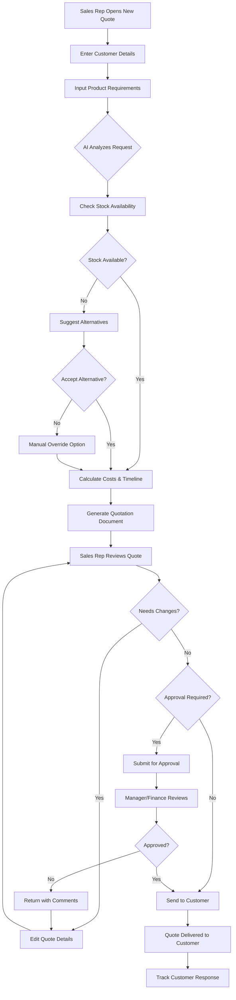
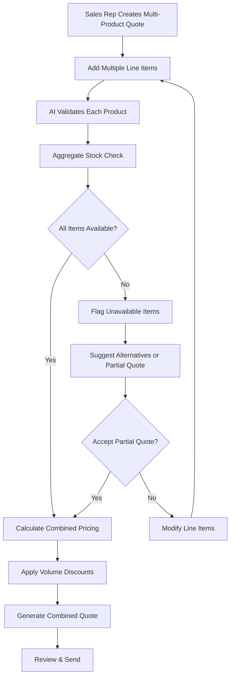
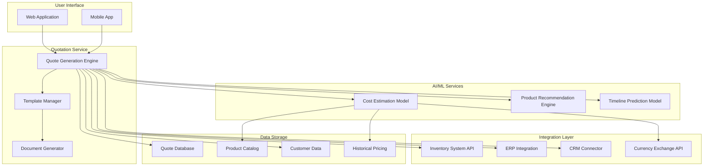
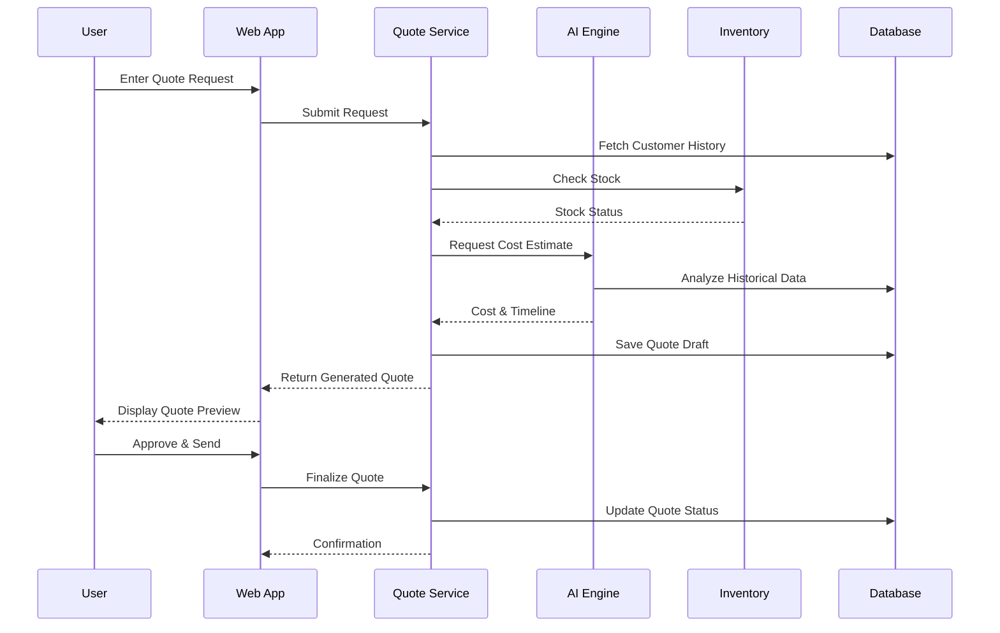
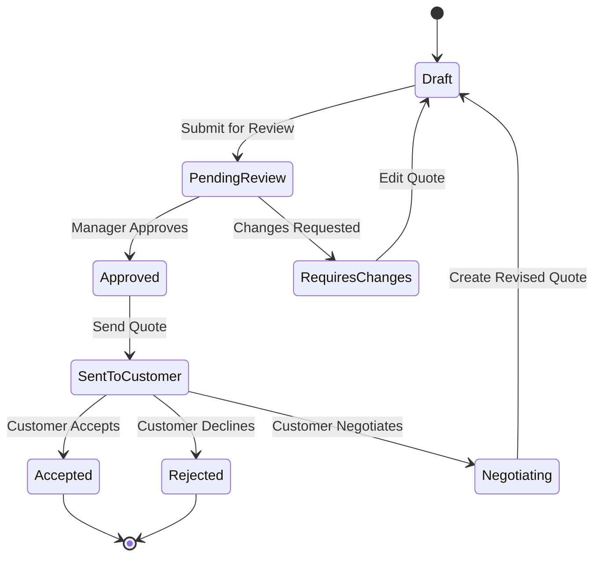
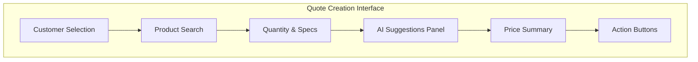

# Minimum Lovable Product (MLP) - Automated Quotation Generation

## Executive Summary

**Use Case:** Automated Quotation Generation  
**Target Users:** Sales Representatives, Sales Managers, Finance Approvers, Legal Team, Operations Team  
**Primary Goal:** Transform manual quotation processes into an automated, AI-powered system that generates accurate quotations in minutes instead of hours.

---

## Problem Statement

Sales teams face significant challenges with manual quotation processes:

- **Time Consuming:** Sales representatives spend up to 40% of their time on paperwork instead of selling
- **Error-Prone:** Manual data entry leads to pricing errors and inconsistencies
- **Lack of Visibility:** Unclear stock availability and delivery timelines
- **Slow Response:** Customers wait hours or days for quotations, risking lost opportunities
- **Inconsistent Pricing:** Different representatives may quote different prices for similar products

---

## Solution Overview

An AI-powered automated quotation generation system that:

1. Analyzes customer requirements using historical data
2. Validates stock availability in real-time
3. Calculates accurate costs and timelines automatically
4. Generates professional quotations using customizable templates
5. Supports multi-currency and multi-language requirements

---

## User Personas

### Sales Representative - "Active Alex"

**Pain Points:**
- Spends excessive time creating quotations manually
- Makes errors in pricing calculations
- Cannot quickly check stock availability
- Loses deals due to slow quotation turnaround

**Goals:**
- Generate accurate quotations in minutes
- Focus more time on customer relationships
- Reduce administrative burden
- Close more deals faster

### Sales Manager - "Strategic Sarah"

**Pain Points:**
- Lacks visibility into quotation pipeline
- Cannot track quotation accuracy and conversion
- No standardization across team quotations

**Goals:**
- Monitor quotation activity and trends
- Ensure pricing consistency across team
- Identify bottlenecks in quotation process
- Improve team efficiency

### Finance Approver - "Careful Chris"

**Pain Points:**
- Reviews quotations without full context
- Manual approval process delays deals
- Difficulty ensuring margin compliance

**Goals:**
- Quick, informed approval decisions
- Maintain pricing and margin guidelines
- Reduce review time while ensuring compliance

### Legal Team - "Compliant Casey"

**Pain Points:**
- Manual review of terms and conditions in quotations
- Lack of standardized legal language across quotes
- Difficulty tracking contractual obligations
- Time-consuming review for non-standard agreements

**Goals:**
- Automated inclusion of compliant terms and conditions
- Standardized legal templates for quotations
- Quick identification of non-standard terms requiring review
- Streamlined legal approval workflow

### Operations Team - "Efficient Evan"

**Pain Points:**
- Lack of visibility into quoted delivery commitments
- Disconnection between quotes and operational capacity
- Difficulty assessing feasibility of quoted timelines
- Manual handoff from sales to operations

**Goals:**
- Real-time visibility into quotation pipeline
- Integration with capacity planning systems
- Automated feasibility checks for delivery timelines
- Seamless transition from quote to fulfillment

---

## Core Features

### 1. AI-Powered Cost Estimation

**Description:** Machine learning model that analyzes historical quotation data to provide accurate cost estimates.

**Capabilities:**
- Historical pricing analysis
- Real-time cost calculation
- Margin optimization suggestions
- Currency conversion support

**Acceptance Criteria:**
- 95% accuracy in cost estimation
- Cost calculation completed in < 5 seconds
- Automatic margin validation against company guidelines

### 2. Real-Time Stock Availability Check

**Description:** Integration with inventory systems to validate product availability before generating quotations.

**Capabilities:**
- Real-time inventory lookup
- Multi-warehouse availability check
- Alternative product suggestions when stock is low
- Lead time calculation based on stock levels

**Acceptance Criteria:**
- Stock check completed in < 3 seconds
- 100% accuracy in availability status
- Automatic alternative suggestions for out-of-stock items

### 3. Automated Timeline Calculation

**Description:** Intelligent calculation of delivery timelines based on stock, manufacturing, and logistics data.

**Capabilities:**
- Production lead time calculation
- Shipping time estimation
- Buffer calculation for complex orders
- Rush order capability assessment

**Acceptance Criteria:**
- Timeline accuracy within ±2 days
- Rush order identification and flagging
- Automatic escalation for tight timelines

### 4. Template-Based Quotation Generation

**Description:** Professional quotation documents generated automatically using customizable templates.

**Capabilities:**
- Multiple template designs
- Company branding integration
- Dynamic content population
- PDF and document export

**Acceptance Criteria:**
- Quotation generated in < 2 minutes
- Support for at least 5 template designs
- Multi-format export (PDF, Word, Excel)

### 5. Multi-Currency & Multi-Language Support

**Description:** Global support for international customers with automatic currency conversion and language translation.

**Capabilities:**
- Real-time currency conversion
- Language translation for customer-facing content
- Regional tax and compliance handling
- International shipping cost calculation

**Acceptance Criteria:**
- Support for 10+ major currencies
- Support for 5+ languages
- Real-time exchange rate updates

---

## User Flow

### Happy Path: Quick Quotation Generation

### Alternative Flow: Complex Quotation with Multiple Products

---

## Technical Architecture

### System Components

### Data Flow

---

## Success Metrics & KPIs

### Efficiency Metrics

| Metric | Current State | Target | Measurement Method |
|--------|--------------|--------|-------------------|
| Average Quote Generation Time | 2-4 hours | < 5 minutes | System timestamp |
| Quote Accuracy Rate | 75% | 95%+ | Error tracking |
| Quotes per Rep per Day | 3-5 | 15-20 | Usage analytics |
| Quote Revision Rate | 40% | < 15% | Revision tracking |

### Business Impact Metrics

| Metric | Target | Measurement Method |
|--------|--------|-------------------|
| Quote-to-Win Conversion | 30%+ improvement | Sales tracking |
| Customer Response Time | < 1 hour | Customer tracking |
| Revenue per Sales Rep | 25%+ increase | Revenue analysis |
| Customer Satisfaction | 4.5/5+ rating | Survey feedback |

### Quality Metrics

| Metric | Target | Measurement Method |
|--------|--------|-------------------|
| Stock Availability Accuracy | 99%+ | Inventory comparison |
| Pricing Error Rate | < 1% | Audit review |
| Template Compliance | 100% | Format validation |
| Delivery Timeline Accuracy | ±2 days | Fulfillment tracking |

---

## Implementation Roadmap

### Phase 1: Foundation (Weeks 1-4)

- [ ] Set up quotation service infrastructure
- [ ] Build basic quote generation engine
- [ ] Create initial template designs (3 templates)
- [ ] Implement stock availability integration
- [ ] Develop basic cost calculation logic

### Phase 2: AI Integration (Weeks 5-8)

- [ ] Train initial AI cost estimation model
- [ ] Implement product recommendation engine
- [ ] Add timeline prediction capabilities
- [ ] Create alternative product suggestion system
- [ ] Integrate currency conversion

### Phase 3: Enhancement (Weeks 9-12)

- [ ] Add multi-language support
- [ ] Implement approval workflow
- [ ] Build mobile app functionality
- [ ] Create manager dashboard
- [ ] Add advanced analytics and reporting

### Phase 4: Optimization (Weeks 13-16)

- [ ] Refine AI models based on usage data
- [ ] Add volume discount automation
- [ ] Implement custom template builder
- [ ] Add advanced CRM integrations
- [ ] Performance optimization and scaling

---

## Approval Workflow

---

## Risk Assessment & Mitigation

### Technical Risks

| Risk | Impact | Probability | Mitigation Strategy |
|------|--------|-------------|---------------------|
| AI model accuracy below target | High | Medium | Implement manual override, continuous model training |
| Integration failures with inventory | High | Low | Build redundant data sources, cache mechanism |
| Performance degradation at scale | Medium | Medium | Cloud-native architecture, auto-scaling |

### Business Risks

| Risk | Impact | Probability | Mitigation Strategy |
|------|--------|-------------|---------------------|
| User adoption resistance | High | Medium | Comprehensive training, change management |
| Data privacy concerns | High | Low | Robust security measures, compliance certification |
| Competitive pressure | Medium | Medium | Focus on UX and AI differentiation |

---

## User Experience Guidelines

### Design Principles

1. **Speed First:** Minimize clicks to generate a quote
2. **Smart Defaults:** AI suggests optimal values
3. **Transparent AI:** Show reasoning behind recommendations
4. **Error Prevention:** Validate inputs in real-time
5. **Mobile Friendly:** Full functionality on mobile devices

### Key UI Elements

---

## Conclusion

The Automated Quotation Generation MLP addresses critical pain points in the sales process by:

1. **Reducing Time:** From hours to minutes for quote generation
2. **Improving Accuracy:** AI-powered pricing and availability checks
3. **Enhancing Customer Experience:** Faster response times
4. **Increasing Revenue:** More quotes generated, higher conversion rates

By focusing on core automation features in Phase 1 and progressively adding AI capabilities, the system delivers immediate value while building towards a comprehensive quotation management solution.

---

**Document Version:** 1.0  
**Last Updated:** 2025-11-27  
**Document Owner:** Product Management Team
