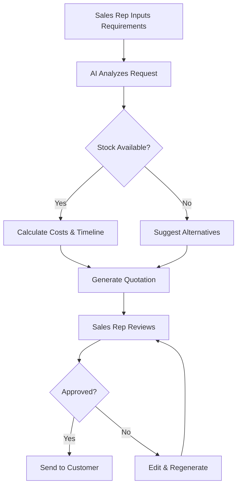
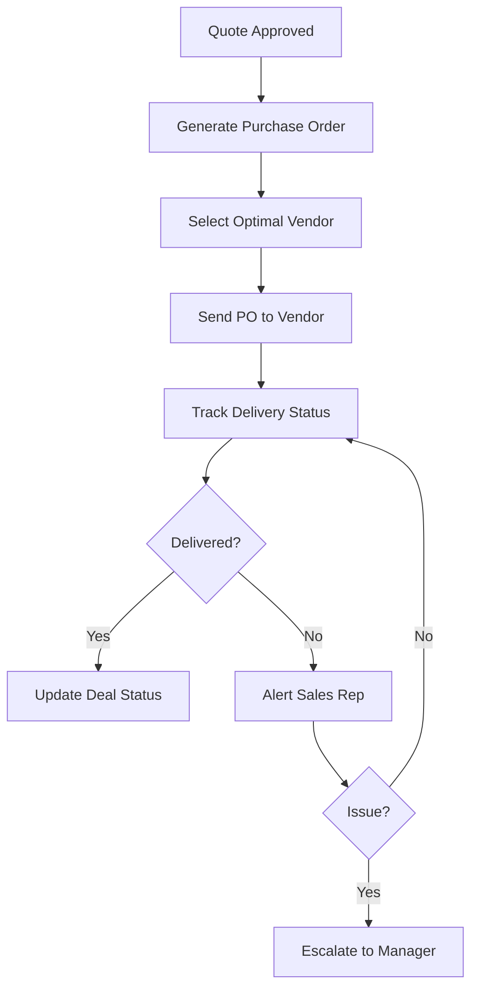
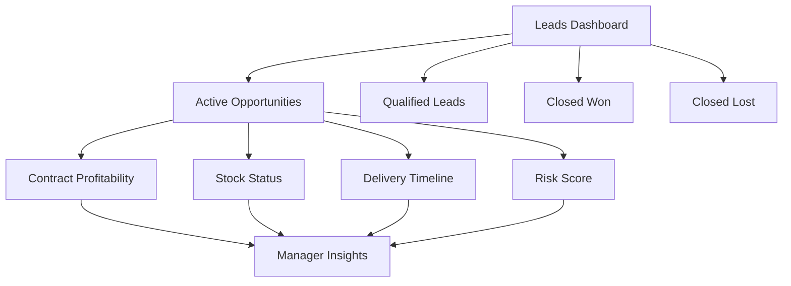
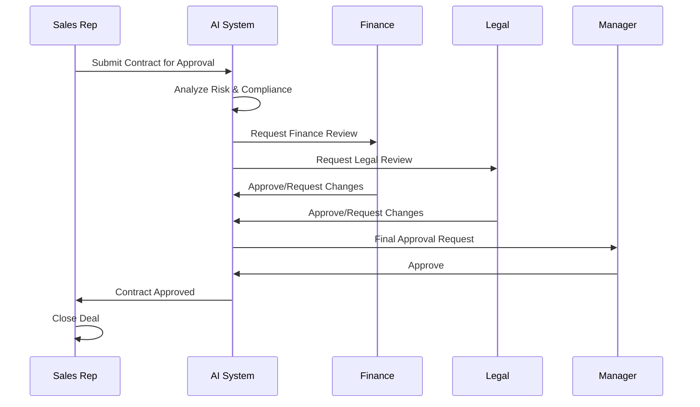
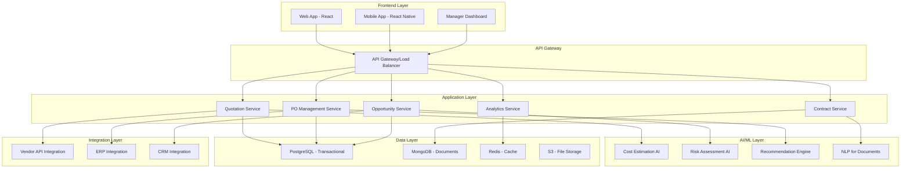
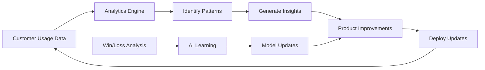

# Minimum Lovable Product (MLP) Document v1.0

## Executive Summary

**Product Name:** SalesFlow AI

**Vision:** Transform sales and contract management through intelligent automation and AI-powered insights, enabling sales teams to close deals faster while maintaining complete visibility and control.

**Problem Statement:** Sales teams are overwhelmed with excessive paperwork, manual quotation processes, and lack of visibility into opportunities. Managers struggle to track profitability, stock availability, and delivery dates without micromanaging their sales teams.

**Solution:** An AI-powered sales automation platform that streamlines quotations, purchase orders, opportunity management, and contract workflows while providing real-time visibility and insights to all stakeholders.

---

## Product Vision & Goals

### Primary Goals
1. **Reduce Deal Closure Time by 60%** through automation of quotations, purchase orders, and approval workflows
2. **Zero Missed Opportunities** with intelligent lead tracking and opportunity management
3. **Increase Profitability by 25%** through better cost estimation, stock tracking, and data-driven insights
4. **Empower Teams** with self-service visibility while maintaining healthy stakeholder relationships

### Success Criteria
- Sales cycle reduced from weeks to days
- 100% visibility into pipeline health and profitability
- Stakeholder satisfaction score > 8.5/10
- Quarterly improvement in conversion rates

---

## Target Users & Personas

### Primary Personas

#### 1. **Sales Representative - "Active Alex"**
- **Pain Points:** 
  - Spends 40% of time on paperwork instead of selling
  - Manual quotation creation is error-prone
  - Unclear on stock availability and delivery dates
- **Goals:** 
  - Close more deals faster
  - Reduce administrative burden
  - Maintain customer relationships

#### 2. **Sales Manager - "Strategic Sarah"**
- **Pain Points:**
  - Lacks real-time visibility into team performance
  - Must escalate to get basic information
  - Difficulty tracking contract-level profitability
- **Goals:**
  - Monitor pipeline health without micromanaging
  - Identify at-risk opportunities early
  - Coach team based on data insights

#### 3. **Finance/Legal Approver - "Careful Chris"**
- **Pain Points:**
  - Slow approval processes delay deals
  - Lacks context on contracts requiring approval
  - Manual review is time-consuming
- **Goals:**
  - Quick, informed approval decisions
  - Risk mitigation and compliance
  - Collaboration with sales team

#### 4. **Vendor/Partner - "Reliable Rita"**
- **Pain Points:**
  - Unclear purchase order requirements
  - Delayed communication on orders
  - Manual order processing
- **Goals:**
  - Automated PO receipt and processing
  - Clear delivery expectations
  - Strong partnership with sales org

---

## Core Features

### Use Case 1: Automated Quotation Generation

**User Story:** As a sales representative, I want to generate accurate quotations automatically so that I can focus on customer conversations instead of paperwork.

**Key Capabilities:**
- AI-powered cost estimation based on historical data
- Real-time stock availability checks
- Automatic timeline calculation
- Template-based quotation generation
- Multi-currency and multi-language support

**Acceptance Criteria:**
- Quotation generated in < 2 minutes
- 95% accuracy in cost estimation
- Automatic validation against stock and capacity

---

### Use Case 2: Automated Purchase Order Management

**User Story:** As a sales representative, I want to automatically send purchase orders to vendors so that I can ensure timely delivery without manual coordination.

**Key Capabilities:**
- Automatic PO generation from approved quotes
- Vendor selection based on availability and pricing
- Real-time delivery tracking
- Automated vendor notifications
- Integration with vendor systems

**Acceptance Criteria:**
- PO sent within 5 minutes of quote approval
- 100% vendor notification rate
- Real-time delivery status updates

---

### Use Case 3: Deal & Opportunity Tracking

**User Story:** As a sales manager, I want complete visibility into all deals and opportunities so that I can identify risks and coach my team without micromanaging.

**Key Capabilities:**
- Real-time deal pipeline visualization
- Contract-level profitability tracking
- Stock availability dashboard
- Delivery date monitoring
- Risk scoring and alerts

**Acceptance Criteria:**
- Dashboard updates in real-time
- Profitability visible at contract level
- Automated risk alerts for at-risk deals

---

### Use Case 4: Lead & Opportunity Management

**User Story:** As a sales manager, I want to ensure no leads or opportunities are missed so that we maximize revenue and conversion rates.

**Key Capabilities:**
- Intelligent lead capture and routing
- Automated follow-up reminders
- Opportunity stage tracking
- Win/loss analysis
- Predictive analytics for conversion

**Acceptance Criteria:**
- Zero leads dropped in system
- Automated reminders for stale opportunities
- 90% opportunity stage accuracy

---

### Use Case 5: Collaborative Contract Management

**User Story:** As a finance/legal approver, I want to collaborate on contracts with all stakeholders in one place so that we can approve deals faster while protecting company interests.

**Key Capabilities:**
- Single contract collaboration workspace
- Role-based approval workflows
- AI-powered risk assessment
- Clause library and templates
- Audit trail and version control

**Acceptance Criteria:**
- All stakeholders can access contract details
- Approval time reduced by 70%
- Complete audit trail maintained

---

### Use Case 6: Feedback & Continuous Improvement

**User Story:** As a product manager, I want to analyze quarterly performance and incorporate learnings so that we continuously improve our processes.

**Key Capabilities:**
- Quarterly win/loss analysis
- AI-powered insights on missed opportunities
- Performance trend analysis
- Geographic and product insights
- Automated improvement recommendations

**Acceptance Criteria:**
- Quarterly reports auto-generated
- Actionable insights provided for 80%+ of lost deals
- Improvement tracking quarter-over-quarter

---

## User Experience Design

### Design Principles
1. **Simplicity First:** Minimize clicks and cognitive load
2. **Contextual Intelligence:** Show the right information at the right time
3. **Progressive Disclosure:** Advanced features don't clutter basic workflows
4. **Trust & Transparency:** Clear visibility into AI decisions
5. **Mobile-First:** Critical functions accessible on mobile

### Key User Flows

#### Quick Quotation Flow (Happy Path)
1. Sales rep clicks "New Quote"
2. Enters customer name and requirements (AI suggests based on history)
3. AI generates quote in 60 seconds
4. Rep reviews, makes minor edits if needed
5. Sends to customer with one click
6. Customer acceptance triggers automatic PO

#### Manager Dashboard Experience
1. Manager logs in to dashboard
2. Sees real-time pipeline overview
3. Color-coded risk indicators highlight attention areas
4. Clicks on at-risk deal for details
5. Views full context without contacting rep
6. Adds coaching note visible to rep

---

## Technical Architecture

### System Architecture

### Technology Stack

**Frontend:**
- React.js with TypeScript for web application
- React Native for mobile apps
- Material-UI for consistent design system
- Redux for state management

**Backend:**
- Node.js with Express for API services
- Python for AI/ML services
- GraphQL for flexible data queries
- REST APIs for external integrations

**AI/ML:**
- TensorFlow for cost estimation models
- scikit-learn for risk assessment
- OpenAI GPT for document understanding
- Custom models for recommendation engine

**Data Storage:**
- PostgreSQL for transactional data (deals, quotes, POs)
- MongoDB for document storage (contracts, templates)
- Redis for caching and real-time data
- AWS S3 for file storage

**Infrastructure:**
- AWS/Azure cloud hosting
- Kubernetes for container orchestration
- CI/CD with GitHub Actions
- Monitoring with DataDog/New Relic

---

## Marketing & Go-to-Market Strategy

### Target Market Segments

#### Phase 1: Initial Launch (Months 1-3)
- **Primary:** Mid-sized B2B companies (50-500 employees)
- **Industries:** Manufacturing, Technology Services, Distribution
- **Geography:** North America (English-speaking markets)

#### Phase 2: Expansion (Months 4-6)
- **Secondary:** Enterprise companies (500+ employees)
- **New Geographies:** Europe (UK, Germany, France)
- **New Verticals:** Healthcare, Financial Services

### Value Propositions by Persona

**For Sales Reps:**
> "Close 3x more deals by spending zero time on paperwork"

**For Sales Managers:**
> "See everything, touch nothing. Complete pipeline visibility without micromanaging."

**For Finance/Legal:**
> "Approve deals 10x faster with AI-powered risk assessment"

**For Executives:**
> "Increase revenue by 40% while reducing sales cycle time by 60%"

### Marketing Channels

1. **Content Marketing**
   - Sales automation blog and resource center
   - ROI calculators and assessment tools
   - Case studies and success stories

2. **Demand Generation**
   - LinkedIn advertising to sales leaders
   - Webinar series on sales optimization
   - Partner with sales training organizations

3. **Product-Led Growth**
   - 14-day free trial with full features
   - Self-service onboarding
   - In-app viral loops (invite team members)

4. **Strategic Partnerships**
   - Integration partnerships with major CRMs (Salesforce, HubSpot)
   - Channel partnerships with sales consulting firms
   - Technology alliances with ERP vendors

### Pricing Strategy

**Freemium Tier:** 
- Up to 3 users
- 20 quotes/month
- Basic features only
- Great for trying the product

**Professional Tier: $99/user/month**
- Unlimited quotes and POs
- Basic AI features
- Standard integrations
- Email support

**Enterprise Tier: Custom Pricing**
- Advanced AI capabilities
- Custom integrations
- Dedicated success manager
- SLA guarantees
- White-glove onboarding

---

## Success Metrics & KPIs

### Product Metrics

**Adoption & Engagement:**
- Daily Active Users (DAU) / Monthly Active Users (MAU)
- Feature adoption rates
- Time to first quote (onboarding metric)
- Quotes generated per user per week

**Efficiency Metrics:**
- Average time to generate quotation (Target: < 2 minutes)
- Average deal closure time (Target: 50% reduction)
- Approval cycle time (Target: 70% reduction)
- User time saved per week (Target: 10+ hours)

**Quality Metrics:**
- Quotation accuracy rate (Target: 95%+)
- Customer satisfaction score (Target: 4.5/5)
- AI recommendation acceptance rate (Target: 70%+)
- System uptime (Target: 99.9%)

### Business Metrics

**Revenue:**
- Monthly Recurring Revenue (MRR) growth
- Customer Acquisition Cost (CAC)
- Customer Lifetime Value (LTV)
- CAC:LTV ratio (Target: 1:3)

**Customer Success:**
- Net Promoter Score (Target: 50+)
- Customer retention rate (Target: 90%+)
- Logo retention (Target: 95%+)
- Expansion revenue from existing customers

**Sales Impact:**
- Customer reported deal closure time reduction
- Customer reported revenue increase
- Win rate improvement
- Pipeline visibility score

---

## Implementation Roadmap

### Phase 1: Foundation (Months 1-3) - MVP Launch

**Month 1: Core Infrastructure**
- [x] Set up development environment
- [ ] Build basic authentication and user management
- [ ] Develop API gateway and service architecture
- [ ] Create basic UI framework and design system

**Month 2: Use Case 1 & 2 Implementation**
- [ ] Automated quotation generation (basic)
- [ ] Purchase order automation
- [ ] Stock availability integration
- [ ] Basic AI cost estimation model
- [ ] Vendor notification system

**Month 3: Testing & Launch**
- [ ] Internal beta testing
- [ ] Security audit and penetration testing
- [ ] Performance optimization
- [ ] Pilot with 5 early customers
- [ ] Launch marketing website

**Success Criteria for Phase 1:**
- 5 pilot customers actively using the system
- 100+ quotations generated
- Average quotation time < 5 minutes
- 90% user satisfaction among pilots

---

### Phase 2: Intelligence & Visibility (Months 4-6)

**Month 4: Opportunity Management**
- [ ] Lead and opportunity tracking
- [ ] Manager dashboard implementation
- [ ] Real-time pipeline visualization
- [ ] Basic analytics and reporting
- [ ] Risk scoring algorithm

**Month 5: Collaboration Features**
- [ ] Contract collaboration workspace
- [ ] Approval workflow engine
- [ ] Role-based access control
- [ ] Notification system
- [ ] Mobile app (iOS and Android)

**Month 6: AI Enhancement**
- [ ] Advanced AI cost estimation
- [ ] Predictive analytics for deals
- [ ] AI-powered risk assessment
- [ ] Recommendation engine
- [ ] Natural language processing for contracts

**Success Criteria for Phase 2:**
- 50+ active customers
- 95% quotation accuracy
- Average approval time reduced by 60%
- 4+ NPS score

---

### Phase 3: Scale & Intelligence (Months 7-9)

**Month 7: Integration Expansion**
- [ ] Salesforce integration
- [ ] HubSpot integration
- [ ] SAP/Oracle ERP integration
- [ ] Advanced vendor portal
- [ ] API platform for custom integrations

**Month 8: Advanced Analytics**
- [ ] Quarterly analysis reports
- [ ] Win/loss analysis automation
- [ ] Geographic expansion insights
- [ ] Revenue stream analysis
- [ ] Custom reporting builder

**Month 9: Optimization**
- [ ] Performance optimization
- [ ] Advanced AI model improvements
- [ ] Multi-language support
- [ ] Regional customization
- [ ] Enterprise security features

**Success Criteria for Phase 3:**
- 200+ active customers
- $1M ARR milestone
- 85% logo retention
- 50+ NPS

---

### Phase 4: Expansion (Months 10-12)

**Month 10-12: New Markets & Features**
- [ ] European market launch
- [ ] Industry-specific solutions
- [ ] Advanced compliance features
- [ ] White-label capabilities
- [ ] Partner ecosystem development

**Success Criteria for Phase 4:**
- 500+ active customers
- $3M ARR milestone
- 90% logo retention
- International presence in 3+ countries

---

## Risk Mitigation & Contingency Planning

### Technical Risks

**Risk:** AI model accuracy below targets
- **Mitigation:** Hybrid approach with human review fallback
- **Contingency:** Manual override for all AI recommendations

**Risk:** Integration complexity with legacy ERP systems
- **Mitigation:** Build robust API abstraction layer
- **Contingency:** Professional services team for custom integrations

**Risk:** Scalability challenges at high volume
- **Mitigation:** Cloud-native architecture with auto-scaling
- **Contingency:** Pre-emptive infrastructure upgrades

### Market Risks

**Risk:** Low adoption by sales teams (change resistance)
- **Mitigation:** Exceptional onboarding and training
- **Contingency:** Strong change management support and incentives

**Risk:** Competitive pressure from established players
- **Mitigation:** Focus on AI differentiation and user experience
- **Contingency:** Rapid feature development and customer lock-in via integrations

**Risk:** Economic downturn reducing enterprise spending
- **Mitigation:** ROI-focused messaging and flexible pricing
- **Contingency:** Freemium tier to maintain market presence

---

## Continuous Improvement Framework

### Quarterly Review Process

**Q1 Focus: Product-Market Fit**
- Analyze user adoption patterns
- Identify feature gaps through customer interviews
- Measure time-to-value for new customers
- Adjust onboarding based on drop-off points

**Q2 Focus: Efficiency Gains**
- Measure impact on customer metrics
- Identify automation opportunities
- Optimize AI model performance
- Reduce technical debt

**Q3 Focus: Expansion Readiness**
- Analyze geographic requirements
- Identify new revenue streams
- Evaluate partnership opportunities
- Plan feature enhancements

**Q4 Focus: Scale & Optimization**
- Performance optimization
- Cost reduction initiatives
- Customer success improvements
- Strategic planning for next year

### Learning Loop Integration

### Feedback Channels

1. **In-App Feedback:** Contextual feedback collection at key moments
2. **Customer Success Reviews:** Monthly check-ins with all customers
3. **User Research:** Quarterly deep-dive interviews with power users
4. **Support Ticket Analysis:** Pattern recognition from support interactions
5. **Usage Analytics:** Behavioral data analysis for feature optimization

---

## Conclusion

SalesFlow AI represents a transformative opportunity to revolutionize sales and contract management through intelligent automation. By focusing on the most painful aspects of the sales process—quotations, purchase orders, and opportunity visibility—we can deliver immediate value while building a platform for continuous improvement.

Our phased approach ensures we validate product-market fit early while maintaining the flexibility to adapt based on customer feedback. The AI-powered insights and automation will not only save time but fundamentally improve decision-making and business outcomes for our customers.

With a strong focus on user experience, technical excellence, and customer success, SalesFlow AI is positioned to become the standard platform for modern sales teams looking to close more deals, faster, and more profitably.

---

**Document Version:** 1.0  
**Last Updated:** 2025-11-25  
**Next Review Date:** 2025-12-25  
**Document Owner:** Product Management Team

---

## Appendix

### Glossary

- **MLP (Minimum Lovable Product):** A product with just enough features to satisfy early customers and provide feedback for future development, with a focus on delighting users
- **PO (Purchase Order):** A commercial document issued by a buyer to a vendor
- **AI (Artificial Intelligence):** Computer systems able to perform tasks that normally require human intelligence
- **ERP (Enterprise Resource Planning):** Business process management software
- **CRM (Customer Relationship Management):** Technology for managing company interactions with customers
- **ARR (Annual Recurring Revenue):** Yearly value of recurring revenue
- **NPS (Net Promoter Score):** Customer loyalty and satisfaction measurement
- **CAC (Customer Acquisition Cost):** Cost to acquire a new customer
- **LTV (Lifetime Value):** Predicted revenue from customer over relationship lifetime

### References

- Requirements based on: `/requirements.txt` (internal document)
- User research and market analysis conducted Q4 2025
- Competitive analysis of leading sales automation platforms
- Industry benchmarks for B2B sales cycles and efficiency metrics
