# Multiphase Product Requirements Document (PRD)
## Automated Quotation and Purchase Order Management System

---

## Document Information
- **Document Version:** 3.0
- **Date:** December 2025
- **Status:** Draft
- **Prepared By:** Product Manager, Business Analyst, Engineering Lead, UI/UX Designer, and Stakeholders
- **Delivery Timeline:** 11 Days

---

## 1. Executive Summary

This Multiphase Product Requirements Document outlines the comprehensive requirements for an integrated Automated Quotation and Purchase Order Management System, designed for delivery within an **11-day accelerated timeline**. The system addresses two critical business processes:

1. **Automated Quotation Generation** - Transform manual quotation processes into an AI-powered system that generates accurate quotations in minutes instead of hours
2. **Automated Purchase Order Management** - Streamline the purchase order lifecycle from quote approval to delivery tracking through intelligent automation and vendor integration

### 1.1 Primary Goals

| Use Case | Target Users | Primary Goal |
|----------|--------------|--------------|
| Automated Quotation Generation | Sales Representatives, Sales Managers, Finance Approvers | Transform manual quotation processes into an automated, AI-powered system that generates accurate quotations in minutes instead of hours |
| Automated Purchase Order Management | Sales Representatives, Procurement Team, Vendors/Partners, Operations Managers | Streamline the purchase order lifecycle from quote approval to delivery tracking through intelligent automation and vendor integration |

### 1.2 Delivery Timeline Overview

This solution is planned for delivery within an **11-day timeframe**, organized into focused sprints:

| Sprint | Days | Focus Area |
|--------|------|------------|
| Foundation Sprint | Days 1-3 | Core infrastructure, basic quote generation, PO automation, email notifications |
| AI Integration Sprint | Days 4-6 | AI cost estimation, vendor selection, product recommendations, issue detection |
| Enhancement Sprint | Days 7-9 | Multi-currency, vendor portal, approval workflows, carrier tracking |
| Testing & Launch | Days 10-11 | End-to-end testing, UAT, optimization, documentation, go-live preparation |

---

## 2. Assumptions

This Multiphase PRD is based on the following assumptions derived from the requirements documented in the Automated Quotation Generation MLP and Automated Purchase Order Management MLP:

### 2.1 Business Assumptions

1. **Organizational Readiness:** The organization has existing processes for quotation generation and purchase order management that can be improved through automation.
2. **Stakeholder Buy-in:** Key stakeholders including Sales, Procurement, Finance, Legal, and Operations teams are committed to adopting the new system.
3. **Data Availability:** Historical quotation and purchase order data is available for AI model training and cost estimation.
4. **Vendor Willingness:** Vendors and partners are willing to participate in automated notification and tracking systems.
5. **Budget Allocation:** Sufficient budget is allocated for the phased implementation of the system.

### 2.2 Technical Assumptions

1. **System Integration:** Existing inventory, ERP, and CRM systems can be integrated with the new platform via APIs.
2. **Infrastructure:** Cloud infrastructure is available for hosting the application with required scalability.
3. **Data Quality:** Existing product, pricing, and vendor data is accurate and can be migrated to the new system.
4. **Network Connectivity:** Reliable network connectivity is available for real-time data exchange with vendors and external systems.
5. **Security Compliance:** The organization has security policies that can accommodate cloud-based SaaS solutions.

### 2.3 User Assumptions

1. **User Adoption:** Sales representatives, procurement specialists, and other users will adopt the new system after appropriate training.
2. **Digital Literacy:** Users have sufficient digital literacy to use web and mobile applications.
3. **Change Management:** The organization will provide change management support to facilitate user transition.
4. **Multi-User Collaboration:** Multiple users may work on quotations and purchase orders simultaneously, requiring proper access controls.

### 2.4 Market Assumptions

1. **Competitive Landscape:** The market for sales automation and procurement tools continues to grow.
2. **Customer Expectations:** Customers expect faster quotation turnaround times and real-time order visibility.
3. **Vendor Ecosystem:** Vendors across different industries are increasingly adopting digital communication channels for order processing.
4. **Regulatory Environment:** No significant regulatory changes are expected that would impact the system's functionality.

### 2.5 Operational Assumptions

1. **Multi-Currency Requirements:** The organization operates in multiple regions requiring multi-currency support.
2. **Multi-Language Needs:** Customer-facing communications may require multiple language support.
3. **Approval Workflows:** Existing approval hierarchies for quotations and purchase orders will be maintained in the new system.
4. **Vendor Performance Tracking:** Organizations are interested in tracking and optimizing vendor performance over time.

### 2.6 11-Day Accelerated Delivery Assumptions

The following additional assumptions are critical to achieving the 11-day delivery timeline:

1. **Pre-trained AI Models:** Pre-trained AI models for cost estimation and vendor selection are available for deployment. These models have been trained on historical data and require only configuration and fine-tuning rather than training from scratch.
   - **Model Requirements:**
     - Cost Estimation Model: REST API compatible, response time < 500ms, input format: JSON with product/quantity/customer data
     - Vendor Selection Model: REST API compatible, response time < 1s, input format: JSON with order details and vendor criteria
   - **Baseline Accuracy:** Models must demonstrate minimum 80% accuracy on validation dataset before deployment
2. **Dedicated Resource Allocation:** Full-time dedicated resources from development, QA, and operations teams are available for the entire 11-day period with no competing priorities.
3. **Parallel Workstreams:** Multiple development workstreams can execute in parallel without blocking dependencies.
4. **Simplified Initial Scope:** The initial MLP release prioritizes core functionality:
   - 2 quotation templates (Standard and Detailed) - additional custom templates will be added post-launch
   - 3 major currencies (USD, EUR, GBP) - additional currencies will be added post-launch
   - 2 major carrier integrations - additional carriers will be added post-launch
5. **Pre-existing Development Environment:** Development, staging, and production environments are already provisioned and configured.
6. **API Documentation Available:** All external system APIs (inventory, ERP, CRM, carriers) have documented and accessible endpoints.
7. **Interim Success Metrics:** The 11-day delivery targets are interim metrics that will be improved through continuous optimization:
   - AI cost estimation: 85% accuracy initially (measured against historical pricing data), targeting 95%+ post-optimization
   - Issue detection: 12+ hours advance notice initially, targeting 48+ hours post-optimization
   - Vendor selection: ≥80% of recommendations accepted by procurement team (measured via selection override rate), targeting 95%+ acceptance with refined models

### 2.7 11-Day Timeline Risk Mitigation

Given the aggressive 11-day timeline, the following risk mitigation strategies are in place:

| Risk | Probability | Impact | Mitigation Strategy |
|------|-------------|--------|---------------------|
| Timeline extension required | High | Medium | Buffer of 2 additional days built into sprint planning; non-critical features can be deferred to post-launch |
| AI model performance below target | Medium | High | Fallback to rule-based estimation with manual override capability; models can be refined post-launch |
| Integration delays with external systems | Medium | High | Mock integrations prepared for testing; phased integration approach with critical systems prioritized |
| Resource availability constraints | Low | High | Cross-trained team members; documented handoff procedures |
| Scope creep | High | Medium | Strict change control process; feature requests documented for post-launch roadmap |

**Deployment Safety Measures:**
- All AI model deployments include rollback procedures with < 5 minute restoration time
- Feature flags enable gradual rollout and immediate disabling if issues detected
- Shadow mode deployment available to compare AI recommendations against manual decisions before full activation
- Automated monitoring alerts for accuracy degradation or performance issues

---

## 3. Problem Statement

### 3.1 Quotation Generation Challenges

Sales teams face significant challenges with manual quotation processes:

- **Time Consuming:** Sales representatives spend up to 40% of their time on paperwork instead of selling
- **Error-Prone:** Manual data entry leads to pricing errors and inconsistencies
- **Lack of Visibility:** Unclear stock availability and delivery timelines
- **Slow Response:** Customers wait hours or days for quotations, risking lost opportunities
- **Inconsistent Pricing:** Different representatives may quote different prices for similar products

### 3.2 Purchase Order Management Challenges

Organizations struggle with manual purchase order management processes:

- **Manual PO Creation:** Time-consuming manual generation of purchase orders from approved quotes
- **Vendor Communication Gaps:** Delayed and inconsistent communication with vendors
- **Tracking Challenges:** Lack of real-time visibility into PO status and delivery timelines
- **Error-Prone Processes:** Manual data entry leads to order errors and discrepancies
- **Coordination Overhead:** Significant effort required to coordinate between sales, procurement, and vendors
- **Delivery Delays:** Late detection of fulfillment issues leads to customer dissatisfaction

---

## 4. Solution Overview

### 4.1 Automated Quotation Generation Solution

An AI-powered automated quotation generation system that:

1. Analyzes customer requirements using historical data
2. Validates stock availability in real-time
3. Calculates accurate costs and timelines automatically
4. Generates professional quotations using customizable templates
5. Supports multi-currency and multi-language requirements

### 4.2 Automated Purchase Order Management Solution

An intelligent automated purchase order management system that:

1. Automatically generates POs from approved quotations
2. Selects optimal vendors based on availability, pricing, and performance
3. Sends automated notifications to vendors
4. Provides real-time delivery tracking and status updates
5. Integrates with vendor systems for seamless order processing
6. Alerts stakeholders proactively about potential issues

---

## 5. User Personas

### 5.1 Sales Representative - "Active Alex"

**Pain Points (Quotation):**
- Spends excessive time creating quotations manually
- Makes errors in pricing calculations
- Cannot quickly check stock availability
- Loses deals due to slow quotation turnaround

**Pain Points (Purchase Orders):**
- Must manually coordinate PO creation after quote approval
- Lacks visibility into order fulfillment status
- Spends time following up with vendors on deliveries
- Cannot quickly respond to customer inquiries about order status

**Goals:**
- Generate accurate quotations in minutes
- Focus more time on customer relationships
- Automatic PO generation when quotes are approved
- Real-time visibility into delivery status
- Instant customer updates on order progress

### 5.2 Sales Manager - "Strategic Sarah"

**Pain Points:**
- Lacks visibility into quotation pipeline
- Cannot track quotation accuracy and conversion
- No standardization across team quotations

**Goals:**
- Monitor quotation activity and trends
- Ensure pricing consistency across team
- Identify bottlenecks in quotation process
- Improve team efficiency

### 5.3 Finance Approver - "Careful Chris"

**Pain Points:**
- Reviews quotations without full context
- Manual approval process delays deals
- Difficulty ensuring margin compliance

**Goals:**
- Quick, informed approval decisions
- Maintain pricing and margin guidelines
- Reduce review time while ensuring compliance

### 5.4 Procurement Specialist - "Precise Pat"

**Pain Points:**
- Manual vendor selection and PO creation
- Difficulty tracking multiple POs across vendors
- No centralized view of procurement activities
- Time spent on vendor follow-ups

**Goals:**
- Automated vendor selection based on criteria
- Streamlined PO workflow
- Centralized PO tracking dashboard
- Reduced manual intervention

### 5.5 Vendor/Partner - "Reliable Rita"

**Pain Points:**
- Receives POs through inconsistent channels
- Unclear requirements and delivery expectations
- Manual order acknowledgment process
- Difficulty updating order status

**Goals:**
- Automated PO receipt through preferred channel
- Clear specifications and delivery requirements
- Easy order confirmation and status updates
- Strong partnership through efficient processes

### 5.6 Operations Manager - "Organized Omar"

**Pain Points:**
- Lacks visibility into pending orders
- Delivery delays discovered too late
- No centralized tracking across all POs
- Manual reporting on procurement metrics

**Goals:**
- Real-time PO status dashboard
- Early warning for potential delays
- Automated reporting and analytics
- Process efficiency improvements

### 5.7 Legal Team - "Compliant Casey"

**Pain Points (Quotation):**
- Manual review of terms and conditions in quotations
- Lack of standardized legal language across quotes
- Difficulty tracking contractual obligations
- Time-consuming review for non-standard agreements

**Pain Points (Purchase Orders):**
- Manual review of contract terms in purchase orders
- Difficulty ensuring compliance with vendor agreements
- Lack of standardized legal clauses across POs
- Time-consuming review process for high-value orders

**Goals:**
- Automated compliance checks for PO terms
- Automated inclusion of compliant terms and conditions in quotations
- Standardized legal templates and clauses
- Quick identification of non-standard terms requiring review
- Streamlined legal approval workflow
- Quick access to vendor contract history

### 5.8 Finance Team - "Analytical Amy"

**Pain Points:**
- Manual tracking of PO spending and budgets
- Delayed visibility into financial commitments
- Difficulty reconciling invoices with POs
- Lack of real-time budget impact analysis

**Goals:**
- Real-time budget tracking and spending visibility
- Automated invoice-to-PO matching
- Financial reporting and cost analysis
- Budget threshold alerts and approvals

### 5.9 Operations Team - "Efficient Evan"

**Pain Points:**
- Lack of visibility into quoted delivery commitments
- Disconnection between quotes and operational capacity
- Difficulty assessing feasibility of quoted timelines
- Manual handoff from sales to operations

**Goals:**
- Real-time visibility into quotation pipeline
- Integration with capacity planning systems
- Automated feasibility checks for delivery timelines
- Seamless transition from quote to fulfillment

---

## 6. Functional Requirements

### 6.1 Quotation Generation Features

#### 6.1.1 AI-Powered Cost Estimation

**Description:** Machine learning model that analyzes historical quotation data to provide accurate cost estimates.

**Capabilities:**
- Historical pricing analysis
- Real-time cost calculation
- Margin optimization suggestions
- Currency conversion support

**Acceptance Criteria:**
- 95% accuracy in cost estimation
- Cost calculation completed in < 5 seconds
- Automatic margin validation against company guidelines

#### 6.1.2 Real-Time Stock Availability Check

**Description:** Integration with inventory systems to validate product availability before generating quotations.

**Capabilities:**
- Real-time inventory lookup
- Multi-warehouse availability check
- Alternative product suggestions when stock is low
- Lead time calculation based on stock levels

**Acceptance Criteria:**
- Stock check completed in < 3 seconds
- 100% accuracy in availability status
- Automatic alternative suggestions for out-of-stock items

#### 6.1.3 Automated Timeline Calculation

**Description:** Intelligent calculation of delivery timelines based on stock, manufacturing, and logistics data.

**Capabilities:**
- Production lead time calculation
- Shipping time estimation
- Buffer calculation for complex orders
- Rush order capability assessment

**Acceptance Criteria:**
- Timeline accuracy within ±2 days
- Rush order identification and flagging
- Automatic escalation for tight timelines

#### 6.1.4 Template-Based Quotation Generation

**Description:** Professional quotation documents generated automatically using customizable templates.

**Capabilities:**
- Multiple template designs
- Company branding integration
- Dynamic content population
- PDF and document export

**Acceptance Criteria:**
- Quotation generated in < 2 minutes
- Support for at least 5 template designs
- Multi-format export (PDF, Word, Excel)

#### 6.1.5 Multi-Currency & Multi-Language Support

**Description:** Global support for international customers with automatic currency conversion and language translation.

**Capabilities:**
- Real-time currency conversion
- Language translation for customer-facing content
- Regional tax and compliance handling
- International shipping cost calculation

**Acceptance Criteria:**
- Support for 10+ major currencies
- Support for 5+ languages
- Real-time exchange rate updates

### 6.2 Purchase Order Management Features

#### 6.2.1 Automatic PO Generation

**Description:** Automatically create purchase orders from approved quotations without manual intervention.

**Capabilities:**
- Quote-to-PO conversion automation
- Line item mapping and validation
- Automatic PO number generation
- Multi-line order support
- Partial fulfillment handling

**Acceptance Criteria:**
- PO generated within 5 minutes of quote approval
- 100% accuracy in line item transfer
- Support for complex multi-product orders

#### 6.2.2 Intelligent Vendor Selection

**Description:** AI-powered vendor selection based on multiple criteria to optimize fulfillment.

**Capabilities:**
- Availability-based vendor matching
- Price optimization across vendors
- Performance history scoring
- Geographic proximity consideration
- Split order capability for optimal fulfillment

**Acceptance Criteria:**
- Vendor selection completed in < 10 seconds
- Cost savings of 10%+ through optimization
- 95%+ vendor match accuracy

#### 6.2.3 Automated Vendor Notifications

**Description:** Multi-channel notification system for seamless vendor communication.

**Capabilities:**
- Email notification with PO details
- EDI integration for enterprise vendors
- Vendor portal for PO access
- SMS alerts for urgent orders
- Automated reminders for unacknowledged POs

**Acceptance Criteria:**
- 100% vendor notification rate
- < 5 minute notification delivery
- Support for 3+ communication channels

#### 6.2.4 Real-Time Delivery Tracking

**Description:** Live tracking of order status from PO creation to delivery completion.

**Capabilities:**
- Order status updates from vendors
- Shipping carrier integration
- Estimated delivery date tracking
- Milestone-based progress tracking
- Geolocation tracking (where available)

**Acceptance Criteria:**
- Real-time status updates (< 15 min delay)
- 95%+ delivery date accuracy
- Complete order lifecycle visibility

#### 6.2.5 Issue Detection & Escalation

**Description:** Proactive identification and escalation of potential fulfillment issues.

**Capabilities:**
- Delay detection and prediction
- Automatic escalation workflows
- Alternative vendor suggestions
- Customer communication templates
- Resolution tracking

**Acceptance Criteria:**
- Issues detected 48+ hours before impact
- Automatic escalation for critical orders
- 80%+ issue resolution rate

#### 6.2.6 Vendor System Integration

**Description:** Seamless integration with vendor systems for automated order processing.

**Capabilities:**
- API integration with vendor platforms
- EDI document exchange
- Vendor portal for smaller suppliers
- Automated invoice matching
- Payment processing integration

**Acceptance Criteria:**
- Support for 5+ integration methods
- 99%+ data accuracy in exchanges
- < 1 hour integration latency

---

## 7. User Flows

### 7.1 Quotation Generation - Happy Path

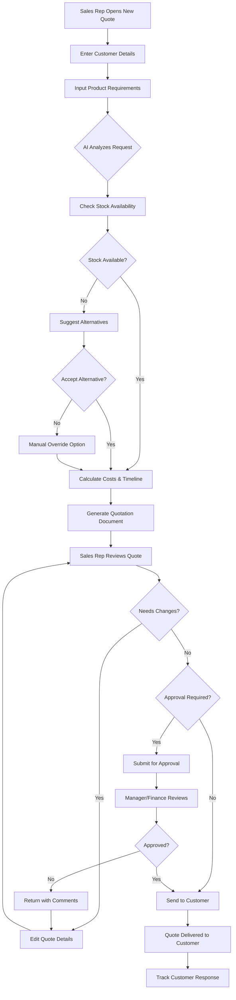

### 7.2 Purchase Order Management - Happy Path

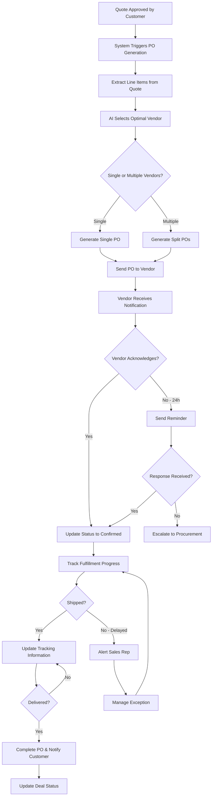

### 7.3 Issue Management Flow

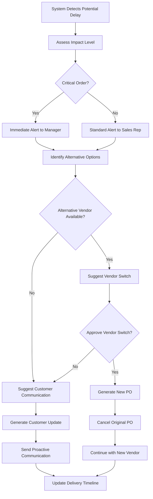

---

## 8. Technical Architecture

### 8.1 Quotation System Components

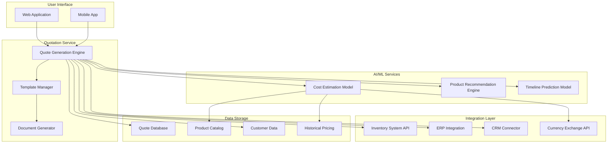

### 8.2 PO Management System Components

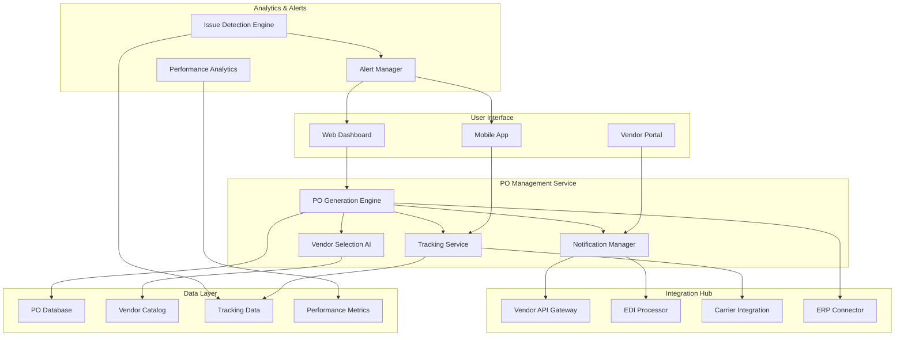

### 8.3 End-to-End Data Flow

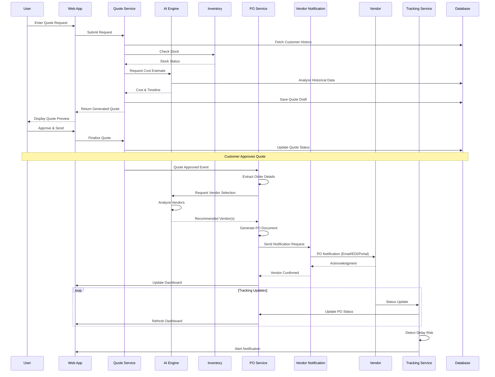

---

## 9. Success Metrics & KPIs

### 9.1 Quotation Generation Metrics

#### Efficiency Metrics

| Metric | Current State | Target | Measurement Method |
|--------|--------------|--------|-------------------|
| Average Quote Generation Time | 2-4 hours | < 5 minutes | System timestamp |
| Quote Accuracy Rate | 75% | 95%+ | Error tracking |
| Quotes per Rep per Day | 3-5 | 15-20 | Usage analytics |
| Quote Revision Rate | 40% | < 15% | Revision tracking |

#### Business Impact Metrics

| Metric | Target | Measurement Method |
|--------|--------|-------------------|
| Quote-to-Win Conversion | 30%+ improvement | Sales tracking |
| Customer Response Time | < 1 hour | Customer tracking |
| Revenue per Sales Rep | 25%+ increase | Revenue analysis |
| Customer Satisfaction | 4.5/5+ rating | Survey feedback |

#### Quality Metrics

| Metric | Target | Measurement Method |
|--------|--------|-------------------|
| Stock Availability Accuracy | 99%+ | Inventory comparison |
| Pricing Error Rate | < 1% | Audit review |
| Template Compliance | 100% | Format validation |
| Delivery Timeline Accuracy | ±2 days | Fulfillment tracking |

### 9.2 Purchase Order Management Metrics

#### Efficiency Metrics

| Metric | Current State | Target | Measurement Method |
|--------|--------------|--------|-------------------|
| Time from Quote to PO | 1-2 days | < 5 minutes | System timestamp |
| Vendor Notification Time | 4-8 hours | < 5 minutes | Notification logs |
| PO Processing Accuracy | 85% | 99%+ | Error tracking |
| Manual Intervention Rate | 80% | < 10% | Workflow analytics |

#### Fulfillment Metrics

| Metric | Target | Measurement Method |
|--------|--------|-------------------|
| On-Time Delivery Rate | 95%+ | Delivery tracking |
| Early Issue Detection | 48 hours advance | Alert analytics |
| Vendor Response Time | < 4 hours | Response tracking |
| Order Status Visibility | 100% real-time | System coverage |

#### Business Impact Metrics

| Metric | Target | Measurement Method |
|--------|--------|-------------------|
| Customer Satisfaction | 4.5/5+ | Survey feedback |
| Procurement Cost Savings | 10%+ | Cost analysis |
| Vendor Performance Score | 90%+ average | Performance tracking |
| Order Fulfillment Rate | 99%+ | Completion rate |

---

## 10. Multiphase Implementation Roadmap (11-Day Delivery Plan)

> **Note:** This accelerated 11-day delivery plan focuses on delivering a functional Minimum Lovable Product (MLP) with core capabilities. The compressed timeline requires parallel workstreams, dedicated resources, and focused scope prioritization.

### Day 1-3: Foundation Sprint

**Quotation Generation:**
- [ ] Set up quotation service infrastructure
- [ ] Build basic quote generation engine
- [ ] Create initial template designs (2 templates)
- [ ] Implement stock availability integration
- [ ] Develop basic cost calculation logic

**Purchase Order Management:**
- [ ] Set up PO management service infrastructure
- [ ] Build automatic PO generation from quotes
- [ ] Implement basic email notification system
- [ ] Create vendor acknowledgment workflow
- [ ] Develop PO tracking dashboard

**Day 1-3 Deliverables:**
- Basic quotation generation capability
- Automatic PO generation from approved quotes
- Email-based vendor notifications
- Basic tracking dashboards

**Success Criteria:**
- Quote generation time reduced to < 15 minutes
- PO auto-generation within 10 minutes of quote approval
- 90% of quotes accurately converted to POs

---

### Day 4-6: AI Integration Sprint

**Quotation Generation:**
- [ ] Deploy pre-trained AI cost estimation model
- [ ] Implement product recommendation engine
- [ ] Add timeline prediction capabilities
- [ ] Create alternative product suggestion system
- [ ] Integrate currency conversion

**Purchase Order Management:**
- [ ] Deploy pre-trained AI vendor selection model
- [ ] Implement multi-vendor split order logic
- [ ] Build delivery tracking integration
- [ ] Create issue detection algorithms

**AI Model Validation Checkpoints:**
- [ ] Validate cost estimation model against test dataset (≥85% accuracy required)
- [ ] Validate vendor selection model recommendation quality (≥80% acceptance rate)
- [ ] Configure feature flags for gradual AI rollout
- [ ] Set up shadow mode for AI recommendations comparison
- [ ] Document rollback procedures and test restoration process

**Day 4-6 Deliverables:**
- AI-powered cost estimation
- Intelligent vendor selection
- Product recommendations
- Basic issue detection

**Success Criteria:**
- 85% accuracy in AI cost estimation (measured against historical pricing data)
- ≥80% vendor selection recommendations accepted (measured via selection override rate)
- Issue detection 12+ hours in advance
- Rollback procedures tested and documented

---

### Day 7-9: Enhancement & Integration Sprint

**Quotation Generation:**
- [ ] Add multi-currency support (3 major currencies)
- [ ] Implement approval workflow
- [ ] Create manager dashboard
- [ ] Add basic analytics and reporting

**Purchase Order Management:**
- [ ] Develop basic vendor portal
- [ ] Add carrier tracking integrations (2 major carriers)
- [ ] Implement ERP synchronization
- [ ] Build automated escalation workflows

**Day 7-9 Deliverables:**
- Multi-currency support
- Basic vendor portal
- Core approval workflows
- Essential carrier tracking

**Success Criteria:**
- Support for 3 major currencies
- Vendor portal accessible
- Approval workflows operational
- Carrier tracking functional

---

### Day 10-11: Testing, Optimization & Launch Preparation

**Quotation Generation:**
- [ ] End-to-end testing and bug fixes
- [ ] User acceptance testing (UAT)
- [ ] Performance optimization
- [ ] Documentation and training materials

**Purchase Order Management:**
- [ ] End-to-end testing and bug fixes
- [ ] User acceptance testing (UAT)
- [ ] Vendor onboarding preparation
- [ ] Documentation and training materials

**Day 10-11 Deliverables:**
- Fully tested integrated system
- UAT sign-off
- User documentation
- Go-live readiness

**Success Criteria:**
- All critical bugs resolved
- UAT approval obtained
- System performance meets requirements
- Users trained and ready

---

### Post-Launch Roadmap (Future Iterations)

The following features are planned for subsequent iterations after the 11-day MLP launch:

**Phase 2 (Weeks 2-4 Post-Launch):**
- Additional quotation templates (3rd template: Executive Summary format)
- Multi-language support (5+ languages)
- Additional currency support (7+ additional currencies)
- Mobile app functionality
- Advanced CRM integrations
- EDI integration capabilities
- Additional carrier integrations

**Phase 3 (Weeks 5-8 Post-Launch):**
- Refined AI models based on usage data (targeting 95%+ accuracy)
- Advanced issue detection (targeting 48+ hour advance notice)
- Volume discount automation
- Custom template builder
- Predictive delay detection
- Vendor performance scoring
- Advanced analytics dashboard
- API platform for custom integrations

**Long-term Success Targets:**
- 95%+ accuracy in cost estimation
- 95%+ on-time delivery rate
- 10%+ procurement cost savings
- Full KPI dashboard operational
- Support for 10+ currencies and 5+ languages
- 80% vendor portal adoption

---

## 11. State Management

### 11.1 Quotation States

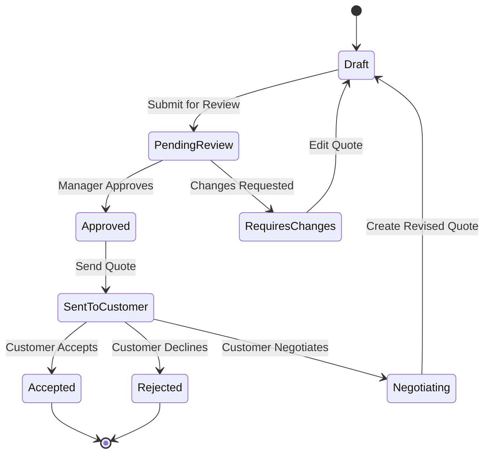

### 11.2 Purchase Order States

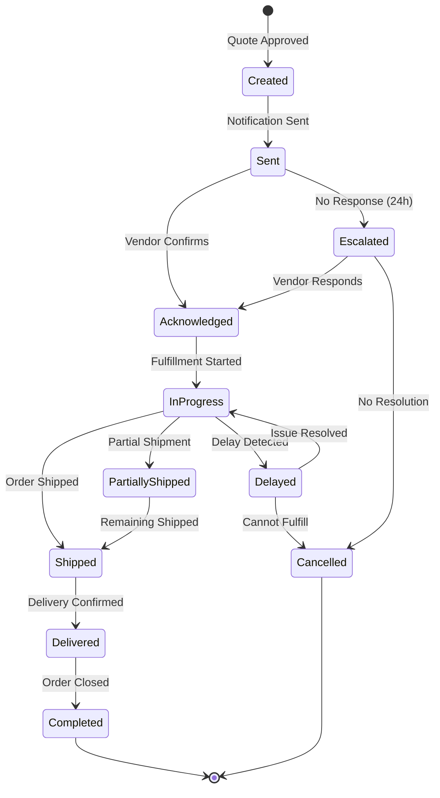

---

## 12. Risk Assessment & Mitigation

### 12.1 Technical Risks

| Risk | Impact | Probability | Mitigation Strategy |
|------|--------|-------------|---------------------|
| AI model accuracy below target | High | Medium | Implement manual override, continuous model training |
| Integration failures with inventory | High | Low | Build redundant data sources, cache mechanism |
| Performance degradation at scale | Medium | Medium | Cloud-native architecture, auto-scaling |
| Vendor integration failures | High | Medium | Multiple integration fallbacks (email, portal) |
| Tracking data inconsistency | Medium | Medium | Data validation and reconciliation |
| System downtime | High | Low | Redundant architecture, offline queuing |

### 12.2 Operational Risks

| Risk | Impact | Probability | Mitigation Strategy |
|------|--------|-------------|---------------------|
| User adoption resistance | High | Medium | Comprehensive training, change management |
| Vendor non-compliance | High | Medium | Vendor onboarding and performance tracking |
| Delivery delays | High | Medium | Early detection and alternative sourcing |
| Order errors | Medium | Low | Automated validation and verification |

### 12.3 Business Risks

| Risk | Impact | Probability | Mitigation Strategy |
|------|--------|-------------|---------------------|
| Data privacy concerns | High | Low | Robust security measures, compliance certification |
| Competitive pressure | Medium | Medium | Focus on UX and AI differentiation |
| Vendor relationship issues | Medium | Low | Clear communication and mutual benefits |
| Customer dissatisfaction | High | Low | Proactive communication and updates |
| Cost overruns | Medium | Medium | Automated cost monitoring and alerts |

---

## 13. Vendor Integration Methods

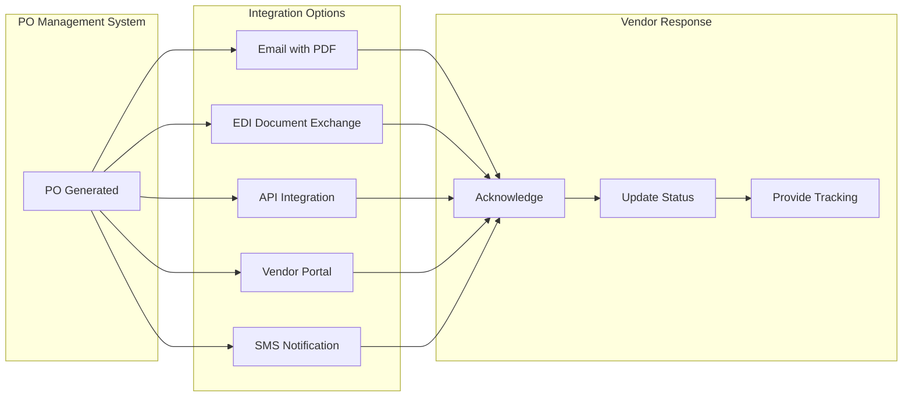

---

## 14. Notification Templates

### 14.1 PO Notification to Vendor

```
Subject: Purchase Order #{PO_NUMBER} - {COMPANY_NAME}

Dear {VENDOR_NAME},

Please find attached Purchase Order #{PO_NUMBER} for the following items:

{LINE_ITEMS_TABLE}

Required Delivery Date: {DELIVERY_DATE}
Shipping Address: {SHIPPING_ADDRESS}

Please acknowledge this order within 24 hours by:
- Clicking the link: {ACKNOWLEDGMENT_LINK}
- Replying to this email
- Logging into the vendor portal

Thank you for your partnership.

Best regards,
{COMPANY_NAME} Procurement Team
```

### 14.2 Delay Alert to Sales Rep

```
Subject: ⚠️ Delivery Alert - PO #{PO_NUMBER}

A potential delay has been detected for PO #{PO_NUMBER}:

Customer: {CUSTOMER_NAME}
Original Delivery Date: {ORIGINAL_DATE}
New Estimated Date: {NEW_DATE}
Reason: {DELAY_REASON}

Recommended Actions:
1. Review alternative vendors
2. Contact customer proactively
3. Request expedited shipping

Action Required: {ACTION_LINK}
```

---

## 15. Dashboard Views

### 15.1 Operations Dashboard

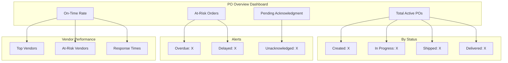

### 15.2 Quote Creation Interface

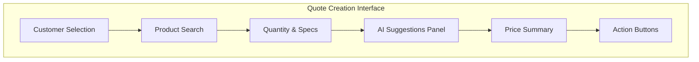

---

## 16. User Experience Guidelines

### 16.1 Design Principles

1. **Speed First:** Minimize clicks to generate a quote and process POs
2. **Smart Defaults:** AI suggests optimal values
3. **Transparent AI:** Show reasoning behind recommendations
4. **Error Prevention:** Validate inputs in real-time
5. **Mobile Friendly:** Full functionality on mobile devices

---

## 17. Conclusion

This Multiphase PRD addresses critical inefficiencies in both the quotation and purchase order management processes, designed for delivery within an **11-day accelerated timeline**:

### Quotation Generation Benefits:
1. **Reducing Time:** From hours to minutes for quote generation
2. **Improving Accuracy:** AI-powered pricing and availability checks
3. **Enhancing Customer Experience:** Faster response times
4. **Increasing Revenue:** More quotes generated, higher conversion rates

### Purchase Order Management Benefits:
1. **Eliminating Manual Work:** Automatic PO generation from approved quotes
2. **Optimizing Vendor Selection:** AI-powered vendor matching for best fulfillment
3. **Ensuring Visibility:** Real-time tracking from order to delivery
4. **Preventing Issues:** Proactive detection and escalation of potential problems
5. **Strengthening Partnerships:** Streamlined vendor communication and collaboration

### 11-Day Delivery Approach:
By implementing this integrated system through focused 2-3 day sprints, organizations can achieve:
- **Days 1-3:** Immediate value with core automation capabilities
- **Days 4-6:** AI-enhanced intelligence for cost estimation and vendor selection
- **Days 7-9:** Extended functionality with multi-currency support and vendor portals
- **Days 10-11:** Production-ready system with comprehensive testing and documentation

This accelerated delivery approach enables rapid time-to-value while building towards a comprehensive, AI-powered quotation and purchase order management solution that significantly reduces processing time, improves accuracy, and enhances customer satisfaction. Advanced features not included in the 11-day MLP will be delivered in subsequent iterations as outlined in the post-launch roadmap.

---

## 18. Approval & Sign-off

This document requires approval from the following stakeholders:

| Role | Name | Signature | Date |
|------|------|-----------|------|
| Product Manager | | | |
| Business Analyst | | | |
| Stakeholder Representative | | | |
| Sales Director | | | |
| Procurement Director | | | |

---

## 19. Revision History

| Version | Date | Author | Description |
|---------|------|--------|-------------|
| 1.0 | November 2025 | Product Management Team | Initial Multiphase PRD based on MLP documents |
| 2.0 | December 2025 | Product Management Team | Updated PRD combining requirements from Automated Purchase Order Management MLP and Automated Quotation Generation MLP (excluding MLP-v1.md). Added Assumptions section and additional user personas (Legal Team, Finance Team, Operations Team). |
| 3.0 | December 2025 | Collaborative Team (PM, BA, Engineering Lead, UI/UX Designer) | Compressed implementation roadmap from 16 weeks to 11 days to meet accelerated delivery timeline. Reorganized phases into focused sprints (Foundation, AI Integration, Enhancement, Testing/Launch). Added post-launch roadmap for future iterations. |

---

**Document Version:** 3.0  
**Last Updated:** December 2025  
**Document Owner:** Product Management Team

---

**End of Document**
