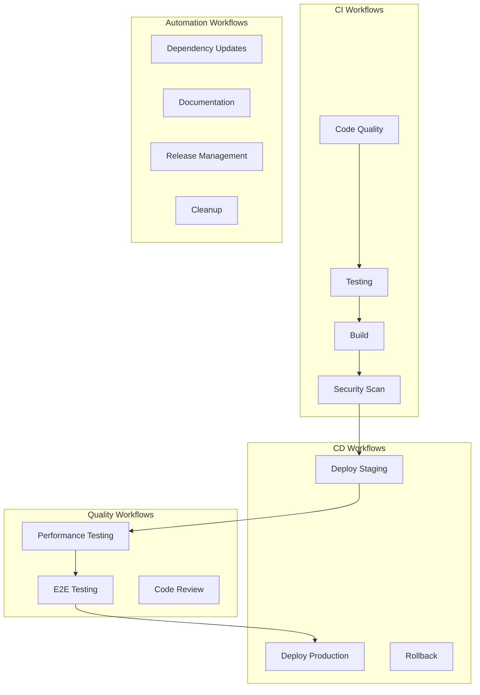
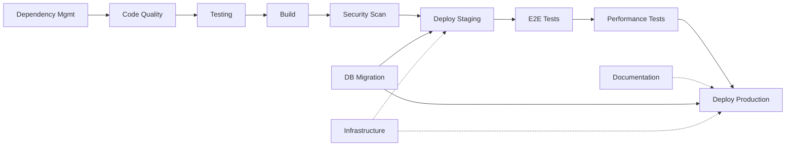

# GitHub Actions Workflows and Agents Design
## Heavy Machinery Dealer Management System

---

## Document Information
- **Document Version:** 1.0
- **Date:** December 2025
- **Status:** Final
- **Prepared By:** DevOps & Engineering Team
- **Purpose:** Define GitHub Actions workflows and automation agents for CI/CD pipeline

---

## Table of Contents

1. [Executive Summary](#1-executive-summary)
2. [Workflow Architecture Overview](#2-workflow-architecture-overview)
3. [Core Workflows](#3-core-workflows)
4. [Agent Specifications](#4-agent-specifications)
5. [Workflow Integration Matrix](#5-workflow-integration-matrix)
6. [Security and Compliance](#6-security-and-compliance)
7. [Monitoring and Alerting](#7-monitoring-and-alerting)
8. [Implementation Roadmap](#8-implementation-roadmap)

---

## 1. Executive Summary

This document provides a comprehensive design for GitHub Actions workflows and automation agents for the Heavy Machinery Dealer Management System. The workflow architecture is designed to support:

- **Continuous Integration (CI):** Automated testing and validation on every commit
- **Continuous Deployment (CD):** Automated deployment to staging and production environments
- **Quality Assurance:** Code quality checks, security scanning, and performance testing
- **Dependency Management:** Automated dependency updates and vulnerability scanning
- **Documentation:** Automated documentation generation and validation

### Key Benefits

- **Faster Time to Market:** Automated pipelines reduce deployment time from days to minutes
- **Higher Code Quality:** Automated testing and code quality checks catch issues early
- **Enhanced Security:** Continuous security scanning and compliance checks
- **Reduced Manual Effort:** Automation reduces manual tasks by 80%
- **Improved Reliability:** Consistent, repeatable deployment processes

---

## 2. Workflow Architecture Overview

### 2.1 Workflow Categories



### 2.2 Trigger Strategy

| Workflow Type | Triggers | Frequency |
|---------------|----------|-----------|
| Code Quality | Push, Pull Request | On every commit |
| Testing | Push, Pull Request | On every commit |
| Build | Push to main, Pull Request | On merge/commit |
| Security Scan | Push, Pull Request, Schedule | Daily + on-demand |
| Deploy Staging | Push to main | After successful build |
| Deploy Production | Manual approval, Tag | On release |
| Dependency Updates | Schedule | Weekly |
| Documentation | Push to docs/, main | On documentation changes |

---

## 3. Core Workflows

### 3.1 Frontend CI/CD Workflow

**Purpose:** Build, test, and deploy the React/TypeScript frontend application

**File:** `.github/workflows/frontend-ci-cd.yml`

**Triggers:**
- Push to `main`, `develop` branches
- Pull requests to `main`, `develop`
- Manual dispatch

**Jobs:**

1. **Code Quality Check**
   - ESLint validation
   - Prettier formatting check
   - TypeScript type checking
   - Code complexity analysis

2. **Unit & Integration Tests**
   - Run Jest test suite
   - Generate coverage report (minimum 80%)
   - Upload coverage to Codecov

3. **Build Application**
   - Install dependencies
   - Build production bundle
   - Validate bundle size (< 2MB)
   - Generate build artifacts

4. **Security Scanning**
   - npm audit for vulnerabilities
   - SAST (Static Application Security Testing)
   - Dependency license check

5. **Deploy to Staging**
   - Deploy to staging environment
   - Run smoke tests
   - Update deployment status

6. **E2E Tests (Staging)**
   - Run Playwright/Cypress E2E tests
   - Generate test reports
   - Capture screenshots on failure

7. **Deploy to Production** (manual approval)
   - Deploy to production CDN
   - Invalidate CDN cache
   - Update deployment tracking

**Agent:** `frontend-ci-agent`

---

### 3.2 Backend Microservices CI/CD Workflow

**Purpose:** Build, test, and deploy backend microservices

**File:** `.github/workflows/backend-ci-cd.yml`

**Triggers:**
- Push to `main`, `develop` branches
- Pull requests to `main`, `develop`
- Manual dispatch

**Jobs:**

1. **Service Detection**
   - Detect changed microservices
   - Build dependency graph
   - Determine build order

2. **Code Quality Check** (per service)
   - Language-specific linting
   - Code formatting validation
   - Static analysis
   - Cyclomatic complexity check

3. **Unit Tests** (per service)
   - Run service unit tests
   - Generate coverage report (minimum 85%)
   - Test database migrations

4. **Integration Tests**
   - Spin up test containers
   - Run integration test suite
   - Test service-to-service communication
   - Validate API contracts

5. **Build Container Images**
   - Build Docker images
   - Tag with commit SHA and version
   - Scan images for vulnerabilities
   - Push to container registry

6. **Deploy to Staging**
   - Update Kubernetes manifests
   - Apply to staging cluster
   - Wait for healthy status
   - Run smoke tests

7. **Performance Tests**
   - Load testing
   - Stress testing
   - Measure response times
   - Validate SLA compliance

8. **Deploy to Production** (manual approval)
   - Blue-green deployment
   - Canary analysis
   - Rollback capability
   - Monitor metrics

**Agent:** `backend-ci-agent`

---

### 3.3 Database Migration Workflow

**Purpose:** Safely manage database schema changes

**File:** `.github/workflows/database-migration.yml`

**Triggers:**
- Push to migration files in `db/migrations/`
- Manual dispatch
- Scheduled validation (weekly)

**Jobs:**

1. **Migration Validation**
   - Syntax validation
   - Backward compatibility check
   - Rollback script validation
   - Performance impact analysis

2. **Test Migrations**
   - Apply migrations to test database
   - Validate data integrity
   - Test rollback procedures
   - Generate migration report

3. **Apply to Staging**
   - Backup staging database
   - Apply migrations
   - Validate application compatibility
   - Run data validation queries

4. **Apply to Production** (manual approval)
   - Backup production database
   - Apply migrations with monitoring
   - Validate data integrity
   - Alert on anomalies

**Agent:** `database-migration-agent`

---

### 3.4 Security Scanning Workflow

**Purpose:** Continuous security scanning and vulnerability management

**File:** `.github/workflows/security-scan.yml`

**Triggers:**
- Push to `main`, `develop` branches
- Pull requests
- Schedule (daily at 2 AM UTC)
- Manual dispatch

**Jobs:**

1. **Dependency Vulnerability Scan**
   - Scan npm/pip/maven dependencies
   - Check GitHub Advisory Database
   - Report critical vulnerabilities
   - Auto-create security issues

2. **SAST (Static Application Security Testing)**
   - CodeQL analysis
   - Semgrep security rules
   - Secret scanning
   - License compliance check

3. **Container Image Scanning**
   - Trivy image scanning
   - Check for known CVEs
   - Base image validation
   - Generate SBOM

4. **Infrastructure as Code Scanning**
   - Terraform/CloudFormation validation
   - Security misconfigurations
   - Compliance checks
   - Cost estimation

5. **DAST (Dynamic Application Security Testing)**
   - OWASP ZAP scanning (staging)
   - API security testing
   - Authentication/authorization tests
   - XSS and injection testing

**Agent:** `security-scan-agent`

---

### 3.5 Code Quality & Review Workflow

**Purpose:** Automated code quality checks and review assistance

**File:** `.github/workflows/code-quality.yml`

**Triggers:**
- Pull requests
- Push to feature branches
- Manual dispatch

**Jobs:**

1. **Linting & Formatting**
   - Run language-specific linters
   - Check code formatting
   - Validate commit messages
   - Check file naming conventions

2. **Code Complexity Analysis**
   - Calculate cyclomatic complexity
   - Identify code smells
   - Detect duplicated code
   - Generate complexity report

3. **Test Coverage Analysis**
   - Calculate test coverage
   - Compare with baseline
   - Identify untested code
   - Enforce coverage thresholds

4. **AI Code Review**
   - Automated code review suggestions
   - Best practices validation
   - Performance optimization tips
   - Security vulnerability detection

5. **Documentation Check**
   - Validate JSDoc/docstrings
   - Check README completeness
   - Validate API documentation
   - Generate documentation preview

**Agent:** `code-quality-agent`

---

### 3.6 Dependency Management Workflow

**Purpose:** Automated dependency updates and maintenance

**File:** `.github/workflows/dependency-management.yml`

**Triggers:**
- Schedule (weekly on Monday)
- Manual dispatch
- Dependabot alerts

**Jobs:**

1. **Dependency Audit**
   - List all dependencies
   - Check for outdated packages
   - Identify security vulnerabilities
   - Generate audit report

2. **Update Analysis**
   - Analyze available updates
   - Check breaking changes
   - Evaluate compatibility
   - Prioritize updates

3. **Automated Updates** (minor/patch)
   - Update patch versions automatically
   - Run test suite
   - Create PR if tests pass
   - Auto-merge if approved

4. **Manual Updates** (major)
   - Create PR for major updates
   - Add migration guide
   - Request manual review
   - Track update progress

5. **License Compliance**
   - Check license compatibility
   - Generate license report
   - Flag non-compliant licenses
   - Update license documentation

**Agent:** `dependency-management-agent`

---

### 3.7 Release Management Workflow

**Purpose:** Automated release creation and changelog generation

**File:** `.github/workflows/release-management.yml`

**Triggers:**
- Push tags matching `v*.*.*`
- Manual dispatch
- Scheduled pre-release (bi-weekly)

**Jobs:**

1. **Version Validation**
   - Validate semantic versioning
   - Check version conflicts
   - Validate changelog
   - Tag validation

2. **Build Release Artifacts**
   - Build all components
   - Create distribution packages
   - Generate checksums
   - Sign artifacts

3. **Generate Changelog**
   - Analyze commits since last release
   - Categorize changes (features, fixes, breaking)
   - Link to issues/PRs
   - Generate release notes

4. **Create GitHub Release**
   - Create release draft
   - Upload artifacts
   - Add release notes
   - Publish release

5. **Deployment Pipeline**
   - Trigger staging deployment
   - Run full test suite
   - Manual production approval
   - Deploy to production

6. **Post-Release Tasks**
   - Update documentation
   - Notify stakeholders
   - Create next version milestone
   - Archive old releases

**Agent:** `release-management-agent`

---

### 3.8 Performance Testing Workflow

**Purpose:** Continuous performance monitoring and optimization

**File:** `.github/workflows/performance-testing.yml`

**Triggers:**
- Push to `main` branch
- Pull requests (large changes)
- Schedule (nightly)
- Manual dispatch

**Jobs:**

1. **Load Testing**
   - Simulate concurrent users
   - Test API endpoints
   - Measure response times
   - Generate load test report

2. **Stress Testing**
   - Test system limits
   - Identify breaking points
   - Memory leak detection
   - Resource utilization analysis

3. **Frontend Performance**
   - Lighthouse CI tests
   - Core Web Vitals measurement
   - Bundle size analysis
   - Render performance testing

4. **Database Performance**
   - Query performance analysis
   - Index optimization check
   - Connection pool testing
   - Deadlock detection

5. **Performance Comparison**
   - Compare with baseline
   - Track performance trends
   - Alert on regressions
   - Generate comparison report

**Agent:** `performance-testing-agent`

---

### 3.9 Documentation Generation Workflow

**Purpose:** Automated documentation generation and validation

**File:** `.github/workflows/documentation.yml`

**Triggers:**
- Push to `main` branch
- Push to `doc/` directory
- Pull requests affecting documentation
- Schedule (weekly)

**Jobs:**

1. **Documentation Validation**
   - Check markdown syntax
   - Validate links
   - Check image references
   - Spelling and grammar check

2. **API Documentation**
   - Generate OpenAPI/Swagger docs
   - Generate API reference
   - Validate API examples
   - Check API versioning

3. **Code Documentation**
   - Generate JSDoc/TypeDoc
   - Generate Python docstrings
   - Generate architecture diagrams
   - Create dependency graphs

4. **User Documentation**
   - Build documentation site
   - Generate PDF documentation
   - Create user guides
   - Update screenshots

5. **Deploy Documentation**
   - Deploy to GitHub Pages
   - Update documentation CDN
   - Create versioned docs
   - Update search index

**Agent:** `documentation-agent`

---

### 3.10 Infrastructure as Code (IaC) Workflow

**Purpose:** Validate and deploy infrastructure changes

**File:** `.github/workflows/infrastructure.yml`

**Triggers:**
- Push to `infrastructure/` directory
- Pull requests affecting IaC
- Manual dispatch

**Jobs:**

1. **IaC Validation**
   - Terraform/CloudFormation validation
   - Syntax checking
   - Best practices validation
   - Cost estimation

2. **Security Scanning**
   - Infrastructure security scan
   - Compliance checks
   - Network configuration validation
   - IAM policy validation

3. **Plan Infrastructure Changes**
   - Generate Terraform plan
   - Compare with current state
   - Estimate cost impact
   - Review for approval

4. **Apply to Staging**
   - Apply infrastructure changes
   - Validate deployment
   - Run smoke tests
   - Rollback on failure

5. **Apply to Production** (manual approval)
   - Apply infrastructure changes
   - Monitor for issues
   - Validate services
   - Update documentation

**Agent:** `infrastructure-agent`

---

### 3.11 E2E Testing Workflow

**Purpose:** End-to-end testing across the entire application

**File:** `.github/workflows/e2e-testing.yml`

**Triggers:**
- Push to `main`, `develop` branches
- Scheduled (nightly)
- Pre-deployment validation
- Manual dispatch

**Jobs:**

1. **Environment Setup**
   - Deploy full stack to test environment
   - Seed test data
   - Configure test users
   - Warm up services

2. **UI E2E Tests**
   - Run Playwright/Cypress tests
   - Test critical user flows
   - Cross-browser testing
   - Mobile responsiveness tests

3. **API E2E Tests**
   - Test end-to-end API flows
   - Test authentication flows
   - Test business workflows
   - Validate data consistency

4. **Integration E2E Tests**
   - Test email workflows
   - Test inventory sync
   - Test quote generation
   - Test PO creation

5. **Visual Regression Tests**
   - Capture UI screenshots
   - Compare with baseline
   - Detect visual changes
   - Generate diff reports

6. **Test Report Generation**
   - Aggregate test results
   - Generate HTML reports
   - Create video recordings
   - Archive test artifacts

**Agent:** `e2e-testing-agent`

---

### 3.12 Monitoring & Alerting Workflow

**Purpose:** Deploy and validate monitoring configurations

**File:** `.github/workflows/monitoring.yml`

**Triggers:**
- Push to `monitoring/` directory
- Scheduled (daily)
- Manual dispatch

**Jobs:**

1. **Validate Monitoring Config**
   - Validate Prometheus rules
   - Check Grafana dashboards
   - Validate alert rules
   - Test notification channels

2. **Deploy Monitoring Updates**
   - Update Prometheus config
   - Deploy Grafana dashboards
   - Update alert rules
   - Configure log aggregation

3. **Test Alert Rules**
   - Trigger test alerts
   - Validate notification delivery
   - Test escalation policies
   - Verify alert resolution

4. **Synthetic Monitoring**
   - Deploy health check monitors
   - Configure uptime checks
   - Set up transaction monitoring
   - Validate SLA compliance

**Agent:** `monitoring-agent`

---

## 4. Agent Specifications

### 4.1 Frontend CI Agent

**Name:** `frontend-ci-agent`

**Responsibilities:**
- Build and test React/TypeScript frontend
- Run linting and formatting checks
- Execute unit and integration tests
- Deploy to staging/production CDN

**Technologies:**
- Node.js 18+
- npm/yarn
- ESLint, Prettier
- Jest, React Testing Library
- Vite build tool
- AWS S3 or Cloudflare deployment

**Configuration:**
```yaml
agent: frontend-ci-agent
runtime: node:18
cache:
  - node_modules
  - .npm
  - dist
env:
  NODE_ENV: production
  CI: true
thresholds:
  test_coverage: 80%
  bundle_size: 2MB
  build_time: 5min
```

**Actions:**
- Install dependencies with cache
- Run type checking (`tsc --noEmit`)
- Run ESLint (`npm run lint`)
- Run tests with coverage (`npm test -- --coverage`)
- Build production bundle (`npm run build`)
- Deploy to CDN
- Invalidate cache

---

### 4.2 Backend CI Agent

**Name:** `backend-ci-agent`

**Responsibilities:**
- Build and test microservices
- Run service-specific tests
- Build and scan Docker images
- Deploy to Kubernetes clusters

**Technologies:**
- Multi-language support (Node.js, Python, Java)
- Docker, Kubernetes
- PostgreSQL, MongoDB, Redis
- RabbitMQ
- Prometheus, Grafana

**Configuration:**
```yaml
agent: backend-ci-agent
services:
  - email-service
  - quote-service
  - inventory-service
  - customer-service
  - approval-service
  - po-service
  - notification-service
  - analytics-service
  - document-service
strategy: matrix
thresholds:
  test_coverage: 85%
  build_time: 10min
```

**Actions:**
- Detect changed services
- Build service dependency graph
- Run tests in parallel
- Build Docker images
- Scan images with Trivy
- Push to registry
- Deploy to Kubernetes
- Run health checks

---

### 4.3 Security Scan Agent

**Name:** `security-scan-agent`

**Responsibilities:**
- Scan dependencies for vulnerabilities
- Run SAST and DAST analysis
- Container image scanning
- Secret detection
- License compliance

**Technologies:**
- CodeQL
- Trivy
- Snyk
- npm audit, pip-audit
- OWASP ZAP
- GitLeaks

**Configuration:**
```yaml
agent: security-scan-agent
scans:
  - dependency-check
  - sast
  - dast
  - container-scan
  - secret-scan
  - license-check
severity_threshold: HIGH
fail_on: CRITICAL
```

**Actions:**
- Scan all dependencies
- Run CodeQL analysis
- Scan container images
- Run DAST on staging
- Check for secrets
- Validate licenses
- Create security issues
- Generate security report

---

### 4.4 Database Migration Agent

**Name:** `database-migration-agent`

**Responsibilities:**
- Validate migration scripts
- Apply migrations safely
- Backup before changes
- Test rollback procedures
- Monitor migration performance

**Technologies:**
- Flyway/Liquibase
- PostgreSQL, MongoDB
- Database backup tools
- Migration testing framework

**Configuration:**
```yaml
agent: database-migration-agent
databases:
  - email-db (PostgreSQL)
  - customer-db (PostgreSQL)
  - inventory-db (PostgreSQL)
  - quote-db (PostgreSQL)
  - analytics-db (MongoDB)
safety:
  backup_before_migration: true
  dry_run_first: true
  rollback_on_error: true
```

**Actions:**
- Validate migration syntax
- Create database backups
- Run dry-run migration
- Apply migrations
- Validate data integrity
- Test rollback
- Update schema documentation

---

### 4.5 Performance Testing Agent

**Name:** `performance-testing-agent`

**Responsibilities:**
- Execute load and stress tests
- Measure frontend performance
- Analyze database performance
- Generate performance reports
- Alert on regressions

**Technologies:**
- k6, JMeter, or Locust
- Lighthouse CI
- Database profilers
- Performance monitoring tools

**Configuration:**
```yaml
agent: performance-testing-agent
tests:
  load_test:
    users: 1000
    duration: 10min
    ramp_up: 2min
  stress_test:
    max_users: 5000
    duration: 30min
  frontend:
    lighthouse: true
    web_vitals: true
thresholds:
  api_response_time: 500ms
  page_load_time: 3s
  lighthouse_score: 90
```

**Actions:**
- Run load tests
- Run stress tests
- Run Lighthouse tests
- Analyze database queries
- Compare with baseline
- Generate reports
- Alert on regressions

---

### 4.6 E2E Testing Agent

**Name:** `e2e-testing-agent`

**Responsibilities:**
- Execute end-to-end test suites
- Test critical user journeys
- Cross-browser testing
- Visual regression testing
- Generate test reports

**Technologies:**
- Playwright or Cypress
- BrowserStack for cross-browser
- Percy for visual testing
- Allure for reporting

**Configuration:**
```yaml
agent: e2e-testing-agent
browsers:
  - chromium
  - firefox
  - webkit
viewports:
  - desktop: 1920x1080
  - tablet: 768x1024
  - mobile: 375x667
critical_paths:
  - user_login
  - quote_generation
  - po_creation
  - email_processing
retries: 2
timeout: 30s
```

**Actions:**
- Deploy test environment
- Seed test data
- Run E2E test suite
- Capture screenshots/videos
- Run visual regression tests
- Generate test reports
- Archive artifacts

---

### 4.7 Release Management Agent

**Name:** `release-management-agent`

**Responsibilities:**
- Validate release versions
- Generate changelogs
- Create GitHub releases
- Deploy releases
- Notify stakeholders

**Technologies:**
- Semantic versioning
- Conventional commits
- GitHub Releases API
- Changelog generators

**Configuration:**
```yaml
agent: release-management-agent
versioning: semantic
changelog_sections:
  - Features
  - Bug Fixes
  - Breaking Changes
  - Documentation
  - Performance
notifications:
  - slack
  - email
  - github_discussion
```

**Actions:**
- Validate version tag
- Generate changelog
- Build release artifacts
- Create GitHub release
- Trigger deployments
- Update documentation
- Send notifications

---

### 4.8 Documentation Agent

**Name:** `documentation-agent`

**Responsibilities:**
- Generate API documentation
- Build documentation sites
- Validate documentation
- Deploy to hosting
- Maintain documentation versions

**Technologies:**
- TypeDoc, JSDoc
- Sphinx (Python)
- MkDocs or Docusaurus
- GitHub Pages
- Mermaid for diagrams

**Configuration:**
```yaml
agent: documentation-agent
generators:
  - api_docs (OpenAPI)
  - code_docs (TypeDoc)
  - user_docs (MkDocs)
  - architecture_diagrams (Mermaid)
deploy:
  platform: github_pages
  domain: docs.example.com
versions:
  - latest
  - stable
  - v1.0
```

**Actions:**
- Validate markdown
- Generate API docs
- Build documentation site
- Validate links
- Deploy to hosting
- Update search index
- Create version archives

---

### 4.9 Dependency Management Agent

**Name:** `dependency-management-agent`

**Responsibilities:**
- Audit dependencies
- Update dependencies
- Check for vulnerabilities
- Validate licenses
- Create update PRs

**Technologies:**
- Dependabot
- Renovate
- npm, pip, maven
- License checkers

**Configuration:**
```yaml
agent: dependency-management-agent
schedules:
  security_updates: daily
  minor_updates: weekly
  major_updates: monthly
auto_merge:
  patch: true
  minor: false
  major: false
ecosystem:
  - npm
  - pip
  - maven
  - docker
```

**Actions:**
- Scan dependencies
- Check for updates
- Analyze breaking changes
- Run test suite
- Create update PRs
- Auto-merge patch updates
- Generate audit report

---

### 4.10 Infrastructure Agent

**Name:** `infrastructure-agent`

**Responsibilities:**
- Validate IaC configurations
- Plan infrastructure changes
- Apply infrastructure updates
- Validate deployments
- Estimate costs

**Technologies:**
- Terraform
- AWS CloudFormation
- Kubernetes
- Helm
- Cloud provider CLIs

**Configuration:**
```yaml
agent: infrastructure-agent
providers:
  - aws
  - kubernetes
iac_tools:
  - terraform
  - helm
validation:
  security: true
  cost_estimation: true
  compliance: true
```

**Actions:**
- Validate IaC syntax
- Run security scans
- Generate Terraform plan
- Estimate costs
- Apply changes
- Validate deployment
- Update documentation

---

## 5. Workflow Integration Matrix

### 5.1 Workflow Dependencies



### 5.2 Integration Points

| Workflow | Integrates With | Integration Type | Purpose |
|----------|----------------|------------------|---------|
| Frontend CI | Backend CI | Artifact sharing | Full stack testing |
| Backend CI | Database Migration | Sequential | Schema compatibility |
| Security Scan | All CI workflows | Gating | Block on critical vulnerabilities |
| E2E Testing | Deploy Staging | Sequential | Validate deployment |
| Performance Testing | Deploy Staging | Sequential | Validate performance |
| Release Management | All CD workflows | Orchestration | Coordinated release |
| Documentation | All CI workflows | Parallel | Keep docs in sync |
| Monitoring | All CD workflows | Post-deployment | Track deployments |

### 5.3 Shared Resources

| Resource | Used By | Purpose |
|----------|---------|---------|
| Container Registry | Backend CI, Infrastructure | Docker images |
| Artifact Storage | Frontend CI, Backend CI | Build artifacts |
| Test Database | Backend CI, E2E Testing | Test data |
| Staging Environment | Deploy Staging, E2E, Performance | Testing |
| Production Environment | Deploy Production, Monitoring | Live system |
| Secrets Manager | All workflows | Credentials |
| Cache Storage | All CI workflows | Build cache |

---

## 6. Security and Compliance

### 6.1 Security Measures

**Secret Management:**
- All secrets stored in GitHub Secrets
- Rotation policy: 90 days
- No secrets in logs or artifacts
- Separate secrets per environment

**Access Control:**
- Branch protection rules on `main`
- Required reviews for production deployments
- CODEOWNERS for critical files
- Audit logging enabled

**Vulnerability Management:**
- Daily dependency scanning
- Immediate alerts for critical CVEs
- Automated security patches
- Monthly security review

**Compliance Checks:**
- GDPR compliance validation
- Data encryption verification
- Audit trail generation
- License compliance check

### 6.2 Compliance Requirements

| Requirement | Implementation | Validation |
|-------------|----------------|------------|
| Code Review | Mandatory PR reviews | GitHub branch protection |
| Security Scanning | Automated on every commit | CodeQL, Trivy, npm audit |
| Test Coverage | Minimum 80% (frontend), 85% (backend) | Coverage reports |
| Documentation | Required for all features | Documentation validation workflow |
| Audit Trail | All deployments logged | Deployment tracking system |
| Data Privacy | PII handling validation | Security scan agent |
| License Compliance | Approved licenses only | License check in CI |

---

## 7. Monitoring and Alerting

### 7.1 Workflow Monitoring

**Metrics to Track:**
- Workflow success rate
- Average execution time
- Resource utilization
- Deployment frequency
- Mean time to recovery (MTTR)
- Change failure rate

**Dashboards:**
- CI/CD Pipeline Overview
- Deployment Status
- Security Scan Results
- Test Coverage Trends
- Performance Metrics
- Cost Analysis

### 7.2 Alert Configuration

| Alert Type | Condition | Severity | Recipients |
|-----------|-----------|----------|------------|
| Workflow Failure | Any critical workflow fails | High | DevOps team, on-call |
| Security Vulnerability | Critical CVE detected | Critical | Security team, DevOps |
| Deployment Failure | Production deployment fails | Critical | All engineers, management |
| Test Coverage Drop | Coverage below threshold | Medium | Team lead, developers |
| Performance Regression | Response time > 2x baseline | High | Performance team, DevOps |
| Cost Spike | Infrastructure cost > 20% increase | Medium | DevOps, finance |

### 7.3 Notification Channels

- **Slack:** Real-time workflow status updates
- **Email:** Daily summary reports
- **GitHub:** Issue creation for failures
- **PagerDuty:** Critical production incidents
- **Dashboard:** Real-time monitoring UI

---

## 8. Implementation Roadmap

### Phase 1: Foundation (Week 1-2)

**Objectives:** Set up core CI workflows

**Deliverables:**
- [ ] Frontend CI workflow
- [ ] Backend CI workflow (basic)
- [ ] Code quality workflow
- [ ] Basic security scanning
- [ ] GitHub Actions environment setup

**Success Criteria:**
- All PRs run automated tests
- Build failures block merges
- Basic security scanning active

---

### Phase 2: Enhanced CI (Week 3-4)

**Objectives:** Add advanced CI capabilities

**Deliverables:**
- [ ] E2E testing workflow
- [ ] Performance testing workflow
- [ ] Database migration workflow
- [ ] Enhanced security scanning
- [ ] Test coverage reporting

**Success Criteria:**
- E2E tests run on every merge
- Performance baselines established
- Database migrations automated

---

### Phase 3: CD Pipeline (Week 5-6)

**Objectives:** Implement automated deployments

**Deliverables:**
- [ ] Staging deployment workflow
- [ ] Production deployment workflow
- [ ] Rollback procedures
- [ ] Blue-green deployment
- [ ] Deployment monitoring

**Success Criteria:**
- Staging auto-deploys on merge
- Production deploys with approval
- Rollback capability tested

---

### Phase 4: Automation & Optimization (Week 7-8)

**Objectives:** Add automation and optimize workflows

**Deliverables:**
- [ ] Dependency management workflow
- [ ] Release management workflow
- [ ] Documentation workflow
- [ ] Infrastructure workflow
- [ ] Monitoring workflow

**Success Criteria:**
- Dependencies auto-update
- Releases automated
- Documentation auto-generated
- Infrastructure changes tracked

---

### Phase 5: Monitoring & Refinement (Week 9-10)

**Objectives:** Enhance monitoring and refine processes

**Deliverables:**
- [ ] Comprehensive dashboards
- [ ] Alert rules configured
- [ ] SLA monitoring
- [ ] Cost optimization
- [ ] Process documentation

**Success Criteria:**
- All metrics tracked
- Alerts properly configured
- Team trained on workflows
- Documentation complete

---

## 9. Workflow File Structure

### Recommended Directory Structure

```
.github/
├── workflows/
│   ├── frontend-ci-cd.yml
│   ├── backend-ci-cd.yml
│   ├── code-quality.yml
│   ├── security-scan.yml
│   ├── database-migration.yml
│   ├── e2e-testing.yml
│   ├── performance-testing.yml
│   ├── dependency-management.yml
│   ├── release-management.yml
│   ├── documentation.yml
│   ├── infrastructure.yml
│   └── monitoring.yml
├── actions/
│   ├── setup-node/
│   ├── setup-backend/
│   ├── deploy-frontend/
│   └── deploy-backend/
├── scripts/
│   ├── detect-changes.sh
│   ├── build-services.sh
│   ├── run-migrations.sh
│   └── deploy.sh
└── CODEOWNERS
```

---

## 10. Best Practices

### 10.1 Workflow Design Principles

1. **Fail Fast:** Run quick checks first (linting, formatting) before expensive tests
2. **Parallelization:** Run independent jobs in parallel to reduce total time
3. **Caching:** Cache dependencies and build artifacts aggressively
4. **Idempotency:** Workflows should be safe to re-run
5. **Observability:** Log all actions and decisions clearly
6. **Security First:** Never expose secrets, always scan for vulnerabilities
7. **Cost Optimization:** Use appropriate runner sizes, optimize caching

### 10.2 Agent Development Guidelines

1. **Single Responsibility:** Each agent should have one clear purpose
2. **Error Handling:** Handle errors gracefully with proper logging
3. **Retry Logic:** Implement retries for transient failures
4. **Timeout Configuration:** Set appropriate timeouts for all operations
5. **Resource Cleanup:** Always clean up temporary resources
6. **Version Pinning:** Pin all action and tool versions
7. **Documentation:** Document all configuration options

### 10.3 Maintenance Guidelines

1. **Regular Updates:** Keep actions and tools updated monthly
2. **Performance Review:** Review workflow performance quarterly
3. **Cost Review:** Review GitHub Actions usage and costs monthly
4. **Security Audit:** Conduct security audit of workflows quarterly
5. **Feedback Loop:** Collect team feedback and iterate
6. **Metrics Analysis:** Analyze trends and identify optimization opportunities

---

## 11. Troubleshooting Guide

### Common Issues and Solutions

| Issue | Possible Cause | Solution |
|-------|---------------|----------|
| Workflow timeout | Long-running tests or builds | Optimize tests, increase timeout, or split jobs |
| Cache miss | Cache key changed | Review cache key generation |
| Intermittent test failures | Race conditions or flaky tests | Add retry logic or fix tests |
| Deployment failure | Configuration error | Validate config, check logs |
| Secret not found | Secret not configured | Add secret in repository settings |
| Out of disk space | Large artifacts or cache | Clean up old artifacts, optimize cache |
| Container build fails | Dependency issue | Check Dockerfile, validate dependencies |

---

## 12. Glossary

| Term | Definition |
|------|------------|
| **CI** | Continuous Integration - automated testing and validation |
| **CD** | Continuous Deployment - automated deployment to environments |
| **SAST** | Static Application Security Testing |
| **DAST** | Dynamic Application Security Testing |
| **SBOM** | Software Bill of Materials |
| **E2E** | End-to-End testing |
| **IaC** | Infrastructure as Code |
| **CVE** | Common Vulnerabilities and Exposures |
| **SLA** | Service Level Agreement |
| **MTTR** | Mean Time To Recovery |

---

## 13. Conclusion

This comprehensive workflow and agent design provides a robust foundation for the Heavy Machinery Dealer Management System's CI/CD pipeline. The architecture supports:

- **Fast Feedback:** Developers get quick feedback on code quality and test results
- **High Quality:** Automated checks ensure code quality and security
- **Reliable Deployments:** Consistent, repeatable deployment processes
- **Continuous Improvement:** Monitoring and metrics drive optimization

### Next Steps

1. **Review and Approve:** Stakeholders review this design document
2. **Phase 1 Implementation:** Begin with core CI workflows
3. **Iterative Enhancement:** Add capabilities in phases
4. **Team Training:** Train team on workflow usage
5. **Continuous Optimization:** Monitor and improve workflows

---

## Document Control

| Version | Date | Author | Changes |
|---------|------|--------|---------|
| 1.0 | December 2025 | DevOps Team | Initial comprehensive design |

**Status:** Final  
**Next Review:** March 2026

---

**End of Document**
