# GitHub Actions Workflow Visual Diagrams
## Heavy Machinery Dealer Management System

---

## Document Information
- **Document Version:** 1.0
- **Date:** December 2025
- **Status:** Final
- **Related Document:** WORKFLOW_AND_AGENTS_DESIGN.md

---

## Table of Contents

1. [Complete CI/CD Pipeline Overview](#1-complete-cicd-pipeline-overview)
2. [Frontend Workflow Detailed Flow](#2-frontend-workflow-detailed-flow)
3. [Backend Microservices Workflow](#3-backend-microservices-workflow)
4. [Security Scanning Pipeline](#4-security-scanning-pipeline)
5. [Release Management Flow](#5-release-management-flow)
6. [Agent Interaction Diagram](#6-agent-interaction-diagram)

---

## 1. Complete CI/CD Pipeline Overview

### 1.1 High-Level Pipeline Flow

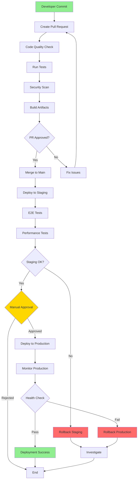

---

## 2. Frontend Workflow Detailed Flow

### 2.1 Frontend CI/CD Complete Pipeline

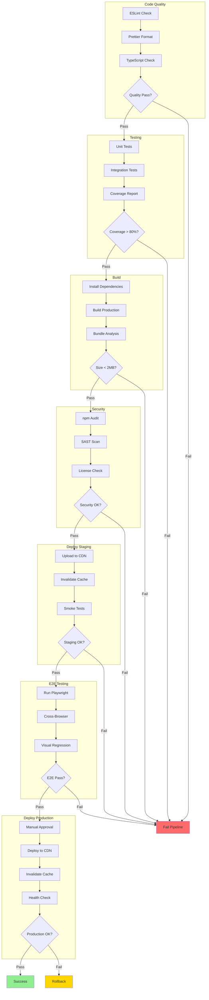

### 2.2 Frontend Performance Testing Flow

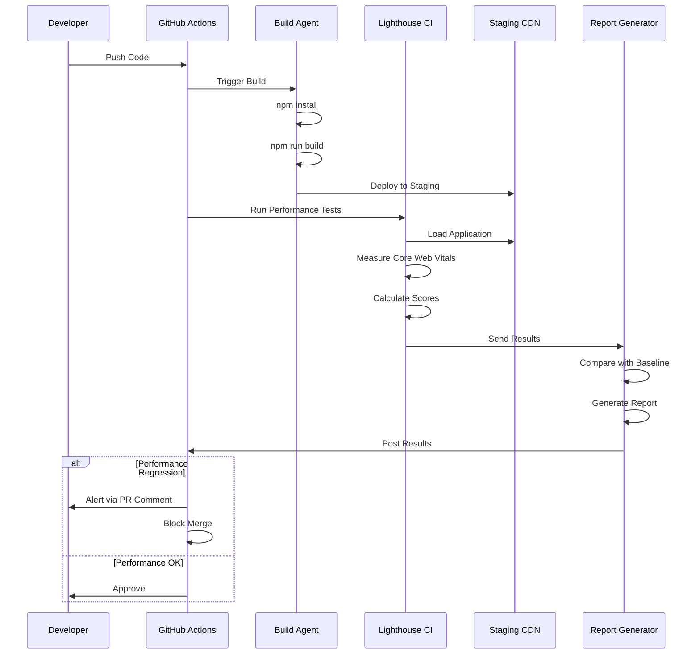

---

## 3. Backend Microservices Workflow

### 3.1 Multi-Service Build Pipeline

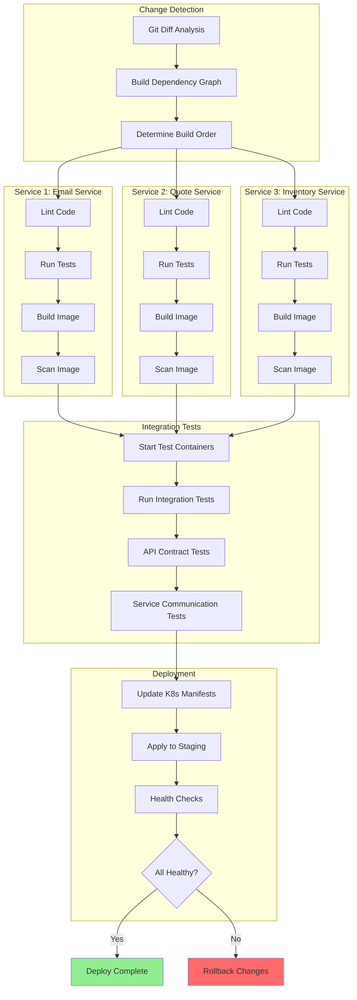

### 3.2 Service Dependency Matrix

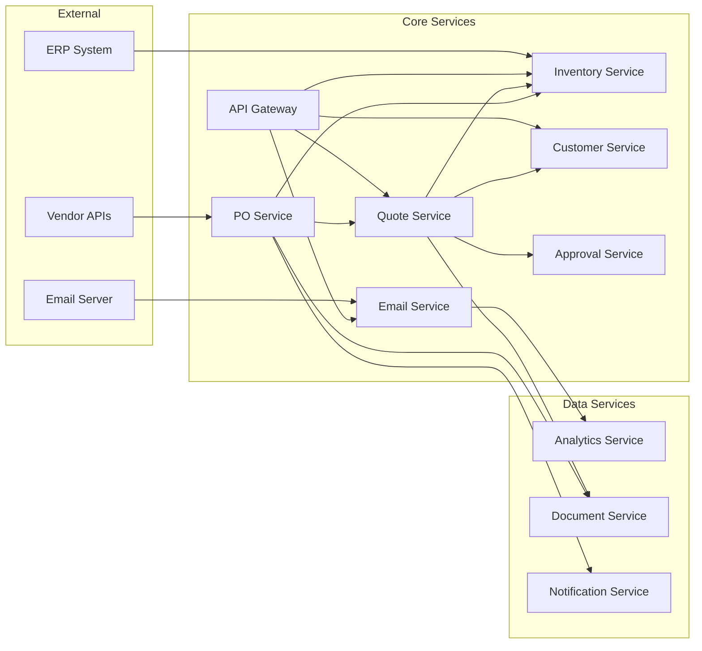

---

## 4. Security Scanning Pipeline

### 4.1 Comprehensive Security Workflow

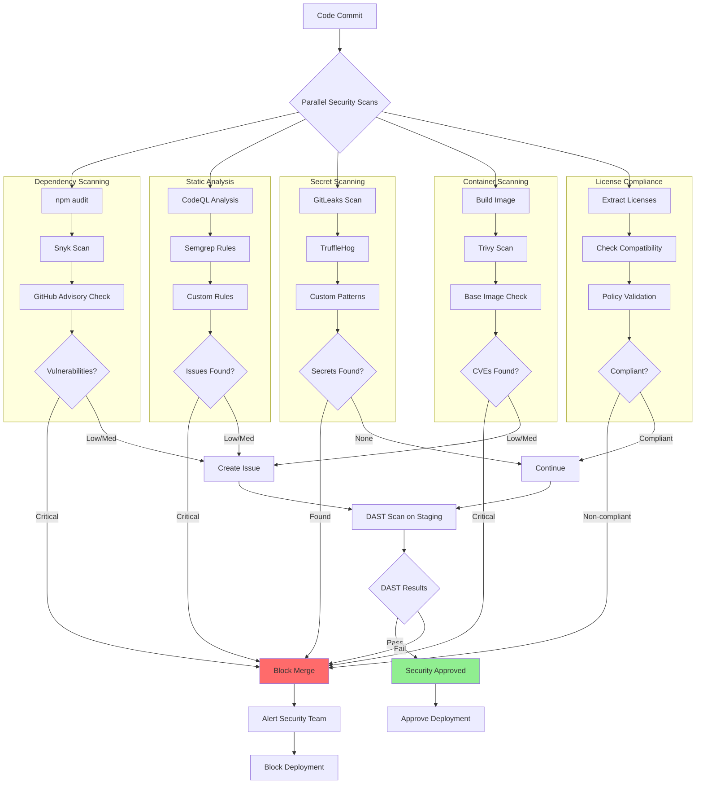

### 4.2 Vulnerability Management Flow

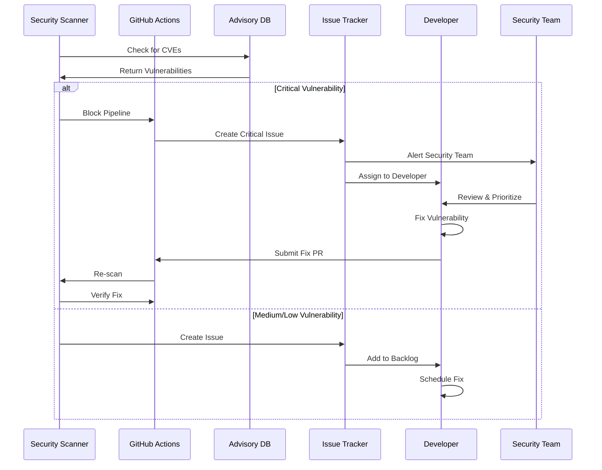

---

## 5. Release Management Flow

### 5.1 Complete Release Pipeline

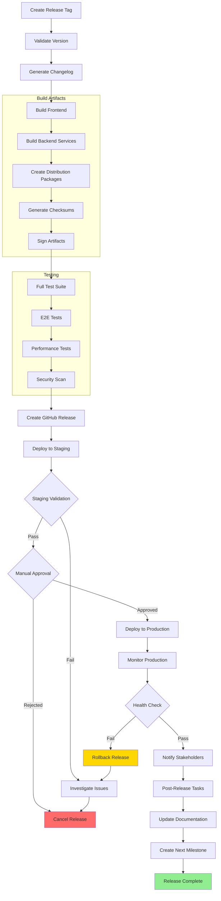

### 5.2 Semantic Versioning Flow

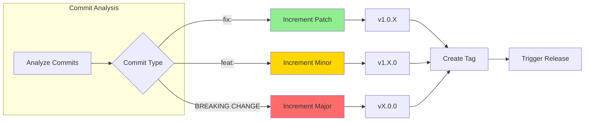

---

## 6. Agent Interaction Diagram

### 6.1 Agent Communication Flow

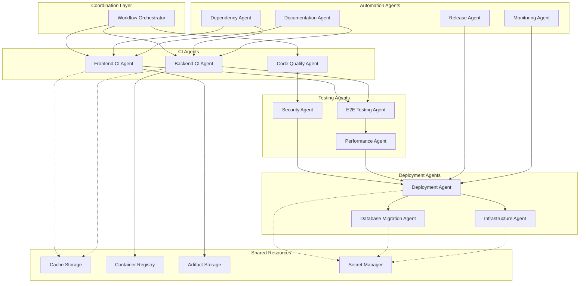

### 6.2 Data Flow Between Agents

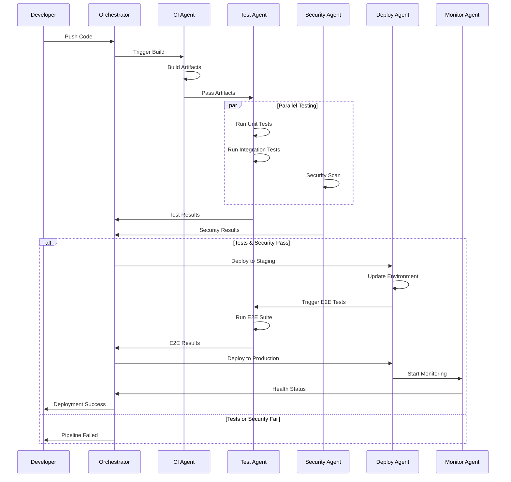

---

## 7. Environment Flow

### 7.1 Multi-Environment Deployment

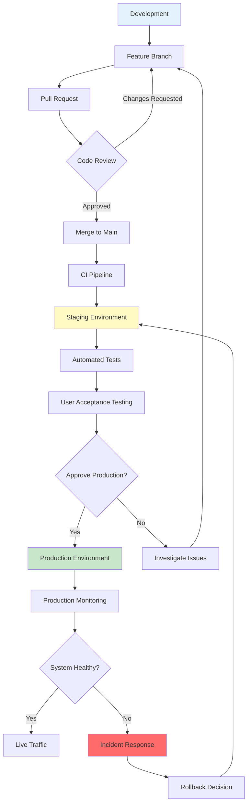

### 7.2 Blue-Green Deployment Strategy

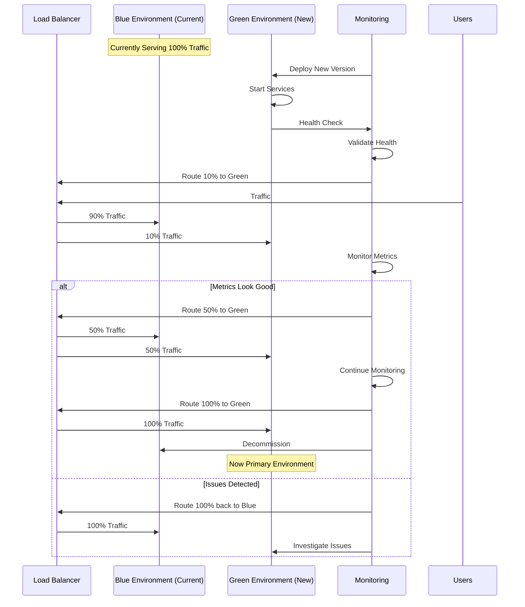

---

## 8. Monitoring & Alerting Flow

### 8.1 Continuous Monitoring Architecture

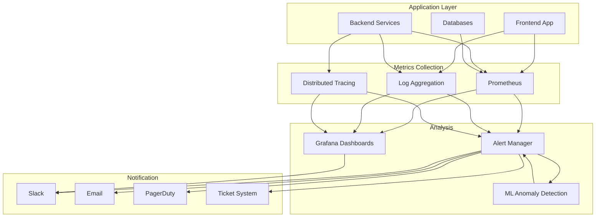

### 8.2 Incident Response Flow

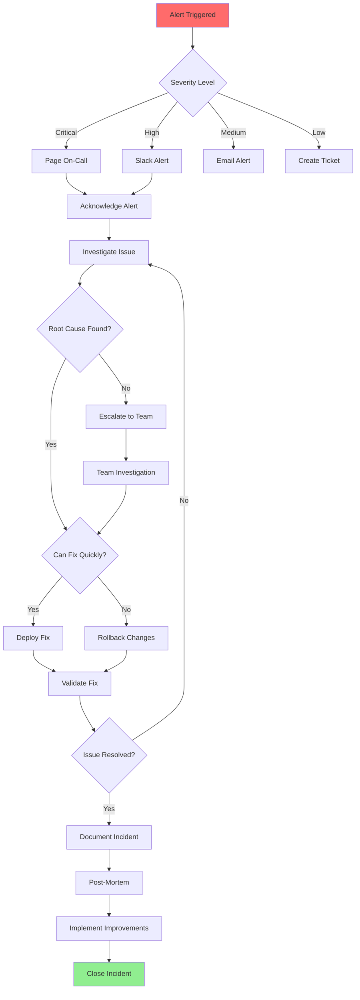

---

## 9. Cost Optimization Flow

### 9.1 Resource Optimization Strategy

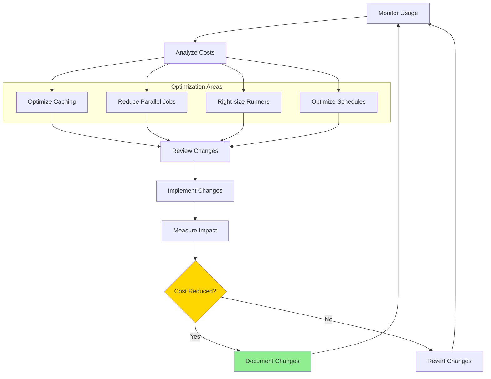

---

## 10. Workflow Execution Timeline

### 10.1 Typical PR to Production Timeline

```mermaid
gantt
    title CI/CD Pipeline Timeline
    dateFormat  HH:mm
    axisFormat %H:%M
    
    section Code Quality
    ESLint & Prettier       :a1, 00:00, 2m
    TypeScript Check        :a2, after a1, 1m
    
    section Testing
    Unit Tests              :b1, after a2, 5m
    Integration Tests       :b2, after b1, 3m
    Coverage Report         :b3, after b2, 1m
    
    section Build
    Install Dependencies    :c1, after b3, 3m
    Build Production        :c2, after c1, 4m
    Bundle Analysis         :c3, after c2, 1m
    
    section Security
    Dependency Scan         :d1, after c3, 2m
    SAST Analysis           :d2, after d1, 3m
    Container Scan          :d3, after d2, 2m
    
    section Deploy Staging
    Upload to CDN           :e1, after d3, 2m
    Smoke Tests             :e2, after e1, 2m
    
    section E2E Tests
    Run Test Suite          :f1, after e2, 10m
    Visual Regression       :f2, after f1, 3m
    
    section Deploy Production
    Manual Approval         :g1, after f2, 0m
    Deploy to CDN           :g2, after g1, 2m
    Health Check            :g3, after g2, 1m
```

---

## Document Control

| Version | Date | Author | Changes |
|---------|------|--------|---------|
| 1.0 | December 2025 | DevOps Team | Initial visual diagrams |

**Status:** Final  
**Related Documents:** WORKFLOW_AND_AGENTS_DESIGN.md

---

**End of Document**
