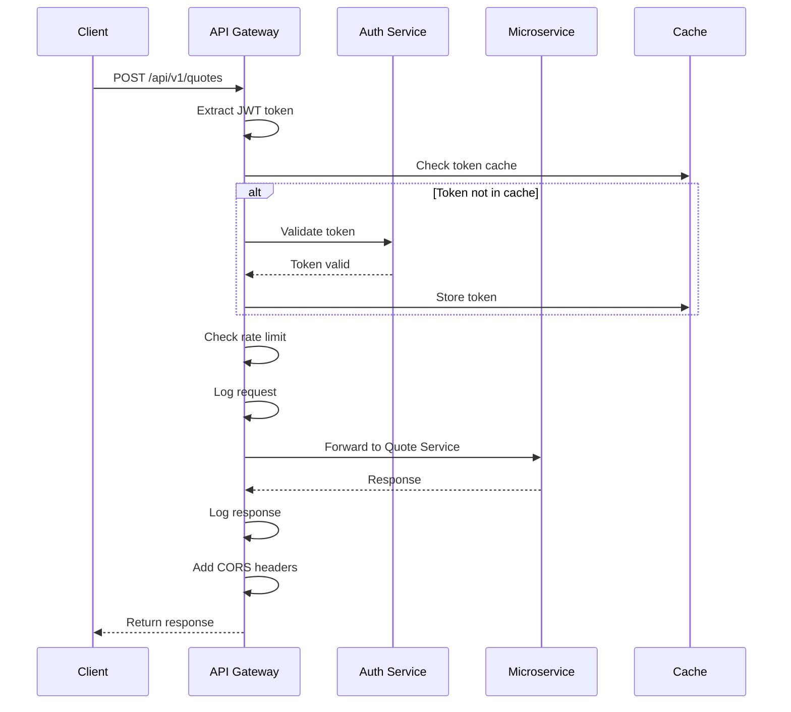

# ADR-004: API Gateway Pattern

**Status:** Accepted

**Date:** 2025-11-24

**Context:**
With multiple microservices, client applications (web and mobile) face several challenges:
- Need to know addresses of multiple services
- Different authentication mechanisms per service
- Cross-cutting concerns duplicated (rate limiting, logging)
- Direct service-to-service communication exposes internal architecture
- Mobile apps face network latency for multiple calls
- API versioning across services is complex

We need a unified entry point that:
- Provides single endpoint for clients
- Handles authentication and authorization centrally
- Implements cross-cutting concerns
- Enables service evolution without breaking clients

**Decision:**
We will implement an API Gateway pattern using Kong (or AWS API Gateway) with the following responsibilities:

1. **Request Routing:**
   - Route requests to appropriate microservices
   - URL path-based routing: `/api/v1/customers/*` → Customer Service
   - Support for request/response transformation

2. **Authentication & Authorization:**
   - JWT token validation
   - OAuth 2.0 / OpenID Connect integration
   - Rate limiting per user/API key
   - IP whitelisting for sensitive operations

3. **Cross-Cutting Concerns:**
   - Request/response logging
   - Metrics collection
   - Distributed tracing headers
   - CORS handling
   - SSL/TLS termination

4. **API Composition:**
   - Aggregate data from multiple services
   - Backend for Frontend (BFF) pattern for mobile apps
   - GraphQL gateway (optional future enhancement)

5. **Circuit Breaking:**
   - Fail fast when services are down
   - Return cached responses or defaults
   - Health check integration

**API Gateway Configuration:**

```yaml
# Route definitions
routes:
  - path: /api/v1/emails/*
    service: email-service
    methods: [GET, POST, PUT, DELETE]
    
  - path: /api/v1/customers/*
    service: customer-service
    methods: [GET, POST, PUT, DELETE]
    
  - path: /api/v1/quotes/*
    service: quote-service
    methods: [GET, POST, PUT, DELETE]
    
  - path: /api/v1/inventory/*
    service: inventory-service
    methods: [GET]
    
  - path: /api/v1/purchase-orders/*
    service: po-service
    methods: [GET, POST]
    
  - path: /api/v1/deals/*
    service: pipeline-service
    methods: [GET, POST, PUT, DELETE]

# Authentication
authentication:
  type: jwt
  secret: ${JWT_SECRET}
  header: Authorization
  
# Rate limiting
rate_limits:
  default: 1000 requests/hour
  authenticated: 5000 requests/hour
  premium: 10000 requests/hour

# Circuit breaker
circuit_breaker:
  failure_threshold: 5
  timeout: 30s
  reset_timeout: 60s
```

**Request Flow:**



**Consequences:**

**Positive:**
- Single entry point simplifies client development
- Centralized authentication and authorization
- Cross-cutting concerns implemented once
- Protects internal service architecture
- Easier to implement API versioning
- Built-in monitoring and analytics
- Simplified SSL/certificate management
- Can implement request aggregation (reduce mobile round trips)
- Easy to add new services without client changes

**Negative:**
- Additional network hop (latency)
- Gateway becomes single point of failure
- Potential bottleneck under high load
- Additional component to manage and monitor
- Increased complexity for local development
- May need specialized expertise (Kong configuration)

**Mitigations:**
- Deploy gateway in high-availability mode (multiple instances)
- Use load balancer in front of gateway
- Implement health checks and auto-scaling
- Keep gateway stateless for easy scaling
- Cache frequently accessed data
- Monitor gateway performance closely
- Provide local development configuration
- Use infrastructure as code for gateway config

**Gateway Responsibilities vs. Service Responsibilities:**

**Gateway Should:**
- Authenticate requests
- Route to correct service
- Rate limiting
- Request/response logging
- Add correlation IDs
- SSL termination
- CORS handling

**Gateway Should NOT:**
- Contain business logic
- Directly access service databases
- Make complex data transformations
- Maintain service state
- Implement service-specific validation

**API Composition Example:**

For mobile apps with limited bandwidth, gateway can compose responses:

```
GET /api/mobile/v1/quote/{quote_id}/summary

Gateway internally calls:
1. Quote Service: Get quote details
2. Customer Service: Get customer name
3. Inventory Service: Get stock status

Returns single aggregated response:
{
  "quote": {...},
  "customer_name": "...",
  "stock_available": true
}
```

**Versioning Strategy:**

```
# URL-based versioning
/api/v1/customers    # Version 1
/api/v2/customers    # Version 2 (when breaking changes)

# Header-based versioning (alternative)
Header: API-Version: 2.0

# Gateway routes both versions to appropriate service versions
```

**Alternatives Considered:**

1. **Client-Side Service Discovery**
   - Clients directly discover and call services
   - Rejected because: Exposes internal architecture, duplicates cross-cutting concerns

2. **Service Mesh (Istio/Linkerd)**
   - More comprehensive service-to-service communication
   - Rejected because: Overkill for initial launch, steeper learning curve

3. **Backend for Frontend Only**
   - Separate BFF for web and mobile
   - Rejected because: Prefer single gateway with BFF as enhancement

4. **GraphQL Gateway**
   - Flexible querying
   - Rejected because: Team not familiar, REST is sufficient initially

**Gateway Selection:**

**Kong:**
- Open-source, battle-tested
- Rich plugin ecosystem
- Good documentation
- Active community

**AWS API Gateway:**
- Fully managed
- Integrates with AWS ecosystem
- Auto-scaling built-in
- Higher cost at scale

**Decision: Start with Kong, can migrate to AWS API Gateway if needed**

**Related Decisions:**
- ADR-001: Microservices Architecture
- ADR-005: Authentication with JWT
- ADR-008: Rate Limiting Strategy

**Notes:**
- Monitor gateway performance metrics weekly
- Plan for GraphQL gateway if client needs become complex
- Consider service mesh if service-to-service communication patterns become complex
- Review rate limiting policies monthly based on usage patterns
