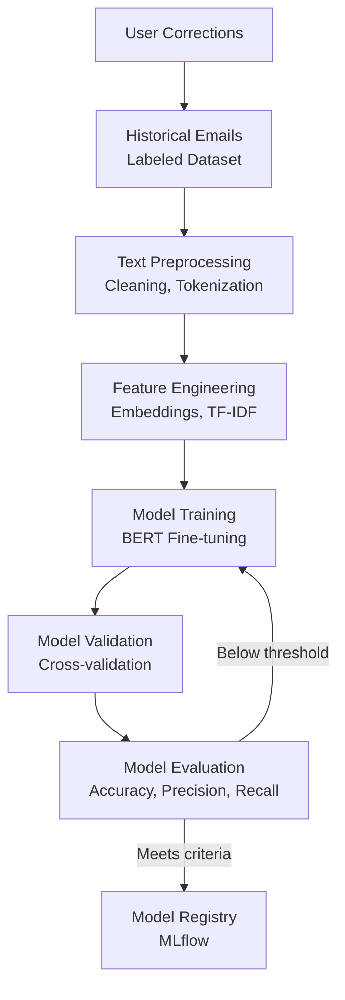
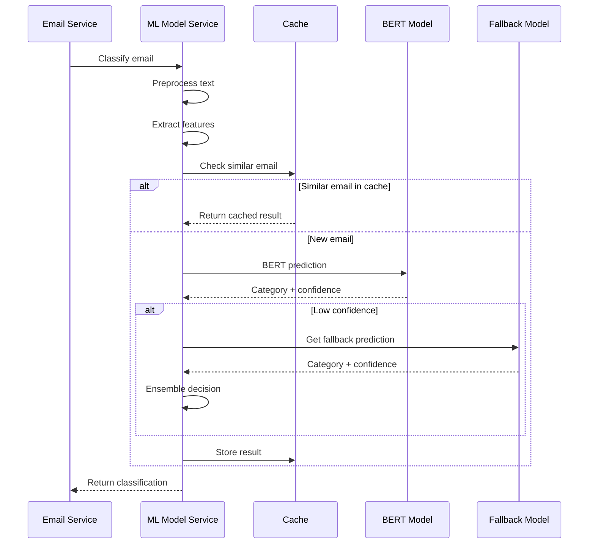

# ADR-005: Machine Learning for Email Classification

**Status:** Accepted

**Date:** 2025-11-24

**Context:**
The Email Service needs to automatically categorize incoming emails into:
- Customer Inquiries
- Service Requests
- Tender Notifications
- Supplier Messages
- Spam/Irrelevant

Manual classification is time-consuming and error-prone. Sales reps waste time sorting through emails to find important customer inquiries. The system receives 500-1000 emails daily across multiple dealers.

Requirements:
- Accurate classification (>90% accuracy)
- Fast processing (<5 seconds per email)
- Adaptable to new patterns
- Explainable results for manual review cases
- Continuous improvement with feedback

**Decision:**
We will implement a supervised machine learning approach for email classification:

1. **Model Architecture:**
   - Primary: Fine-tuned BERT-based transformer model
   - Fallback: Traditional ML (Random Forest + TF-IDF) for speed
   - Ensemble approach combining both

2. **Feature Engineering:**
   ```
   Features extracted:
   - Email subject (text)
   - Email body (text, first 500 words)
   - Sender domain
   - Sender history (known customer/supplier)
   - Presence of attachments
   - Attachment types
   - Time of day/week
   - Keywords (urgent, quote, order, service, etc.)
   - Email thread depth
   - Presence of pricing information
   ```

3. **Training Data:**
   - Initial: 10,000+ manually labeled historical emails
   - Continuous: Active learning from user corrections
   - Balance across categories using oversampling/undersampling

4. **Model Pipeline:**
   ```
   Input Email → Preprocessing → Feature Extraction → 
   Primary Model (BERT) → Confidence Check → 
   If low confidence: Fallback Model → 
   Ensemble Decision → Category + Confidence Score
   ```

5. **Confidence Thresholds:**
   ```
   Confidence >= 0.90: Auto-classify
   0.70 <= Confidence < 0.90: Auto-classify + flag for review
   Confidence < 0.70: Route to manual review queue
   ```

6. **Deployment:**
   - Model served via REST API (FastAPI)
   - Separate model service (containerized)
   - Model versioning with A/B testing capability
   - Fallback to rule-based classification if ML service is down

**Model Training Architecture:**



**Inference Flow:**



**Consequences:**

**Positive:**
- High accuracy (target >92%) reduces misclassification
- Automated processing saves 2-3 hours per sales rep per day
- Continuous learning improves over time
- Confidence scores enable intelligent routing
- Reduced response time for critical emails
- Scalable to handle email volume growth
- Can incorporate dealer-specific patterns

**Negative:**
- Initial training data collection effort (2-3 weeks)
- Model training infrastructure required (GPU)
- Ongoing monitoring and retraining needed
- May misclassify edge cases
- Computational cost for BERT inference
- False positives/negatives require manual intervention
- Model drift over time requires retraining

**Mitigations:**
- Start with rule-based classification, transition to ML
- Use transfer learning (pre-trained BERT) to reduce training data needs
- Implement active learning to prioritize labeling efforts
- Set up automated model monitoring (accuracy drift detection)
- Maintain fallback rule-based classifier
- Schedule quarterly model retraining
- Implement user feedback loop for corrections
- Use model caching for common patterns

**Performance Targets:**

```
Accuracy Metrics:
- Overall accuracy: >92%
- Precision per category: >90%
- Recall per category: >88%
- F1-score: >0.90

Performance Metrics:
- Inference time: <2 seconds (95th percentile)
- Throughput: >100 emails/second
- Model size: <500MB
- Memory usage: <2GB

Business Metrics:
- Reduction in manual classification: >85%
- Email routing accuracy: >95%
- Time to first response: <2 hours (from 24+ hours)
```

**Model Retraining Strategy:**

```
Triggers for retraining:
1. Accuracy drops below 90% (monitored weekly)
2. >100 user corrections accumulated
3. Monthly scheduled retraining
4. New email category introduced
5. Significant business process change

Retraining process:
1. Collect new labeled data (user corrections + recent manual reviews)
2. Merge with existing training set
3. Balance dataset
4. Train new model version
5. Validate on holdout set
6. A/B test new vs. old model (20% traffic)
7. If new model performs better, full rollout
8. Archive old model (keep for rollback)
```

**Active Learning Implementation:**

```python
def select_emails_for_labeling(unlabeled_emails, model, budget=100):
    """
    Select most informative emails for manual labeling
    """
    predictions = model.predict_proba(unlabeled_emails)
    
    # Uncertainty sampling
    uncertainty_scores = []
    for pred in predictions:
        # Entropy-based uncertainty
        entropy = -sum(p * log(p) for p in pred if p > 0)
        uncertainty_scores.append(entropy)
    
    # Select emails with highest uncertainty
    selected_indices = argsort(uncertainty_scores)[-budget:]
    
    return [unlabeled_emails[i] for i in selected_indices]
```

**Explainability:**

For manual review cases, provide explanations:
```
Classification: Customer Inquiry (Confidence: 75%)

Key indicators:
✓ Subject contains "quote request"
✓ Sender from known customer domain
✓ Body mentions machine model
✗ No pricing keywords detected
! Similar to manually corrected email from last week
```

**Alternatives Considered:**

1. **Rule-Based Classification Only**
   - Simple keyword matching
   - Easy to implement and understand
   - Rejected because: Poor accuracy (60-70%), doesn't learn, brittle

2. **Third-Party Email Classification Service**
   - Pre-built, managed service
   - No training required
   - Rejected because: Generic models not domain-specific, data privacy concerns, ongoing cost

3. **Simple ML (Naive Bayes / SVM)**
   - Faster inference
   - Less resource intensive
   - Rejected because: Lower accuracy, doesn't capture context well

4. **GPT-based Classification**
   - Very high accuracy
   - Zero-shot or few-shot learning
   - Rejected because: High API cost per email, latency concerns, data privacy

**Technology Stack:**

```
Model Framework: PyTorch / Hugging Face Transformers
Primary Model: bert-base-uncased (fine-tuned)
Fallback Model: Scikit-learn Random Forest
Feature Engineering: Scikit-learn, NLTK, spaCy
Model Serving: FastAPI + Gunicorn
Model Versioning: MLflow
Monitoring: Prometheus + Grafana
Infrastructure: Docker containers on Kubernetes
```

**Related Decisions:**
- ADR-009: Priority Scoring Algorithm
- ADR-010: Active Learning for Continuous Improvement

**Notes:**
- Consider GPT-4 for complex edge cases (as fallback)
- Evaluate smaller BERT models (DistilBERT) for faster inference
- Plan for multi-language support if expanding internationally
- Monitor for bias in classification (e.g., certain customer types)
