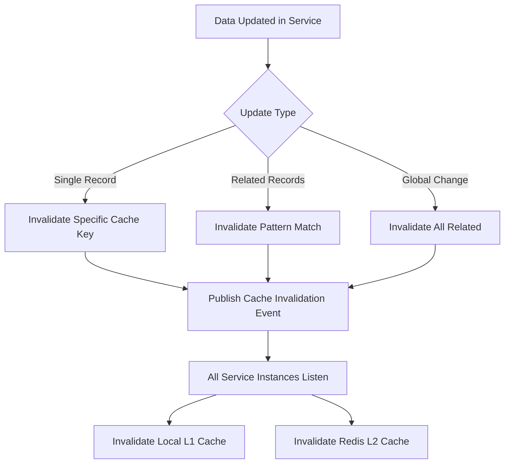

# ADR-006: Multi-Layer Caching Strategy

**Status:** Accepted

**Date:** 2025-11-24

**Context:**
The system has several performance-critical operations:
- Customer information lookups (frequent, rarely changes)
- Product catalog queries (very frequent, changes weekly)
- Inventory availability checks (extremely frequent, changes often)
- Quote calculations (computation-intensive)
- User session management
- API rate limiting

Without caching:
- Database queries create bottlenecks
- Response times degrade under load
- Expensive computations repeated unnecessarily
- Poor user experience

Requirements:
- Sub-second response times for 95% of requests
- Handle 1000+ concurrent users
- Maintain data consistency
- Cost-effective infrastructure

**Decision:**
We will implement a multi-layer caching strategy using Redis with the following layers:

**1. Application-Level Cache (L1)**
- In-memory cache within each service instance
- Extremely fast (microseconds)
- Small, frequently accessed data
- TTL: 1-5 minutes
- Invalidation: Time-based

```python
# Example: In-memory LRU cache
from functools import lru_cache

@lru_cache(maxsize=1000)
def get_product_basic_info(product_id):
    # Cached for single request/instance
    pass
```

**2. Distributed Cache (L2)**
- Redis cluster (primary cache layer)
- Shared across all service instances
- Sub-millisecond latency
- TTL-based expiration
- Active invalidation on updates

**3. CDN Cache (L3)**
- For static assets and documents
- CloudFront / Cloudflare
- Edge caching for global distribution
- Long TTL (hours to days)

**Cache Strategies by Data Type:**

```yaml
Customer Data:
  storage: Redis
  ttl: 15 minutes
  strategy: Cache-aside
  invalidation: Event-driven (on customer update)
  key_pattern: "customer:360:{customer_id}"
  
Product Catalog:
  storage: Redis
  ttl: 1 hour
  strategy: Write-through
  invalidation: Time-based
  key_pattern: "product:{product_id}"
  
Inventory:
  storage: Redis
  ttl: 5 minutes
  strategy: Write-through
  invalidation: Event-driven (on stock change)
  key_pattern: "inventory:{product_id}:{warehouse_id}"
  
User Sessions:
  storage: Redis
  ttl: 24 hours
  strategy: Write-through
  key_pattern: "session:{session_id}"
  
API Rate Limits:
  storage: Redis
  ttl: 1 hour (sliding window)
  strategy: Counter
  key_pattern: "ratelimit:{api_key}:{endpoint}:{window}"
  
Quote Calculations:
  storage: Redis
  ttl: 1 hour
  strategy: Cache-aside
  invalidation: On price/config change
  key_pattern: "quote:calc:{hash}"
```

**Caching Patterns:**

**1. Cache-Aside (Lazy Loading):**
```python
def get_customer_360(customer_id):
    # Check cache first
    cache_key = f"customer:360:{customer_id}"
    cached = redis.get(cache_key)
    
    if cached:
        return json.loads(cached)
    
    # Cache miss - fetch from database
    customer = fetch_from_database(customer_id)
    
    # Store in cache
    redis.setex(cache_key, 900, json.dumps(customer))  # 15 min TTL
    
    return customer
```

**2. Write-Through:**
```python
def update_inventory(product_id, warehouse_id, new_quantity):
    # Update database
    db.update_inventory(product_id, warehouse_id, new_quantity)
    
    # Update cache immediately
    cache_key = f"inventory:{product_id}:{warehouse_id}"
    inventory_data = {
        'product_id': product_id,
        'quantity': new_quantity,
        'updated_at': datetime.now()
    }
    redis.setex(cache_key, 300, json.dumps(inventory_data))  # 5 min TTL
```

**3. Write-Behind (Asynchronous):**
```python
def log_user_activity(user_id, activity):
    # Write to cache immediately
    cache_key = f"activity:{user_id}:{datetime.now().timestamp()}"
    redis.setex(cache_key, 3600, json.dumps(activity))
    
    # Queue for async database write
    message_queue.publish('activity.logged', activity)
```

**Cache Invalidation Strategy:**



**Event-Driven Invalidation:**
```python
# When customer is updated
def update_customer(customer_id, updates):
    # Update database
    db.update_customer(customer_id, updates)
    
    # Invalidate cache
    cache_keys = [
        f"customer:360:{customer_id}",
        f"customer:basic:{customer_id}",
        f"customer:history:{customer_id}"
    ]
    redis.delete(*cache_keys)
    
    # Publish event for other services
    event_bus.publish('customer.updated', {
        'customer_id': customer_id,
        'cache_keys': cache_keys
    })
```

**Cache Warming:**
```python
def warm_cache():
    """
    Pre-populate cache with frequently accessed data
    Run on application startup and periodically
    """
    # Top 100 products
    top_products = get_top_products(limit=100)
    for product in top_products:
        cache_key = f"product:{product.id}"
        redis.setex(cache_key, 3600, json.dumps(product))
    
    # Active customers
    active_customers = get_active_customers(days=30)
    for customer in active_customers:
        cache_key = f"customer:360:{customer.id}"
        data = build_customer_360(customer.id)
        redis.setex(cache_key, 900, json.dumps(data))
```

**Consequences:**

**Positive:**
- Dramatic performance improvement (50-90% response time reduction)
- Reduced database load (70-80% fewer queries)
- Better scalability (handle more users with same infrastructure)
- Improved user experience
- Lower infrastructure costs (smaller database instances)
- Resilience (system continues with stale cache if database is slow)

**Negative:**
- Data consistency challenges (stale data risk)
- Increased memory requirements
- Cache invalidation complexity
- Debugging difficulty (harder to reproduce issues)
- Additional infrastructure component (Redis)
- Cache stampede risk (many requests miss cache simultaneously)

**Mitigations:**

**Stale Data:**
- Use appropriate TTLs per data type
- Implement event-driven invalidation for critical data
- Display "last updated" timestamps to users

**Cache Stampede:**
```python
def get_with_lock(key, fetch_func, max_retries=30):
    """Prevent cache stampede with distributed lock"""
    data = redis.get(key)
    if data:
        return data
    
    lock_key = f"lock:{key}"
    lock = redis.set(lock_key, "1", nx=True, ex=10)
    
    if lock:
        try:
            # This process fetches the data
            data = fetch_func()
            redis.setex(key, 900, data)
            return data
        finally:
            redis.delete(lock_key)
    else:
        # Wait for other process to populate cache
        # Retry with exponential backoff up to max_retries
        for attempt in range(max_retries):
            time.sleep(0.1 * (1.5 ** attempt))  # Exponential backoff
            data = redis.get(key)
            if data:
                return data
        
        # Timeout - fetch data anyway to prevent indefinite wait
        logger.warning(f"Cache lock timeout for key {key}, fetching anyway")
        return fetch_func()
```

**Memory Management:**
- Set Redis max memory policy: `allkeys-lru`
- Monitor memory usage
- Set appropriate TTLs (shorter for large objects)
- Use Redis eviction policies

**Redis High Availability:**
- Redis cluster with multiple nodes
- Redis Sentinel for automatic failover
- Replication for read scaling
- Regular backups (RDB + AOF)

**Cache Monitoring:**

```
Metrics to Track:
- Cache hit rate (target >85%)
- Cache miss rate
- Average response time (cached vs non-cached)
- Memory usage
- Eviction rate
- Key count
- TTL distribution

Alerts:
- Cache hit rate < 80%
- Memory usage > 90%
- Redis instance down
- Eviction rate > 100/second
```

**Performance Impact:**

```
Before Caching:
- Customer lookup: ~150ms (database query)
- Product catalog: ~200ms (complex joins)
- Inventory check: ~100ms (real-time query)
- Quote calculation: ~500ms (multiple queries + computation)

After Caching:
- Customer lookup: ~5ms (cache hit)
- Product catalog: ~3ms (cache hit)
- Inventory check: ~10ms (cache hit with frequent updates)
- Quote calculation: ~8ms (cache hit)

Cache Hit Rates:
- Customer data: 95%
- Product catalog: 98%
- Inventory: 85% (frequent changes)
- Quote calculations: 75%
```

**Alternatives Considered:**

1. **No Caching**
   - Simplest approach
   - Rejected because: Poor performance, high database load

2. **Database Query Caching Only**
   - PostgreSQL query cache
   - Rejected because: Limited control, not shared across instances

3. **Memcached**
   - Simpler than Redis
   - Rejected because: Lacks data structures, persistence, pub/sub

4. **Application-Level Caching Only**
   - No external dependencies
   - Rejected because: Not shared across instances, limited scalability

**Related Decisions:**
- ADR-003: Database per Service
- ADR-007: Redis for Session Management

**Notes:**
- Monitor cache effectiveness monthly
- Review TTL values quarterly based on usage patterns
- Consider Redis Enterprise for automatic scaling
- Plan for cache pre-warming during deployments
