# C4 Architecture Diagrams
## Heavy Machinery Dealer Management System

This document contains C4 model diagrams (Context, Container, Component, and Code) in Mermaid format to visualize the system architecture at different levels of abstraction.

## 📊 Document Summary

This comprehensive C4 architecture documentation includes **16 Mermaid diagrams** across all four levels of the C4 model:

### Diagram Inventory

**Level 1 - System Context (1 diagram)**
- System Context Diagram - Shows external actors and systems

**Level 2 - Container (1 diagram)**
- Container Diagram - Shows all microservices, frontends, databases, and message broker

**Level 3 - Component (9 diagrams)**
- Email Service Component Diagram
- Quote Service Component Diagram
- Inventory Service Component Diagram
- Customer Service Component Diagram
- Approval Service Component Diagram
- Purchase Order Service Component Diagram
- Pipeline Service Component Diagram
- Notification Service Component Diagram
- Tender Service Component Diagram

**Level 4 - Code (5 diagrams)**
- Email Classification Classes
- Quote Calculation Classes
- Inventory Reservation Classes
- Approval Workflow Classes
- Pipeline Forecasting Classes

**Deployment (1 diagram)**
- Cloud Deployment Architecture

### How to Use These Diagrams

- **For Business Stakeholders:** Start with Level 1 (System Context) to understand the big picture
- **For Architects:** Review Levels 1-2 and the Deployment diagram for architectural decisions
- **For Developers:** Study Level 3 (Component) diagrams for your service and Level 4 (Code) for implementation details
- **For DevOps:** Focus on the Container and Deployment diagrams

All diagrams use **Mermaid.js** format and can be rendered in:
- GitHub (automatic rendering)
- VS Code (with Mermaid extension)
- Mermaid Live Editor (https://mermaid.live)
- Documentation generators (MkDocs, Docusaurus, etc.)

---

## Level 1: System Context Diagram

Shows the system in its environment with external actors and systems.

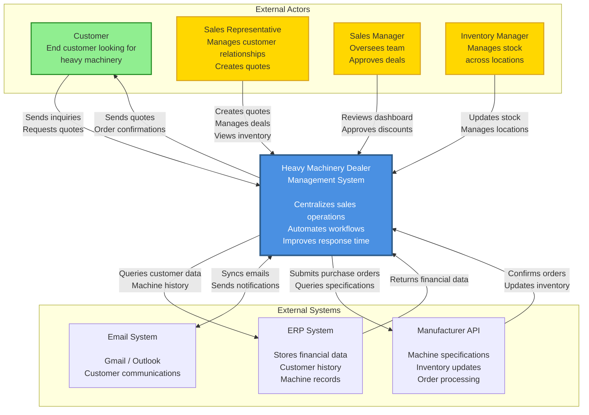
```mermaid
graph TB
    subgraph ExternalActors[External Actors]
        Customer[Customer<br/>End customer looking for<br/>heavy machinery]
        SalesRep[Sales Representative<br/>Manages customer relationships<br/>Creates quotes]
        SalesManager[Sales Manager<br/>Oversees team<br/>Approves deals]
        InventoryMgr[Inventory Manager<br/>Manages stock<br/>across locations]
    end
    
    DealerSystem[Heavy Machinery Dealer<br/>Management System<br/><br/>Centralizes sales operations<br/>Automates workflows<br/>Improves response time]
    
    subgraph ExternalSystems[External Systems]
        ERP[ERP System<br/><br/>Stores financial data<br/>Customer history<br/>Machine records]
        EmailSys[Email System<br/><br/>Gmail / Outlook<br/>Customer communications]
        Manufacturer[Manufacturer API<br/><br/>Machine specifications<br/>Inventory updates<br/>Order processing]
    end
    
    Customer -->|Sends inquiries<br/>Requests quotes| DealerSystem
    DealerSystem -->|Sends quotes<br/>Order confirmations| Customer
    
    SalesRep -->|Creates quotes<br/>Manages deals<br/>Views inventory| DealerSystem
    SalesManager -->|Reviews dashboard<br/>Approves discounts| DealerSystem
    InventoryMgr -->|Updates stock<br/>Manages locations| DealerSystem
    
    DealerSystem -->|Queries customer data<br/>Machine history| ERP
    ERP -->|Returns financial data| DealerSystem
    
    DealerSystem <-->|Syncs emails<br/>Sends notifications| EmailSys
    
    DealerSystem -->|Submits purchase orders<br/>Queries specifications| Manufacturer
    Manufacturer -->|Confirms orders<br/>Updates inventory| DealerSystem
    
    style DealerSystem fill:#4A90E2,stroke:#2E5C8A,stroke-width:3px,color:#fff
    style Customer fill:#90EE90,stroke:#228B22,stroke-width:2px
    style SalesRep fill:#FFD700,stroke:#DAA520,stroke-width:2px
    style SalesManager fill:#FFD700,stroke:#DAA520,stroke-width:2px
    style InventoryMgr fill:#FFD700,stroke:#DAA520,stroke-width:2px
```

---

## Level 2: Container Diagram

Shows the high-level technology choices and how containers communicate.

```mermaid
graph TB
    subgraph Users[Users and External Systems]
        User[User<br/>Browser/Mobile]
        EmailSystem[Email System]
        ERPSystem[ERP System]
        ManufacturerAPI[Manufacturer API]
    end
    
    subgraph FrontendContainers[Frontend Layer]
        WebApp[Web Application<br/><br/>React SPA<br/>Port 3000<br/>User interface for<br/>all operations]
        MobileApp[Mobile App<br/><br/>Progressive Web App<br/>Offline-capable<br/>Field access]
    end
    
    subgraph APILayer[API Layer]
        APIGateway[API Gateway<br/><br/>Kong<br/>Port 8000<br/>Authentication<br/>Rate limiting<br/>Request routing]
    end
    
    subgraph BackendServices[Backend Services - Microservices]
        EmailService[Email Service<br/><br/>Python FastAPI<br/>Port 8001<br/>Email processing<br/>ML classification<br/>Priority scoring]
        
        CustomerService[Customer Service<br/><br/>Python FastAPI<br/>Port 8002<br/>Customer data<br/>360 degree view<br/>History tracking]
        
        QuoteService[Quote Service<br/><br/>Python FastAPI<br/>Port 8003<br/>Quote generation<br/>Configuration<br/>Pricing engine]
        
        InventoryService[Inventory Service<br/><br/>Python FastAPI<br/>Port 8004<br/>Stock management<br/>Multi-warehouse<br/>Reservations]
        
        ApprovalService[Approval Service<br/><br/>Python FastAPI<br/>Port 8005<br/>Workflow engine<br/>Multi-level approvals]
        
        POService[Purchase Order Service<br/><br/>Python FastAPI<br/>Port 8006<br/>PO automation<br/>Template generation]
        
        PipelineService[Pipeline Service<br/><br/>Python FastAPI<br/>Port 8007<br/>Deal tracking<br/>Forecasting<br/>Analytics]
        
        NotificationService[Notification Service<br/><br/>Node.js<br/>Port 8008<br/>Real-time notifications<br/>WebSocket support]
    end
    
    subgraph DataLayer[Data Layer]
        PostgreSQL[(PostgreSQL<br/><br/>Port 5432<br/>Transactional data<br/>Customers, Quotes<br/>Inventory, Deals)]
        
        MongoDB[(MongoDB<br/><br/>Port 27017<br/>Document storage<br/>Emails<br/>Attachments)]
        
        Redis[(Redis<br/><br/>Port 6379<br/>Cache layer<br/>Sessions<br/>Rate limiting)]
        
        Elasticsearch[(Elasticsearch<br/><br/>Port 9200<br/>Full-text search<br/>Analytics<br/>Logging)]
        
        S3[S3 Object Storage<br/><br/>HTTPS<br/>Documents<br/>PDFs<br/>Attachments]
    end
    
    subgraph MessageLayer[Message Layer]
        RabbitMQ[RabbitMQ<br/><br/>Port 5672<br/>Event bus<br/>Async messaging<br/>Pub/Sub]
    end
    
    User -->|HTTPS| WebApp
    User -->|HTTPS| MobileApp
    
    WebApp -->|REST API<br/>JSON/HTTPS| APIGateway
    MobileApp -->|REST API<br/>JSON/HTTPS| APIGateway
    
    APIGateway -->|HTTP| EmailService
    APIGateway -->|HTTP| CustomerService
    APIGateway -->|HTTP| QuoteService
    APIGateway -->|HTTP| InventoryService
    APIGateway -->|HTTP| ApprovalService
    APIGateway -->|HTTP| POService
    APIGateway -->|HTTP| PipelineService
    APIGateway -->|WebSocket| NotificationService
    
    EmailService -->|Read/Write| PostgreSQL
    EmailService -->|Read/Write| MongoDB
    EmailService -->|Publish events| RabbitMQ
    EmailService -->|IMAP/SMTP| EmailSystem
    
    CustomerService -->|Read/Write| PostgreSQL
    CustomerService -->|Cache| Redis
    CustomerService -->|REST API| ERPSystem
    
    QuoteService -->|Read/Write| PostgreSQL
    QuoteService -->|Cache| Redis
    QuoteService -->|Store PDFs| S3
    QuoteService -->|Publish events| RabbitMQ
    
    InventoryService -->|Read/Write| PostgreSQL
    InventoryService -->|Cache| Redis
    InventoryService -->|Sync data| ERPSystem
    
    ApprovalService -->|Read/Write| PostgreSQL
    ApprovalService -->|Publish events| RabbitMQ
    
    POService -->|Read/Write| PostgreSQL
    POService -->|Store PDFs| S3
    POService -->|Submit orders| ManufacturerAPI
    
    PipelineService -->|Read/Write| PostgreSQL
    PipelineService -->|Search| Elasticsearch
    
    NotificationService -->|Subscribe events| RabbitMQ
    NotificationService -->|Cache| Redis
    
    style APIGateway fill:#FF6B6B,stroke:#C92A2A,stroke-width:2px
    style WebApp fill:#4ECDC4,stroke:#2C7A7B,stroke-width:2px
    style MobileApp fill:#4ECDC4,stroke:#2C7A7B,stroke-width:2px
```

---

## Level 3: Component Diagram - Email Service

Detailed view of Email Service internal components.

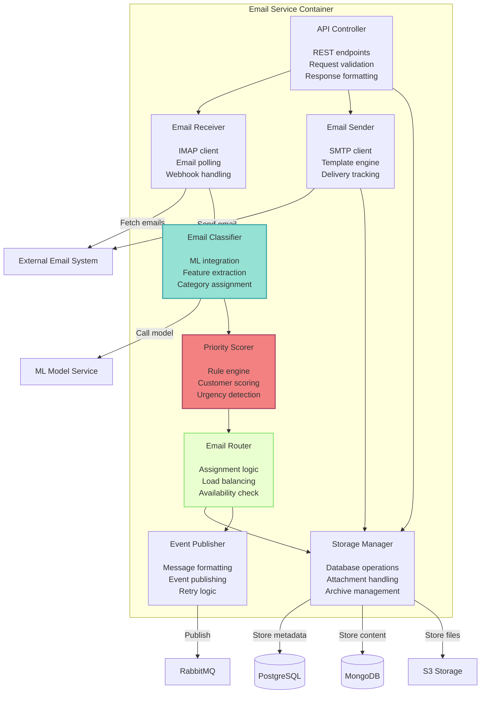
```mermaid
graph TB
    subgraph EmailService[Email Service Container]
        direction TB
        
        APIController[API Controller<br/><br/>REST endpoints<br/>Request validation<br/>Response formatting]
        
        EmailReceiver[Email Receiver<br/><br/>IMAP client<br/>Email polling<br/>Webhook handling]
        
        EmailClassifier[Email Classifier<br/><br/>ML integration<br/>Feature extraction<br/>Category assignment]
        
        PriorityScorer[Priority Scorer<br/><br/>Rule engine<br/>Customer scoring<br/>Urgency detection]
        
        EmailRouter[Email Router<br/><br/>Assignment logic<br/>Load balancing<br/>Availability check]
        
        EmailSender[Email Sender<br/><br/>SMTP client<br/>Template engine<br/>Delivery tracking]
        
        StorageManager[Storage Manager<br/><br/>Database operations<br/>Attachment handling<br/>Archive management]
        
        EventPublisher[Event Publisher<br/><br/>Message formatting<br/>Event publishing<br/>Retry logic]
    end
    
    ExternalEmail[External Email System]
    MLModelService[ML Model Service]
    DatabasePostgres[(PostgreSQL)]
    DatabaseMongo[(MongoDB)]
    MessageQueue[RabbitMQ]
    ObjectStorage[S3 Storage]
    
    APIController --> EmailReceiver
    APIController --> EmailSender
    APIController --> StorageManager
    
    EmailReceiver -->|Fetch emails| ExternalEmail
    EmailReceiver --> EmailClassifier
    
    EmailClassifier -->|Call model| MLModelService
    EmailClassifier --> PriorityScorer
    
    PriorityScorer --> EmailRouter
    
    EmailRouter --> StorageManager
    EmailRouter --> EventPublisher
    
    EmailSender -->|Send email| ExternalEmail
    EmailSender --> StorageManager
    
    StorageManager -->|Store metadata| DatabasePostgres
    StorageManager -->|Store content| DatabaseMongo
    StorageManager -->|Store files| ObjectStorage
    
    EventPublisher -->|Publish| MessageQueue
    
    style EmailClassifier fill:#95E1D3,stroke:#38A3A5,stroke-width:2px
    style PriorityScorer fill:#F38181,stroke:#AA4465,stroke-width:2px
    style EmailRouter fill:#EAFFD0,stroke:#95E77D,stroke-width:2px
```

---

## Level 3: Component Diagram - Quote Service

Detailed view of Quote Service internal components.

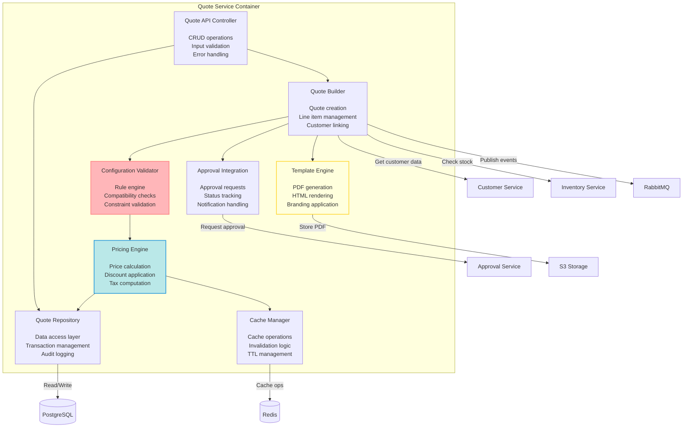
```mermaid
graph TB
    subgraph QuoteService[Quote Service Container]
        direction TB
        
        QuoteAPIController[Quote API Controller<br/><br/>CRUD operations<br/>Input validation<br/>Error handling]
        
        QuoteBuilder[Quote Builder<br/><br/>Quote creation<br/>Line item management<br/>Customer linking]
        
        ConfigValidator[Configuration Validator<br/><br/>Rule engine<br/>Compatibility checks<br/>Constraint validation]
        
        PricingEngine[Pricing Engine<br/><br/>Price calculation<br/>Discount application<br/>Tax computation]
        
        TemplateEngine[Template Engine<br/><br/>PDF generation<br/>HTML rendering<br/>Branding application]
        
        ApprovalIntegration[Approval Integration<br/><br/>Approval requests<br/>Status tracking<br/>Notification handling]
        
        QuoteRepository[Quote Repository<br/><br/>Data access layer<br/>Transaction management<br/>Audit logging]
        
        CacheManager[Cache Manager<br/><br/>Cache operations<br/>Invalidation logic<br/>TTL management]
    end
    
    CustomerServiceAPI[Customer Service]
    InventoryServiceAPI[Inventory Service]
    ApprovalServiceAPI[Approval Service]
    
    DatabasePostgres[(PostgreSQL)]
    CacheRedis[(Redis)]
    StorageS3[S3 Storage]
    EventBus[RabbitMQ]
    
    QuoteAPIController --> QuoteBuilder
    QuoteAPIController --> QuoteRepository
    
    QuoteBuilder --> ConfigValidator
    QuoteBuilder -->|Get customer data| CustomerServiceAPI
    
    ConfigValidator --> PricingEngine
    
    PricingEngine --> QuoteRepository
    PricingEngine --> CacheManager
    
    QuoteBuilder --> TemplateEngine
    
    TemplateEngine -->|Store PDF| StorageS3
    
    QuoteBuilder --> ApprovalIntegration
    ApprovalIntegration -->|Request approval| ApprovalServiceAPI
    
    QuoteBuilder -->|Check stock| InventoryServiceAPI
    
    QuoteRepository -->|Read/Write| DatabasePostgres
    CacheManager -->|Cache ops| CacheRedis
    
    QuoteBuilder -->|Publish events| EventBus
    
    style ConfigValidator fill:#FFB6B9,stroke:#FE8A8A,stroke-width:2px
    style PricingEngine fill:#BAE8E8,stroke:#2D9CDB,stroke-width:2px
    style TemplateEngine fill:#FFFFDD,stroke:#FFD93D,stroke-width:2px
```

---

## Level 3: Component Diagram - Inventory Service

Detailed view of Inventory Service internal components.

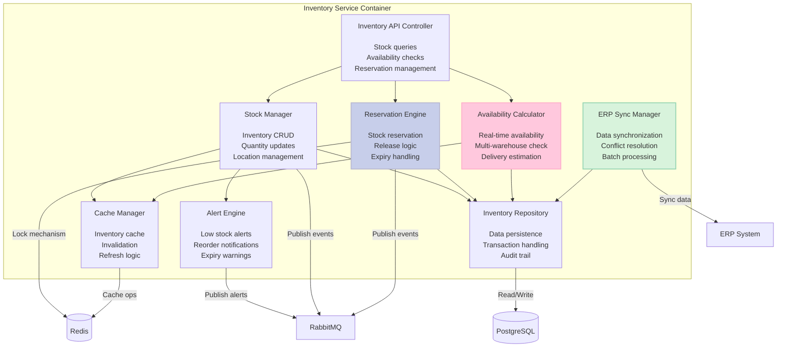
```mermaid
graph TB
    subgraph InventoryService[Inventory Service Container]
        direction TB
        
        InventoryAPIController[Inventory API Controller<br/><br/>Stock queries<br/>Availability checks<br/>Reservation management]
        
        StockManager[Stock Manager<br/><br/>Inventory CRUD<br/>Quantity updates<br/>Location management]
        
        ReservationEngine[Reservation Engine<br/><br/>Stock reservation<br/>Release logic<br/>Expiry handling]
        
        AvailabilityCalculator[Availability Calculator<br/><br/>Real-time availability<br/>Multi-warehouse check<br/>Delivery estimation]
        
        ERPSyncManager[ERP Sync Manager<br/><br/>Data synchronization<br/>Conflict resolution<br/>Batch processing]
        
        AlertEngine[Alert Engine<br/><br/>Low stock alerts<br/>Reorder notifications<br/>Expiry warnings]
        
        InventoryRepository[Inventory Repository<br/><br/>Data persistence<br/>Transaction handling<br/>Audit trail]
        
        CacheManager[Cache Manager<br/><br/>Inventory cache<br/>Invalidation<br/>Refresh logic]
    end
    
    ERPSystemAPI[ERP System]
    DatabasePostgres[(PostgreSQL)]
    CacheRedis[(Redis)]
    EventBus[RabbitMQ]
    
    InventoryAPIController --> StockManager
    InventoryAPIController --> ReservationEngine
    InventoryAPIController --> AvailabilityCalculator
    
    StockManager --> InventoryRepository
    StockManager --> CacheManager
    StockManager --> AlertEngine
    
    ReservationEngine --> InventoryRepository
    ReservationEngine -->|Lock mechanism| CacheRedis
    
    AvailabilityCalculator --> InventoryRepository
    AvailabilityCalculator --> CacheManager
    
    ERPSyncManager -->|Sync data| ERPSystemAPI
    ERPSyncManager --> InventoryRepository
    
    AlertEngine -->|Publish alerts| EventBus
    
    InventoryRepository -->|Read/Write| DatabasePostgres
    CacheManager -->|Cache ops| CacheRedis
    
    StockManager -->|Publish events| EventBus
    ReservationEngine -->|Publish events| EventBus
    
    style ReservationEngine fill:#C7CEEA,stroke:#B8B8D1,stroke-width:2px
    style AvailabilityCalculator fill:#FFC8DD,stroke:#FFAFCC,stroke-width:2px
    style ERPSyncManager fill:#D8F3DC,stroke:#95D5B2,stroke-width:2px
```

---

## Level 3: Component Diagram - Customer Service

Detailed view of Customer Service internal components.

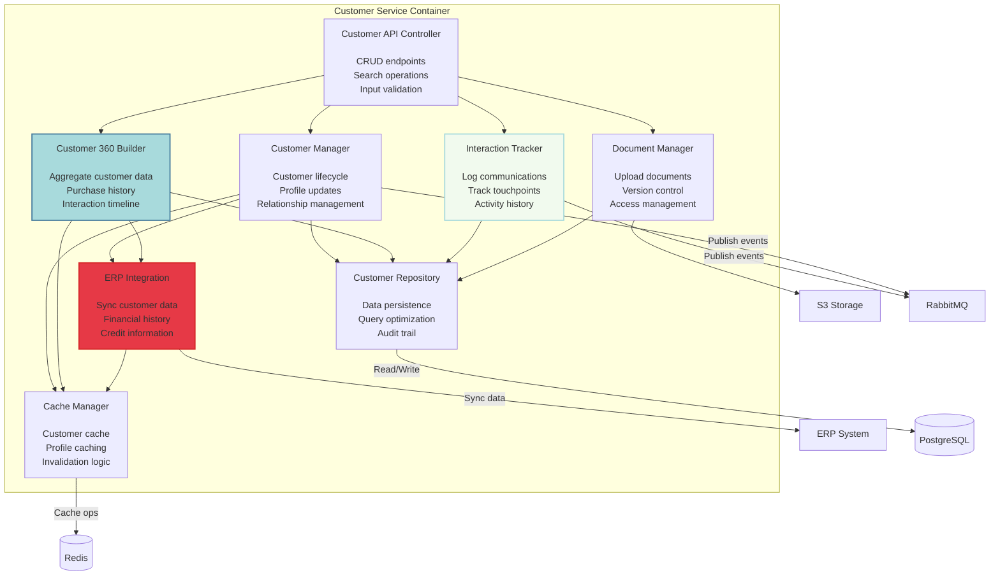
```mermaid
graph TB
    subgraph CustomerService[Customer Service Container]
        direction TB
        
        CustomerAPIController[Customer API Controller<br/><br/>CRUD endpoints<br/>Search operations<br/>Input validation]
        
        CustomerManager[Customer Manager<br/><br/>Customer lifecycle<br/>Profile updates<br/>Relationship management]
        
        Customer360Builder[Customer 360 Builder<br/><br/>Aggregate customer data<br/>Purchase history<br/>Interaction timeline]
        
        InteractionTracker[Interaction Tracker<br/><br/>Log communications<br/>Track touchpoints<br/>Activity history]
        
        DocumentManager[Document Manager<br/><br/>Upload documents<br/>Version control<br/>Access management]
        
        ERPIntegration[ERP Integration<br/><br/>Sync customer data<br/>Financial history<br/>Credit information]
        
        CustomerRepository[Customer Repository<br/><br/>Data persistence<br/>Query optimization<br/>Audit trail]
        
        CacheManager[Cache Manager<br/><br/>Customer cache<br/>Profile caching<br/>Invalidation logic]
    end
    
    ERPSystemAPI[ERP System]
    DatabasePostgres[(PostgreSQL)]
    CacheRedis[(Redis)]
    StorageS3[S3 Storage]
    EventBus[RabbitMQ]
    
    CustomerAPIController --> CustomerManager
    CustomerAPIController --> Customer360Builder
    CustomerAPIController --> InteractionTracker
    CustomerAPIController --> DocumentManager
    
    CustomerManager --> CustomerRepository
    CustomerManager --> CacheManager
    CustomerManager --> ERPIntegration
    
    Customer360Builder --> CustomerRepository
    Customer360Builder --> ERPIntegration
    Customer360Builder --> CacheManager
    
    InteractionTracker --> CustomerRepository
    InteractionTracker -->|Publish events| EventBus
    
    DocumentManager --> StorageS3
    DocumentManager --> CustomerRepository
    
    ERPIntegration -->|Sync data| ERPSystemAPI
    ERPIntegration --> CacheManager
    
    CustomerRepository -->|Read/Write| DatabasePostgres
    CacheManager -->|Cache ops| CacheRedis
    
    CustomerManager -->|Publish events| EventBus
    
    style Customer360Builder fill:#A8DADC,stroke:#457B9D,stroke-width:2px
    style InteractionTracker fill:#F1FAEE,stroke:#A8DADC,stroke-width:2px
    style ERPIntegration fill:#E63946,stroke:#D62828,stroke-width:2px
```

---

## Level 3: Component Diagram - Approval Service

Detailed view of Approval Service internal components.

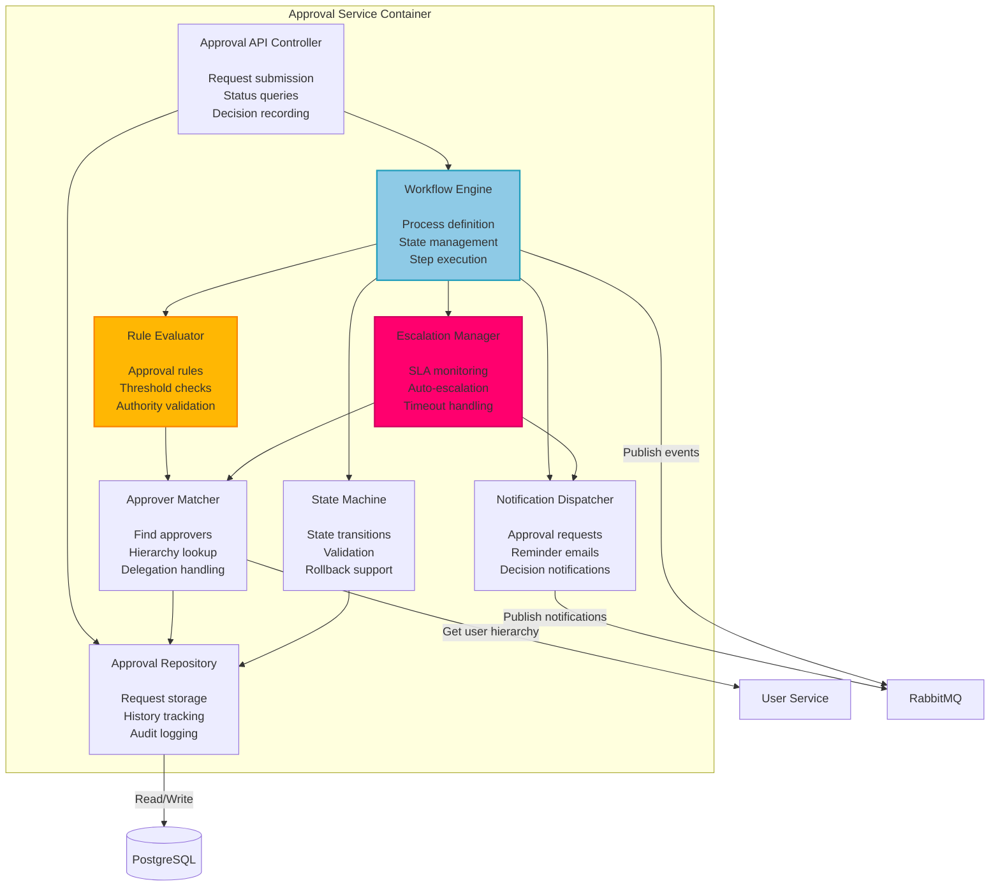
```mermaid
graph TB
    subgraph ApprovalService[Approval Service Container]
        direction TB
        
        ApprovalAPIController[Approval API Controller<br/><br/>Request submission<br/>Status queries<br/>Decision recording]
        
        WorkflowEngine[Workflow Engine<br/><br/>Process definition<br/>State management<br/>Step execution]
        
        RuleEvaluator[Rule Evaluator<br/><br/>Approval rules<br/>Threshold checks<br/>Authority validation]
        
        ApproverMatcher[Approver Matcher<br/><br/>Find approvers<br/>Hierarchy lookup<br/>Delegation handling]
        
        NotificationDispatcher[Notification Dispatcher<br/><br/>Approval requests<br/>Reminder emails<br/>Decision notifications]
        
        EscalationManager[Escalation Manager<br/><br/>SLA monitoring<br/>Auto-escalation<br/>Timeout handling]
        
        ApprovalRepository[Approval Repository<br/><br/>Request storage<br/>History tracking<br/>Audit logging]
        
        StateMachine[State Machine<br/><br/>State transitions<br/>Validation<br/>Rollback support]
    end
    
    UserServiceAPI[User Service]
    DatabasePostgres[(PostgreSQL)]
    EventBus[RabbitMQ]
    
    ApprovalAPIController --> WorkflowEngine
    ApprovalAPIController --> ApprovalRepository
    
    WorkflowEngine --> RuleEvaluator
    WorkflowEngine --> StateMachine
    
    RuleEvaluator --> ApproverMatcher
    
    ApproverMatcher -->|Get user hierarchy| UserServiceAPI
    ApproverMatcher --> ApprovalRepository
    
    WorkflowEngine --> NotificationDispatcher
    WorkflowEngine --> EscalationManager
    
    NotificationDispatcher -->|Publish notifications| EventBus
    
    EscalationManager --> ApproverMatcher
    EscalationManager --> NotificationDispatcher
    
    ApprovalRepository -->|Read/Write| DatabasePostgres
    
    WorkflowEngine -->|Publish events| EventBus
    StateMachine --> ApprovalRepository
    
    style WorkflowEngine fill:#8ECAE6,stroke:#219EBC,stroke-width:2px
    style RuleEvaluator fill:#FFB703,stroke:#FB8500,stroke-width:2px
    style EscalationManager fill:#FF006E,stroke:#D00060,stroke-width:2px
```

---

## Level 3: Component Diagram - Purchase Order Service

Detailed view of Purchase Order Service internal components.

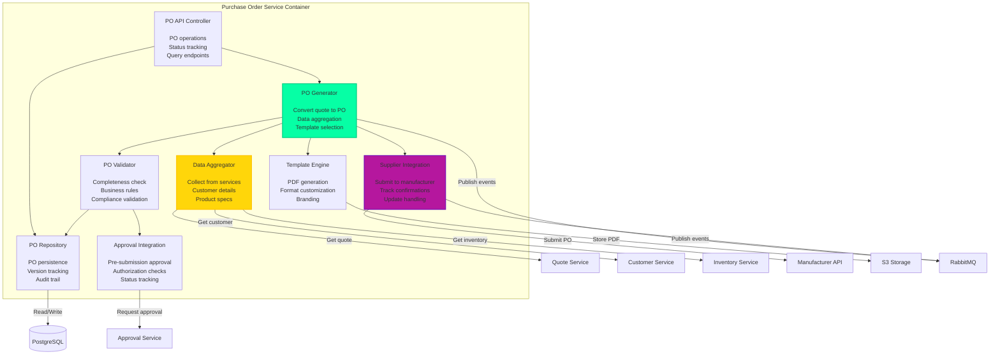
```mermaid
graph TB
    subgraph POService[Purchase Order Service Container]
        direction TB
        
        POAPIController[PO API Controller<br/><br/>PO operations<br/>Status tracking<br/>Query endpoints]
        
        POGenerator[PO Generator<br/><br/>Convert quote to PO<br/>Data aggregation<br/>Template selection]
        
        DataAggregator[Data Aggregator<br/><br/>Collect from services<br/>Customer details<br/>Product specs]
        
        POValidator[PO Validator<br/><br/>Completeness check<br/>Business rules<br/>Compliance validation]
        
        TemplateEngine[Template Engine<br/><br/>PDF generation<br/>Format customization<br/>Branding]
        
        SupplierIntegration[Supplier Integration<br/><br/>Submit to manufacturer<br/>Track confirmations<br/>Update handling]
        
        PORepository[PO Repository<br/><br/>PO persistence<br/>Version tracking<br/>Audit trail]
        
        ApprovalIntegration[Approval Integration<br/><br/>Pre-submission approval<br/>Authorization checks<br/>Status tracking]
    end
    
    QuoteServiceAPI[Quote Service]
    CustomerServiceAPI[Customer Service]
    InventoryServiceAPI[Inventory Service]
    ApprovalServiceAPI[Approval Service]
    ManufacturerAPI[Manufacturer API]
    
    DatabasePostgres[(PostgreSQL)]
    StorageS3[S3 Storage]
    EventBus[RabbitMQ]
    
    POAPIController --> POGenerator
    POAPIController --> PORepository
    
    POGenerator --> DataAggregator
    POGenerator --> POValidator
    
    DataAggregator -->|Get quote| QuoteServiceAPI
    DataAggregator -->|Get customer| CustomerServiceAPI
    DataAggregator -->|Get inventory| InventoryServiceAPI
    
    POValidator --> PORepository
    POValidator --> ApprovalIntegration
    
    ApprovalIntegration -->|Request approval| ApprovalServiceAPI
    
    POGenerator --> TemplateEngine
    TemplateEngine -->|Store PDF| StorageS3
    
    POGenerator --> SupplierIntegration
    SupplierIntegration -->|Submit PO| ManufacturerAPI
    
    PORepository -->|Read/Write| DatabasePostgres
    
    POGenerator -->|Publish events| EventBus
    SupplierIntegration -->|Publish events| EventBus
    
    style POGenerator fill:#06FFA5,stroke:#00CC83,stroke-width:2px
    style DataAggregator fill:#FFD60A,stroke:#FFC300,stroke-width:2px
    style SupplierIntegration fill:#B5179E,stroke:#7209B7,stroke-width:2px
```

---

## Level 3: Component Diagram - Pipeline Service

Detailed view of Pipeline Service internal components.

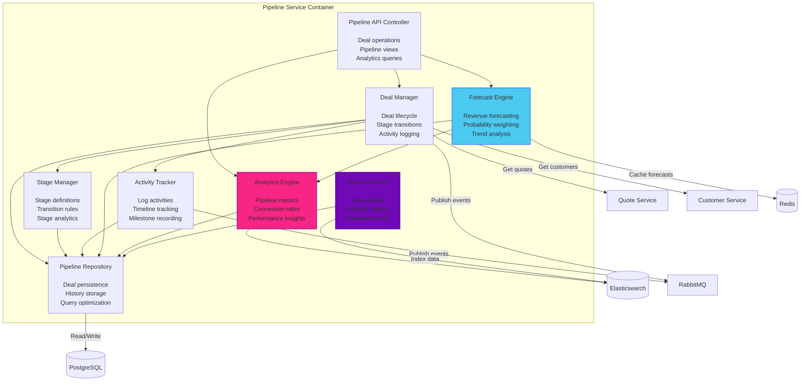
```mermaid
graph TB
    subgraph PipelineService[Pipeline Service Container]
        direction TB
        
        PipelineAPIController[Pipeline API Controller<br/><br/>Deal operations<br/>Pipeline views<br/>Analytics queries]
        
        DealManager[Deal Manager<br/><br/>Deal lifecycle<br/>Stage transitions<br/>Activity logging]
        
        ForecastEngine[Forecast Engine<br/><br/>Revenue forecasting<br/>Probability weighting<br/>Trend analysis]
        
        ActivityTracker[Activity Tracker<br/><br/>Log activities<br/>Timeline tracking<br/>Milestone recording]
        
        StageManager[Stage Manager<br/><br/>Stage definitions<br/>Transition rules<br/>Stage analytics]
        
        AnalyticsEngine[Analytics Engine<br/><br/>Pipeline metrics<br/>Conversion rates<br/>Performance insights]
        
        PipelineRepository[Pipeline Repository<br/><br/>Deal persistence<br/>History storage<br/>Query optimization]
        
        SearchIndexer[Search Indexer<br/><br/>Index deals<br/>Full-text search<br/>Faceted search]
    end
    
    QuoteServiceAPI[Quote Service]
    CustomerServiceAPI[Customer Service]
    
    DatabasePostgres[(PostgreSQL)]
    SearchEngine[(Elasticsearch)]
    CacheRedis[(Redis)]
    EventBus[RabbitMQ]
    
    PipelineAPIController --> DealManager
    PipelineAPIController --> ForecastEngine
    PipelineAPIController --> AnalyticsEngine
    
    DealManager --> StageManager
    DealManager --> ActivityTracker
    DealManager --> PipelineRepository
    
    StageManager --> PipelineRepository
    
    ActivityTracker --> PipelineRepository
    ActivityTracker -->|Publish events| EventBus
    
    ForecastEngine --> PipelineRepository
    ForecastEngine --> AnalyticsEngine
    
    AnalyticsEngine --> PipelineRepository
    AnalyticsEngine --> SearchEngine
    
    DealManager -->|Get quotes| QuoteServiceAPI
    DealManager -->|Get customers| CustomerServiceAPI
    
    PipelineRepository -->|Read/Write| DatabasePostgres
    
    SearchIndexer -->|Index data| SearchEngine
    SearchIndexer --> PipelineRepository
    
    ForecastEngine -->|Cache forecasts| CacheRedis
    
    DealManager -->|Publish events| EventBus
    
    style ForecastEngine fill:#4CC9F0,stroke:#3A86FF,stroke-width:2px
    style AnalyticsEngine fill:#F72585,stroke:#B5179E,stroke-width:2px
    style SearchIndexer fill:#7209B7,stroke:#560BAD,stroke-width:2px
```

---

## Level 3: Component Diagram - Notification Service

Detailed view of Notification Service internal components.

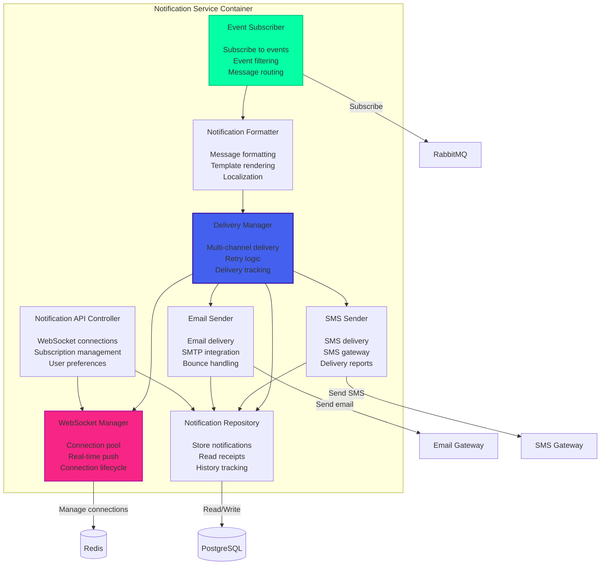
```mermaid
graph TB
    subgraph NotificationService[Notification Service Container]
        direction TB
        
        NotificationAPIController[Notification API Controller<br/><br/>WebSocket connections<br/>Subscription management<br/>User preferences]
        
        EventSubscriber[Event Subscriber<br/><br/>Subscribe to events<br/>Event filtering<br/>Message routing]
        
        NotificationFormatter[Notification Formatter<br/><br/>Message formatting<br/>Template rendering<br/>Localization]
        
        DeliveryManager[Delivery Manager<br/><br/>Multi-channel delivery<br/>Retry logic<br/>Delivery tracking]
        
        WebSocketManager[WebSocket Manager<br/><br/>Connection pool<br/>Real-time push<br/>Connection lifecycle]
        
        EmailSender[Email Sender<br/><br/>Email delivery<br/>SMTP integration<br/>Bounce handling]
        
        SMSSender[SMS Sender<br/><br/>SMS delivery<br/>SMS gateway<br/>Delivery reports]
        
        NotificationRepository[Notification Repository<br/><br/>Store notifications<br/>Read receipts<br/>History tracking]
    end
    
    EventBus[RabbitMQ]
    CacheRedis[(Redis)]
    DatabasePostgres[(PostgreSQL)]
    EmailGateway[Email Gateway]
    SMSGateway[SMS Gateway]
    
    NotificationAPIController --> WebSocketManager
    NotificationAPIController --> NotificationRepository
    
    EventSubscriber -->|Subscribe| EventBus
    EventSubscriber --> NotificationFormatter
    
    NotificationFormatter --> DeliveryManager
    
    DeliveryManager --> WebSocketManager
    DeliveryManager --> EmailSender
    DeliveryManager --> SMSSender
    
    WebSocketManager -->|Manage connections| CacheRedis
    
    EmailSender -->|Send email| EmailGateway
    EmailSender --> NotificationRepository
    
    SMSSender -->|Send SMS| SMSGateway
    SMSSender --> NotificationRepository
    
    NotificationRepository -->|Read/Write| DatabasePostgres
    
    DeliveryManager --> NotificationRepository
    
    style EventSubscriber fill:#06FFA5,stroke:#00CC83,stroke-width:2px
    style DeliveryManager fill:#4361EE,stroke:#3A0CA3,stroke-width:2px
    style WebSocketManager fill:#F72585,stroke:#B5179E,stroke-width:2px
```

---

## Level 3: Component Diagram - Tender Service

Detailed view of Tender Service internal components.

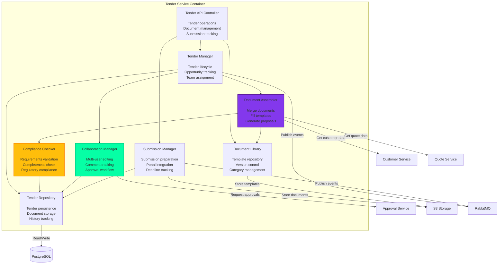
```mermaid
graph TB
    subgraph TenderService[Tender Service Container]
        direction TB
        
        TenderAPIController[Tender API Controller<br/><br/>Tender operations<br/>Document management<br/>Submission tracking]
        
        TenderManager[Tender Manager<br/><br/>Tender lifecycle<br/>Opportunity tracking<br/>Team assignment]
        
        DocumentLibrary[Document Library<br/><br/>Template repository<br/>Version control<br/>Category management]
        
        DocumentAssembler[Document Assembler<br/><br/>Merge documents<br/>Fill templates<br/>Generate proposals]
        
        ComplianceChecker[Compliance Checker<br/><br/>Requirements validation<br/>Completeness check<br/>Regulatory compliance]
        
        CollaborationManager[Collaboration Manager<br/><br/>Multi-user editing<br/>Comment tracking<br/>Approval workflow]
        
        SubmissionManager[Submission Manager<br/><br/>Submission preparation<br/>Portal integration<br/>Deadline tracking]
        
        TenderRepository[Tender Repository<br/><br/>Tender persistence<br/>Document storage<br/>History tracking]
    end
    
    CustomerServiceAPI[Customer Service]
    QuoteServiceAPI[Quote Service]
    ApprovalServiceAPI[Approval Service]
    
    DatabasePostgres[(PostgreSQL)]
    StorageS3[S3 Storage]
    EventBus[RabbitMQ]
    
    TenderAPIController --> TenderManager
    TenderAPIController --> DocumentLibrary
    TenderAPIController --> SubmissionManager
    
    TenderManager --> TenderRepository
    TenderManager --> CollaborationManager
    
    TenderManager --> DocumentAssembler
    DocumentAssembler --> DocumentLibrary
    DocumentAssembler --> ComplianceChecker
    
    DocumentAssembler -->|Get customer data| CustomerServiceAPI
    DocumentAssembler -->|Get quote data| QuoteServiceAPI
    
    ComplianceChecker --> TenderRepository
    
    CollaborationManager --> TenderRepository
    CollaborationManager -->|Request approvals| ApprovalServiceAPI
    
    SubmissionManager --> TenderRepository
    SubmissionManager -->|Store documents| StorageS3
    
    TenderRepository -->|Read/Write| DatabasePostgres
    DocumentLibrary -->|Store templates| StorageS3
    
    TenderManager -->|Publish events| EventBus
    SubmissionManager -->|Publish events| EventBus
    
    style DocumentAssembler fill:#8338EC,stroke:#5A189A,stroke-width:2px
    style ComplianceChecker fill:#FFBE0B,stroke:#FB8500,stroke-width:2px
    style CollaborationManager fill:#06FFA5,stroke:#00CC83,stroke-width:2px
```

---

## Level 4: Code Diagram - Email Classification

Shows key classes and their relationships in the email classification logic.

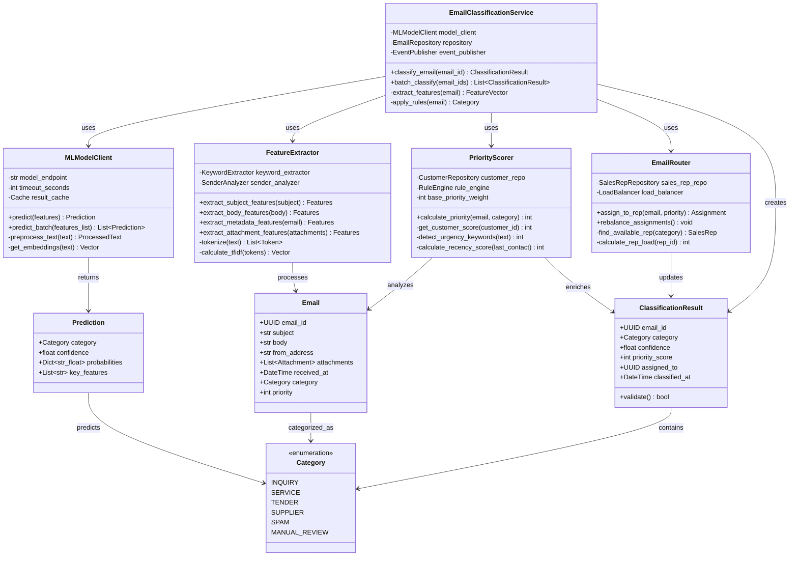
```mermaid
classDiagram
    class EmailClassificationService {
        -MLModelClient model_client
        -EmailRepository repository
        -EventPublisher event_publisher
        +classify_email(email_id) ClassificationResult
        +batch_classify(email_ids) List~ClassificationResult~
        -extract_features(email) FeatureVector
        -apply_rules(email) Category
    }
    
    class MLModelClient {
        -str model_endpoint
        -int timeout_seconds
        -Cache result_cache
        +predict(features) Prediction
        +predict_batch(features_list) List~Prediction~
        -preprocess_text(text) ProcessedText
        -get_embeddings(text) Vector
    }
    
    class FeatureExtractor {
        -KeywordExtractor keyword_extractor
        -SenderAnalyzer sender_analyzer
        +extract_subject_features(subject) Features
        +extract_body_features(body) Features
        +extract_metadata_features(email) Features
        +extract_attachment_features(attachments) Features
        -tokenize(text) List~Token~
        -calculate_tfidf(tokens) Vector
    }
    
    class PriorityScorer {
        -CustomerRepository customer_repo
        -RuleEngine rule_engine
        -int base_priority_weight
        +calculate_priority(email, category) int
        -get_customer_score(customer_id) int
        -detect_urgency_keywords(text) int
        -calculate_recency_score(last_contact) int
    }
    
    class EmailRouter {
        -SalesRepRepository sales_rep_repo
        -LoadBalancer load_balancer
        +assign_to_rep(email, priority) Assignment
        +rebalance_assignments() void
        -find_available_rep(category) SalesRep
        -calculate_rep_load(rep_id) int
    }
    
    class ClassificationResult {
        +UUID email_id
        +Category category
        +float confidence
        +int priority_score
        +UUID assigned_to
        +DateTime classified_at
        +validate() bool
    }
    
    class Email {
        +UUID email_id
        +str subject
        +str body
        +str from_address
        +List~Attachment~ attachments
        +DateTime received_at
        +Category category
        +int priority
    }
    
    class Category {
        <<enumeration>>
        INQUIRY
        SERVICE
        TENDER
        SUPPLIER
        SPAM
        MANUAL_REVIEW
    }
    
    class Prediction {
        +Category category
        +float confidence
        +Dict~str_float~ probabilities
        +List~str~ key_features
    }
    
    EmailClassificationService --> MLModelClient : uses
    EmailClassificationService --> FeatureExtractor : uses
    EmailClassificationService --> PriorityScorer : uses
    EmailClassificationService --> EmailRouter : uses
    EmailClassificationService --> ClassificationResult : creates
    
    MLModelClient --> Prediction : returns
    FeatureExtractor --> Email : processes
    PriorityScorer --> Email : analyzes
    PriorityScorer --> ClassificationResult : enriches
    EmailRouter --> ClassificationResult : updates
    
    ClassificationResult --> Category : contains
    Email --> Category : categorized_as
    Prediction --> Category : predicts
```

---

## Level 4: Code Diagram - Quote Calculation

Shows key classes involved in quote price calculation.

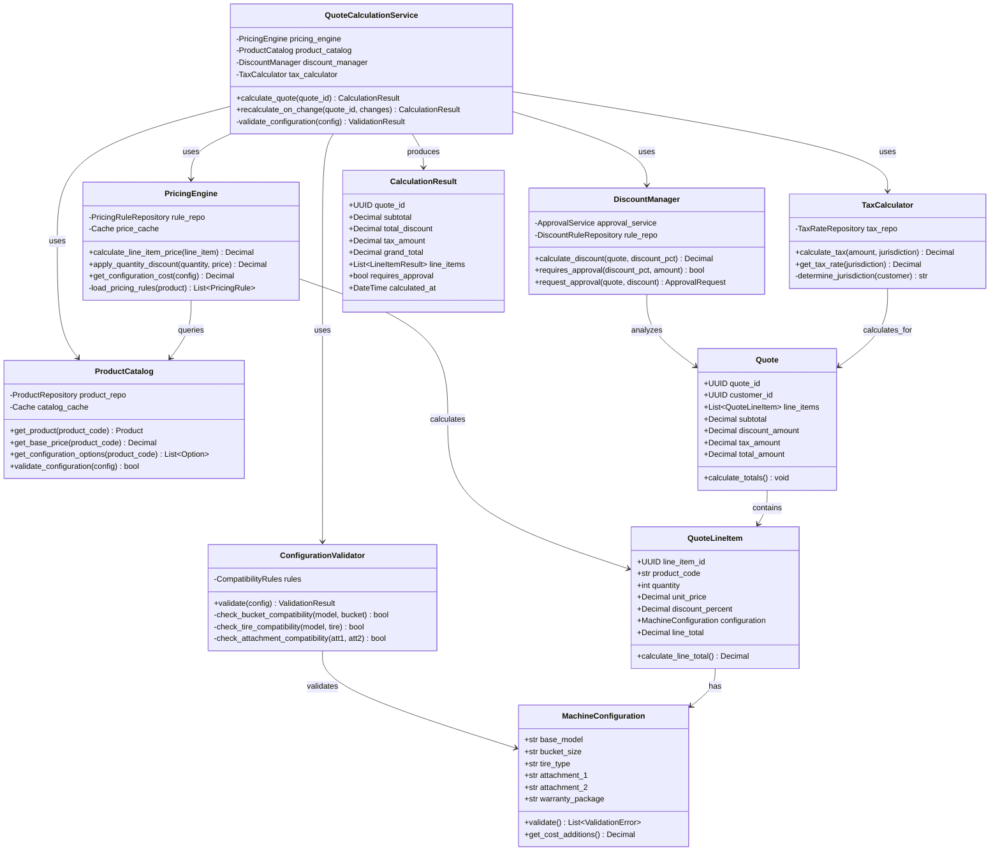
```mermaid
classDiagram
    class QuoteCalculationService {
        -PricingEngine pricing_engine
        -ProductCatalog product_catalog
        -DiscountManager discount_manager
        -TaxCalculator tax_calculator
        +calculate_quote(quote_id) CalculationResult
        +recalculate_on_change(quote_id, changes) CalculationResult
        -validate_configuration(config) ValidationResult
    }
    
    class PricingEngine {
        -PricingRuleRepository rule_repo
        -Cache price_cache
        +calculate_line_item_price(line_item) Decimal
        +apply_quantity_discount(quantity, price) Decimal
        +get_configuration_cost(config) Decimal
        -load_pricing_rules(product) List~PricingRule~
    }
    
    class ProductCatalog {
        -ProductRepository product_repo
        -Cache catalog_cache
        +get_product(product_code) Product
        +get_base_price(product_code) Decimal
        +get_configuration_options(product_code) List~Option~
        +validate_configuration(config) bool
    }
    
    class MachineConfiguration {
        +str base_model
        +str bucket_size
        +str tire_type
        +str attachment_1
        +str attachment_2
        +str warranty_package
        +validate() List~ValidationError~
        +get_cost_additions() Decimal
    }
    
    class ConfigurationValidator {
        -CompatibilityRules rules
        +validate(config) ValidationResult
        -check_bucket_compatibility(model, bucket) bool
        -check_tire_compatibility(model, tire) bool
        -check_attachment_compatibility(att1, att2) bool
    }
    
    class DiscountManager {
        -ApprovalService approval_service
        -DiscountRuleRepository rule_repo
        +calculate_discount(quote, discount_pct) Decimal
        +requires_approval(discount_pct, amount) bool
        +request_approval(quote, discount) ApprovalRequest
    }
    
    class TaxCalculator {
        -TaxRateRepository tax_repo
        +calculate_tax(amount, jurisdiction) Decimal
        +get_tax_rate(jurisdiction) Decimal
        -determine_jurisdiction(customer) str
    }
    
    class Quote {
        +UUID quote_id
        +UUID customer_id
        +List~QuoteLineItem~ line_items
        +Decimal subtotal
        +Decimal discount_amount
        +Decimal tax_amount
        +Decimal total_amount
        +calculate_totals() void
    }
    
    class QuoteLineItem {
        +UUID line_item_id
        +str product_code
        +int quantity
        +Decimal unit_price
        +Decimal discount_percent
        +MachineConfiguration configuration
        +Decimal line_total
        +calculate_line_total() Decimal
    }
    
    class CalculationResult {
        +UUID quote_id
        +Decimal subtotal
        +Decimal total_discount
        +Decimal tax_amount
        +Decimal grand_total
        +List~LineItemResult~ line_items
        +bool requires_approval
        +DateTime calculated_at
    }
    
    QuoteCalculationService --> PricingEngine : uses
    QuoteCalculationService --> ProductCatalog : uses
    QuoteCalculationService --> DiscountManager : uses
    QuoteCalculationService --> TaxCalculator : uses
    QuoteCalculationService --> ConfigurationValidator : uses
    
    PricingEngine --> ProductCatalog : queries
    PricingEngine --> QuoteLineItem : calculates
    
    ConfigurationValidator --> MachineConfiguration : validates
    
    QuoteCalculationService --> CalculationResult : produces
    Quote --> QuoteLineItem : contains
    QuoteLineItem --> MachineConfiguration : has
    
    DiscountManager --> Quote : analyzes
    TaxCalculator --> Quote : calculates_for
```

---

## Level 4: Code Diagram - Inventory Reservation

Shows key classes involved in inventory reservation and locking mechanism.

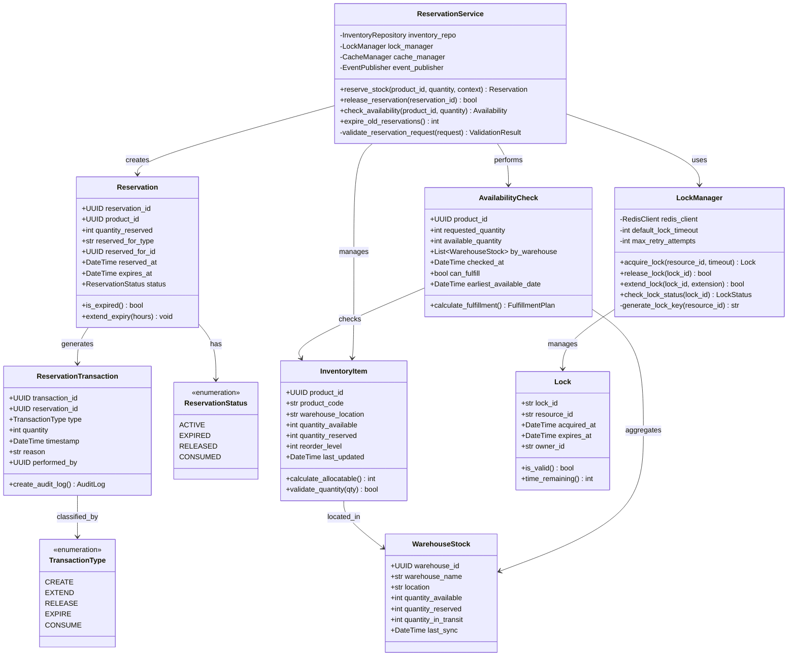
```mermaid
classDiagram
    class ReservationService {
        -InventoryRepository inventory_repo
        -LockManager lock_manager
        -CacheManager cache_manager
        -EventPublisher event_publisher
        +reserve_stock(product_id, quantity, context) Reservation
        +release_reservation(reservation_id) bool
        +check_availability(product_id, quantity) Availability
        +expire_old_reservations() int
        -validate_reservation_request(request) ValidationResult
    }
    
    class LockManager {
        -RedisClient redis_client
        -int default_lock_timeout
        -int max_retry_attempts
        +acquire_lock(resource_id, timeout) Lock
        +release_lock(lock_id) bool
        +extend_lock(lock_id, extension) bool
        +check_lock_status(lock_id) LockStatus
        -generate_lock_key(resource_id) str
    }
    
    class InventoryItem {
        +UUID product_id
        +str product_code
        +str warehouse_location
        +int quantity_available
        +int quantity_reserved
        +int reorder_level
        +DateTime last_updated
        +calculate_allocatable() int
        +validate_quantity(qty) bool
    }
    
    class Reservation {
        +UUID reservation_id
        +UUID product_id
        +int quantity_reserved
        +str reserved_for_type
        +UUID reserved_for_id
        +DateTime reserved_at
        +DateTime expires_at
        +ReservationStatus status
        +is_expired() bool
        +extend_expiry(hours) void
    }
    
    class ReservationStatus {
        <<enumeration>>
        ACTIVE
        EXPIRED
        RELEASED
        CONSUMED
    }
    
    class AvailabilityCheck {
        +UUID product_id
        +int requested_quantity
        +int available_quantity
        +List~WarehouseStock~ by_warehouse
        +DateTime checked_at
        +bool can_fulfill
        +DateTime earliest_available_date
        +calculate_fulfillment() FulfillmentPlan
    }
    
    class WarehouseStock {
        +UUID warehouse_id
        +str warehouse_name
        +str location
        +int quantity_available
        +int quantity_reserved
        +int quantity_in_transit
        +DateTime last_sync
    }
    
    class ReservationTransaction {
        +UUID transaction_id
        +UUID reservation_id
        +TransactionType type
        +int quantity
        +DateTime timestamp
        +str reason
        +UUID performed_by
        +create_audit_log() AuditLog
    }
    
    class TransactionType {
        <<enumeration>>
        CREATE
        EXTEND
        RELEASE
        EXPIRE
        CONSUME
    }
    
    class Lock {
        +str lock_id
        +str resource_id
        +DateTime acquired_at
        +DateTime expires_at
        +str owner_id
        +is_valid() bool
        +time_remaining() int
    }
    
    ReservationService --> InventoryItem : manages
    ReservationService --> Reservation : creates
    ReservationService --> LockManager : uses
    ReservationService --> AvailabilityCheck : performs
    
    LockManager --> Lock : manages
    
    Reservation --> ReservationStatus : has
    Reservation --> ReservationTransaction : generates
    
    ReservationTransaction --> TransactionType : classified_by
    
    AvailabilityCheck --> WarehouseStock : aggregates
    AvailabilityCheck --> InventoryItem : checks
    
    InventoryItem --> WarehouseStock : located_in
```

---

## Level 4: Code Diagram - Approval Workflow

Shows the state machine and classes for the approval workflow engine.

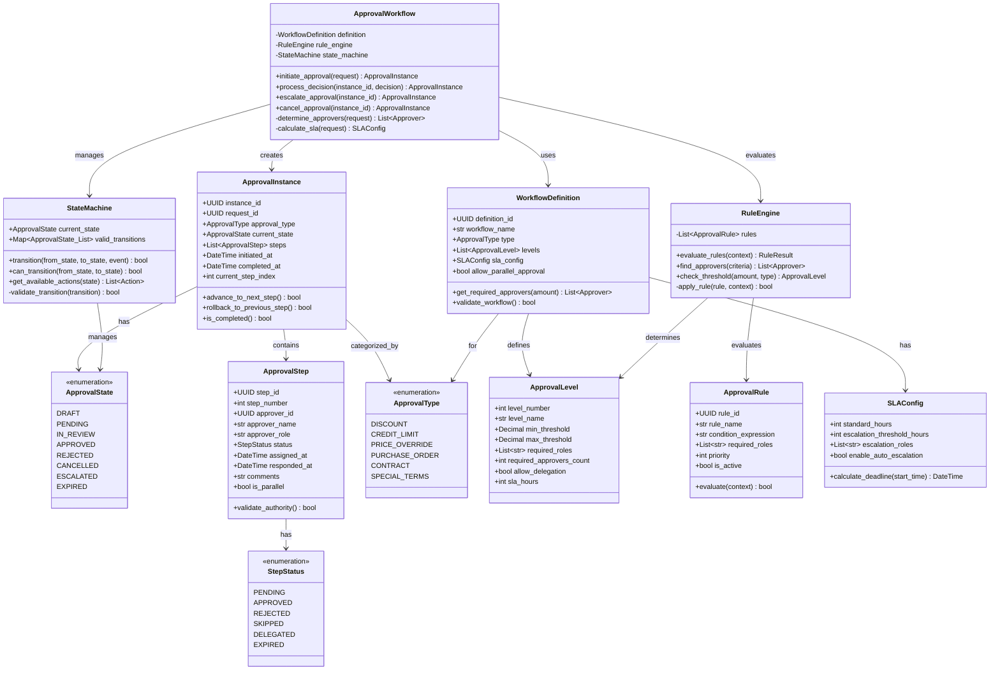
```mermaid
classDiagram
    class ApprovalWorkflow {
        -WorkflowDefinition definition
        -RuleEngine rule_engine
        -StateMachine state_machine
        +initiate_approval(request) ApprovalInstance
        +process_decision(instance_id, decision) ApprovalInstance
        +escalate_approval(instance_id) ApprovalInstance
        +cancel_approval(instance_id) ApprovalInstance
        -determine_approvers(request) List~Approver~
        -calculate_sla(request) SLAConfig
    }
    
    class ApprovalInstance {
        +UUID instance_id
        +UUID request_id
        +ApprovalType approval_type
        +ApprovalState current_state
        +List~ApprovalStep~ steps
        +DateTime initiated_at
        +DateTime completed_at
        +int current_step_index
        +advance_to_next_step() bool
        +rollback_to_previous_step() bool
        +is_completed() bool
    }
    
    class ApprovalState {
        <<enumeration>>
        DRAFT
        PENDING
        IN_REVIEW
        APPROVED
        REJECTED
        CANCELLED
        ESCALATED
        EXPIRED
    }
    
    class ApprovalStep {
        +UUID step_id
        +int step_number
        +UUID approver_id
        +str approver_name
        +str approver_role
        +StepStatus status
        +DateTime assigned_at
        +DateTime responded_at
        +str comments
        +bool is_parallel
        +validate_authority() bool
    }
    
    class StepStatus {
        <<enumeration>>
        PENDING
        APPROVED
        REJECTED
        SKIPPED
        DELEGATED
        EXPIRED
    }
    
    class ApprovalType {
        <<enumeration>>
        DISCOUNT
        CREDIT_LIMIT
        PRICE_OVERRIDE
        PURCHASE_ORDER
        CONTRACT
        SPECIAL_TERMS
    }
    
    class WorkflowDefinition {
        +UUID definition_id
        +str workflow_name
        +ApprovalType type
        +List~ApprovalLevel~ levels
        +SLAConfig sla_config
        +bool allow_parallel_approval
        +get_required_approvers(amount) List~Approver~
        +validate_workflow() bool
    }
    
    class ApprovalLevel {
        +int level_number
        +str level_name
        +Decimal min_threshold
        +Decimal max_threshold
        +List~str~ required_roles
        +int required_approvers_count
        +bool allow_delegation
        +int sla_hours
    }
    
    class StateMachine {
        +ApprovalState current_state
        +Map~ApprovalState_List~ valid_transitions
        +transition(from_state, to_state, event) bool
        +can_transition(from_state, to_state) bool
        +get_available_actions(state) List~Action~
        -validate_transition(transition) bool
    }
    
    class RuleEngine {
        -List~ApprovalRule~ rules
        +evaluate_rules(context) RuleResult
        +find_approvers(criteria) List~Approver~
        +check_threshold(amount, type) ApprovalLevel
        -apply_rule(rule, context) bool
    }
    
    class ApprovalRule {
        +UUID rule_id
        +str rule_name
        +str condition_expression
        +List~str~ required_roles
        +int priority
        +bool is_active
        +evaluate(context) bool
    }
    
    class SLAConfig {
        +int standard_hours
        +int escalation_threshold_hours
        +List~str~ escalation_roles
        +bool enable_auto_escalation
        +calculate_deadline(start_time) DateTime
    }
    
    ApprovalWorkflow --> WorkflowDefinition : uses
    ApprovalWorkflow --> StateMachine : manages
    ApprovalWorkflow --> RuleEngine : evaluates
    ApprovalWorkflow --> ApprovalInstance : creates
    
    ApprovalInstance --> ApprovalState : has
    ApprovalInstance --> ApprovalStep : contains
    ApprovalInstance --> ApprovalType : categorized_by
    
    ApprovalStep --> StepStatus : has
    
    WorkflowDefinition --> ApprovalLevel : defines
    WorkflowDefinition --> SLAConfig : has
    WorkflowDefinition --> ApprovalType : for
    
    StateMachine --> ApprovalState : manages
    
    RuleEngine --> ApprovalRule : evaluates
    RuleEngine --> ApprovalLevel : determines
```

---

## Level 4: Code Diagram - Pipeline Forecasting

Shows classes involved in sales pipeline forecasting and analytics.

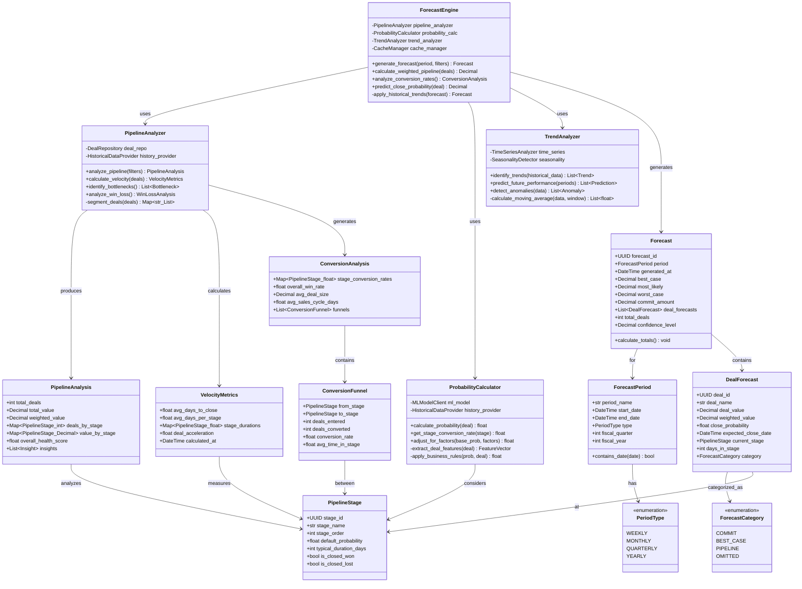
```mermaid
classDiagram
    class ForecastEngine {
        -PipelineAnalyzer pipeline_analyzer
        -ProbabilityCalculator probability_calc
        -TrendAnalyzer trend_analyzer
        -CacheManager cache_manager
        +generate_forecast(period, filters) Forecast
        +calculate_weighted_pipeline(deals) Decimal
        +analyze_conversion_rates() ConversionAnalysis
        +predict_close_probability(deal) Decimal
        -apply_historical_trends(forecast) Forecast
    }
    
    class Forecast {
        +UUID forecast_id
        +ForecastPeriod period
        +DateTime generated_at
        +Decimal best_case
        +Decimal most_likely
        +Decimal worst_case
        +Decimal commit_amount
        +List~DealForecast~ deal_forecasts
        +int total_deals
        +Decimal confidence_level
        +calculate_totals() void
    }
    
    class ForecastPeriod {
        +str period_name
        +DateTime start_date
        +DateTime end_date
        +PeriodType type
        +int fiscal_quarter
        +int fiscal_year
        +contains_date(date) bool
    }
    
    class PeriodType {
        <<enumeration>>
        WEEKLY
        MONTHLY
        QUARTERLY
        YEARLY
    }
    
    class DealForecast {
        +UUID deal_id
        +str deal_name
        +Decimal deal_value
        +Decimal weighted_value
        +float close_probability
        +DateTime expected_close_date
        +PipelineStage current_stage
        +int days_in_stage
        +ForecastCategory category
    }
    
    class ForecastCategory {
        <<enumeration>>
        COMMIT
        BEST_CASE
        PIPELINE
        OMITTED
    }
    
    class PipelineAnalyzer {
        -DealRepository deal_repo
        -HistoricalDataProvider history_provider
        +analyze_pipeline(filters) PipelineAnalysis
        +calculate_velocity(deals) VelocityMetrics
        +identify_bottlenecks() List~Bottleneck~
        +analyze_win_loss() WinLossAnalysis
        -segment_deals(deals) Map~str_List~
    }
    
    class PipelineAnalysis {
        +int total_deals
        +Decimal total_value
        +Decimal weighted_value
        +Map~PipelineStage_int~ deals_by_stage
        +Map~PipelineStage_Decimal~ value_by_stage
        +float overall_health_score
        +List~Insight~ insights
    }
    
    class ProbabilityCalculator {
        -MLModelClient ml_model
        -HistoricalDataProvider history_provider
        +calculate_probability(deal) float
        +get_stage_conversion_rate(stage) float
        +adjust_for_factors(base_prob, factors) float
        -extract_deal_features(deal) FeatureVector
        -apply_business_rules(prob, deal) float
    }
    
    class VelocityMetrics {
        +float avg_days_to_close
        +float avg_days_per_stage
        +Map~PipelineStage_float~ stage_durations
        +float deal_acceleration
        +DateTime calculated_at
    }
    
    class PipelineStage {
        +UUID stage_id
        +str stage_name
        +int stage_order
        +float default_probability
        +int typical_duration_days
        +bool is_closed_won
        +bool is_closed_lost
    }
    
    class TrendAnalyzer {
        -TimeSeriesAnalyzer time_series
        -SeasonalityDetector seasonality
        +identify_trends(historical_data) List~Trend~
        +predict_future_performance(periods) List~Prediction~
        +detect_anomalies(data) List~Anomaly~
        -calculate_moving_average(data, window) List~float~
    }
    
    class ConversionAnalysis {
        +Map~PipelineStage_float~ stage_conversion_rates
        +float overall_win_rate
        +Decimal avg_deal_size
        +float avg_sales_cycle_days
        +List~ConversionFunnel~ funnels
    }
    
    class ConversionFunnel {
        +PipelineStage from_stage
        +PipelineStage to_stage
        +int deals_entered
        +int deals_converted
        +float conversion_rate
        +float avg_time_in_stage
    }
    
    ForecastEngine --> PipelineAnalyzer : uses
    ForecastEngine --> ProbabilityCalculator : uses
    ForecastEngine --> TrendAnalyzer : uses
    ForecastEngine --> Forecast : generates
    
    Forecast --> ForecastPeriod : for
    Forecast --> DealForecast : contains
    
    DealForecast --> ForecastCategory : categorized_as
    DealForecast --> PipelineStage : at
    
    ForecastPeriod --> PeriodType : has
    
    PipelineAnalyzer --> PipelineAnalysis : produces
    PipelineAnalyzer --> VelocityMetrics : calculates
    PipelineAnalyzer --> ConversionAnalysis : generates
    
    PipelineAnalysis --> PipelineStage : analyzes
    
    ProbabilityCalculator --> PipelineStage : considers
    
    VelocityMetrics --> PipelineStage : measures
    
    ConversionAnalysis --> ConversionFunnel : contains
    ConversionFunnel --> PipelineStage : between
```

---

## Deployment Diagram

Shows how the system is deployed in cloud infrastructure.

```mermaid
graph TB
    subgraph CloudProvider[Cloud Provider - AWS/Azure]
        subgraph LoadBalancing[Load Balancing Layer]
            ALB[Application Load Balancer<br/>HTTPS Termination<br/>SSL Certificates]
        end
        
        subgraph ComputeLayer[Compute Layer - Kubernetes Cluster]
            subgraph FrontendPods[Frontend Pods]
                WebPod1[Web App Pod 1]
                WebPod2[Web App Pod 2]
            end
            
            subgraph ServicePods[Microservice Pods]
                EmailPod1[Email Service Pod]
                EmailPod2[Email Service Pod]
                CustomerPod[Customer Service Pod]
                QuotePod[Quote Service Pod]
                InventoryPod[Inventory Service Pod]
                ApprovalPod[Approval Service Pod]
                POPod[PO Service Pod]
                PipelinePod[Pipeline Service Pod]
                NotificationPod[Notification Service Pod]
            end
            
            GatewayPod[API Gateway Pod]
        end
        
        subgraph DataLayer[Data Layer - Managed Services]
            RDSPostgres[RDS PostgreSQL<br/>Multi-AZ<br/>Automated Backups]
            
            DocumentDB[DocumentDB<br/>MongoDB Compatible<br/>3-node cluster]
            
            ElastiCache[ElastiCache Redis<br/>Cluster Mode<br/>5 Shards]
            
            OpenSearch[OpenSearch<br/>Elasticsearch Compatible<br/>3-node cluster]
        end
        
        subgraph StorageLayer[Storage Layer]
            S3Bucket[S3 Bucket<br/>Documents & PDFs<br/>Lifecycle Policies<br/>Versioning Enabled]
        end
        
        subgraph MessagingLayer[Messaging Layer]
            AmazonMQ[Amazon MQ<br/>RabbitMQ<br/>Active/Standby]
        end
        
        subgraph MonitoringLayer[Monitoring & Logging]
            CloudWatch[CloudWatch<br/>Metrics & Logs]
            Prometheus[Prometheus<br/>Metrics Collection]
            Grafana[Grafana<br/>Dashboards]
            Jaeger[Jaeger<br/>Distributed Tracing]
        end
    end
    
    Internet[Internet Users]
    
    Internet -->|HTTPS| ALB
    ALB --> GatewayPod
    
    GatewayPod --> WebPod1
    GatewayPod --> WebPod2
    
    GatewayPod --> EmailPod1
    GatewayPod --> EmailPod2
    GatewayPod --> CustomerPod
    GatewayPod --> QuotePod
    GatewayPod --> InventoryPod
    GatewayPod --> ApprovalPod
    GatewayPod --> POPod
    GatewayPod --> PipelinePod
    GatewayPod --> NotificationPod
    
    EmailPod1 --> RDSPostgres
    EmailPod2 --> RDSPostgres
    EmailPod1 --> DocumentDB
    EmailPod2 --> DocumentDB
    
    CustomerPod --> RDSPostgres
    CustomerPod --> ElastiCache
    
    QuotePod --> RDSPostgres
    QuotePod --> ElastiCache
    QuotePod --> S3Bucket
    
    InventoryPod --> RDSPostgres
    InventoryPod --> ElastiCache
    
    ApprovalPod --> RDSPostgres
    POPod --> RDSPostgres
    POPod --> S3Bucket
    
    PipelinePod --> RDSPostgres
    PipelinePod --> OpenSearch
    
    NotificationPod --> ElastiCache
    
    EmailPod1 --> AmazonMQ
    EmailPod2 --> AmazonMQ
    QuotePod --> AmazonMQ
    ApprovalPod --> AmazonMQ
    NotificationPod --> AmazonMQ
    
    ServicePods --> CloudWatch
    ServicePods --> Prometheus
    Prometheus --> Grafana
    ServicePods --> Jaeger
    
    style ALB fill:#FF9800,stroke:#F57C00,stroke-width:3px
    style GatewayPod fill:#FF6B6B,stroke:#C92A2A,stroke-width:2px
    style RDSPostgres fill:#4CAF50,stroke:#388E3C,stroke-width:2px
    style DocumentDB fill:#4CAF50,stroke:#388E3C,stroke-width:2px
    style ElastiCache fill:#E91E63,stroke:#C2185B,stroke-width:2px
```

---

---

## 📈 Diagram Statistics

| C4 Level | Diagram Count | Purpose |
|----------|---------------|---------|
| Level 1 - System Context | 1 | Shows the system boundary and external interactions |
| Level 2 - Container | 1 | Shows technology choices and deployment units |
| Level 3 - Component | 9 | Shows internal structure of each microservice |
| Level 4 - Code | 5 | Shows key classes and design patterns |
| Deployment | 1 | Shows cloud infrastructure and deployment architecture |
| **Total** | **16** | **Complete architecture visualization** |

### Coverage by Service

All 9 microservices now have complete component diagrams:
✅ Email Service
✅ Customer Service  
✅ Quote Service
✅ Inventory Service
✅ Approval Service
✅ Purchase Order Service
✅ Pipeline Service
✅ Notification Service
✅ Tender Service

---

**Document Control:**
- Version: 2.0
- Last Updated: 2025-11-24
- Diagram Format: Mermaid.js
- Tool Compatibility: GitHub, VS Code, Mermaid Live Editor
- Status: Complete - All microservices documented
- Total Diagrams: 16 comprehensive C4 diagrams
