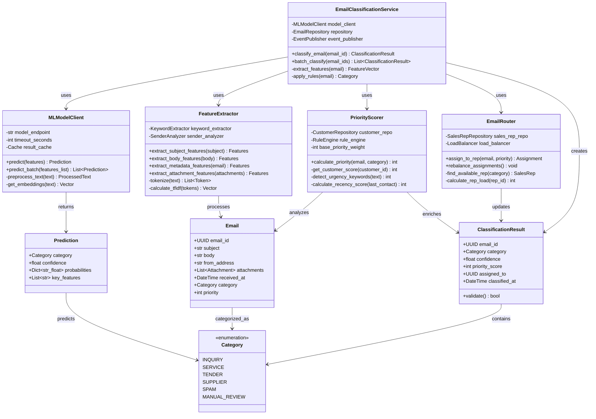

# C4 Architecture Diagrams
## Heavy Machinery Dealer Management System

This document contains C4 model diagrams (Context, Container, Component, and Code) in Mermaid format to visualize the system architecture at different levels of abstraction.

---

## Level 1: System Context Diagram

Shows the system in its environment with external actors and systems.

---

## Level 2: Container Diagram

Shows the high-level technology choices and how containers communicate.

---

## Level 3: Component Diagram - Email Service

Detailed view of Email Service internal components.

---

## Level 3: Component Diagram - Quote Service

Detailed view of Quote Service internal components.

---

## Level 3: Component Diagram - Inventory Service

Detailed view of Inventory Service internal components.

---

## Level 4: Code Diagram - Email Classification

Shows key classes and their relationships in the email classification logic.

---

## Level 4: Code Diagram - Quote Calculation

Shows key classes involved in quote price calculation.

---

## Deployment Diagram

Shows how the system is deployed in cloud infrastructure.

---

**Document Control:**
- Version: 1.0
- Last Updated: 2025-11-24
- Diagram Format: Mermaid
- Tool Compatibility: GitHub, VS Code, Mermaid Live Editor
