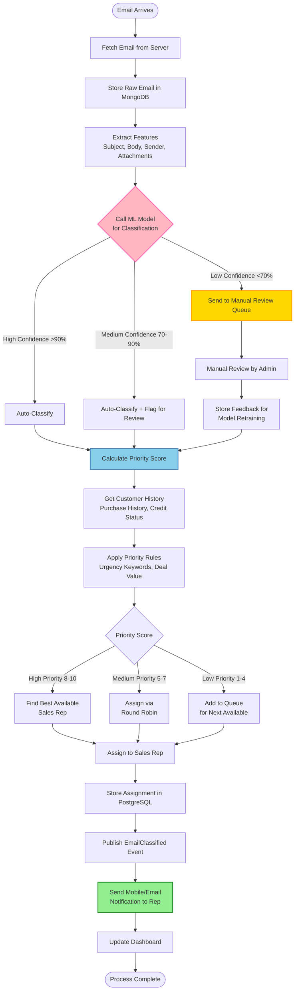
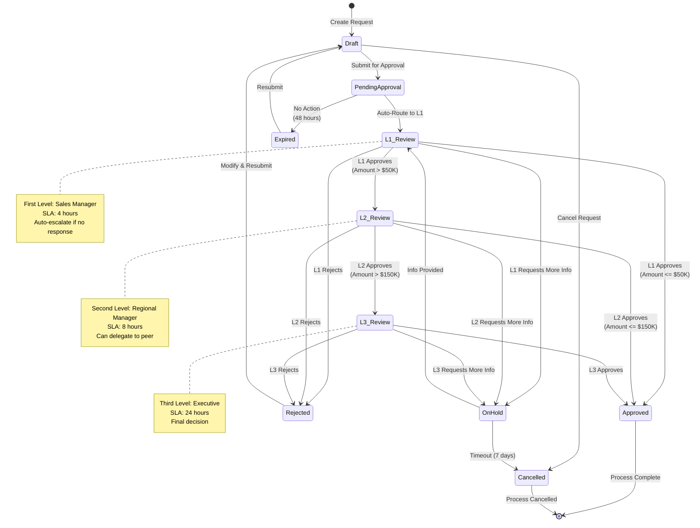
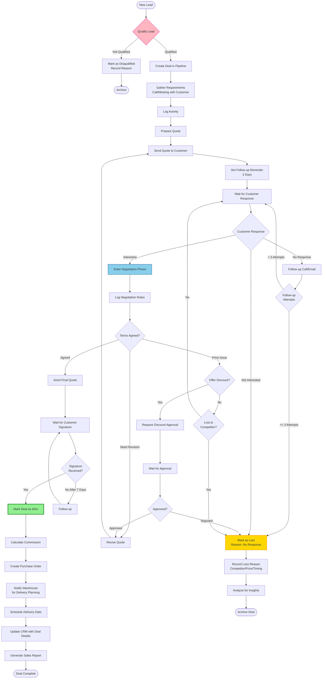
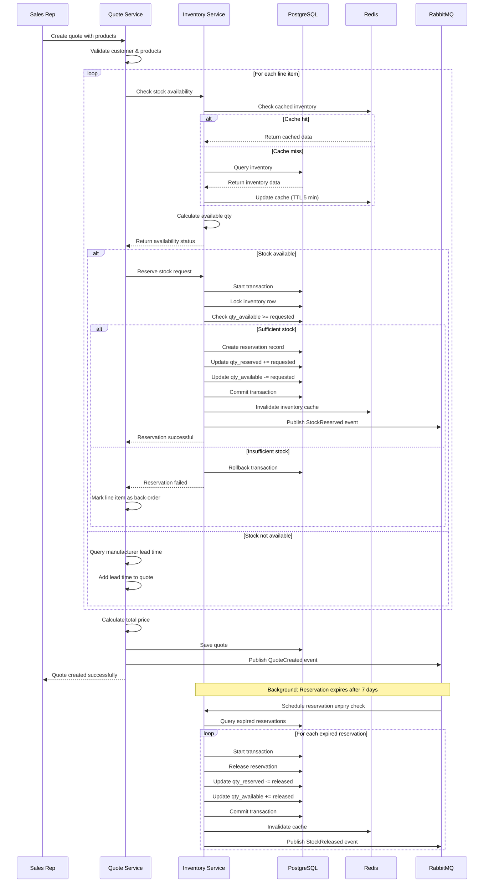
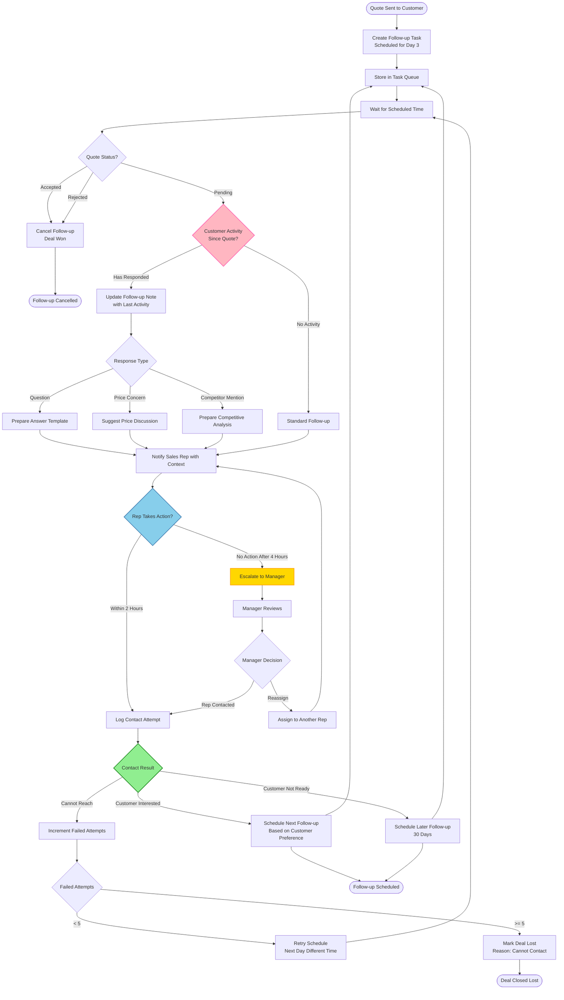

# Workflow and Process Diagrams
## Heavy Machinery Dealer Management System

This document contains workflow diagrams, sequence diagrams, and process flows that illustrate key business operations in the system.

---

## 1. Email Processing Workflow

Shows the end-to-end flow of processing an incoming customer email.

---

## 2. Quote Generation Workflow

Shows the complete process of creating and sending a quote to a customer.

```mermaid
flowchart TD
    Start([Sales Rep Initiates Quote]) --> SelectCustomer[Select Customer]
    SelectCustomer --> FetchCustomer360[Fetch Customer 360 View<br/>Address, Tax Info, History]
    
    FetchCustomer360 --> AddProducts[Add Machine Models<br/>to Quote]
    AddProducts --> ConfigureMachine[Configure Each Machine<br/>Bucket Size, Tires, Attachments]
    
    ConfigureMachine --> ValidateConfig{Validate Configuration}
    
    ValidateConfig -->|Invalid| ShowErrors[Display Validation Errors]
    ShowErrors --> ConfigureMachine
    
    ValidateConfig -->|Valid| CalculatePrice[Calculate Price<br/>Base + Configuration Cost]
    
    CalculatePrice --> ApplyDiscount{Apply Discount?}
    
    ApplyDiscount -->|No Discount| CalculateTax[Calculate Tax]
    ApplyDiscount -->|Small Discount <10%| CalculateTax
    
    ApplyDiscount -->|Large Discount >=10%| CheckApproval{Requires Approval?}
    
    CheckApproval -->|Yes| RequestApproval[Request Discount Approval]
    RequestApproval --> WaitApproval[Wait for Manager Approval]
    
    WaitApproval --> ApprovalDecision{Approved?}
    ApprovalDecision -->|Rejected| NotifyRejection[Notify Sales Rep<br/>Rejection Reason]
    NotifyRejection --> ApplyDiscount
    
    ApprovalDecision -->|Approved| CalculateTax
    CheckApproval -->|No| CalculateTax
    
    CalculateTax --> CheckStock{Check Inventory<br/>Availability}
    
    CheckStock -->|In Stock| ReserveStock[Reserve Stock<br/>for 7 Days]
    CheckStock -->|Out of Stock| EstimateDelivery[Estimate Delivery Date<br/>from Manufacturer]
    
    ReserveStock --> GeneratePDF[Generate Quote PDF<br/>Apply Template]
    EstimateDelivery --> GeneratePDF
    
    GeneratePDF --> SaveQuote[Save Quote to Database]
    SaveQuote --> UploadS3[Upload PDF to S3]
    
    UploadS3 --> SendOptions{Send to Customer?}
    
    SendOptions -->|Send Now| ComposeEmail[Compose Email Message]
    SendOptions -->|Send Later| ScheduleSend[Schedule for Later]
    SendOptions -->|Manual Send| SaveDraft[Save as Draft]
    
    ComposeEmail --> SendEmail[Send Email via<br/>Email Service]
    SendEmail --> LogActivity[Log Activity in<br/>Customer History]
    
    ScheduleSend --> LogActivity
    SaveDraft --> LogActivity
    
    LogActivity --> CreateDeal[Create/Update Deal<br/>in Pipeline]
    CreateDeal --> PublishEvent[Publish QuoteCreated Event]
    
    PublishEvent --> SetFollowUp[Set Follow-up Reminder<br/>for 3 Days]
    SetFollowUp --> End([Quote Complete])
    
    style ValidateConfig fill:#FFB6C1,stroke:#FF69B4,stroke-width:2px
    style CheckApproval fill:#FFD700,stroke:#FFA500,stroke-width:2px
    style CheckStock fill:#87CEEB,stroke:#4682B4,stroke-width:2px
    style GeneratePDF fill:#90EE90,stroke:#228B22,stroke-width:2px
```

---

## 3. Purchase Order Creation Workflow

Shows automated PO generation from an approved quote.

```mermaid
flowchart TD
    Start([Trigger: Customer Accepts Quote]) --> FetchQuote[Fetch Quote Details<br/>Line Items, Configurations]
    FetchQuote --> FetchCustomer[Fetch Customer Details<br/>Shipping Address, Tax Info]
    
    FetchCustomer --> CheckInventory{Check Stock<br/>Availability}
    
    CheckInventory -->|All in Stock| UseInventory[Use Existing Stock]
    CheckInventory -->|Partial Stock| SplitOrder[Split: Stock + Manufacturer]
    CheckInventory -->|No Stock| OrderAll[Order All from Manufacturer]
    
    UseInventory --> InitPO[Initialize Purchase Order]
    SplitOrder --> InitPO
    OrderAll --> InitPO
    
    InitPO --> AddLineItems[Add Line Items<br/>Product Codes, Quantities]
    AddLineItems --> AddSpecs[Add Machine Specifications<br/>Configuration Details]
    
    AddSpecs --> CalculateCost[Calculate PO Cost<br/>Supplier Pricing]
    CalculateCost --> AddDelivery[Add Delivery Details<br/>Location, Expected Date]
    
    AddDelivery --> ValidatePO{Validate PO<br/>Completeness}
    
    ValidatePO -->|Missing Info| RequestInfo[Request Missing Information<br/>from Sales Rep]
    RequestInfo --> AddDelivery
    
    ValidatePO -->|Complete| CheckAmount{PO Amount}
    
    CheckAmount -->|< $50000| AutoApprove[Auto-Approve]
    CheckAmount -->|$50000 - $200000| RequestManagerApproval[Request Manager Approval]
    CheckAmount -->|> $200000| RequestExecutiveApproval[Request Executive Approval]
    
    RequestManagerApproval --> WaitApproval[Wait for Approval]
    RequestExecutiveApproval --> WaitApproval
    
    WaitApproval --> ApprovalStatus{Approved?}
    
    ApprovalStatus -->|Rejected| NotifyRep[Notify Sales Rep]
    NotifyRep --> End1([PO Cancelled])
    
    ApprovalStatus -->|Approved| AutoApprove
    
    AutoApprove --> GeneratePOPDF[Generate PO PDF<br/>Supplier-Specific Format]
    GeneratePOPDF --> StorePDF[Store PDF in S3]
    
    StorePDF --> DetermineSubmission{Submission Method}
    
    DetermineSubmission -->|API Available| CallSupplierAPI[Submit via Supplier API]
    DetermineSubmission -->|Email Only| SendPOEmail[Send PO via Email]
    DetermineSubmission -->|Manual Process| FlagManual[Flag for Manual Submission]
    
    CallSupplierAPI --> WaitConfirmation[Wait for Confirmation]
    SendPOEmail --> WaitConfirmation
    FlagManual --> NotifyManual[Notify Procurement Team]
    
    WaitConfirmation --> ReceiveConfirmation{Confirmation<br/>Received?}
    
    ReceiveConfirmation -->|Yes| StorePONumber[Store Supplier PO Number]
    ReceiveConfirmation -->|No After 2 Hours| SendReminder[Send Reminder]
    SendReminder --> WaitConfirmation
    
    StorePONumber --> UpdateInventory[Update Inventory System<br/>On-Order Quantity]
    NotifyManual --> UpdateInventory
    
    UpdateInventory --> CreateTracking[Create Order Tracking Record]
    CreateTracking --> SetReminders[Set Delivery Reminders]
    
    SetReminders --> PublishEvent[Publish POCreated Event]
    PublishEvent --> NotifyStakeholders[Notify All Stakeholders<br/>Sales Rep, Customer, Warehouse]
    
    NotifyStakeholders --> End([PO Process Complete])
    
    style CheckInventory fill:#FFB6C1,stroke:#FF69B4,stroke-width:2px
    style ValidatePO fill:#87CEEB,stroke:#4682B4,stroke-width:2px
    style CheckAmount fill:#FFD700,stroke:#FFA500,stroke-width:2px
    style GeneratePOPDF fill:#90EE90,stroke:#228B22,stroke-width:2px
```

---

## 4. Approval Workflow State Machine

Shows the state transitions in the approval process.

---

## 5. Sales Pipeline Process Flow

Shows how deals progress through the sales pipeline.

---

## 6. Inventory Stock Reservation Sequence

Detailed sequence showing stock reservation during quote creation.

---

## 7. Tender Management Process

Shows the workflow for responding to tender requests.

```mermaid
flowchart TD
    Start([Tender Email Received]) --> ClassifyEmail[Email Classified as Tender]
    ClassifyEmail --> HighPriority[Marked High Priority]
    
    HighPriority --> NotifyTeam[Notify Tender Response Team]
    NotifyTeam --> CreateTender[Create Tender Record in System]
    
    CreateTender --> ExtractDetails[Extract Tender Details<br/>Deadline, Requirements, Docs]
    ExtractDetails --> CheckDeadline{Sufficient Time<br/>to Respond?}
    
    CheckDeadline -->|< 3 Days| EscalateUrgent[Escalate to Management<br/>Urgent Decision]
    CheckDeadline -->|>= 3 Days| AssignTeam[Assign Response Team]
    
    EscalateUrgent --> GoNoGo{Decision to<br/>Participate?}
    GoNoGo -->|No| DeclineParticipation[Decline Participation<br/>Send Polite Decline]
    DeclineParticipation --> End1([Tender Closed])
    
    GoNoGo -->|Yes| AssignTeam
    
    AssignTeam --> CheckLibrary[Search Document Library<br/>Similar Past Tenders]
    CheckLibrary --> FoundTemplate{Template<br/>Found?}
    
    FoundTemplate -->|Yes| LoadTemplate[Load Template Documents]
    FoundTemplate -->|No| CreateFromScratch[Start from Scratch]
    
    LoadTemplate --> CreateChecklist[Create Compliance Checklist<br/>Required Documents]
    CreateFromScratch --> CreateChecklist
    
    CreateChecklist --> GatherDocs[Gather Required Documents]
    GatherDocs --> ParallelTasks[Parallel Tasks Begin]
    
    ParallelTasks --> TechSpec[Technical Specifications<br/>Product Details]
    ParallelTasks --> Commercial[Commercial Terms<br/>Pricing, Payment]
    ParallelTasks --> Legal[Legal Documents<br/>Certificates, Compliance]
    ParallelTasks --> Financial[Financial Documents<br/>Company Profile, References]
    
    TechSpec --> ReviewTech[Technical Review]
    Commercial --> ReviewCommercial[Commercial Review]
    Legal --> ReviewLegal[Legal Review]
    Financial --> ReviewFinancial[Finance Review]
    
    ReviewTech --> ConsolidateDocs[Consolidate All Documents]
    ReviewCommercial --> ConsolidateDocs
    ReviewLegal --> ConsolidateDocs
    ReviewFinancial --> ConsolidateDocs
    
    ConsolidateDocs --> FinalReview[Final Review Against Checklist]
    FinalReview --> CheckComplete{All Requirements<br/>Met?}
    
    CheckComplete -->|Missing Items| IdentifyGaps[Identify Gaps]
    IdentifyGaps --> FillGaps[Fill Missing Information]
    FillGaps --> FinalReview
    
    CheckComplete -->|Complete| ExecutiveApproval[Submit for Executive Approval]
    ExecutiveApproval --> ApprovalDecision{Approved?}
    
    ApprovalDecision -->|Needs Changes| MakeChanges[Make Requested Changes]
    MakeChanges --> ExecutiveApproval
    
    ApprovalDecision -->|Approved| GenerateFinal[Generate Final Submission Package]
    GenerateFinal --> QualityCheck[Quality Check<br/>Formatting, Signatures]
    
    QualityCheck --> SubmitTender{Submission Method}
    
    SubmitTender -->|Online Portal| UploadPortal[Upload to Tender Portal]
    SubmitTender -->|Email| SendEmail[Send via Email]
    SubmitTender -->|Physical| PrintShip[Print & Ship Documents]
    
    UploadPortal --> ConfirmSubmission[Confirm Submission Receipt]
    SendEmail --> ConfirmSubmission
    PrintShip --> ConfirmSubmission
    
    ConfirmSubmission --> StoreRecord[Store Complete Record<br/>for Future Reference]
    StoreRecord --> SetReminder[Set Reminder for Result Date]
    
    SetReminder --> WaitResult[Wait for Tender Result]
    WaitResult --> ResultReceived{Result Received?}
    
    ResultReceived -->|Won| RecordWin[Record as Won<br/>Celebrate Success]
    ResultReceived -->|Lost| RecordLoss[Record as Lost<br/>Analyze Reasons]
    ResultReceived -->|No Result After Deadline| FollowUpResult[Follow Up on Status]
    
    RecordWin --> UpdateLibrary[Update Document Library<br/>Save Winning Proposal]
    RecordLoss --> UpdateLibrary
    
    UpdateLibrary --> End([Tender Process Complete])
    FollowUpResult --> WaitResult
    
    style CheckDeadline fill:#FFB6C1,stroke:#FF69B4,stroke-width:2px
    style CheckComplete fill:#87CEEB,stroke:#4682B4,stroke-width:2px
    style RecordWin fill:#90EE90,stroke:#228B22,stroke-width:3px
    style RecordLoss fill:#FFD700,stroke:#FFA500,stroke-width:2px
```

---

## 8. Customer Follow-up Automation

Shows the automated follow-up system workflow.

---

**Document Control:**
- Version: 1.0
- Last Updated: 2025-11-24
- Diagram Format: Mermaid
- Purpose: Business Process Documentation
