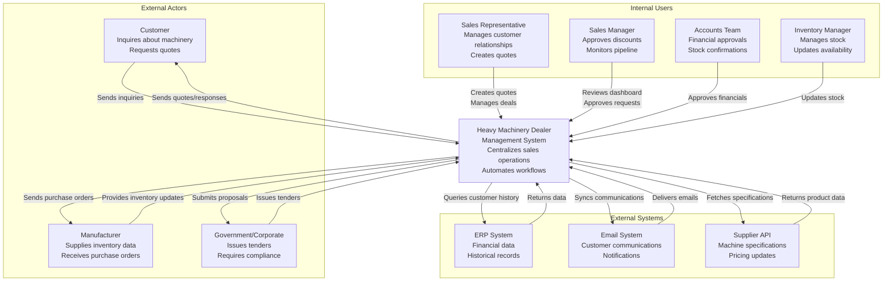

# High-Level Design (HLD)
## Heavy Machinery Dealer Management System

### 1. Executive Summary

This document provides a high-level architectural overview of the Heavy Machinery Dealer Management System - a comprehensive solution designed to address critical pain points in the sales, inventory, and customer relationship management processes for heavy machinery dealers.

**Target Users:**
- Sales Representatives
- Sales Managers
- Inventory Managers
- Accounts/Finance Teams
- Customer Service Teams

**Primary Business Goals:**
- Reduce customer response time
- Improve email management and prioritization
- Centralize customer information
- Automate quote and purchase order generation
- Enable real-time inventory visibility
- Streamline approval workflows
- Track sales pipeline effectively
- Enhance follow-up mechanisms
- Accelerate tender/proposal preparation

---

### 2. System Context

The system serves as a central hub connecting dealers, customers, manufacturers, and internal teams to streamline the entire sales lifecycle for heavy machinery.

#### 2.1 C4 Context Diagram

---

### 3. Key Functional Areas

#### 3.1 Intelligent Email Management
**Purpose:** Automatically classify, prioritize, and route incoming customer emails.

**Key Features:**
- AI-powered email categorization (inquiry, service, tender, supplier)
- Priority scoring based on customer importance and urgency
- Automatic routing to appropriate sales representatives
- Mobile notifications for high-priority emails
- Integration with email systems (Gmail, Outlook)

**Business Value:** Prevents lost opportunities, ensures timely responses, reduces email overload.

---

#### 3.2 Customer Information Hub
**Purpose:** Centralize all customer data in a single, accessible location.

**Key Features:**
- 360-degree customer view (contact details, tax numbers, address)
- Machine purchase history
- Service records
- Credit limits and payment terms
- Communication history
- Document repository

**Business Value:** Eliminates information silos, reduces errors, speeds up quote preparation.

---

#### 3.3 Quote Generation Engine
**Purpose:** Automate the creation of accurate, professional quotes.

**Key Features:**
- Machine configuration wizard (bucket size, tires, attachments, warranty)
- Rule-based validation to prevent incorrect combinations
- Template-based quote generation
- Pricing engine with discount rules
- Multi-currency support
- PDF generation with company branding

**Business Value:** Reduces rework, prevents errors, accelerates quote delivery.

---

#### 3.4 Real-Time Inventory Management
**Purpose:** Provide instant visibility into stock availability across all locations.

**Key Features:**
- Multi-warehouse inventory tracking
- Real-time stock levels
- Reserved vs available quantities
- Stock aging reports
- Integration with ERP for synchronization
- Stock alerts and notifications

**Business Value:** Prevents overpromising, improves customer satisfaction, optimizes inventory.

---

#### 3.5 Approval Workflow Engine
**Purpose:** Streamline and accelerate approval processes.

**Key Features:**
- Configurable approval chains
- Discount approval workflows
- Stock confirmation workflows
- Credit limit approvals
- Mobile approval capabilities
- Automatic escalation on delays
- Audit trail

**Business Value:** Reduces approval time, prevents bottlenecks, maintains compliance.

---

#### 3.6 Purchase Order Automation
**Purpose:** Automate PO generation to manufacturers.

**Key Features:**
- Template-based PO creation
- Auto-population from quotes and inventory data
- Supplier-specific formats
- Multi-approval support
- Electronic submission to manufacturers
- PO tracking and status updates

**Business Value:** Reduces manual effort from 90 minutes to 10 minutes, eliminates errors.

---

#### 3.7 Sales Pipeline Dashboard
**Purpose:** Provide real-time visibility into all ongoing deals.

**Key Features:**
- Visual pipeline (lead → quote → negotiation → won/lost)
- Deal value and probability tracking
- Activity timeline
- Performance metrics (conversion rate, average deal size)
- Forecasting capabilities
- Customizable views for managers and reps

**Business Value:** Improves forecast accuracy, prevents deals from stalling, enhances accountability.

---

#### 3.8 Automated Follow-Up System
**Purpose:** Ensure no customer inquiry falls through the cracks.

**Key Features:**
- Scheduled follow-up reminders
- Automated email sequences
- Task management integration
- Customer engagement tracking
- Configurable follow-up rules
- Smart recommendations for next actions

**Business Value:** Improves professionalism, prevents lost opportunities, increases conversion rate.

---

#### 3.9 Tender Management Module
**Purpose:** Streamline preparation of tender responses and proposals.

**Key Features:**
- Tender document library
- Template-based proposal generation
- Compliance checklist
- Document assembly from pre-approved content
- Collaboration tools for team input
- Submission tracking
- Historical tender database

**Business Value:** Reduces preparation time from hours to minutes, improves accuracy, increases win rate.

---

#### 3.10 Mobile Accessibility
**Purpose:** Enable sales teams to work effectively on the go.

**Key Features:**
- Responsive mobile interface
- Offline capability for key functions
- Mobile notifications
- Quick quote generation
- Approval actions
- Customer information access

**Business Value:** Improves responsiveness, enables field work, increases productivity.

---

### 4. System Architecture Overview

#### 4.1 Architecture Style
The system follows a **microservices architecture** with the following key characteristics:
- Loosely coupled services for each functional area
- Event-driven communication for asynchronous operations
- API Gateway for unified external access
- Centralized authentication and authorization
- Distributed data stores optimized for each service

#### 4.2 Key Architectural Principles

1. **Separation of Concerns:** Each service handles a specific business capability
2. **Scalability:** Services can be scaled independently based on load
3. **Resilience:** Failures in one service don't cascade to others
4. **Flexibility:** Services can be updated/replaced without affecting the entire system
5. **Security:** Multi-layered security with authentication, authorization, and encryption
6. **Observability:** Comprehensive logging, monitoring, and tracing

---

### 5. Technology Stack Overview

#### 5.1 Frontend Layer
- **Web Application:** Modern SPA framework (React/Angular/Vue)
- **Mobile Application:** Progressive Web App (PWA) or native apps
- **Responsive Design:** Bootstrap/Material UI
- **State Management:** Redux/MobX/Vuex

#### 5.2 Backend Services Layer
- **API Gateway:** Kong/AWS API Gateway/Azure API Management
- **Microservices:** Python (Flask/FastAPI), Node.js, or Java Spring Boot
- **Authentication:** OAuth 2.0, JWT tokens
- **Message Queue:** RabbitMQ/Apache Kafka for event-driven communication

#### 5.3 Data Layer
- **Relational Database:** PostgreSQL/MySQL for transactional data
- **Document Database:** MongoDB for flexible schemas (emails, documents)
- **Cache:** Redis for session management and performance
- **Search Engine:** Elasticsearch for full-text search
- **Blob Storage:** AWS S3/Azure Blob for documents and files

#### 5.4 Integration Layer
- **ERP Integration:** REST APIs, SOAP, or direct database access
- **Email Integration:** IMAP/SMTP protocols, Microsoft Graph API, Gmail API
- **Supplier APIs:** REST/GraphQL integrations

#### 5.5 Infrastructure Layer
- **Cloud Platform:** AWS/Azure/GCP
- **Container Orchestration:** Kubernetes/Docker Swarm
- **CI/CD:** Jenkins/GitLab CI/Azure DevOps
- **Monitoring:** Prometheus, Grafana, ELK Stack

---

### 6. Security Architecture

#### 6.1 Security Layers

1. **Authentication & Authorization**
   - Multi-factor authentication (MFA)
   - Role-based access control (RBAC)
   - Single Sign-On (SSO) integration

2. **Data Security**
   - Encryption at rest (AES-256)
   - Encryption in transit (TLS 1.3)
   - Data masking for sensitive information
   - GDPR compliance for customer data

3. **Network Security**
   - Web Application Firewall (WAF)
   - DDoS protection
   - API rate limiting
   - IP whitelisting for critical operations

4. **Application Security**
   - Input validation and sanitization
   - SQL injection prevention
   - XSS protection
   - CSRF tokens
   - Regular security audits and penetration testing

---

### 7. Non-Functional Requirements

#### 7.1 Performance
- **Response Time:** < 2 seconds for 95% of user requests
- **Throughput:** Support 1000+ concurrent users
- **Email Processing:** Process incoming emails within 30 seconds

#### 7.2 Availability
- **Uptime:** 99.9% availability (< 8.76 hours downtime per year)
- **Disaster Recovery:** RPO < 1 hour, RTO < 4 hours
- **Backup:** Daily automated backups with 30-day retention

#### 7.3 Scalability
- **Horizontal Scaling:** Support adding servers to handle increased load
- **Database Scaling:** Implement read replicas and sharding
- **Auto-scaling:** Dynamic resource allocation based on demand

#### 7.4 Maintainability
- **Code Quality:** Automated testing with > 80% code coverage
- **Documentation:** Comprehensive API documentation
- **Monitoring:** Real-time dashboards and alerting
- **Deployment:** Zero-downtime deployments

#### 7.5 Usability
- **Accessibility:** WCAG 2.1 Level AA compliance
- **Internationalization:** Support for multiple languages
- **Responsive Design:** Works on desktop, tablet, and mobile
- **Training:** In-app tutorials and help documentation

---

### 8. Integration Points

#### 8.1 ERP System Integration
- **Data Exchange:** Customer master data, machine history, pricing
- **Frequency:** Real-time for critical data, batch for historical data
- **Protocol:** REST API or direct database connection

#### 8.2 Email System Integration
- **Capabilities:** Read emails, send emails, categorize, archive
- **Protocols:** IMAP, SMTP, Microsoft Graph API, Gmail API
- **Frequency:** Real-time monitoring with webhook support

#### 8.3 Manufacturer Integration
- **Data Exchange:** Product specifications, inventory updates, PO submission
- **Protocol:** REST API, EDI, or email-based
- **Frequency:** Daily batch updates, real-time for critical operations

#### 8.4 Payment Gateway Integration
- **Purpose:** Process customer payments
- **Providers:** Stripe, PayPal, bank-specific gateways
- **Security:** PCI DSS compliance

---

### 9. Deployment Architecture

#### 9.1 Environments
1. **Development:** For active development and unit testing
2. **Testing/QA:** For integration testing and QA validation
3. **Staging:** Production-like environment for final validation
4. **Production:** Live environment serving customers

#### 9.2 Deployment Strategy
- **Blue-Green Deployment:** Zero-downtime deployments
- **Canary Releases:** Gradual rollout to detect issues early
- **Rollback Capability:** Quick reversion to previous stable version

#### 9.3 Infrastructure as Code
- **Tools:** Terraform, AWS CloudFormation, ARM templates
- **Benefits:** Version-controlled infrastructure, reproducible environments

---

### 10. Success Metrics

#### 10.1 Business Metrics
- **Customer Response Time:** Reduce from 24+ hours to < 2 hours
- **Quote Generation Time:** Reduce from 30-90 minutes to < 10 minutes
- **PO Creation Time:** Reduce from 30-90 minutes to < 15 minutes
- **Deal Conversion Rate:** Increase by 20%
- **Lost Opportunities:** Reduce by 50%
- **Sales Team Productivity:** Increase by 30%

#### 10.2 Technical Metrics
- **System Availability:** 99.9% uptime
- **API Response Time:** < 500ms for 95% of requests
- **Error Rate:** < 0.1% of all transactions
- **User Satisfaction Score:** > 4.5/5

---

### 11. Risks and Mitigation

| Risk | Impact | Probability | Mitigation Strategy |
|------|--------|-------------|---------------------|
| ERP integration complexity | High | Medium | Extensive testing, fallback mechanisms, staged rollout |
| User adoption resistance | High | Medium | Comprehensive training, change management, phased rollout |
| Data migration errors | High | Low | Thorough validation, pilot migration, rollback plan |
| Third-party API downtime | Medium | Medium | Caching strategy, graceful degradation, retry logic |
| Security breaches | High | Low | Multi-layered security, regular audits, incident response plan |
| Performance degradation | Medium | Medium | Load testing, auto-scaling, performance monitoring |

---

### 12. Future Enhancements

1. **AI-Powered Recommendations**
   - Smart machine recommendations based on customer profile
   - Predictive maintenance alerts
   - Optimal pricing suggestions

2. **Advanced Analytics**
   - Market trend analysis
   - Competitor intelligence
   - Customer behavior insights

3. **IoT Integration**
   - Real-time machine telemetry
   - Predictive maintenance
   - Usage-based financing

4. **Blockchain for Supply Chain**
   - Transparent provenance tracking
   - Smart contracts for automated payments

5. **Voice Interface**
   - Voice-activated queries
   - Hands-free quote creation for field teams

---

### 13. Conclusion

The Heavy Machinery Dealer Management System addresses 10 critical pain points through a modern, scalable, and secure architecture. By centralizing information, automating workflows, and providing real-time visibility, the system will significantly improve operational efficiency, customer satisfaction, and sales performance.

The microservices architecture ensures flexibility for future enhancements while maintaining system stability. The focus on mobile accessibility and user experience will drive adoption and maximize business value.

**Next Steps:**
1. Review and approve HLD
2. Proceed with Low-Level Design for each component
3. Create detailed Architecture Decision Records
4. Begin implementation in priority order

---

**Document Control:**
- Version: 1.0
- Last Updated: 2025-11-24
- Status: Draft for Review
- Owner: Architecture Team
