# Low-Level Design (LLD)
## Heavy Machinery Dealer Management System

### 1. Document Overview

This Low-Level Design document provides detailed technical specifications for implementing the Heavy Machinery Dealer Management System. It covers component architecture, data models, APIs, algorithms, and implementation details for each major subsystem.

---

## 2. System Architecture

### 2.1 C4 Container Diagram


```mermaid
graph TB
    subgraph Users[Users]
        SalesRep[Sales Representative]
        Manager[Sales Manager]
        Customer[Customer]
    end
    
    subgraph Frontend[Frontend Container]
        WebApp[Web Application<br/>React/Vue<br/>SPA]
        MobileApp[Mobile App<br/>PWA<br/>Responsive]
    end
    
    subgraph APILayer[API Layer]
        APIGateway[API Gateway<br/>Kong/AWS API Gateway<br/>Routing, Auth, Rate Limiting]
    end
    
    subgraph Microservices[Microservices]
        EmailService[Email Service<br/>Python FastAPI<br/>Email processing & routing]
        CustomerService[Customer Service<br/>Python FastAPI<br/>Customer data management]
        QuoteService[Quote Service<br/>Python FastAPI<br/>Quote generation]
        InventoryService[Inventory Service<br/>Python FastAPI<br/>Stock management]
        ApprovalService[Approval Service<br/>Python FastAPI<br/>Workflow engine]
        POService[PO Service<br/>Python FastAPI<br/>Purchase order automation]
        PipelineService[Pipeline Service<br/>Python FastAPI<br/>Sales tracking]
        NotificationService[Notification Service<br/>Node.js<br/>Real-time notifications]
        TenderService[Tender Service<br/>Python FastAPI<br/>Tender management]
    end
    
    subgraph DataStores[Data Stores]
        PostgreSQL[(PostgreSQL<br/>Transactional data)]
        MongoDB[(MongoDB<br/>Documents & emails)]
        Redis[(Redis<br/>Cache & sessions)]
        Elasticsearch[(Elasticsearch<br/>Full-text search)]
        S3[S3 Storage<br/>Files & documents]
    end
    
    subgraph MessageBroker[Message Broker]
        RabbitMQ[RabbitMQ<br/>Event bus]
    end
    
    subgraph External[External Systems]
        ERP[ERP System]
        EmailSys[Email System]
        SupplierAPI[Supplier API]
    end
    
    SalesRep --> WebApp
    Manager --> WebApp
    Customer --> WebApp
    SalesRep --> MobileApp
    
    WebApp --> APIGateway
    MobileApp --> APIGateway
    
    APIGateway --> EmailService
    APIGateway --> CustomerService
    APIGateway --> QuoteService
    APIGateway --> InventoryService
    APIGateway --> ApprovalService
    APIGateway --> POService
    APIGateway --> PipelineService
    APIGateway --> NotificationService
    APIGateway --> TenderService
    
    EmailService --> MongoDB
    EmailService --> PostgreSQL
    EmailService --> RabbitMQ
    
    CustomerService --> PostgreSQL
    CustomerService --> Redis
    CustomerService --> ERP
    
    QuoteService --> PostgreSQL
    QuoteService --> Redis
    QuoteService --> S3
    QuoteService --> RabbitMQ
    
    InventoryService --> PostgreSQL
    InventoryService --> Redis
    InventoryService --> ERP
    
    ApprovalService --> PostgreSQL
    ApprovalService --> RabbitMQ
    
    POService --> PostgreSQL
    POService --> S3
    POService --> SupplierAPI
    
    PipelineService --> PostgreSQL
    PipelineService --> Elasticsearch
    
    NotificationService --> RabbitMQ
    NotificationService --> Redis
    
    TenderService --> MongoDB
    TenderService --> S3
    TenderService --> PostgreSQL
    
    EmailService --> EmailSys
```

---

## 3. Component-Level Design

### 3.1 Email Service

#### 3.1.1 Component Diagram

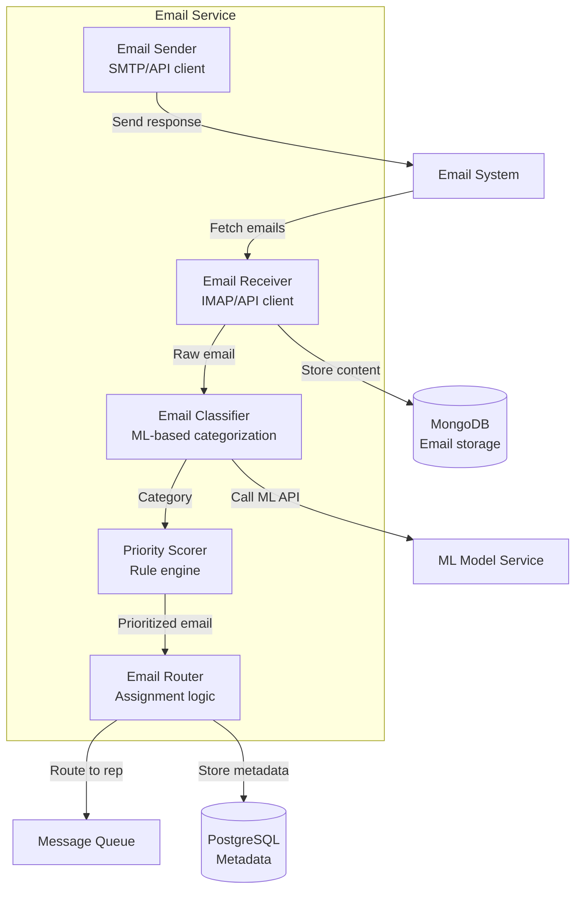
```mermaid
graph TB
    subgraph EmailService[Email Service]
        EmailReceiver[Email Receiver<br/>IMAP/API client]
        EmailClassifier[Email Classifier<br/>ML-based categorization]
        PriorityScorer[Priority Scorer<br/>Rule engine]
        EmailRouter[Email Router<br/>Assignment logic]
        EmailSender[Email Sender<br/>SMTP/API client]
    end
    
    EmailSystem[Email System]
    MongoDB[(MongoDB<br/>Email storage)]
    PostgreSQL[(PostgreSQL<br/>Metadata)]
    RabbitMQ[Message Queue]
    MLModel[ML Model Service]
    
    EmailSystem -->|Fetch emails| EmailReceiver
    EmailReceiver -->|Raw email| EmailClassifier
    EmailClassifier -->|Category| PriorityScorer
    EmailClassifier -->|Call ML API| MLModel
    PriorityScorer -->|Prioritized email| EmailRouter
    EmailRouter -->|Route to rep| RabbitMQ
    EmailRouter -->|Store metadata| PostgreSQL
    EmailReceiver -->|Store content| MongoDB
    EmailSender -->|Send response| EmailSystem
```

#### 3.1.2 Data Model

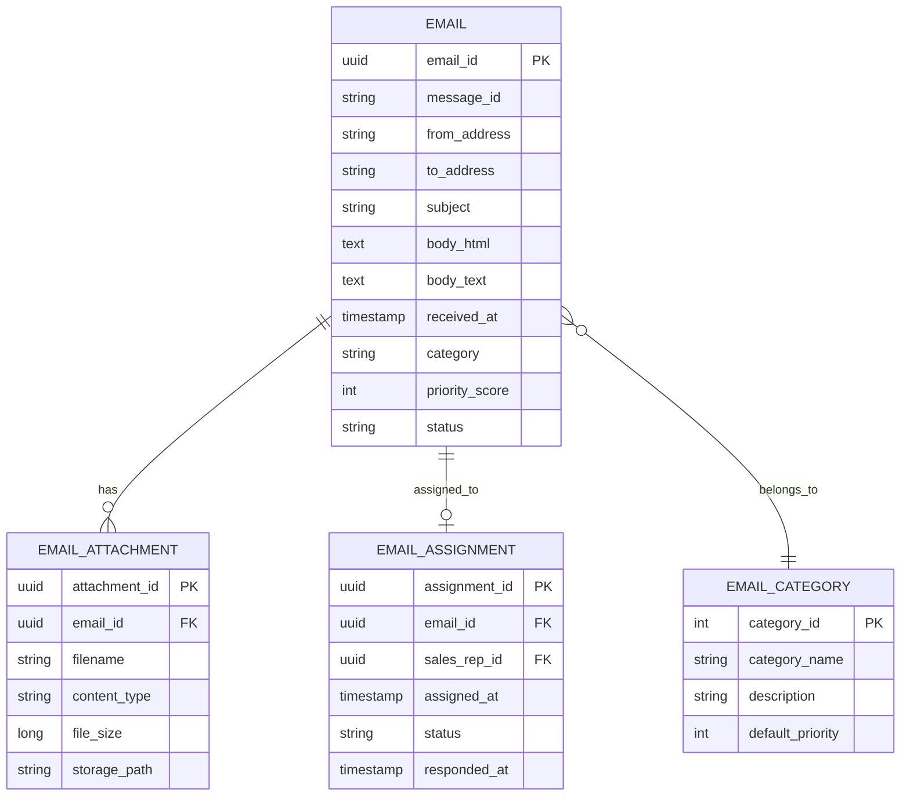
```mermaid
erDiagram
    EMAIL {
        uuid email_id PK
        string message_id
        string from_address
        string to_address
        string subject
        text body_html
        text body_text
        timestamp received_at
        string category
        int priority_score
        string status
    }
    
    EMAIL_ATTACHMENT {
        uuid attachment_id PK
        uuid email_id FK
        string filename
        string content_type
        long file_size
        string storage_path
    }
    
    EMAIL_ASSIGNMENT {
        uuid assignment_id PK
        uuid email_id FK
        uuid sales_rep_id FK
        timestamp assigned_at
        string status
        timestamp responded_at
    }
    
    EMAIL_CATEGORY {
        int category_id PK
        string category_name
        string description
        int default_priority
    }
    
    EMAIL ||--o{ EMAIL_ATTACHMENT : has
    EMAIL ||--o| EMAIL_ASSIGNMENT : assigned_to
    EMAIL }o--|| EMAIL_CATEGORY : belongs_to
```

#### 3.1.3 Key Algorithms

**Email Classification Algorithm:**
```
function classifyEmail(email):
    # Extract features
    features = {
        'subject_keywords': extractKeywords(email.subject),
        'body_keywords': extractKeywords(email.body),
        'sender_domain': extractDomain(email.from_address),
        'attachments': email.attachments.count(),
        'time_of_day': email.received_at.hour
    }
    
    # Call ML model
    predictions = mlModel.predict(features)
    
    # Categories: INQUIRY, SERVICE, TENDER, SUPPLIER, SPAM
    category = predictions.top_category
    confidence = predictions.confidence
    
    if confidence < 0.7:
        category = 'MANUAL_REVIEW'
    
    return category
```

**Priority Scoring Algorithm:**
```
function calculatePriority(email, category):
    base_priority = category.default_priority
    
    # Customer importance (0-10)
    customer_score = getCustomerScore(email.from_address)
    
    # Urgency keywords
    urgency_score = 0
    urgency_keywords = ['urgent', 'asap', 'immediate', 'today']
    for keyword in urgency_keywords:
        if keyword in email.subject.lower() or keyword in email.body.lower():
            urgency_score += 2
    
    # Time since last contact
    days_since_contact = getDaysSinceLastContact(email.from_address)
    recency_score = min(days_since_contact / 7, 5)
    
    # Deal value indicator
    value_score = estimateDealValue(email.body)
    
    total_score = (
        base_priority * 10 +
        customer_score * 15 +
        urgency_score * 10 +
        recency_score * 5 +
        value_score * 20
    ) / 100
    
    return min(max(total_score, 1), 10)
```

#### 3.1.4 API Endpoints

```
POST /api/v1/emails/sync
    Description: Sync emails from email server
    Authentication: Service token
    Response: { "emails_fetched": 42, "new_emails": 15 }

GET /api/v1/emails
    Description: List emails with filters
    Query params: category, priority, status, assigned_to, page, limit
    Response: { "emails": [...], "total": 100, "page": 1 }

GET /api/v1/emails/{email_id}
    Description: Get email details
    Response: { "email": {...}, "attachments": [...], "assignment": {...} }

POST /api/v1/emails/{email_id}/reply
    Description: Send reply to email
    Body: { "reply_text": "...", "attachments": [...] }
    Response: { "sent": true, "message_id": "..." }

PUT /api/v1/emails/{email_id}/assign
    Description: Assign email to sales rep
    Body: { "sales_rep_id": "..." }
    Response: { "assigned": true }

PUT /api/v1/emails/{email_id}/category
    Description: Update email category (manual correction)
    Body: { "category": "INQUIRY" }
    Response: { "updated": true }
```

---

### 3.2 Customer Service

#### 3.2.1 Component Diagram

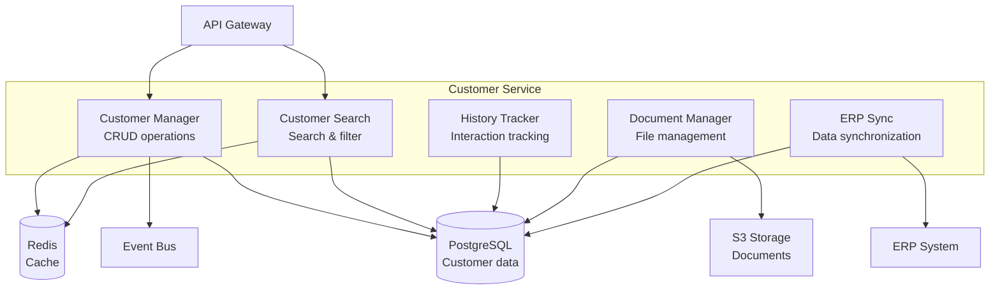
```mermaid
graph TB
    subgraph CustomerService[Customer Service]
        CustomerManager[Customer Manager<br/>CRUD operations]
        CustomerSearch[Customer Search<br/>Search & filter]
        HistoryTracker[History Tracker<br/>Interaction tracking]
        DocumentManager[Document Manager<br/>File management]
        ERPSync[ERP Sync<br/>Data synchronization]
    end
    
    APIGateway[API Gateway]
    PostgreSQL[(PostgreSQL<br/>Customer data)]
    Redis[(Redis<br/>Cache)]
    S3[S3 Storage<br/>Documents]
    ERP[ERP System]
    EventBus[Event Bus]
    
    APIGateway --> CustomerManager
    APIGateway --> CustomerSearch
    CustomerManager --> PostgreSQL
    CustomerManager --> Redis
    CustomerManager --> EventBus
    CustomerSearch --> PostgreSQL
    CustomerSearch --> Redis
    HistoryTracker --> PostgreSQL
    DocumentManager --> S3
    DocumentManager --> PostgreSQL
    ERPSync --> ERP
    ERPSync --> PostgreSQL
```

#### 3.2.2 Data Model

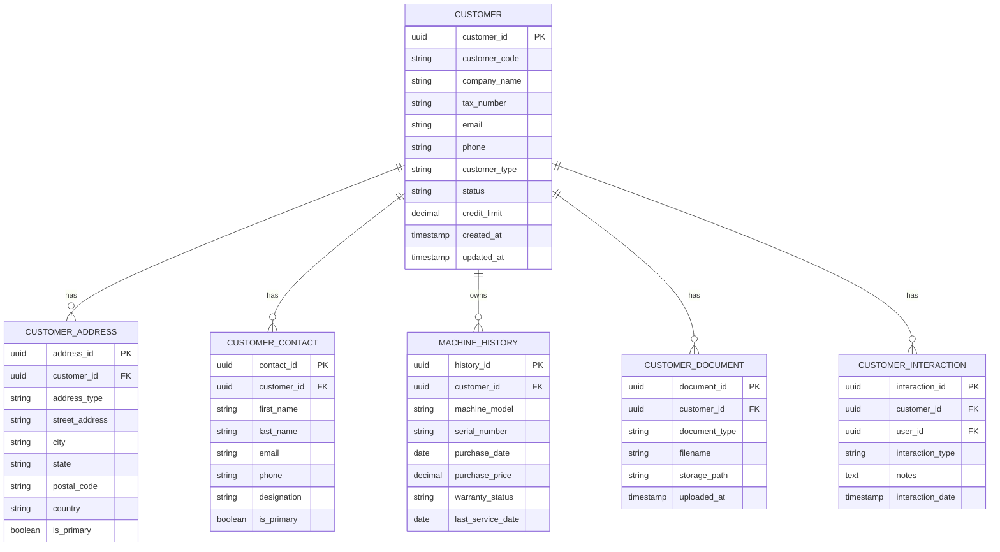
```mermaid
erDiagram
    CUSTOMER {
        uuid customer_id PK
        string customer_code
        string company_name
        string tax_number
        string email
        string phone
        string customer_type
        string status
        decimal credit_limit
        timestamp created_at
        timestamp updated_at
    }
    
    CUSTOMER_ADDRESS {
        uuid address_id PK
        uuid customer_id FK
        string address_type
        string street_address
        string city
        string state
        string postal_code
        string country
        boolean is_primary
    }
    
    CUSTOMER_CONTACT {
        uuid contact_id PK
        uuid customer_id FK
        string first_name
        string last_name
        string email
        string phone
        string designation
        boolean is_primary
    }
    
    MACHINE_HISTORY {
        uuid history_id PK
        uuid customer_id FK
        string machine_model
        string serial_number
        date purchase_date
        decimal purchase_price
        string warranty_status
        date last_service_date
    }
    
    CUSTOMER_DOCUMENT {
        uuid document_id PK
        uuid customer_id FK
        string document_type
        string filename
        string storage_path
        timestamp uploaded_at
    }
    
    CUSTOMER_INTERACTION {
        uuid interaction_id PK
        uuid customer_id FK
        uuid user_id FK
        string interaction_type
        text notes
        timestamp interaction_date
    }
    
    CUSTOMER ||--o{ CUSTOMER_ADDRESS : has
    CUSTOMER ||--o{ CUSTOMER_CONTACT : has
    CUSTOMER ||--o{ MACHINE_HISTORY : owns
    CUSTOMER ||--o{ CUSTOMER_DOCUMENT : has
    CUSTOMER ||--o{ CUSTOMER_INTERACTION : has
```

#### 3.2.3 Key Business Logic

**Customer 360 View Assembly:**
```
function getCustomer360View(customer_id):
    # Fetch from cache first
    cached = redis.get(f"customer:360:{customer_id}")
    if cached and not expired(cached):
        return cached
    
    # Assemble comprehensive view
    customer_360 = {
        'basic_info': getCustomerBasicInfo(customer_id),
        'addresses': getCustomerAddresses(customer_id),
        'contacts': getCustomerContacts(customer_id),
        'machine_history': getMachineHistory(customer_id),
        'recent_interactions': getRecentInteractions(customer_id, limit=10),
        'recent_quotes': getRecentQuotes(customer_id, limit=5),
        'outstanding_orders': getOutstandingOrders(customer_id),
        'payment_terms': getPaymentTerms(customer_id),
        'credit_status': getCreditStatus(customer_id),
        'documents': getCustomerDocuments(customer_id)
    }
    
    # Enrich with ERP data
    erp_data = fetchFromERP(customer_id)
    customer_360['financial_summary'] = erp_data.financial_summary
    customer_360['credit_limit'] = erp_data.credit_limit
    
    # Cache for 15 minutes
    redis.setex(f"customer:360:{customer_id}", 900, customer_360)
    
    return customer_360
```

#### 3.2.4 API Endpoints

```
POST /api/v1/customers
    Description: Create new customer
    Body: { "company_name": "...", "tax_number": "...", ... }
    Response: { "customer_id": "...", "created": true }

GET /api/v1/customers/{customer_id}
    Description: Get customer 360 view
    Response: { "customer": {...}, "addresses": [...], ... }

PUT /api/v1/customers/{customer_id}
    Description: Update customer information
    Body: { "email": "...", "phone": "...", ... }
    Response: { "updated": true }

GET /api/v1/customers/search
    Query params: q, type, status, page, limit
    Response: { "customers": [...], "total": 50 }

POST /api/v1/customers/{customer_id}/interactions
    Description: Log customer interaction
    Body: { "type": "CALL", "notes": "...", "user_id": "..." }
    Response: { "interaction_id": "..." }

POST /api/v1/customers/{customer_id}/documents
    Description: Upload customer document
    Body: Multipart form data
    Response: { "document_id": "...", "url": "..." }
```

---

### 3.3 Quote Service

#### 3.3.1 Component Diagram

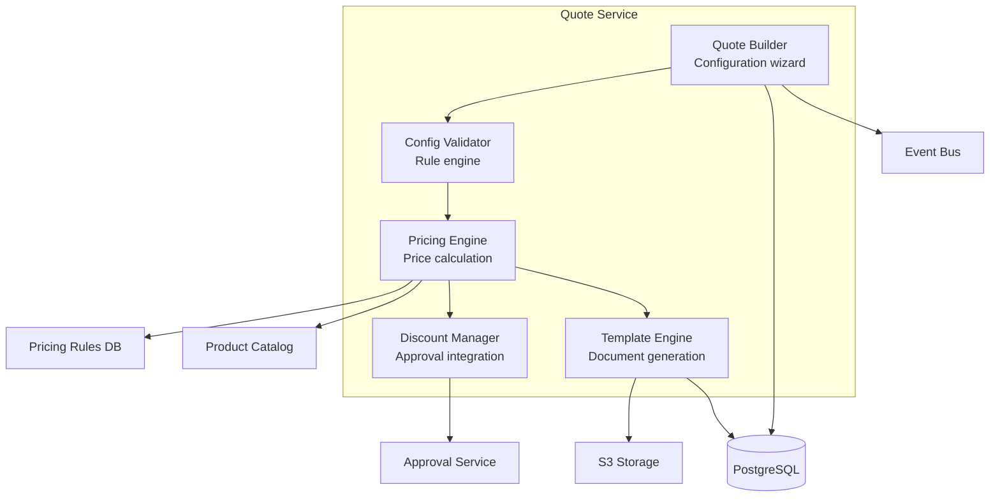
```mermaid
graph TB
    subgraph QuoteService[Quote Service]
        QuoteBuilder[Quote Builder<br/>Configuration wizard]
        ConfigValidator[Config Validator<br/>Rule engine]
        PricingEngine[Pricing Engine<br/>Price calculation]
        TemplateEngine[Template Engine<br/>Document generation]
        DiscountManager[Discount Manager<br/>Approval integration]
    end
    
    ProductCatalog[Product Catalog]
    PricingRules[Pricing Rules DB]
    PostgreSQL[(PostgreSQL)]
    S3[S3 Storage]
    ApprovalService[Approval Service]
    EventBus[Event Bus]
    
    QuoteBuilder --> ConfigValidator
    ConfigValidator --> PricingEngine
    PricingEngine --> PricingRules
    PricingEngine --> ProductCatalog
    PricingEngine --> DiscountManager
    DiscountManager --> ApprovalService
    PricingEngine --> TemplateEngine
    TemplateEngine --> S3
    QuoteBuilder --> PostgreSQL
    TemplateEngine --> PostgreSQL
    QuoteBuilder --> EventBus
```

#### 3.3.2 Data Model

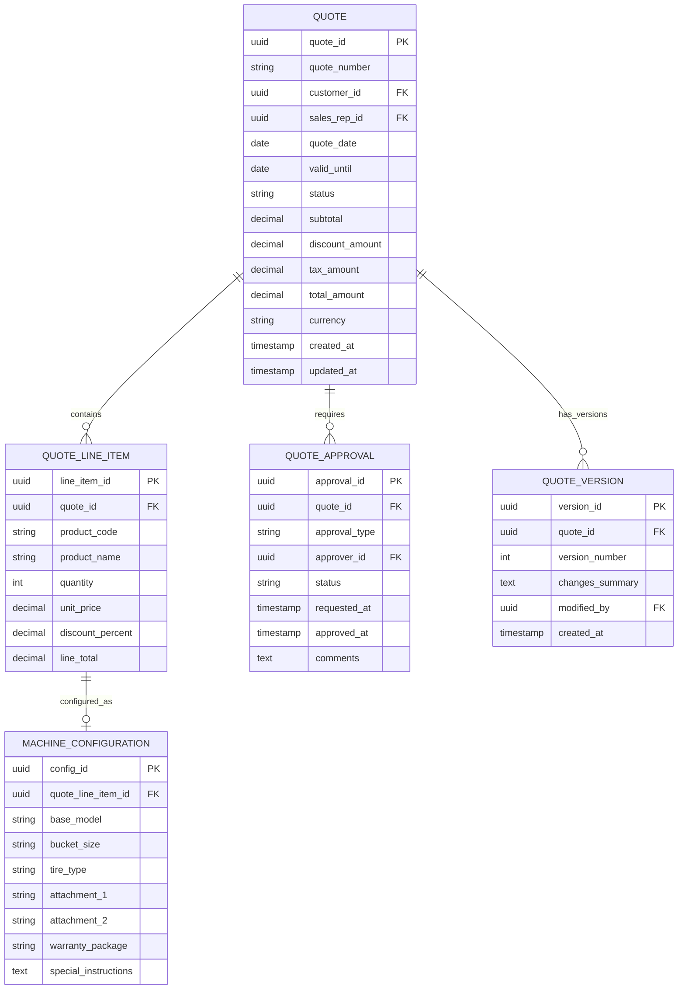
```mermaid
erDiagram
    QUOTE {
        uuid quote_id PK
        string quote_number
        uuid customer_id FK
        uuid sales_rep_id FK
        date quote_date
        date valid_until
        string status
        decimal subtotal
        decimal discount_amount
        decimal tax_amount
        decimal total_amount
        string currency
        timestamp created_at
        timestamp updated_at
    }
    
    QUOTE_LINE_ITEM {
        uuid line_item_id PK
        uuid quote_id FK
        string product_code
        string product_name
        int quantity
        decimal unit_price
        decimal discount_percent
        decimal line_total
    }
    
    MACHINE_CONFIGURATION {
        uuid config_id PK
        uuid quote_line_item_id FK
        string base_model
        string bucket_size
        string tire_type
        string attachment_1
        string attachment_2
        string warranty_package
        text special_instructions
    }
    
    QUOTE_APPROVAL {
        uuid approval_id PK
        uuid quote_id FK
        string approval_type
        uuid approver_id FK
        string status
        timestamp requested_at
        timestamp approved_at
        text comments
    }
    
    QUOTE_VERSION {
        uuid version_id PK
        uuid quote_id FK
        int version_number
        text changes_summary
        uuid modified_by FK
        timestamp created_at
    }
    
    QUOTE ||--o{ QUOTE_LINE_ITEM : contains
    QUOTE_LINE_ITEM ||--o| MACHINE_CONFIGURATION : configured_as
    QUOTE ||--o{ QUOTE_APPROVAL : requires
    QUOTE ||--o{ QUOTE_VERSION : has_versions
```

#### 3.3.3 Key Algorithms

**Configuration Validation:**
```
function validateMachineConfiguration(config):
    errors = []
    
    # Load compatibility rules
    rules = loadCompatibilityRules(config.base_model)
    
    # Validate bucket size
    valid_buckets = rules.compatible_buckets
    if config.bucket_size not in valid_buckets:
        errors.append(f"Bucket size {config.bucket_size} not compatible with {config.base_model}")
    
    # Validate tire type
    if config.tire_type == 'SOLID' and config.base_model in ['MODEL_A', 'MODEL_B']:
        errors.append("Solid tires not available for this model")
    
    # Validate attachment combinations
    if config.attachment_1 == config.attachment_2:
        errors.append("Cannot select same attachment twice")
    
    incompatible_pairs = rules.incompatible_attachments
    if (config.attachment_1, config.attachment_2) in incompatible_pairs:
        errors.append(f"Attachments {config.attachment_1} and {config.attachment_2} are incompatible")
    
    # Validate warranty with configuration
    if config.warranty_package == 'EXTENDED' and config.base_model.age > 5:
        errors.append("Extended warranty not available for machines older than 5 years")
    
    return errors
```

**Pricing Calculation:**
```
function calculateQuotePrice(quote):
    subtotal = 0
    
    for line_item in quote.line_items:
        # Base price
        base_price = getProductPrice(line_item.product_code)
        
        # Configuration additions
        if line_item.configuration:
            config_cost = calculateConfigurationCost(line_item.configuration)
            base_price += config_cost
        
        # Quantity discount
        qty_discount = calculateQuantityDiscount(line_item.quantity, base_price)
        
        # Line item discount
        line_discount = (base_price * line_item.discount_percent) / 100
        
        line_total = (base_price - qty_discount - line_discount) * line_item.quantity
        subtotal += line_total
    
    # Quote-level discount
    quote_discount = (subtotal * quote.discount_percent) / 100
    
    # Tax calculation
    tax_rate = getTaxRate(quote.customer.tax_jurisdiction)
    taxable_amount = subtotal - quote_discount
    tax_amount = taxable_amount * tax_rate
    
    # Final total
    total = taxable_amount + tax_amount
    
    return {
        'subtotal': subtotal,
        'discount': quote_discount,
        'tax': tax_amount,
        'total': total
    }
```

#### 3.3.4 API Endpoints

```
POST /api/v1/quotes
    Description: Create new quote
    Body: { "customer_id": "...", "line_items": [...] }
    Response: { "quote_id": "...", "quote_number": "..." }

GET /api/v1/quotes/{quote_id}
    Description: Get quote details
    Response: { "quote": {...}, "line_items": [...], "approvals": [...] }

PUT /api/v1/quotes/{quote_id}/line-items
    Description: Add/update quote line items
    Body: { "line_items": [...] }
    Response: { "updated": true, "new_total": 125000.00 }

POST /api/v1/quotes/{quote_id}/validate-configuration
    Description: Validate machine configuration
    Body: { "configuration": {...} }
    Response: { "valid": false, "errors": [...] }

POST /api/v1/quotes/{quote_id}/generate-pdf
    Description: Generate PDF document
    Response: { "pdf_url": "https://...", "expires_in": 3600 }

POST /api/v1/quotes/{quote_id}/send
    Description: Send quote to customer
    Body: { "email_to": "...", "message": "..." }
    Response: { "sent": true, "email_id": "..." }

POST /api/v1/quotes/{quote_id}/request-approval
    Description: Request discount approval
    Body: { "approval_type": "DISCOUNT", "discount_percent": 15 }
    Response: { "approval_id": "...", "status": "PENDING" }
```

---

### 3.4 Inventory Service

#### 3.4.1 Component Diagram

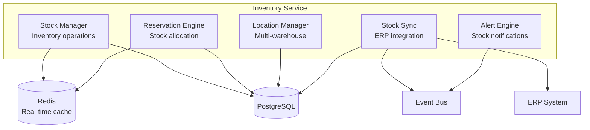
```mermaid
graph TB
    subgraph InventoryService[Inventory Service]
        StockManager[Stock Manager<br/>Inventory operations]
        ReservationEngine[Reservation Engine<br/>Stock allocation]
        LocationManager[Location Manager<br/>Multi-warehouse]
        StockSync[Stock Sync<br/>ERP integration]
        AlertEngine[Alert Engine<br/>Stock notifications]
    end
    
    PostgreSQL[(PostgreSQL)]
    Redis[(Redis<br/>Real-time cache)]
    ERP[ERP System]
    EventBus[Event Bus]
    
    StockManager --> PostgreSQL
    StockManager --> Redis
    ReservationEngine --> PostgreSQL
    ReservationEngine --> Redis
    LocationManager --> PostgreSQL
    StockSync --> ERP
    StockSync --> PostgreSQL
    StockSync --> EventBus
    AlertEngine --> EventBus
```

#### 3.4.2 Data Model

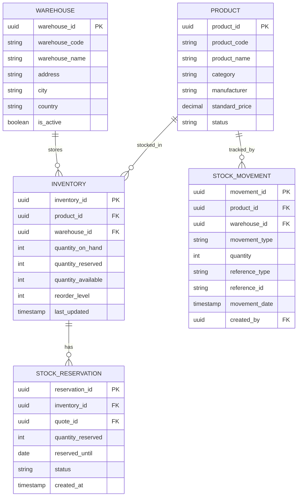
```mermaid
erDiagram
    PRODUCT {
        uuid product_id PK
        string product_code
        string product_name
        string category
        string manufacturer
        decimal standard_price
        string status
    }
    
    WAREHOUSE {
        uuid warehouse_id PK
        string warehouse_code
        string warehouse_name
        string address
        string city
        string country
        boolean is_active
    }
    
    INVENTORY {
        uuid inventory_id PK
        uuid product_id FK
        uuid warehouse_id FK
        int quantity_on_hand
        int quantity_reserved
        int quantity_available
        int reorder_level
        timestamp last_updated
    }
    
    STOCK_MOVEMENT {
        uuid movement_id PK
        uuid product_id FK
        uuid warehouse_id FK
        string movement_type
        int quantity
        string reference_type
        string reference_id
        timestamp movement_date
        uuid created_by FK
    }
    
    STOCK_RESERVATION {
        uuid reservation_id PK
        uuid inventory_id FK
        uuid quote_id FK
        int quantity_reserved
        date reserved_until
        string status
        timestamp created_at
    }
    
    PRODUCT ||--o{ INVENTORY : stocked_in
    WAREHOUSE ||--o{ INVENTORY : stores
    PRODUCT ||--o{ STOCK_MOVEMENT : tracked_by
    INVENTORY ||--o{ STOCK_RESERVATION : has
```

#### 3.4.3 Key Business Logic

**Stock Availability Check:**
```
function checkStockAvailability(product_id, quantity, warehouse_id=None):
    if warehouse_id:
        # Check specific warehouse
        inventory = getInventory(product_id, warehouse_id)
        available = inventory.quantity_available
        
        return {
            'available': available >= quantity,
            'quantity_available': available,
            'warehouse': warehouse_id
        }
    else:
        # Check all warehouses
        warehouses = getInventoryAcrossWarehouses(product_id)
        results = []
        
        for warehouse in warehouses:
            if warehouse.quantity_available >= quantity:
                results.append({
                    'warehouse_id': warehouse.warehouse_id,
                    'warehouse_name': warehouse.warehouse_name,
                    'quantity_available': warehouse.quantity_available,
                    'estimated_delivery_days': warehouse.delivery_days
                })
        
        return {
            'available': len(results) > 0,
            'options': sorted(results, key=lambda x: x['estimated_delivery_days'])
        }
```

**Stock Reservation:**
```
function reserveStock(product_id, quantity, quote_id, warehouse_id):
    # Start transaction
    begin_transaction()
    
    try:
        # Lock inventory row
        inventory = getInventoryForUpdate(product_id, warehouse_id)
        
        # Check availability
        if inventory.quantity_available < quantity:
            rollback_transaction()
            return {'success': False, 'error': 'Insufficient stock'}
        
        # Create reservation
        reservation = createReservation({
            'inventory_id': inventory.inventory_id,
            'quote_id': quote_id,
            'quantity_reserved': quantity,
            'reserved_until': date.today() + timedelta(days=7),
            'status': 'ACTIVE'
        })
        
        # Update inventory counts
        updateInventory(inventory.inventory_id, {
            'quantity_reserved': inventory.quantity_reserved + quantity,
            'quantity_available': inventory.quantity_available - quantity
        })
        
        # Update cache
        invalidateCache(f"inventory:{product_id}:{warehouse_id}")
        
        # Publish event
        publishEvent('stock.reserved', {
            'product_id': product_id,
            'quantity': quantity,
            'quote_id': quote_id
        })
        
        commit_transaction()
        
        return {'success': True, 'reservation_id': reservation.reservation_id}
        
    except Exception as e:
        rollback_transaction()
        return {'success': False, 'error': str(e)}
```

#### 3.4.4 API Endpoints

```
GET /api/v1/inventory/availability
    Query params: product_id, quantity, warehouse_id
    Response: { "available": true, "options": [...] }

POST /api/v1/inventory/reserve
    Description: Reserve stock for quote
    Body: { "product_id": "...", "quantity": 2, "quote_id": "..." }
    Response: { "reservation_id": "...", "reserved_until": "..." }

DELETE /api/v1/inventory/reservations/{reservation_id}
    Description: Release stock reservation
    Response: { "released": true }

GET /api/v1/inventory/products/{product_id}
    Description: Get inventory across all warehouses
    Response: { "product": {...}, "warehouses": [...] }

POST /api/v1/inventory/movements
    Description: Record stock movement
    Body: { "product_id": "...", "warehouse_id": "...", "type": "IN", "quantity": 5 }
    Response: { "movement_id": "..." }

GET /api/v1/inventory/low-stock
    Description: Get products below reorder level
    Response: { "products": [...] }
```

---

### 3.5 Approval Service

#### 3.5.1 Workflow State Machine

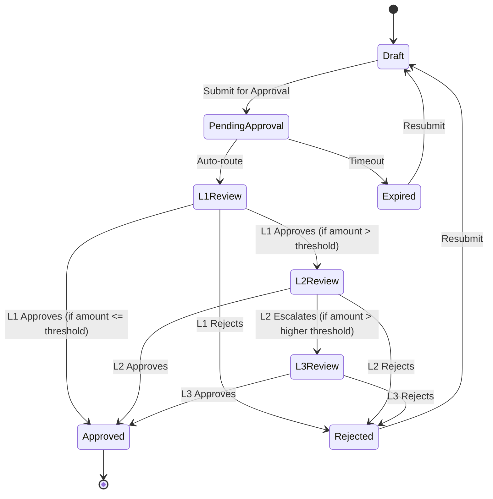
```mermaid
stateDiagram-v2
    [*] --> Draft
    Draft --> PendingApproval: Submit for Approval
    PendingApproval --> L1Review: Auto-route
    L1Review --> L2Review: L1 Approves (if amount > threshold)
    L1Review --> Approved: L1 Approves (if amount <= threshold)
    L1Review --> Rejected: L1 Rejects
    L2Review --> Approved: L2 Approves
    L2Review --> Rejected: L2 Rejects
    L2Review --> L3Review: L2 Escalates (if amount > higher threshold)
    L3Review --> Approved: L3 Approves
    L3Review --> Rejected: L3 Rejects
    PendingApproval --> Expired: Timeout
    Approved --> [*]
    Rejected --> Draft: Resubmit
    Expired --> Draft: Resubmit
```

#### 3.5.2 Data Model

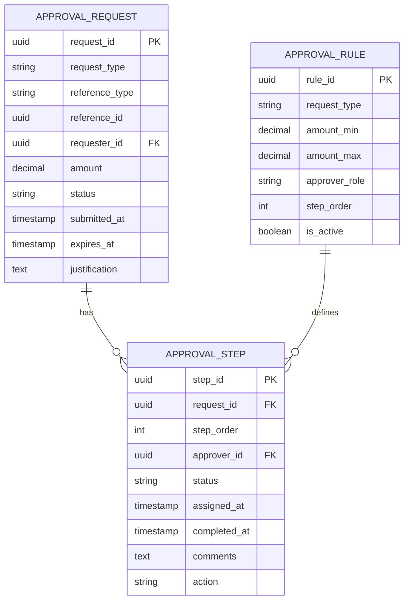
```mermaid
erDiagram
    APPROVAL_REQUEST {
        uuid request_id PK
        string request_type
        string reference_type
        uuid reference_id
        uuid requester_id FK
        decimal amount
        string status
        timestamp submitted_at
        timestamp expires_at
        text justification
    }
    
    APPROVAL_STEP {
        uuid step_id PK
        uuid request_id FK
        int step_order
        uuid approver_id FK
        string status
        timestamp assigned_at
        timestamp completed_at
        text comments
        string action
    }
    
    APPROVAL_RULE {
        uuid rule_id PK
        string request_type
        decimal amount_min
        decimal amount_max
        string approver_role
        int step_order
        boolean is_active
    }
    
    APPROVAL_REQUEST ||--o{ APPROVAL_STEP : has
    APPROVAL_RULE ||--o{ APPROVAL_STEP : defines
```

#### 3.5.3 Key Business Logic

**Approval Chain Determination:**
```
function determineApprovalChain(request):
    # Get applicable rules
    rules = getApprovalRules(
        request_type=request.type,
        amount=request.amount
    )
    
    steps = []
    
    for rule in rules:
        # Find available approver
        approver = findApproverByRole(
            role=rule.approver_role,
            availability='AVAILABLE',
            exclude=request.requester_id
        )
        
        if not approver:
            # Escalate to next level
            approver = findBackupApprover(rule.approver_role)
        
        steps.append({
            'step_order': rule.step_order,
            'approver_id': approver.user_id,
            'approver_name': approver.full_name,
            'approver_role': rule.approver_role,
            'required': rule.is_required,
            'sla_hours': rule.sla_hours
        })
    
    return steps
```

#### 3.5.4 API Endpoints

```
POST /api/v1/approvals
    Description: Create approval request
    Body: { "type": "DISCOUNT", "reference_type": "QUOTE", "reference_id": "...", "amount": 15000 }
    Response: { "request_id": "...", "steps": [...] }

GET /api/v1/approvals/{request_id}
    Description: Get approval status
    Response: { "request": {...}, "steps": [...], "status": "PENDING" }

POST /api/v1/approvals/{request_id}/approve
    Description: Approve request
    Body: { "step_id": "...", "comments": "..." }
    Response: { "approved": true, "next_step": {...} }

POST /api/v1/approvals/{request_id}/reject
    Description: Reject request
    Body: { "step_id": "...", "reason": "..." }
    Response: { "rejected": true }

GET /api/v1/approvals/pending
    Description: Get pending approvals for current user
    Response: { "approvals": [...] }
```

---

### 3.6 Purchase Order Service

#### 3.6.1 Component Diagram

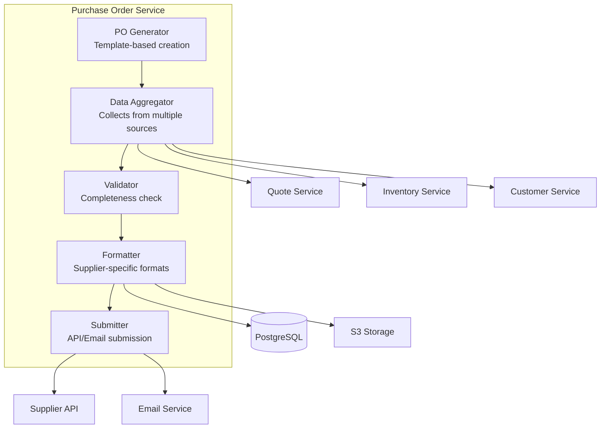
```mermaid
graph TB
    subgraph POService[Purchase Order Service]
        POGenerator[PO Generator<br/>Template-based creation]
        DataAggregator[Data Aggregator<br/>Collects from multiple sources]
        Validator[Validator<br/>Completeness check]
        Formatter[Formatter<br/>Supplier-specific formats]
        Submitter[Submitter<br/>API/Email submission]
    end
    
    QuoteService[Quote Service]
    InventoryService[Inventory Service]
    CustomerService[Customer Service]
    PostgreSQL[(PostgreSQL)]
    S3[S3 Storage]
    SupplierAPI[Supplier API]
    EmailService[Email Service]
    
    POGenerator --> DataAggregator
    DataAggregator --> QuoteService
    DataAggregator --> InventoryService
    DataAggregator --> CustomerService
    DataAggregator --> Validator
    Validator --> Formatter
    Formatter --> PostgreSQL
    Formatter --> S3
    Formatter --> Submitter
    Submitter --> SupplierAPI
    Submitter --> EmailService
```

#### 3.6.2 Data Model

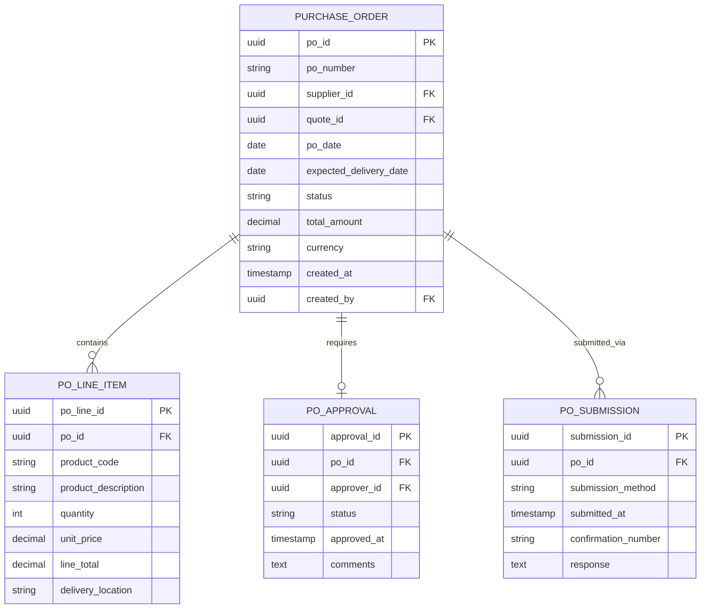
```mermaid
erDiagram
    PURCHASE_ORDER {
        uuid po_id PK
        string po_number
        uuid supplier_id FK
        uuid quote_id FK
        date po_date
        date expected_delivery_date
        string status
        decimal total_amount
        string currency
        timestamp created_at
        uuid created_by FK
    }
    
    PO_LINE_ITEM {
        uuid po_line_id PK
        uuid po_id FK
        string product_code
        string product_description
        int quantity
        decimal unit_price
        decimal line_total
        string delivery_location
    }
    
    PO_APPROVAL {
        uuid approval_id PK
        uuid po_id FK
        uuid approver_id FK
        string status
        timestamp approved_at
        text comments
    }
    
    PO_SUBMISSION {
        uuid submission_id PK
        uuid po_id FK
        string submission_method
        timestamp submitted_at
        string confirmation_number
        text response
    }
    
    PURCHASE_ORDER ||--o{ PO_LINE_ITEM : contains
    PURCHASE_ORDER ||--o| PO_APPROVAL : requires
    PURCHASE_ORDER ||--o{ PO_SUBMISSION : submitted_via
```

#### 3.6.3 Key Business Logic

**PO Auto-Generation:**
```
function generatePurchaseOrder(quote_id):
    # Gather data from multiple sources
    quote = getQuoteDetails(quote_id)
    customer = getCustomerDetails(quote.customer_id)
    
    # Initialize PO
    po = {
        'po_number': generatePONumber(),
        'supplier_id': determineSupplier(quote),
        'quote_id': quote_id,
        'po_date': date.today(),
        'expected_delivery_date': calculateDeliveryDate(quote),
        'status': 'DRAFT'
    }
    
    # Create line items
    line_items = []
    for quote_line in quote.line_items:
        # Map quote item to PO item
        po_line = {
            'product_code': quote_line.product_code,
            'product_description': getFullProductDescription(quote_line),
            'quantity': quote_line.quantity,
            'unit_price': getSupplierPrice(quote_line.product_code),
            'delivery_location': customer.primary_address
        }
        
        # Add configuration details
        if quote_line.configuration:
            po_line['specifications'] = formatSpecifications(quote_line.configuration)
        
        line_items.append(po_line)
    
    # Validate completeness
    validation_result = validatePO(po, line_items)
    if not validation_result.is_valid:
        return {'success': False, 'errors': validation_result.errors}
    
    # Save to database
    po_id = savePurchaseOrder(po, line_items)
    
    # Generate PDF
    pdf_url = generatePOPDF(po_id)
    
    return {
        'success': True,
        'po_id': po_id,
        'po_number': po['po_number'],
        'pdf_url': pdf_url
    }
```

#### 3.6.4 API Endpoints

```
POST /api/v1/purchase-orders/generate
    Description: Generate PO from quote
    Body: { "quote_id": "..." }
    Response: { "po_id": "...", "po_number": "...", "pdf_url": "..." }

GET /api/v1/purchase-orders/{po_id}
    Description: Get PO details
    Response: { "po": {...}, "line_items": [...], "approvals": [...] }

POST /api/v1/purchase-orders/{po_id}/submit
    Description: Submit PO to supplier
    Body: { "submission_method": "API", "notify": true }
    Response: { "submitted": true, "confirmation": "..." }

GET /api/v1/purchase-orders
    Query params: status, supplier_id, from_date, to_date
    Response: { "purchase_orders": [...] }
```

---

### 3.7 Sales Pipeline Service

#### 3.7.1 Pipeline Stages

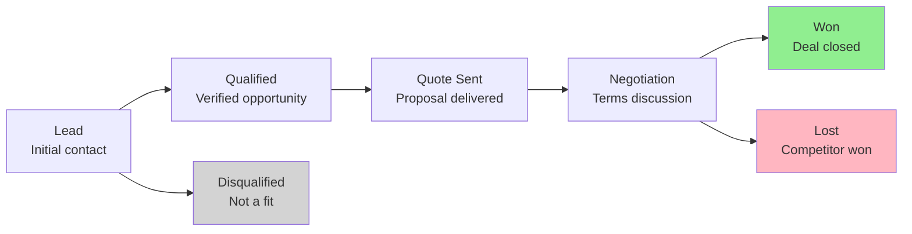
```mermaid
graph LR
    Lead[Lead<br/>Initial contact] --> Qualified[Qualified<br/>Verified opportunity]
    Qualified --> Quote[Quote Sent<br/>Proposal delivered]
    Quote --> Negotiation[Negotiation<br/>Terms discussion]
    Negotiation --> Won[Won<br/>Deal closed]
    Negotiation --> Lost[Lost<br/>Competitor won]
    Lead --> Disqualified[Disqualified<br/>Not a fit]
    
    style Won fill:#90EE90
    style Lost fill:#FFB6C1
    style Disqualified fill:#D3D3D3
```

#### 3.7.2 Data Model

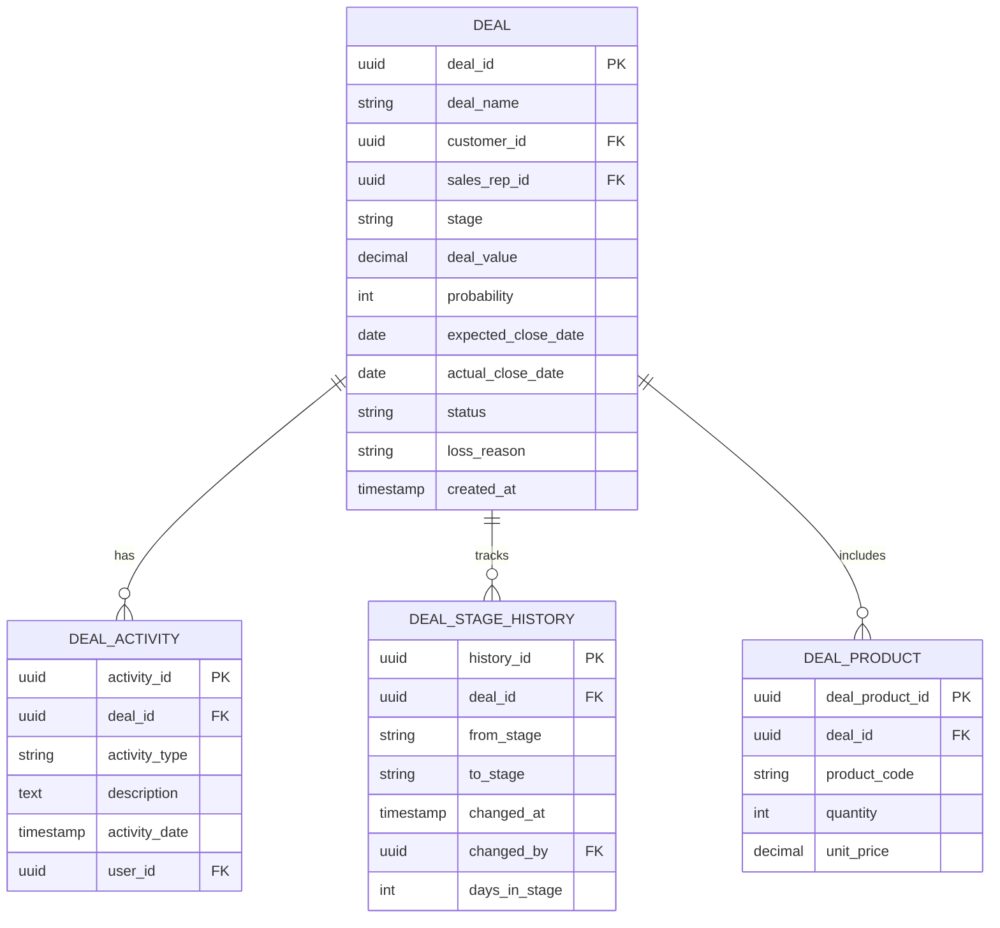
```mermaid
erDiagram
    DEAL {
        uuid deal_id PK
        string deal_name
        uuid customer_id FK
        uuid sales_rep_id FK
        string stage
        decimal deal_value
        int probability
        date expected_close_date
        date actual_close_date
        string status
        string loss_reason
        timestamp created_at
    }
    
    DEAL_ACTIVITY {
        uuid activity_id PK
        uuid deal_id FK
        string activity_type
        text description
        timestamp activity_date
        uuid user_id FK
    }
    
    DEAL_STAGE_HISTORY {
        uuid history_id PK
        uuid deal_id FK
        string from_stage
        string to_stage
        timestamp changed_at
        uuid changed_by FK
        int days_in_stage
    }
    
    DEAL_PRODUCT {
        uuid deal_product_id PK
        uuid deal_id FK
        string product_code
        int quantity
        decimal unit_price
    }
    
    DEAL ||--o{ DEAL_ACTIVITY : has
    DEAL ||--o{ DEAL_STAGE_HISTORY : tracks
    DEAL ||--o{ DEAL_PRODUCT : includes
```

#### 3.7.3 Key Business Logic

**Deal Scoring and Probability:**
```
function calculateDealProbability(deal):
    base_probability = stage_probabilities[deal.stage]
    
    # Adjust based on factors
    adjustments = 0
    
    # Customer engagement
    activities = getRecentActivities(deal.deal_id, days=7)
    if activities.count() > 3:
        adjustments += 10
    elif activities.count() == 0:
        adjustments -= 15
    
    # Time in stage
    days_in_stage = (date.today() - deal.last_stage_change).days
    expected_days = stage_durations[deal.stage]
    if days_in_stage > expected_days * 1.5:
        adjustments -= 10
    
    # Customer history
    if hasSuccessfulPurchaseHistory(deal.customer_id):
        adjustments += 15
    
    # Competitor presence
    if deal.competitors.count() > 2:
        adjustments -= 5
    
    # Budget confirmed
    if deal.budget_confirmed:
        adjustments += 10
    
    # Decision maker engaged
    if hasDecisionMakerContact(deal):
        adjustments += 10
    
    probability = max(0, min(100, base_probability + adjustments))
    
    return probability
```

**Forecast Calculation:**
```
function calculateSalesForecast(sales_rep_id, period):
    deals = getActiveDeals(sales_rep_id, period)
    
    forecast = {
        'best_case': 0,
        'most_likely': 0,
        'worst_case': 0,
        'committed': 0
    }
    
    for deal in deals:
        weighted_value = deal.deal_value * (deal.probability / 100)
        
        if deal.probability >= 90:
            forecast['committed'] += deal.deal_value
        
        if deal.probability >= 70:
            forecast['best_case'] += deal.deal_value
        
        forecast['most_likely'] += weighted_value
        
        if deal.probability >= 50:
            forecast['worst_case'] += weighted_value * 0.7
    
    return forecast
```

#### 3.7.4 API Endpoints

```
POST /api/v1/deals
    Description: Create new deal
    Body: { "deal_name": "...", "customer_id": "...", "deal_value": 100000 }
    Response: { "deal_id": "..." }

GET /api/v1/deals/{deal_id}
    Description: Get deal details
    Response: { "deal": {...}, "activities": [...], "history": [...] }

PUT /api/v1/deals/{deal_id}/stage
    Description: Move deal to next stage
    Body: { "stage": "NEGOTIATION" }
    Response: { "updated": true }

POST /api/v1/deals/{deal_id}/activities
    Description: Log activity
    Body: { "type": "CALL", "description": "..." }
    Response: { "activity_id": "..." }

GET /api/v1/deals/pipeline
    Query params: sales_rep_id, stage, from_date, to_date
    Response: { "deals": [...], "summary": {...} }

GET /api/v1/deals/forecast
    Query params: sales_rep_id, period
    Response: { "best_case": 500000, "most_likely": 350000, ... }
```

---

## 4. Sequence Diagrams

### 4.1 Email Processing Flow

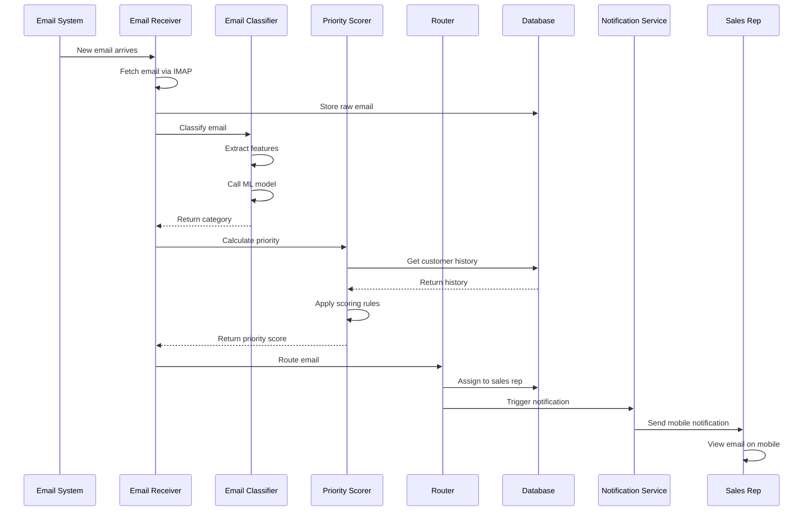
```mermaid
sequenceDiagram
    participant ES as Email System
    participant ER as Email Receiver
    participant EC as Email Classifier
    participant PS as Priority Scorer
    participant RT as Router
    participant DB as Database
    participant NS as Notification Service
    participant SR as Sales Rep
    
    ES->>ER: New email arrives
    ER->>ER: Fetch email via IMAP
    ER->>DB: Store raw email
    ER->>EC: Classify email
    EC->>EC: Extract features
    EC->>EC: Call ML model
    EC-->>ER: Return category
    ER->>PS: Calculate priority
    PS->>DB: Get customer history
    DB-->>PS: Return history
    PS->>PS: Apply scoring rules
    PS-->>ER: Return priority score
    ER->>RT: Route email
    RT->>DB: Assign to sales rep
    RT->>NS: Trigger notification
    NS->>SR: Send mobile notification
    SR->>SR: View email on mobile
```

### 4.2 Quote Generation Flow

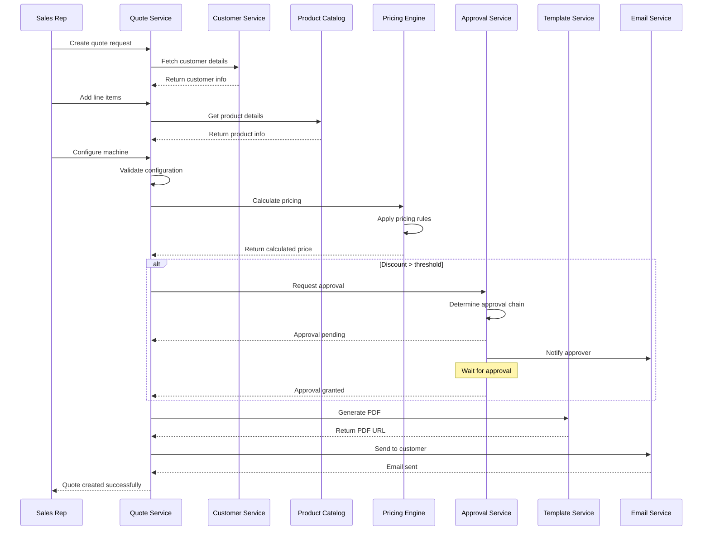
```mermaid
sequenceDiagram
    participant SR as Sales Rep
    participant QS as Quote Service
    participant CS as Customer Service
    participant PC as Product Catalog
    participant PE as Pricing Engine
    participant AS as Approval Service
    participant TS as Template Service
    participant Email as Email Service
    
    SR->>QS: Create quote request
    QS->>CS: Fetch customer details
    CS-->>QS: Return customer info
    SR->>QS: Add line items
    QS->>PC: Get product details
    PC-->>QS: Return product info
    SR->>QS: Configure machine
    QS->>QS: Validate configuration
    QS->>PE: Calculate pricing
    PE->>PE: Apply pricing rules
    PE-->>QS: Return calculated price
    
    alt Discount > threshold
        QS->>AS: Request approval
        AS->>AS: Determine approval chain
        AS-->>QS: Approval pending
        AS->>Email: Notify approver
        Note over AS: Wait for approval
        AS-->>QS: Approval granted
    end
    
    QS->>TS: Generate PDF
    TS-->>QS: Return PDF URL
    QS->>Email: Send to customer
    Email-->>QS: Email sent
    QS-->>SR: Quote created successfully
```

### 4.3 Purchase Order Creation Flow

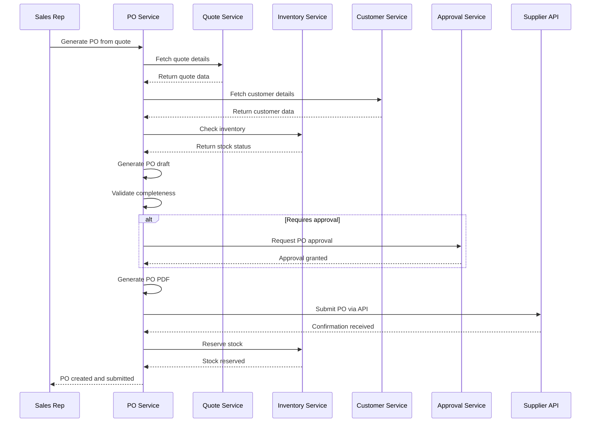
```mermaid
sequenceDiagram
    participant SR as Sales Rep
    participant POS as PO Service
    participant QS as Quote Service
    participant IS as Inventory Service
    participant CS as Customer Service
    participant AS as Approval Service
    participant SUP as Supplier API
    
    SR->>POS: Generate PO from quote
    POS->>QS: Fetch quote details
    QS-->>POS: Return quote data
    POS->>CS: Fetch customer details
    CS-->>POS: Return customer data
    POS->>IS: Check inventory
    IS-->>POS: Return stock status
    POS->>POS: Generate PO draft
    POS->>POS: Validate completeness
    
    alt Requires approval
        POS->>AS: Request PO approval
        AS-->>POS: Approval granted
    end
    
    POS->>POS: Generate PO PDF
    POS->>SUP: Submit PO via API
    SUP-->>POS: Confirmation received
    POS->>IS: Reserve stock
    IS-->>POS: Stock reserved
    POS-->>SR: PO created and submitted
```

---

## 5. Performance Considerations

### 5.1 Caching Strategy

**Redis Cache Layers:**
```
# Customer data cache (TTL: 15 minutes)
customer:360:{customer_id}

# Product catalog cache (TTL: 1 hour)
product:{product_id}

# Inventory cache (TTL: 5 minutes)
inventory:{product_id}:{warehouse_id}

# User sessions (TTL: 24 hours)
session:{session_id}

# API rate limiting
ratelimit:{api_key}:{endpoint}
```

### 5.2 Database Optimization

**Indexes:**
```sql
-- Email queries
CREATE INDEX idx_email_category_priority ON emails(category, priority_score DESC, received_at DESC);
CREATE INDEX idx_email_assignment ON emails(sales_rep_id, status);

-- Customer queries
CREATE INDEX idx_customer_search ON customers USING gin(to_tsvector('english', company_name));
CREATE INDEX idx_customer_code ON customers(customer_code);

-- Quote queries
CREATE INDEX idx_quote_customer ON quotes(customer_id, quote_date DESC);
CREATE INDEX idx_quote_status ON quotes(status, valid_until);

-- Inventory queries
CREATE INDEX idx_inventory_product ON inventory(product_id, warehouse_id);
CREATE INDEX idx_inventory_available ON inventory(product_id, quantity_available) WHERE quantity_available > 0;

-- Deal queries
CREATE INDEX idx_deal_pipeline ON deals(sales_rep_id, stage, status);
CREATE INDEX idx_deal_close_date ON deals(expected_close_date, status);
```

### 5.3 Scalability Patterns

**Horizontal Scaling:**
- Stateless services enable easy replication
- Load balancer distributes traffic across instances
- Database read replicas for query distribution
- Message queue for asynchronous processing

**Vertical Scaling:**
- Increase resources for database servers
- Optimize memory for caching layers
- CPU scaling for compute-intensive operations

---

## 6. Error Handling

### 6.1 Error Response Format

```json
{
  "error": {
    "code": "VALIDATION_ERROR",
    "message": "Configuration validation failed",
    "details": [
      {
        "field": "bucket_size",
        "message": "Bucket size not compatible with selected model"
      }
    ],
    "trace_id": "550e8400-e29b-41d4-a716-446655440000",
    "timestamp": "2025-11-24T05:32:00Z"
  }
}
```

### 6.2 Retry Strategy

```
function callExternalService(service, method, params, max_retries=3):
    for attempt in range(1, max_retries + 1):
        try:
            response = service.call(method, params)
            return response
        except TemporaryError as e:
            if attempt == max_retries:
                raise
            wait_time = calculate_exponential_backoff(attempt)
            sleep(wait_time)
        except PermanentError as e:
            # Don't retry permanent errors
            raise
```

---

## 7. Security Implementation

### 7.1 Authentication Flow

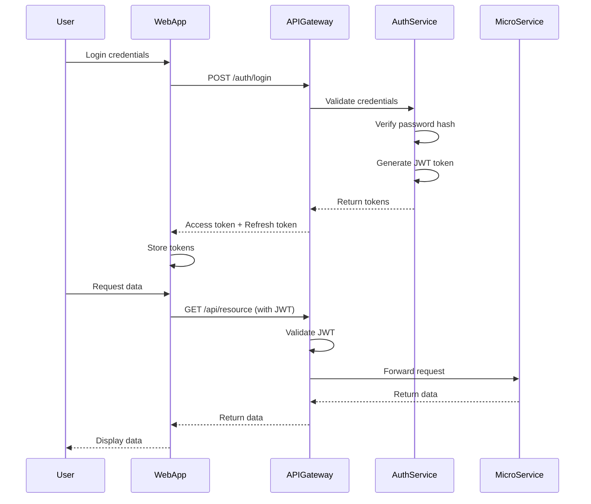
```mermaid
sequenceDiagram
    participant User
    participant WebApp
    participant APIGateway
    participant AuthService
    participant MicroService
    
    User->>WebApp: Login credentials
    WebApp->>APIGateway: POST /auth/login
    APIGateway->>AuthService: Validate credentials
    AuthService->>AuthService: Verify password hash
    AuthService->>AuthService: Generate JWT token
    AuthService-->>APIGateway: Return tokens
    APIGateway-->>WebApp: Access token + Refresh token
    WebApp->>WebApp: Store tokens
    
    User->>WebApp: Request data
    WebApp->>APIGateway: GET /api/resource (with JWT)
    APIGateway->>APIGateway: Validate JWT
    APIGateway->>MicroService: Forward request
    MicroService-->>APIGateway: Return data
    APIGateway-->>WebApp: Return data
    WebApp-->>User: Display data
```

### 7.2 Authorization Rules

```
# Role-based permissions
roles:
  sales_rep:
    - read:customers
    - read:quotes
    - create:quotes
    - update:own_quotes
    - read:inventory
    - create:deals
  
  sales_manager:
    - inherit:sales_rep
    - read:all_quotes
    - update:all_quotes
    - approve:discounts
    - read:reports
  
  accounts_team:
    - approve:credit
    - approve:payments
    - read:financial_data
  
  admin:
    - all:*
```

---

## 8. Monitoring and Observability

### 8.1 Metrics to Track

**Application Metrics:**
- Request rate (requests/second)
- Response time (p50, p95, p99)
- Error rate (errors/total requests)
- Active user count
- Cache hit rate

**Business Metrics:**
- Email processing time
- Quote generation time
- PO creation time
- Approval turnaround time
- Deal conversion rate

**Infrastructure Metrics:**
- CPU utilization
- Memory usage
- Disk I/O
- Network throughput
- Database connection pool

### 8.2 Logging Standards

```
# Structured logging format
{
  "timestamp": "2025-11-24T05:32:00.123Z",
  "level": "INFO",
  "service": "quote-service",
  "trace_id": "550e8400-e29b-41d4-a716-446655440000",
  "user_id": "user-123",
  "message": "Quote generated successfully",
  "context": {
    "quote_id": "quote-789",
    "customer_id": "cust-456",
    "total_amount": 125000.00
  }
}
```

---

## 9. Testing Strategy

### 9.1 Unit Tests
- Test individual functions and methods
- Mock external dependencies
- Target: > 80% code coverage

### 9.2 Integration Tests
- Test service-to-service communication
- Test database interactions
- Test external API integrations

### 9.3 End-to-End Tests
- Test complete user workflows
- Test critical business processes
- Automated using Selenium/Cypress

### 9.4 Performance Tests
- Load testing (1000+ concurrent users)
- Stress testing (beyond expected capacity)
- Endurance testing (sustained load over time)

---

## 10. Deployment Procedures

### 10.1 CI/CD Pipeline


```mermaid
graph LR
    A[Code Commit] --> B[Build]
    B --> C[Unit Tests]
    C --> D[Integration Tests]
    D --> E[Security Scan]
    E --> F[Build Docker Image]
    F --> G[Push to Registry]
    G --> H[Deploy to Staging]
    H --> I[E2E Tests]
    I --> J[Deploy to Production]
    J --> K[Health Check]
    K --> L[Monitor]
```

### 10.2 Database Migration

```
# Migration script template
def upgrade():
    # Add new columns, tables, indexes
    op.add_column('quotes', sa.Column('tax_rate', sa.Decimal(5,2)))
    op.create_index('idx_quote_tax', 'quotes', ['tax_rate'])

def downgrade():
    # Rollback changes
    op.drop_index('idx_quote_tax')
    op.drop_column('quotes', 'tax_rate')
```

---

**Document Control:**
- Version: 1.0
- Last Updated: 2025-11-24
- Status: Draft for Review
- Owner: Development Team
