# Solution Architecture Document
## Dealer Sales & Customer Management System with AI-Powered Automation

---

## Document Information
- **Document Version:** 1.0
- **Date:** December 2025
- **Status:** Final
- **Architecture Style:** Cloud-Native, Microservices, AI-Driven

---

## 1. Team Structure

### 1.1 Core Team Roles

| Role | Responsibilities | Key Deliverables |
|------|------------------|------------------|
| **Product Manager** | Define product vision, prioritize features, manage roadmap, stakeholder communication | PRD, Feature prioritization, Release planning |
| **Business Analyst** | Requirements gathering, process mapping, user story creation, acceptance criteria | User stories, Process flows, Business rules |
| **Solution Architect** | System design, technology selection, integration patterns, technical governance | Architecture documents, ADRs, Technical standards |
| **Technical Lead** | Implementation oversight, code reviews, technical mentorship, sprint planning | Technical specifications, Code standards, Team guidance |
| **Developers** | Feature implementation, unit testing, bug fixes, documentation | Working code, Unit tests, Technical documentation |
| **Stakeholders** | Business requirements, feedback, acceptance testing, go/no-go decisions | Business validation, UAT sign-off, Strategic direction |

### 1.2 Extended Team

| Role | Responsibilities |
|------|------------------|
| **DevOps Engineer** | CI/CD pipelines, infrastructure automation, monitoring |
| **QA Engineer** | Test strategy, automated testing, quality assurance |
| **UX Designer** | User experience design, prototyping, usability testing |
| **Data Engineer** | Data pipelines, ETL processes, data quality |
| **Security Engineer** | Security reviews, vulnerability assessment, compliance |

---

## 2. Technology Stack Overview

### 2.1 Core Technologies

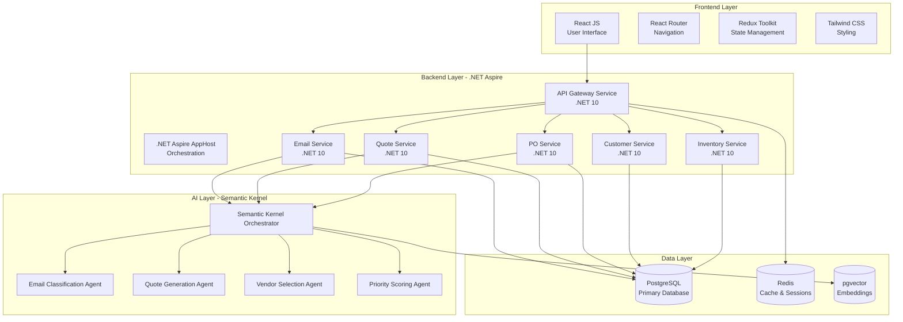

### 2.2 Technology Specifications

| Component | Technology | Version | Purpose |
|-----------|------------|---------|---------|
| **Backend Framework** | .NET Aspire | .NET 10 | Cloud-native orchestration and service discovery |
| **Frontend Framework** | React JS | 18.x | Modern, component-based UI |
| **AI/ML Framework** | Semantic Kernel | 1.x | AI orchestration, custom skills, agent communication |
| **Primary Database** | PostgreSQL | 16.x | Transactional data, JSONB support |
| **Vector Database** | pgvector | 0.6.x | AI embeddings and semantic search |
| **Cache** | Redis | 7.x | Session management, caching |
| **Message Queue** | RabbitMQ | 3.x | Async communication, event-driven |
| **Container Orchestration** | Kubernetes | 1.29+ | Container management and scaling |

---

## 3. .NET Aspire Architecture (.NET 10)

### 3.1 AppHost Configuration

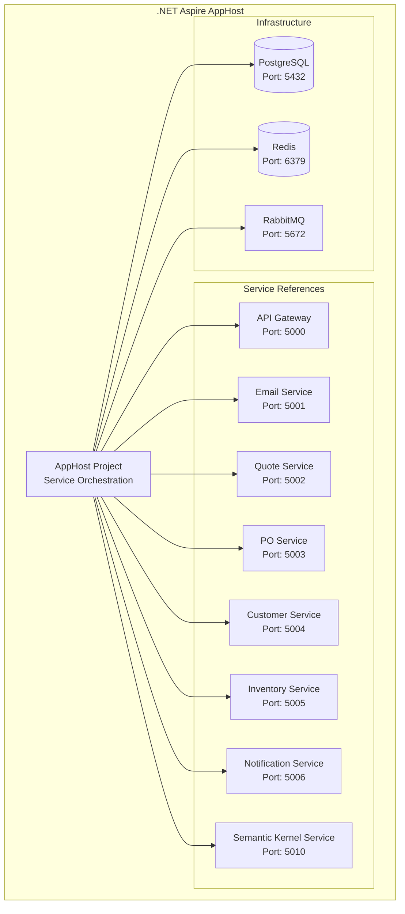

### 3.2 Service Architecture

```
DealerManagementSystem/
├── DealerManagement.AppHost/           # .NET Aspire orchestrator
│   ├── Program.cs                      # Service registration
│   └── appsettings.json               # Configuration
├── DealerManagement.ServiceDefaults/   # Shared service configuration
│   ├── Extensions.cs                   # Common extensions
│   └── OpenTelemetry.cs               # Observability setup
├── Services/
│   ├── DealerManagement.ApiGateway/   # API Gateway (Yarp)
│   ├── DealerManagement.EmailService/ # Email processing
│   ├── DealerManagement.QuoteService/ # Quote generation
│   ├── DealerManagement.POService/    # Purchase order management
│   ├── DealerManagement.CustomerService/ # Customer management
│   ├── DealerManagement.InventoryService/ # Inventory tracking
│   ├── DealerManagement.NotificationService/ # Notifications
│   └── DealerManagement.SemanticKernel/ # AI orchestration
├── Shared/
│   ├── DealerManagement.Contracts/    # Shared DTOs and interfaces
│   └── DealerManagement.Domain/       # Domain models
└── Frontend/
    └── dealer-management-ui/          # React JS application
```

---

## 4. Semantic Kernel Architecture

### 4.1 Semantic Kernel Orchestrator

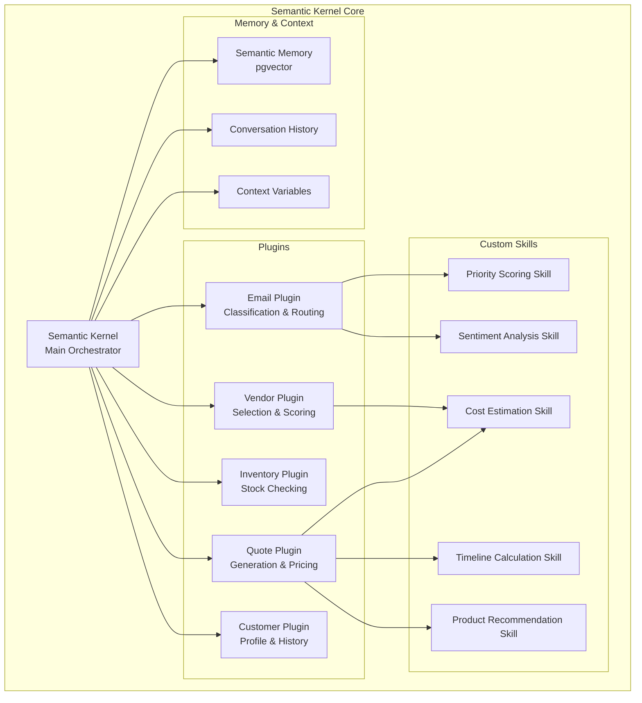

### 4.2 Custom Skills Implementation

#### 4.2.1 Email Classification Skill

```csharp
// Skill: EmailClassificationSkill
[SKFunction, Description("Classifies incoming emails into categories")]
public async Task<EmailClassification> ClassifyEmailAsync(
    [Description("Email subject")] string subject,
    [Description("Email body")] string body,
    [Description("Sender email address")] string senderEmail)
{
    // Categories: INQUIRY, SERVICE, TENDER, SUPPLIER, SPAM
    // Returns: Category, Confidence, Priority Score
}
```

#### 4.2.2 Cost Estimation Skill

```csharp
// Skill: CostEstimationSkill
[SKFunction, Description("Estimates cost for machine configurations")]
public async Task<CostEstimate> EstimateCostAsync(
    [Description("Base machine model")] string baseModel,
    [Description("Configuration options")] MachineConfiguration config,
    [Description("Customer ID for pricing tier")] string customerId)
{
    // Returns: BasePrice, OptionsPrice, Discounts, TotalPrice, Margin
}
```

#### 4.2.3 Vendor Selection Skill

```csharp
// Skill: VendorSelectionSkill
[SKFunction, Description("Selects optimal vendor based on criteria")]
public async Task<VendorRecommendation> SelectVendorAsync(
    [Description("Product requirements")] ProductRequirements requirements,
    [Description("Delivery timeline")] DateTime requiredDate,
    [Description("Optimization criteria")] string criteria)
{
    // Returns: RecommendedVendor, AlternativeVendors, Reasoning
}
```

#### 4.2.4 Timeline Calculation Skill

```csharp
// Skill: TimelineCalculationSkill
[SKFunction, Description("Calculates delivery timeline")]
public async Task<DeliveryTimeline> CalculateTimelineAsync(
    [Description("Product configuration")] MachineConfiguration config,
    [Description("Stock availability")] StockStatus stockStatus,
    [Description("Delivery location")] string deliveryLocation)
{
    // Returns: EstimatedDate, ConfidenceLevel, RiskFactors
}
```

#### 4.2.5 Priority Scoring Skill

```csharp
// Skill: PriorityScoringSkill
[SKFunction, Description("Calculates priority score for emails/tasks")]
public async Task<PriorityScore> CalculatePriorityAsync(
    [Description("Customer information")] CustomerProfile customer,
    [Description("Content to analyze")] string content,
    [Description("Historical context")] CustomerHistory history)
{
    // Returns: Score (1-10), Factors, RecommendedSLA
}
```

---

## 5. Agent-to-Agent Protocol

### 5.1 Agent Communication Architecture

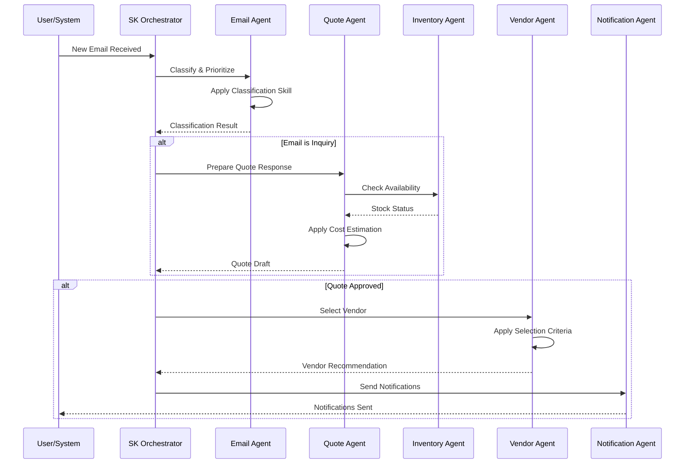

### 5.2 Agent Message Protocol

```json
{
  "protocol": "A2A-v1",
  "messageId": "uuid",
  "timestamp": "ISO8601",
  "source": {
    "agentId": "email-agent",
    "agentType": "EmailClassificationAgent"
  },
  "destination": {
    "agentId": "quote-agent",
    "agentType": "QuoteGenerationAgent"
  },
  "messageType": "REQUEST|RESPONSE|EVENT|COMMAND",
  "payload": {
    "action": "GENERATE_QUOTE",
    "context": {
      "customerId": "CUST-001",
      "emailId": "EMAIL-123",
      "requirements": {}
    }
  },
  "metadata": {
    "correlationId": "uuid",
    "priority": "HIGH|MEDIUM|LOW",
    "ttl": 3600
  }
}
```

### 5.3 Agent Types and Responsibilities

| Agent | Type | Responsibilities | Skills Used |
|-------|------|------------------|-------------|
| **Email Agent** | Classification | Email categorization, priority scoring, routing | EmailClassification, PriorityScoring, Sentiment |
| **Quote Agent** | Generation | Quote creation, pricing, configuration validation | CostEstimation, Timeline, Recommendation |
| **Inventory Agent** | Query | Stock checking, reservation, availability | InventoryQuery, StockPrediction |
| **Vendor Agent** | Selection | Vendor matching, performance scoring | VendorSelection, CostOptimization |
| **Customer Agent** | Profile | Customer 360 view, history analysis | CustomerInsight, CreditCheck |
| **Notification Agent** | Communication | Multi-channel notifications, templates | MessageComposition, ChannelSelection |
| **Approval Agent** | Workflow | Approval routing, escalation | WorkflowRouting, EscalationLogic |

---

## 6. React JS Frontend Architecture

### 6.1 Application Structure

```
dealer-management-ui/
├── public/
│   └── index.html
├── src/
│   ├── components/
│   │   ├── common/
│   │   │   ├── Button.tsx
│   │   │   ├── Modal.tsx
│   │   │   ├── DataTable.tsx
│   │   │   └── LoadingSpinner.tsx
│   │   ├── dashboard/
│   │   │   ├── DashboardLayout.tsx
│   │   │   ├── MetricsCard.tsx
│   │   │   └── PipelineChart.tsx
│   │   ├── email/
│   │   │   ├── EmailList.tsx
│   │   │   ├── EmailDetail.tsx
│   │   │   └── EmailComposer.tsx
│   │   ├── quotes/
│   │   │   ├── QuoteBuilder.tsx
│   │   │   ├── QuoteList.tsx
│   │   │   └── ConfigurationWizard.tsx
│   │   ├── orders/
│   │   │   ├── POList.tsx
│   │   │   ├── PODetail.tsx
│   │   │   └── DeliveryTracker.tsx
│   │   ├── customers/
│   │   │   ├── CustomerList.tsx
│   │   │   ├── Customer360View.tsx
│   │   │   └── CustomerForm.tsx
│   │   └── inventory/
│   │       ├── StockDashboard.tsx
│   │       └── WarehouseView.tsx
│   ├── features/
│   │   ├── auth/
│   │   ├── email/
│   │   ├── quotes/
│   │   ├── orders/
│   │   ├── customers/
│   │   └── inventory/
│   ├── services/
│   │   ├── api.ts
│   │   ├── authService.ts
│   │   └── websocketService.ts
│   ├── store/
│   │   ├── index.ts
│   │   ├── slices/
│   │   └── middleware/
│   ├── hooks/
│   ├── utils/
│   ├── types/
│   ├── App.tsx
│   └── index.tsx
├── package.json
└── vite.config.ts
```

### 6.2 Component Architecture

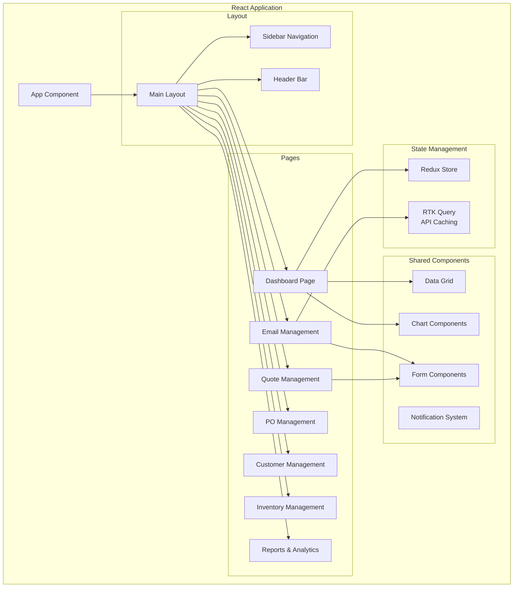

---

## 7. PostgreSQL Database Architecture

### 7.1 Database Schema Overview

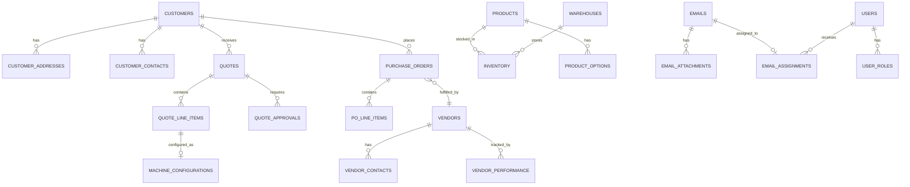

### 7.2 Core Tables

#### 7.2.1 Customer Tables

```sql
-- Customers
CREATE TABLE customers (
    customer_id UUID PRIMARY KEY DEFAULT gen_random_uuid(),
    customer_code VARCHAR(50) UNIQUE NOT NULL,
    company_name VARCHAR(255) NOT NULL,
    tax_number VARCHAR(50),
    email VARCHAR(255),
    phone VARCHAR(50),
    customer_type VARCHAR(50) DEFAULT 'STANDARD',
    status VARCHAR(20) DEFAULT 'ACTIVE',
    credit_limit DECIMAL(15,2) DEFAULT 0,
    payment_terms INTEGER DEFAULT 30,
    created_at TIMESTAMP DEFAULT CURRENT_TIMESTAMP,
    updated_at TIMESTAMP DEFAULT CURRENT_TIMESTAMP
);

-- Customer Addresses
CREATE TABLE customer_addresses (
    address_id UUID PRIMARY KEY DEFAULT gen_random_uuid(),
    customer_id UUID REFERENCES customers(customer_id),
    address_type VARCHAR(50) NOT NULL,
    street_address TEXT,
    city VARCHAR(100),
    state VARCHAR(100),
    postal_code VARCHAR(20),
    country VARCHAR(100),
    is_primary BOOLEAN DEFAULT FALSE
);

-- Customer Contacts
CREATE TABLE customer_contacts (
    contact_id UUID PRIMARY KEY DEFAULT gen_random_uuid(),
    customer_id UUID REFERENCES customers(customer_id),
    first_name VARCHAR(100),
    last_name VARCHAR(100),
    email VARCHAR(255),
    phone VARCHAR(50),
    designation VARCHAR(100),
    is_primary BOOLEAN DEFAULT FALSE,
    is_decision_maker BOOLEAN DEFAULT FALSE
);
```

#### 7.2.2 Product & Inventory Tables

```sql
-- Products
CREATE TABLE products (
    product_id UUID PRIMARY KEY DEFAULT gen_random_uuid(),
    product_code VARCHAR(50) UNIQUE NOT NULL,
    product_name VARCHAR(255) NOT NULL,
    category VARCHAR(100),
    manufacturer VARCHAR(100),
    base_price DECIMAL(15,2),
    description TEXT,
    specifications JSONB,
    status VARCHAR(20) DEFAULT 'ACTIVE',
    created_at TIMESTAMP DEFAULT CURRENT_TIMESTAMP
);

-- Product Options
CREATE TABLE product_options (
    option_id UUID PRIMARY KEY DEFAULT gen_random_uuid(),
    product_id UUID REFERENCES products(product_id),
    option_type VARCHAR(50) NOT NULL,
    option_name VARCHAR(100) NOT NULL,
    option_value VARCHAR(255),
    additional_price DECIMAL(15,2) DEFAULT 0,
    is_default BOOLEAN DEFAULT FALSE
);

-- Warehouses
CREATE TABLE warehouses (
    warehouse_id UUID PRIMARY KEY DEFAULT gen_random_uuid(),
    warehouse_code VARCHAR(50) UNIQUE NOT NULL,
    warehouse_name VARCHAR(255) NOT NULL,
    address TEXT,
    city VARCHAR(100),
    country VARCHAR(100),
    is_active BOOLEAN DEFAULT TRUE
);

-- Inventory
CREATE TABLE inventory (
    inventory_id UUID PRIMARY KEY DEFAULT gen_random_uuid(),
    product_id UUID REFERENCES products(product_id),
    warehouse_id UUID REFERENCES warehouses(warehouse_id),
    quantity_on_hand INTEGER DEFAULT 0,
    quantity_reserved INTEGER DEFAULT 0,
    quantity_available INTEGER GENERATED ALWAYS AS (quantity_on_hand - quantity_reserved) STORED,
    reorder_level INTEGER DEFAULT 5,
    last_updated TIMESTAMP DEFAULT CURRENT_TIMESTAMP,
    UNIQUE(product_id, warehouse_id)
);
```

#### 7.2.3 Quote Tables

```sql
-- Quotes
CREATE TABLE quotes (
    quote_id UUID PRIMARY KEY DEFAULT gen_random_uuid(),
    quote_number VARCHAR(50) UNIQUE NOT NULL,
    customer_id UUID REFERENCES customers(customer_id),
    sales_rep_id UUID REFERENCES users(user_id),
    quote_date DATE DEFAULT CURRENT_DATE,
    valid_until DATE,
    status VARCHAR(50) DEFAULT 'DRAFT',
    subtotal DECIMAL(15,2),
    discount_amount DECIMAL(15,2) DEFAULT 0,
    discount_percent DECIMAL(5,2) DEFAULT 0,
    tax_amount DECIMAL(15,2) DEFAULT 0,
    total_amount DECIMAL(15,2),
    currency VARCHAR(3) DEFAULT 'USD',
    notes TEXT,
    created_at TIMESTAMP DEFAULT CURRENT_TIMESTAMP,
    updated_at TIMESTAMP DEFAULT CURRENT_TIMESTAMP
);

-- Quote Line Items
CREATE TABLE quote_line_items (
    line_item_id UUID PRIMARY KEY DEFAULT gen_random_uuid(),
    quote_id UUID REFERENCES quotes(quote_id),
    product_id UUID REFERENCES products(product_id),
    product_code VARCHAR(50),
    product_name VARCHAR(255),
    quantity INTEGER DEFAULT 1,
    unit_price DECIMAL(15,2),
    discount_percent DECIMAL(5,2) DEFAULT 0,
    line_total DECIMAL(15,2),
    configuration_id UUID
);

-- Machine Configurations
CREATE TABLE machine_configurations (
    config_id UUID PRIMARY KEY DEFAULT gen_random_uuid(),
    line_item_id UUID REFERENCES quote_line_items(line_item_id),
    base_model VARCHAR(100),
    bucket_size VARCHAR(50),
    tire_type VARCHAR(50),
    attachment_1 VARCHAR(100),
    attachment_2 VARCHAR(100),
    warranty_package VARCHAR(50),
    special_instructions TEXT,
    configuration_data JSONB
);
```

#### 7.2.4 Purchase Order Tables

```sql
-- Vendors
CREATE TABLE vendors (
    vendor_id UUID PRIMARY KEY DEFAULT gen_random_uuid(),
    vendor_code VARCHAR(50) UNIQUE NOT NULL,
    vendor_name VARCHAR(255) NOT NULL,
    email VARCHAR(255),
    phone VARCHAR(50),
    address TEXT,
    payment_terms INTEGER DEFAULT 30,
    status VARCHAR(20) DEFAULT 'ACTIVE',
    rating DECIMAL(3,2) DEFAULT 0,
    created_at TIMESTAMP DEFAULT CURRENT_TIMESTAMP
);

-- Purchase Orders
CREATE TABLE purchase_orders (
    po_id UUID PRIMARY KEY DEFAULT gen_random_uuid(),
    po_number VARCHAR(50) UNIQUE NOT NULL,
    vendor_id UUID REFERENCES vendors(vendor_id),
    quote_id UUID REFERENCES quotes(quote_id),
    customer_id UUID REFERENCES customers(customer_id),
    po_date DATE DEFAULT CURRENT_DATE,
    expected_delivery_date DATE,
    actual_delivery_date DATE,
    status VARCHAR(50) DEFAULT 'DRAFT',
    total_amount DECIMAL(15,2),
    currency VARCHAR(3) DEFAULT 'USD',
    shipping_address TEXT,
    notes TEXT,
    created_by UUID REFERENCES users(user_id),
    created_at TIMESTAMP DEFAULT CURRENT_TIMESTAMP,
    updated_at TIMESTAMP DEFAULT CURRENT_TIMESTAMP
);

-- PO Line Items
CREATE TABLE po_line_items (
    po_line_id UUID PRIMARY KEY DEFAULT gen_random_uuid(),
    po_id UUID REFERENCES purchase_orders(po_id),
    product_id UUID REFERENCES products(product_id),
    product_code VARCHAR(50),
    product_description TEXT,
    quantity INTEGER DEFAULT 1,
    unit_price DECIMAL(15,2),
    line_total DECIMAL(15,2),
    configuration_data JSONB
);
```

#### 7.2.5 Email Tables

```sql
-- Emails
CREATE TABLE emails (
    email_id UUID PRIMARY KEY DEFAULT gen_random_uuid(),
    message_id VARCHAR(255) UNIQUE,
    from_address VARCHAR(255),
    to_address VARCHAR(255),
    subject VARCHAR(500),
    body_html TEXT,
    body_text TEXT,
    received_at TIMESTAMP,
    category VARCHAR(50),
    priority_score INTEGER DEFAULT 5,
    status VARCHAR(50) DEFAULT 'UNREAD',
    customer_id UUID REFERENCES customers(customer_id),
    ai_classification JSONB,
    created_at TIMESTAMP DEFAULT CURRENT_TIMESTAMP
);

-- Email Assignments
CREATE TABLE email_assignments (
    assignment_id UUID PRIMARY KEY DEFAULT gen_random_uuid(),
    email_id UUID REFERENCES emails(email_id),
    assigned_to UUID REFERENCES users(user_id),
    assigned_at TIMESTAMP DEFAULT CURRENT_TIMESTAMP,
    status VARCHAR(50) DEFAULT 'ASSIGNED',
    responded_at TIMESTAMP,
    response_time_minutes INTEGER
);
```

### 7.3 Vector Store for AI (pgvector)

```sql
-- Enable pgvector extension
CREATE EXTENSION IF NOT EXISTS vector;

-- Email Embeddings for semantic search
CREATE TABLE email_embeddings (
    embedding_id UUID PRIMARY KEY DEFAULT gen_random_uuid(),
    email_id UUID REFERENCES emails(email_id),
    embedding vector(1536),
    model_version VARCHAR(50),
    created_at TIMESTAMP DEFAULT CURRENT_TIMESTAMP
);

-- Customer Profile Embeddings
CREATE TABLE customer_embeddings (
    embedding_id UUID PRIMARY KEY DEFAULT gen_random_uuid(),
    customer_id UUID REFERENCES customers(customer_id),
    embedding vector(1536),
    embedding_type VARCHAR(50),
    created_at TIMESTAMP DEFAULT CURRENT_TIMESTAMP
);

-- Product Embeddings for recommendations
CREATE TABLE product_embeddings (
    embedding_id UUID PRIMARY KEY DEFAULT gen_random_uuid(),
    product_id UUID REFERENCES products(product_id),
    embedding vector(1536),
    created_at TIMESTAMP DEFAULT CURRENT_TIMESTAMP
);

-- Create indexes for similarity search
CREATE INDEX ON email_embeddings USING ivfflat (embedding vector_cosine_ops);
CREATE INDEX ON customer_embeddings USING ivfflat (embedding vector_cosine_ops);
CREATE INDEX ON product_embeddings USING ivfflat (embedding vector_cosine_ops);
```

---

## 8. Orchestrator Architecture

### 8.1 Workflow Orchestrator

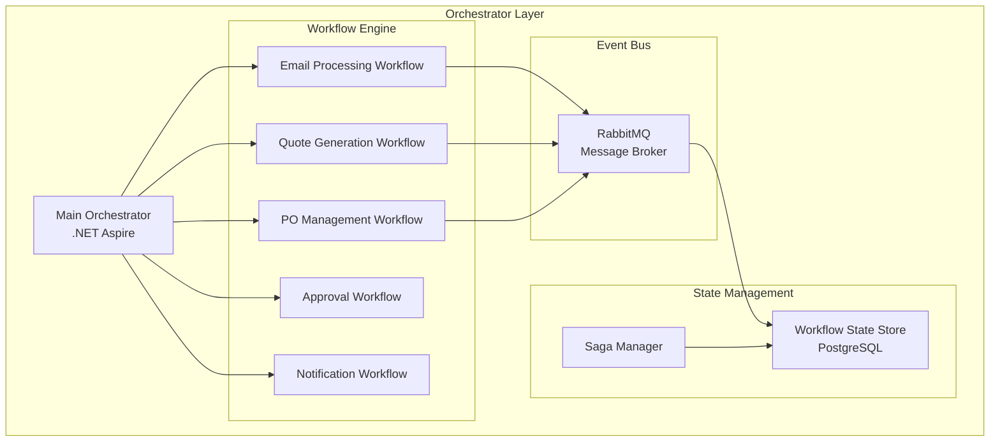

### 8.2 Orchestrator Requirements

| Requirement | Implementation | Purpose |
|-------------|----------------|---------|
| **Service Discovery** | .NET Aspire Service Discovery | Automatic service registration and discovery |
| **Load Balancing** | YARP Reverse Proxy | Distribute traffic across service instances |
| **Health Monitoring** | .NET Aspire Dashboard | Real-time health checks and metrics |
| **Configuration Management** | .NET Aspire Configuration | Centralized configuration for all services |
| **Distributed Tracing** | OpenTelemetry | End-to-end request tracing |
| **Saga Pattern** | MassTransit Saga | Long-running transaction management |
| **Event Sourcing** | Marten | Event store for audit and replay |

### 8.3 Workflow Definitions

#### 8.3.1 Email Processing Workflow

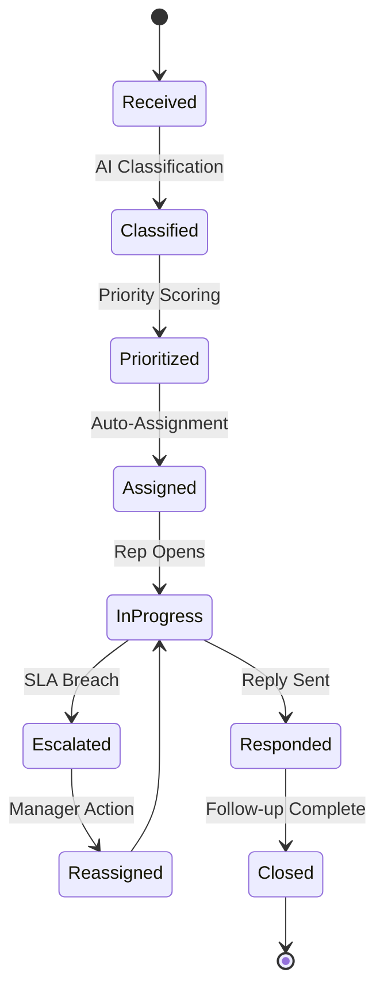

#### 8.3.2 Quote-to-Order Workflow

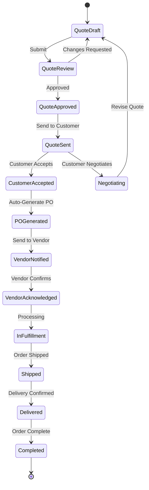

---

## 9. Seed Data Requirements

### 9.1 ERP Seed Data

```sql
-- ERP Integration Configuration
INSERT INTO erp_configurations (config_key, config_value, description) VALUES
('ERP_SYSTEM_TYPE', 'SAP_S4HANA', 'ERP System Type'),
('ERP_API_ENDPOINT', 'https://erp.company.com/api/v1', 'ERP API Base URL'),
('SYNC_INTERVAL_MINUTES', '15', 'Data sync interval'),
('CUSTOMER_SYNC_ENABLED', 'true', 'Enable customer data sync'),
('INVENTORY_SYNC_ENABLED', 'true', 'Enable inventory sync'),
('FINANCIAL_SYNC_ENABLED', 'true', 'Enable financial data sync');

-- Sample ERP Customer Data
INSERT INTO customers (customer_code, company_name, tax_number, email, customer_type, credit_limit) VALUES
('ERP-CUST-001', 'ABC Construction Ltd', 'TAX123456', 'procurement@abcconstruction.com', 'ENTERPRISE', 500000.00),
('ERP-CUST-002', 'XYZ Mining Corp', 'TAX234567', 'orders@xyzmining.com', 'ENTERPRISE', 1000000.00),
('ERP-CUST-003', 'Metro Infrastructure', 'TAX345678', 'purchasing@metroinfra.com', 'GOVERNMENT', 750000.00),
('ERP-CUST-004', 'Green Earth Landscaping', 'TAX456789', 'info@greenearth.com', 'SMB', 100000.00),
('ERP-CUST-005', 'Pacific Ports Authority', 'TAX567890', 'procurement@pacificports.gov', 'GOVERNMENT', 2000000.00);

-- Sample ERP Product Catalog
INSERT INTO products (product_code, product_name, category, manufacturer, base_price, specifications) VALUES
('EXC-XL500', 'Excavator XL-500', 'EXCAVATORS', 'HeavyMach Inc', 450000.00, '{"weight_tons": 25, "engine_hp": 180, "bucket_capacity_m3": 1.2}'),
('EXC-XL750', 'Excavator XL-750', 'EXCAVATORS', 'HeavyMach Inc', 680000.00, '{"weight_tons": 35, "engine_hp": 250, "bucket_capacity_m3": 1.8}'),
('LDR-M300', 'Loader M-300', 'LOADERS', 'HeavyMach Inc', 280000.00, '{"weight_tons": 15, "engine_hp": 150, "bucket_capacity_m3": 2.5}'),
('LDR-M500', 'Loader M-500', 'LOADERS', 'HeavyMach Inc', 420000.00, '{"weight_tons": 22, "engine_hp": 200, "bucket_capacity_m3": 3.5}'),
('BLD-D400', 'Bulldozer D-400', 'BULLDOZERS', 'HeavyMach Inc', 520000.00, '{"weight_tons": 30, "engine_hp": 220, "blade_width_m": 4.2}'),
('CRN-T100', 'Crane T-100', 'CRANES', 'LiftMax Corp', 890000.00, '{"max_capacity_tons": 100, "max_height_m": 60, "boom_length_m": 45}'),
('DMP-H200', 'Dump Truck H-200', 'TRUCKS', 'TransHaul Ltd', 320000.00, '{"payload_tons": 20, "engine_hp": 400, "bed_volume_m3": 15}');

-- Sample ERP Inventory Data
INSERT INTO warehouses (warehouse_code, warehouse_name, city, country) VALUES
('WH-MAIN', 'Main Distribution Center', 'Chicago', 'USA'),
('WH-WEST', 'West Coast Facility', 'Los Angeles', 'USA'),
('WH-EAST', 'East Coast Facility', 'Newark', 'USA'),
('WH-SOUTH', 'Southern Hub', 'Houston', 'USA');

INSERT INTO inventory (product_id, warehouse_id, quantity_on_hand, quantity_reserved, reorder_level)
SELECT p.product_id, w.warehouse_id, 
    CASE WHEN w.warehouse_code = 'WH-MAIN' THEN 10 ELSE 5 END,
    0,
    3
FROM products p CROSS JOIN warehouses w;
```

### 9.2 CRM Seed Data

```sql
-- CRM Configuration
INSERT INTO crm_configurations (config_key, config_value, description) VALUES
('CRM_SYSTEM_TYPE', 'SALESFORCE', 'CRM System Type'),
('CRM_API_ENDPOINT', 'https://crm.company.com/api/v1', 'CRM API Base URL'),
('LEAD_SYNC_ENABLED', 'true', 'Enable lead sync'),
('OPPORTUNITY_SYNC_ENABLED', 'true', 'Enable opportunity sync'),
('CONTACT_SYNC_ENABLED', 'true', 'Enable contact sync');

-- Sample CRM Contacts
INSERT INTO customer_contacts (customer_id, first_name, last_name, email, phone, designation, is_primary, is_decision_maker)
SELECT c.customer_id, 'John', 'Smith', 'john.smith@' || LOWER(REPLACE(c.company_name, ' ', '')) || '.com', 
    '+1-555-0101', 'Procurement Manager', true, true
FROM customers c WHERE c.customer_code = 'ERP-CUST-001';

INSERT INTO customer_contacts (customer_id, first_name, last_name, email, phone, designation, is_primary, is_decision_maker)
SELECT c.customer_id, 'Sarah', 'Johnson', 'sarah.j@' || LOWER(REPLACE(c.company_name, ' ', '')) || '.com',
    '+1-555-0102', 'Operations Director', false, true
FROM customers c WHERE c.customer_code = 'ERP-CUST-002';

-- Sample CRM Opportunities/Deals
INSERT INTO deals (deal_name, customer_id, sales_rep_id, stage, deal_value, probability, expected_close_date)
SELECT 
    'Fleet Expansion - ' || c.company_name,
    c.customer_id,
    (SELECT user_id FROM users WHERE role = 'SALES_REP' LIMIT 1),
    'QUALIFIED',
    1500000.00,
    40,
    CURRENT_DATE + INTERVAL '60 days'
FROM customers c WHERE c.customer_code = 'ERP-CUST-001';

-- Sample Customer Interactions
INSERT INTO customer_interactions (customer_id, user_id, interaction_type, notes, interaction_date)
SELECT 
    c.customer_id,
    (SELECT user_id FROM users WHERE role = 'SALES_REP' LIMIT 1),
    'PHONE_CALL',
    'Discussed upcoming fleet expansion project. Customer interested in XL-500 and XL-750 excavators.',
    CURRENT_TIMESTAMP - INTERVAL '5 days'
FROM customers c WHERE c.customer_code = 'ERP-CUST-001';
```

### 9.3 Vendor Information Seed Data

```sql
-- Vendor Master Data
INSERT INTO vendors (vendor_code, vendor_name, email, phone, address, payment_terms, status, rating) VALUES
('VND-001', 'HeavyMach Manufacturing Inc', 'orders@heavymach.com', '+1-800-555-0001', '1000 Industrial Blvd, Detroit, MI 48201', 30, 'ACTIVE', 4.8),
('VND-002', 'LiftMax Corporation', 'sales@liftmax.com', '+1-800-555-0002', '500 Crane Way, Houston, TX 77001', 45, 'ACTIVE', 4.6),
('VND-003', 'TransHaul Limited', 'procurement@transhaul.com', '+1-800-555-0003', '200 Truck Lane, Chicago, IL 60601', 30, 'ACTIVE', 4.5),
('VND-004', 'Parts & Components Co', 'orders@partsco.com', '+1-800-555-0004', '750 Parts Ave, Cleveland, OH 44101', 15, 'ACTIVE', 4.3),
('VND-005', 'Global Equipment Supply', 'sales@globalequip.com', '+1-800-555-0005', '300 Supply St, Atlanta, GA 30301', 30, 'ACTIVE', 4.4);

-- Vendor Contacts
INSERT INTO vendor_contacts (vendor_id, contact_name, email, phone, role, is_primary)
SELECT v.vendor_id, 'Mike Thompson', 'mike.t@heavymach.com', '+1-800-555-0011', 'Account Manager', true
FROM vendors v WHERE v.vendor_code = 'VND-001';

INSERT INTO vendor_contacts (vendor_id, contact_name, email, phone, role, is_primary)
SELECT v.vendor_id, 'Lisa Chen', 'lisa.c@liftmax.com', '+1-800-555-0021', 'Sales Director', true
FROM vendors v WHERE v.vendor_code = 'VND-002';

-- Vendor Product Mapping
INSERT INTO vendor_products (vendor_id, product_id, vendor_sku, lead_time_days, unit_cost)
SELECT v.vendor_id, p.product_id, 'HM-' || p.product_code, 14, p.base_price * 0.7
FROM vendors v, products p WHERE v.vendor_code = 'VND-001' AND p.manufacturer = 'HeavyMach Inc';

INSERT INTO vendor_products (vendor_id, product_id, vendor_sku, lead_time_days, unit_cost)
SELECT v.vendor_id, p.product_id, 'LM-' || p.product_code, 21, p.base_price * 0.72
FROM vendors v, products p WHERE v.vendor_code = 'VND-002' AND p.manufacturer = 'LiftMax Corp';

-- Vendor Performance Data
INSERT INTO vendor_performance (vendor_id, metric_date, on_time_delivery_rate, quality_score, response_time_hours, orders_completed)
SELECT v.vendor_id, CURRENT_DATE - INTERVAL '30 days', 0.95, 4.8, 2.5, 45
FROM vendors v WHERE v.vendor_code = 'VND-001';

INSERT INTO vendor_performance (vendor_id, metric_date, on_time_delivery_rate, quality_score, response_time_hours, orders_completed)
SELECT v.vendor_id, CURRENT_DATE - INTERVAL '30 days', 0.92, 4.6, 3.0, 28
FROM vendors v WHERE v.vendor_code = 'VND-002';
```

### 9.4 Email Templates Seed Data

```sql
-- Email Template Categories
INSERT INTO email_template_categories (category_code, category_name, description) VALUES
('QUOTE', 'Quotation Templates', 'Templates for quote-related communications'),
('PO', 'Purchase Order Templates', 'Templates for PO-related communications'),
('NOTIFICATION', 'Notification Templates', 'Templates for system notifications'),
('FOLLOW_UP', 'Follow-up Templates', 'Templates for follow-up communications'),
('APPROVAL', 'Approval Templates', 'Templates for approval workflows');

-- Quote Templates
INSERT INTO email_templates (template_code, category_code, template_name, subject_template, body_template, variables) VALUES
('QUOTE_SEND', 'QUOTE', 'Send Quote to Customer', 
'Quote #{quote_number} - {company_name}',
'Dear {contact_name},

Thank you for your interest in our products. Please find attached Quote #{quote_number} for the following items:

{line_items_table}

Quote Summary:
- Subtotal: {subtotal}
- Discount: {discount_amount}
- Tax: {tax_amount}
- Total: {total_amount}

This quote is valid until {valid_until}.

Please feel free to contact me if you have any questions.

Best regards,
{sales_rep_name}
{sales_rep_title}
{company_name}
Phone: {sales_rep_phone}
Email: {sales_rep_email}',
'["quote_number", "company_name", "contact_name", "line_items_table", "subtotal", "discount_amount", "tax_amount", "total_amount", "valid_until", "sales_rep_name", "sales_rep_title", "sales_rep_phone", "sales_rep_email"]');

INSERT INTO email_templates (template_code, category_code, template_name, subject_template, body_template, variables) VALUES
('QUOTE_FOLLOW_UP', 'FOLLOW_UP', 'Quote Follow-up',
'Following up on Quote #{quote_number}',
'Dear {contact_name},

I wanted to follow up on Quote #{quote_number} that was sent on {quote_date}.

The quote included:
{line_items_summary}

Total Value: {total_amount}

This quote remains valid until {valid_until}.

Would you have some time this week to discuss your requirements? I am happy to answer any questions or make adjustments to better meet your needs.

Best regards,
{sales_rep_name}
{company_name}',
'["quote_number", "contact_name", "quote_date", "line_items_summary", "total_amount", "valid_until", "sales_rep_name", "company_name"]');

-- Purchase Order Templates
INSERT INTO email_templates (template_code, category_code, template_name, subject_template, body_template, variables) VALUES
('PO_VENDOR_NOTIFICATION', 'PO', 'PO Notification to Vendor',
'Purchase Order #{po_number} - {buyer_company}',
'Dear {vendor_contact_name},

Please find attached Purchase Order #{po_number} for the following items:

{line_items_table}

Order Details:
- PO Number: {po_number}
- Order Date: {po_date}
- Required Delivery Date: {delivery_date}
- Shipping Address: {shipping_address}

Total Order Value: {total_amount}

Please acknowledge receipt of this order within 24 hours by:
1. Clicking this link: {acknowledgment_link}
2. Replying to this email
3. Logging into the vendor portal

If you have any questions or concerns about this order, please contact us immediately.

Thank you for your partnership.

Best regards,
{buyer_name}
Procurement Team
{buyer_company}',
'["po_number", "buyer_company", "vendor_contact_name", "line_items_table", "po_date", "delivery_date", "shipping_address", "total_amount", "acknowledgment_link", "buyer_name"]');

INSERT INTO email_templates (template_code, category_code, template_name, subject_template, body_template, variables) VALUES
('PO_ACKNOWLEDGMENT', 'PO', 'PO Acknowledgment Confirmation',
'Order Confirmed - PO #{po_number}',
'Dear {customer_contact_name},

Great news! Your order has been confirmed.

Order Details:
- PO Number: {po_number}
- Vendor: {vendor_name}
- Expected Delivery: {expected_delivery_date}

Items Ordered:
{line_items_summary}

You can track your order status at any time using this link: {tracking_link}

We will notify you when your order ships.

Best regards,
{sales_rep_name}
{company_name}',
'["po_number", "customer_contact_name", "vendor_name", "expected_delivery_date", "line_items_summary", "tracking_link", "sales_rep_name", "company_name"]');

-- Notification Templates
INSERT INTO email_templates (template_code, category_code, template_name, subject_template, body_template, variables) VALUES
('DELAY_ALERT', 'NOTIFICATION', 'Delivery Delay Alert',
'⚠️ Delivery Alert - PO #{po_number}',
'A potential delay has been detected for PO #{po_number}:

Customer: {customer_name}
Original Delivery Date: {original_date}
New Estimated Date: {new_date}
Delay Reason: {delay_reason}

Impact Assessment:
- Order Value: {order_value}
- Days Delayed: {days_delayed}
- Customer Priority: {customer_priority}

Recommended Actions:
1. Review alternative vendors
2. Contact customer proactively
3. Request expedited shipping if possible

Take Action: {action_link}

This is an automated alert from the Dealer Management System.',
'["po_number", "customer_name", "original_date", "new_date", "delay_reason", "order_value", "days_delayed", "customer_priority", "action_link"]');

INSERT INTO email_templates (template_code, category_code, template_name, subject_template, body_template, variables) VALUES
('NEW_EMAIL_ASSIGNMENT', 'NOTIFICATION', 'New Email Assigned',
'New {email_category} Email Assigned - Priority: {priority}',
'You have been assigned a new email:

From: {sender_name} ({sender_email})
Subject: {email_subject}
Category: {email_category}
Priority Score: {priority}/10
Received: {received_time}

Customer: {customer_name}
Customer Type: {customer_type}

Preview:
{email_preview}

Required Response Time: {sla_hours} hours

View Email: {email_link}

This is an automated notification from the Dealer Management System.',
'["email_category", "priority", "sender_name", "sender_email", "email_subject", "received_time", "customer_name", "customer_type", "email_preview", "sla_hours", "email_link"]');

-- Approval Templates
INSERT INTO email_templates (template_code, category_code, template_name, subject_template, body_template, variables) VALUES
('APPROVAL_REQUEST', 'APPROVAL', 'Approval Request',
'Approval Required: {approval_type} - {reference_number}',
'An approval request requires your attention:

Request Type: {approval_type}
Reference: {reference_number}
Requested By: {requester_name}
Request Date: {request_date}

Details:
{approval_details}

Amount: {amount}
Justification: {justification}

Actions:
- Approve: {approve_link}
- Reject: {reject_link}
- View Details: {details_link}

This request will auto-escalate if not actioned within {sla_hours} hours.

Dealer Management System',
'["approval_type", "reference_number", "requester_name", "request_date", "approval_details", "amount", "justification", "approve_link", "reject_link", "details_link", "sla_hours"]');

INSERT INTO email_templates (template_code, category_code, template_name, subject_template, body_template, variables) VALUES
('APPROVAL_COMPLETED', 'APPROVAL', 'Approval Decision Notification',
'{approval_status}: {approval_type} - {reference_number}',
'Your approval request has been processed:

Request Type: {approval_type}
Reference: {reference_number}
Status: {approval_status}
Decided By: {approver_name}
Decision Date: {decision_date}

{comments_section}

{next_steps}

View Details: {details_link}

Dealer Management System',
'["approval_status", "approval_type", "reference_number", "approver_name", "decision_date", "comments_section", "next_steps", "details_link"]');
```

---

## 10. Integration Architecture

### 10.1 External System Integration

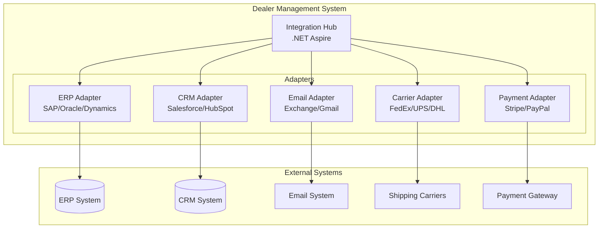

### 10.2 API Specifications

| API | Protocol | Authentication | Rate Limit |
|-----|----------|----------------|------------|
| REST API | HTTPS | OAuth 2.0 / JWT | 1000 req/min |
| GraphQL | HTTPS | JWT | 500 req/min |
| WebSocket | WSS | JWT | 100 connections |
| EDI | AS2/SFTP | Certificates | Batch processing |

---

## 11. Security Architecture

### 11.1 Security Layers

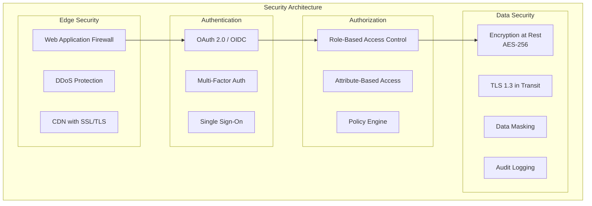

### 11.2 Role-Based Access Control

| Role | Permissions |
|------|-------------|
| **Sales Rep** | View/Create/Edit own quotes, View customers, View inventory |
| **Sales Manager** | All Sales Rep + Approve discounts, View team metrics |
| **Procurement** | Manage POs, Vendor management, Inventory management |
| **Finance** | Approve high-value items, View financial reports |
| **Admin** | Full system access, User management, Configuration |

---

## 12. Deployment Architecture

### 12.1 Kubernetes Deployment

```mermaid
graph TB
    subgraph "Kubernetes Cluster"
        subgraph "Ingress"
            Ingress[NGINX Ingress]
        end
        
        subgraph "Services Namespace"
            APIGateway[API Gateway<br/>3 replicas]
            EmailSvc[Email Service<br/>2 replicas]
            QuoteSvc[Quote Service<br/>2 replicas]
            POSvc[PO Service<br/>2 replicas]
            CustomerSvc[Customer Service<br/>2 replicas]
            SKSvc[Semantic Kernel<br/>3 replicas]
        end
        
        subgraph "Data Namespace"
            PgCluster[PostgreSQL<br/>HA Cluster]
            RedisCluster[Redis<br/>Sentinel]
            RabbitCluster[RabbitMQ<br/>Cluster]
        end
        
        subgraph "Monitoring"
            Prometheus[Prometheus]
            Grafana[Grafana]
            Jaeger[Jaeger Tracing]
        end
    end
    
    Ingress --> APIGateway
    APIGateway --> EmailSvc
    APIGateway --> QuoteSvc
    APIGateway --> POSvc
    APIGateway --> CustomerSvc
    APIGateway --> SKSvc
    
    EmailSvc --> PgCluster
    QuoteSvc --> PgCluster
    SKSvc --> RedisCluster
```

### 12.2 Environment Configuration

| Environment | Purpose | Scaling | Database |
|-------------|---------|---------|----------|
| **Development** | Feature development | Single instance | Shared Dev DB |
| **Testing** | Integration testing | 2 replicas | Dedicated Test DB |
| **Staging** | UAT and Performance | Production-like | Staging DB |
| **Production** | Live system | Auto-scaling | HA PostgreSQL |

---

## 13. Monitoring and Observability

### 13.1 Observability Stack

| Component | Tool | Purpose |
|-----------|------|---------|
| **Metrics** | Prometheus + Grafana | System and business metrics |
| **Logging** | ELK Stack (Elasticsearch, Logstash, Kibana) | Centralized logging |
| **Tracing** | Jaeger / OpenTelemetry | Distributed tracing |
| **Alerting** | Alertmanager | Proactive notifications |
| **APM** | .NET Aspire Dashboard | Application performance |

### 13.2 Key Metrics

| Category | Metric | Target |
|----------|--------|--------|
| **Performance** | API Response Time (p95) | < 500ms |
| **Availability** | System Uptime | 99.9% |
| **Business** | Quote Generation Time | < 5 minutes |
| **Business** | PO Processing Time | < 10 minutes |
| **AI** | Email Classification Accuracy | > 92% |
| **AI** | Cost Estimation Accuracy | > 95% |

---

## 14. Conclusion

This solution architecture provides a comprehensive, scalable, and AI-powered platform for the Dealer Sales & Customer Management System. Key highlights include:

1. **Modern Tech Stack**: .NET Aspire with .NET 10, React JS, PostgreSQL
2. **AI-Powered**: Semantic Kernel with custom skills for intelligent automation
3. **Agent Architecture**: Multi-agent system with standardized Agent-to-Agent protocol
4. **Scalable Design**: Microservices architecture with Kubernetes orchestration
5. **Complete Data Model**: Comprehensive seed data for ERP, CRM, Vendors, and Email Templates
6. **Enterprise Security**: Multi-layered security with RBAC and encryption
7. **Full Observability**: Metrics, logging, tracing, and alerting

---

## Document Control

| Version | Date | Author | Description |
|---------|------|--------|-------------|
| 1.0 | December 2025 | Solution Architecture Team | Initial architecture document |

---

**End of Document**
